# Wardline for Python — Execution Sequence

**Date:** 2026-03-22
**Source:** `docs/2026-03-21-wardline-python-design.md` (post-second-review revision)
**Purpose:** Decomposed work packages in build order, each sized for a single agent session / PR

> **Note:** This execution sequence is authoritative for file paths and task structure. The source layout in the design doc (`docs/2026-03-21-wardline-python-design.md`, Section 2) is indicative but materially stale — several test files and directories added by review fixes do not appear there. When in doubt, follow the file paths in this document's "Produces" sections.

---

## How to Read This Document

Each task has:
- **Depends on:** which tasks must be complete before this one starts
- **Produces:** concrete outputs (files, modules, tests)
- **Done when:** acceptance criteria

Tasks are grouped into phases matching the critical path. Within a phase, tasks without cross-dependencies can be parallelised.

---

## Phase 0 — Foundation

### T-0.1: Project Scaffolding

**Depends on:** Nothing
**Produces:**
- `src/wardline/__init__.py` (package root with version re-export)
- `src/wardline/_version.py`
- `src/wardline/core/__init__.py`
- `src/wardline/runtime/__init__.py`
- `src/wardline/decorators/__init__.py`
- `src/wardline/manifest/__init__.py`
- `src/wardline/scanner/__init__.py`
- `src/wardline/cli/__init__.py`
- `pyproject.toml` (hatchling, src layout, deps, entry point, ruff + mypy config)
- `tests/conftest.py` (register `integration` and `network` pytest marks; configure default `addopts = -m "not integration"`)
- `tests/unit/` and `tests/integration/` directory structure
- Remove orphaned `main.py` from repo root
- CI enforcement: ruff rule or grep check that fails on `yaml.load(` without `Loader=` on the same line (must exclude `.venv/`; accepts any `SafeLoader` subclass such as `WardlineSafeLoader`, not just literal `Loader=SafeLoader`)

**Done when:** `uv run pytest` runs successfully with an empty test. `uv run ruff check src/` passes. `uv run mypy src/` passes.

---

### T-0.2: Self-Hosting Manifest Design

**Depends on:** Nothing (can parallel with T-0.1)
**Produces:**
- `wardline.yaml` at repo root (comment-only — not machine-validated until WP-3)
- Documents intended tier assignment for each scanner module
- Rationale for every Tier 3/4 assignment referencing actual data flow semantics
- Expected tier distribution sketch (used to calibrate the `max_permissive_percent` threshold)

**Done when:** Every `src/wardline/` sub-package has a tier assignment with documented rationale. Distribution sketch confirms whether 60% default threshold is appropriate.

---

### T-0.3: Initial CODEOWNERS + CI Pipeline

**Depends on:** T-0.1
**Produces:**
- `.github/CODEOWNERS` protecting `wardline.yaml`, `wardline.toml`, `corpus/`, `**/wardline.overlay.yaml` from the start (T-6.4b extends this with baseline files created in later phases)
- CI pipeline configuration (GitHub Actions or equivalent): `ruff check src/`, `mypy src/`, `uv run pytest -m "not integration" tests/` on every push
- CI grep check for `yaml.load(` without `Loader=` on the same line (must exclude `.venv/`; accepts any `SafeLoader` subclass such as `WardlineSafeLoader`, not just literal `Loader=SafeLoader`)

**Done when:** CODEOWNERS file exists, is active on the repository, and has no blank-owner lines or syntax errors (validate with a CODEOWNERS linter or a test that parses the file and asserts all patterns have at least one owner). CI pipeline runs on push and catches ruff/mypy/pytest failures. The `yaml.load` grep check runs in CI.

---

## Phase 1 — Core Data Model

### T-1.1: Enums and Constants

**Depends on:** T-0.1
**Produces:**
- `src/wardline/core/tiers.py` — `AuthorityTier` IntEnum (1-4)
- `src/wardline/core/taints.py` — `TaintState` StrEnum (8 explicit uppercase values)
- `src/wardline/core/severity.py` — `Severity` StrEnum, `Exceptionability` StrEnum, `RuleId` StrEnum (includes both canonical rule IDs and pseudo-rule-IDs: `PY_WL_001_UNVERIFIED_DEFAULT = "PY-WL-001-UNVERIFIED-DEFAULT"`, `WARDLINE_UNRESOLVED_DECORATOR = "WARDLINE-UNRESOLVED-DECORATOR"`, `TOOL_ERROR = "TOOL-ERROR"`, `GOVERNANCE_REGISTRY_MISMATCH_ALLOWED = "GOVERNANCE-REGISTRY-MISMATCH-ALLOWED"`)
- `tests/unit/core/test_tiers.py` — value assertions
- `tests/unit/core/test_taints.py` — serialisation round-trip (`str(TaintState.AUDIT_TRAIL) == "AUDIT_TRAIL"`)
- Round-trip test for `RuleId` (`str(RuleId.PY_WL_001) == "PY-WL-001"`, `str(RuleId.TOOL_ERROR) == "TOOL-ERROR"`)

**Done when:** All enums constructed, serialisation round-trip tests pass. `json.dumps` produces expected primitives for both IntEnum and StrEnum members. All pseudo-rule-IDs are members of `RuleId` — `Finding.rule_id` is typed as `RuleId` (not `str | RuleId`).

---

### T-1.2: Canonical Decorator Registry

**Depends on:** T-1.1, T-1.3 (shared write target `taints.py` — T-1.3 must complete before T-1.2 begins to avoid file-level merge conflicts)
**Produces:**
- `src/wardline/core/registry.py` — `REGISTRY_VERSION` module constant, frozen dataclass `RegistryEntry` with `canonical_name: str`, `group: int`, `args: dict[str, type | None]`, `attrs: dict[str, type]`; `args` and `attrs` wrapped in `MappingProxyType` via `object.__setattr__` in `__post_init__`
- Registry dict mapping canonical names to `RegistryEntry` instances for all Group 1 + Group 2 decorators (minimum required for MVP)
- `tests/unit/core/test_registry.py` — entry immutability (MappingProxyType raises on write), version string present, all MVP decorator names registered

**Implementation note:** `object.__setattr__` in `__post_init__` pattern: direct assignment in frozen dataclass raises `FrozenInstanceError`. Use `object.__setattr__(self, 'field_name', MappingProxyType(self.field_name))`. Cross-reference: T-4.1 uses identical pattern.

**Done when:** Registry entries are frozen and immutable. Test confirms MappingProxyType prevents mutation. All Group 1 + 2 decorator names have entries.

---

### T-1.3: Taint Join Lattice

**Depends on:** T-1.1
**Produces:**
- `src/wardline/core/taints.py` (extend) — `taint_join(a, b) -> TaintState`, hardcoded 28-pair dict, identity check, order normalisation
- `tests/unit/core/test_taints.py` (extend) — exhaustive commutativity (64 pairs), associativity, idempotency, MIXED_RAW absorbing element (named explicit test)

**Done when:** All 64 ordered pairs tested. MIXED_RAW absorbing property verified independently. Associativity spot-checked on representative triples. Idempotency tested: `join(a, a) == a` for all taint states.

---

### T-1.4: Severity Matrix

**Depends on:** T-1.1
**Produces:**
- `src/wardline/core/matrix.py` — `SeverityCell` frozen dataclass, `SEVERITY_MATRIX` dict (72 cells: 9 rules × 8 taint states), `lookup(rule, taint) -> SeverityCell` (raises KeyError on unknown combos)
- `tests/unit/core/test_matrix.py` — independently-encoded fixture table of `(rule, taint, expected_severity, expected_exceptionability)` tuples; fixture MUST NOT import or read from `SEVERITY_MATRIX`; CI check that test file has no import of `matrix` module

**Done when:** All 72 cells verified against independently-encoded expected values. `lookup` raises `KeyError` for invalid combos.

---

### T-1.5: Runtime Constructs — Type Markers

> **Note:** Runtime library deliverable; not required for self-hosting gate. No downstream scanner or CLI task depends on this.

**Depends on:** T-1.1
**Produces:**
- `src/wardline/runtime/types.py` — `TierMarker` class, `Tier1`-`Tier4` Annotated aliases, `FailFast` annotation marker
- `tests/unit/runtime/test_types.py` — marker construction, Annotated alias creation

**Done when:** `Tier1` through `Tier4` produce valid `Annotated` types usable as bare annotations (e.g., `x: Tier1` type-checks cleanly). If implemented as `Annotated[Any, TierMarker(N)]`, confirm `Any` is the base type. If implemented as a generic alias with `TypeVar`, confirm subscript usage (`x: Tier1[str]`) is required and document that bare `Tier1` is not supported. `FailFast` is usable as an annotation.

---

### T-1.6: Runtime Constructs — AuthoritativeField Descriptor

> **Note:** Runtime library deliverable; not required for self-hosting gate. No downstream scanner or CLI task depends on this.

**Depends on:** T-1.1
**Produces:**
- `src/wardline/runtime/descriptors.py` — `AuthoritativeField` with `__set_name__`, `__get__`, `__set__`; stores in `obj.__dict__["_wd_auth_{name}"]`; raises `AuthoritativeAccessError` on access-before-set
- `tests/unit/runtime/test_descriptors.py` — access-before-set raises, normal set/get works, `__dict__` bypass test (known residual), collision test (`_wd_auth_` prefix vs raw attribute), `__set_name__` auto-naming test

**Done when:** All descriptor tests pass including the known-residual bypass test.

---

### T-1.7: Runtime Constructs — WardlineBase

**Depends on:** T-1.2 (registry)
**Produces:**
- `src/wardline/runtime/base.py` — `WardlineBase` with `__init_subclass__` (cooperative `super()` BEFORE wardline checks); checks subclass methods for wardline decorators
- `tests/unit/runtime/test_base.py` — ABCMeta composition test, dual-`__init_subclass__` test (both hooks fire), `super()` ordering test (negative case: confirm breakage if super is called after)

**Done when:** WardlineBase cooperates with ABCMeta. Both `__init_subclass__` hooks fire in multi-inheritance. Super ordering is tested.

---

### T-1.8: Tracer Bullet

**Depends on:** T-1.1, T-1.2, T-1.4
**Produces:**
- Disposable spike code (location: `spike/` or similar, NOT in `src/`)
- Hardcoded PY-WL-004 rule (broad exception handler)
- Hardcoded EXTERNAL_RAW taint, severity lookup from matrix
- Parse single fixture file with `ast.parse()` (sync + async)
- Emit SARIF result with wardline property bags
- Registry validation: lookup decorator name from `core/registry.py`; validate registry `attrs` dict contract pattern (not just name lookup) — verify the structure supports the factory assertion planned for T-2.1
- RuleBase proof-of-concept: `@typing.final` + `__init_subclass__` guard + abstract `visit_function`
- Assert SARIF validates against vendored schema (SARIF schema validation: vendor the SARIF schema locally as part of the spike — pre-production vendoring in T-4.13 replaces this — or validate against a locally downloaded copy)
- Verify `@abstractmethod` enforcement timing (instantiation, not definition)

**Done when:** Spike runs end-to-end. SARIF validates. Registry lookup works. RuleBase pattern proven. All four validation points confirmed. **Teardown: delete spike code at start of T-4.1.**

---

## Phase 2 — Decorator Library

### T-2.1: Decorator Factory

**Depends on:** T-1.2 (registry), T-1.8 (registry freeze enforcement)
**Produces:**
- `src/wardline/decorators/_base.py` — `wardline_decorator(group, name, **semantic_attrs)` factory
- Registry enforcement assertion: assert `name` in registry and all `semantic_attrs` keys in entry's `attrs` contract at call time
- Sets `_wardline_groups` (set accumulation) and `_wardline_*` semantic attributes AFTER `functools.wraps()`
- Works on functions, methods, staticmethods, classmethods
- Stacking: multiple wardline decorators compose (group flags accumulate, attrs merge)
- `tests/unit/decorators/test_decorators.py` — decorated function callable, signature preserved, metadata exposed, stacking works, `functools.wraps` ordering (stacked attrs survive), `__wrapped__` chain traversal recovers attrs, severed chain returns None without raising, registry enforcement (unregistered name raises)

**Done when:** Factory creates decorators that pass all tests. Registry enforcement blocks unregistered attributes. Severed `__wrapped__` chain logs at WARNING level. Stacking test verifies `_wardline_groups` accumulation does not mutate the inner decorator's set (copy-on-accumulate pattern required: `wrapper._wardline_groups = set(getattr(wrapper, '_wardline_groups', set()))` AFTER `functools.wraps()`, before adding current group).

---

### T-2.2: Group 1 Decorators (Authority Tier Flow)

**Depends on:** T-2.1
**Produces:**
- `src/wardline/decorators/authority.py` — `@external_boundary`, `@validates_shape`, `@validates_semantic`, `@validates_external`, `@tier1_read`, `@audit_writer`, `@authoritative_construction`
- Each uses the factory with correct group, name, and semantic attrs per WP-2b spec
- `tests/unit/decorators/test_decorators.py` (extend) — each decorator sets expected `_wardline_*` attrs

**Done when:** All 7 Group 1 decorators exist, set correct attributes, pass tests.

---

### T-2.3: Group 2 Decorator + schema_default

> **Note:** Consider merging into T-2.2 if the one-decorator overhead exceeds value.

**Depends on:** T-2.1
**Produces:**
- `src/wardline/decorators/audit.py` — `@audit_critical`
- `src/wardline/decorators/schema.py` — `schema_default(expr)` (presence-only marker for MVP)
- Tests for both

**Done when:** `@audit_critical` sets `_wardline_audit_critical = True`. `schema_default` exists as a callable marker.

---

## Phase 3 — Manifest System

### T-3.1: JSON Schemas

**Depends on:** T-1.1 (enum values for constraints)
**Produces:**
- `src/wardline/manifest/schemas/wardline.schema.json` — with `$id`, version, `additionalProperties: false`
- `src/wardline/manifest/schemas/overlay.schema.json`
- `src/wardline/manifest/schemas/exceptions.schema.json` — includes `agent_originated` (nullable), `recurrence_count`, `governance_path`, `max_exception_duration_days`
- `src/wardline/manifest/schemas/fingerprint.schema.json`
- `src/wardline/manifest/schemas/corpus-specimen.schema.json` — `verdict` enum: `true_positive`, `true_negative`, `known_false_negative`
- `tests/unit/manifest/test_schemas.py` — parameterized `jsonschema.Draft7Validator.check_schema()` tests for all 5 schemas

**Done when:** All 5 schemas valid JSON Schema. `$id` includes version. `additionalProperties: false` on all. Schema structural validity verified by test suite.

---

### T-3.2: Manifest Data Models

> **Note:** Use `tomllib` from stdlib (Python 3.11+). Do not use `tomli` or `toml` packages. **Important:** `tomllib.load()` requires binary file mode — use `open(path, 'rb')`. Unlike `json.load()` and `yaml.safe_load()`, text mode raises `TypeError`.

**Depends on:** T-1.1
**Produces:**
- `src/wardline/manifest/models.py` — `WardlineManifest`, `WardlineOverlay`, `ExceptionEntry`, `FingerprintEntry` (all `@dataclass(frozen=True)`)
- `ScannerConfig` frozen dataclass with `@classmethod from_toml(path) -> ScannerConfig` factory (normalises paths, rule IDs, taint state tokens before construction)
- `tests/unit/manifest/test_models.py` — construction from dicts, frozen immutability (assignment raises `FrozenInstanceError`), `ScannerConfig.from_toml()` round-trip

**Done when:** All models construct correctly and are immutable. `ScannerConfig.from_toml()` handles path/enum normalisation.

---

### T-3.3: YAML Loader + SafeLoader Alias Limiter

**Depends on:** T-3.1, T-3.2
**Produces:**
- `src/wardline/manifest/loader.py` — `WardlineSafeLoader` (subclass of `yaml.SafeLoader`, overrides `compose_node` to count alias resolutions on the `AliasEvent` branch only — do NOT count all node compositions; raises `yaml.YAMLError` subclass (e.g., `WardlineYAMLError`) at configurable threshold, default 1000 via factory function `make_wardline_loader(alias_limit: int = 1000) -> type[yaml.SafeLoader]` that returns a configured subclass with the limit as a class attribute (PyYAML's SafeLoader does not accept constructor kwargs — use a factory, not a constructor parameter); hard upper bound of 10000 to prevent threshold defeat; so CLI YAML error handler catches it uniformly at exit code 2); `load_manifest(path) -> WardlineManifest` with file-size check (1MB), `yaml.load(stream, Loader=WardlineSafeLoader)` (**NOT** `yaml.safe_load()` which does not accept a `Loader` parameter), `$id` version check, schema validation, dataclass construction; `load_overlay(path) -> WardlineOverlay`
- `tests/unit/manifest/test_loader.py` — valid manifest loads, schema validation catches invalid fields, `$id` version mismatch produces structured error, YAML 1.1 coercion tests (Norway problem: `NO`/`YES`/`OFF`/`ON`, sexagesimal: `1:30`, float: `1e3`), alias bomb test (exceeds 1000 aliases → structured error), file over 1MB → structured error

**Done when:** Loader handles all happy and error paths. Alias limiter raises on bomb input. Coercion tests confirm schema catches type mismatches. Alias bomb and 1MB file limit produce exit code 2. `$id` version mismatch structured error includes specific message format per design WP-3c.

---

### T-3.4: Manifest Discovery + Overlay Discovery

**Depends on:** T-3.3
**Produces:**
- `src/wardline/manifest/discovery.py` — `discover_manifest(start_path) -> Path` (walk upward, stop at `.git` or `Path.home()`, inode tracking for symlink loops); `discover_overlays(root) -> list[Path]` (secure default: only `module_tiers` directories when no `overlay_paths`; `"*"` literal sentinel for unrestricted; GOVERNANCE ERROR with corrective guidance for undeclared locations)
- Scan-time path validation: emit WARNING for `module_tiers` paths matching zero files
- `tests/unit/manifest/test_discovery.py` — upward walk finds manifest, stops at `.git`, symlink cycle detection, overlay discovery respects `module_tiers`-only default, `"*"` sentinel enables all directories, undeclared overlay produces GOVERNANCE ERROR with guidance message

**Done when:** Discovery handles all path and symlink edge cases. Symlink cycle detected: logs at WARNING level with cycle path and returns `None` (manifest not found via this path); test asserts WARNING is emitted. Secure overlay default enforced. GOVERNANCE ERROR for undeclared overlay is fatal: discovery raises `GovernanceError` (or equivalent), caller exits 2; test uses `pytest.raises`. Error messages include corrective guidance.

---

### T-3.5: Overlay Merge

> **Note:** Post-MVP for the enforcement path, but required by T-5.3 (`wardline manifest baseline update`) which writes the resolved manifest. Not orphaned — feeds T-5.3 via the `merge()` function.

**Depends on:** T-3.2
**Produces:**
- `src/wardline/manifest/merge.py` — `merge(base, overlay) -> ResolvedManifest`; enforces narrow-only invariant; raises `ManifestWidenError` with structured message (which overlay, which field, base vs attempted value)
- `tests/unit/manifest/test_merge.py` — narrow-only passes, widen attempt raises with actionable message

**Done when:** Merge correctly narrows. Widen produces clear error identifying overlay file, field, and values. **Design decision (resolved):** Severity reduction through overlay (e.g., ERROR to WARNING) IS ALLOWED. Rationale: teams need a soft-adoption path — they can introduce rules at WARNING to assess impact before promoting to ERROR. The narrow-only invariant applies to tier changes (tier relaxation is always rejected) but NOT to severity changes. Test: overlay that reduces severity from ERROR to WARNING is accepted; overlay that relaxes a tier (e.g., Tier 1 to Tier 3) is rejected. A GOVERNANCE INFO signal is emitted when severity is reduced through overlay, to maintain visibility.

---

### T-3.6: Coherence Checks — Annotations + Boundaries

**Depends on:** T-3.2, T-3.4, T-1.2 (decorator registry for annotation enumeration)
**Produces:**
- `src/wardline/manifest/coherence.py` — orphaned annotations check (decorators without manifest declaration), undeclared boundaries check (manifest claims without code decorators)
- `tests/unit/manifest/test_coherence.py` — orphaned annotation detected, undeclared boundary detected

**Done when:** Both checks fire correctly on fixture manifests.

---

### T-3.7: Coherence Checks — Governance Anomaly Signals + Baselines

**Depends on:** T-3.6
**Produces:**
- `src/wardline/manifest/coherence.py` (extend) — tier-distribution check (configurable threshold via `max_permissive_percent`, default 60%); tier downgrade detection (diff current manifest against `wardline.manifest.baseline.json`); tier upgrade without evidence; agent-originated policy change detection
- First-scan perimeter listing (GOVERNANCE INFO when no `wardline.perimeter.baseline.json`)
- Synthetic baseline fixture file for unit tests (hand-crafted `wardline.manifest.baseline.json` for testing tier-change detection without requiring T-5.3 to run)
- `tests/unit/manifest/test_coherence.py` (extend) — threshold boundary test (61% fires, 60% does not), tier downgrade detected, upgrade without evidence detected, first-scan behavior, manifest baseline comparison (added/removed modules)

**Done when:** All governance signals fire correctly. Threshold boundary test passes. Baseline comparison handles tier changes, module additions, and module removals. Agent-originated policy change detection fires correctly. GOVERNANCE WARNING emitted for each exception entry with `agent_originated: null` (provenance unknown); test fixture: three entries (`agent_originated: true`, `false`, `null`) — WARNING fires only for null. Expired exception detection: exception past `max_exception_duration_days` from grant date fires GOVERNANCE WARNING; far-future expiry (e.g., `expires: 2099-12-31` with short `max_exception_duration_days`) rejected; clock injection mechanism documented for test isolation (e.g., pass `now` parameter or mock `datetime.date.today()`). First-scan GOVERNANCE INFO message emitted when `wardline.perimeter.baseline.json` does not exist; test: run coherence checks with no baseline file present, assert INFO level message.

---

## Phase 4 — AST Scanner

### T-4.1: Scanner Data Models

**Depends on:** T-1.1, T-1.8 (teardown: delete tracer bullet spike code)
**Produces:**
- `src/wardline/scanner/context.py` — `Finding` frozen dataclass (rule_id, file_path, line, col, end_line, end_col, message, severity, exceptionability, taint_state, analysis_level, source_snippet); `ScanContext` frozen dataclass with `function_level_taint_map` wrapped in `MappingProxyType` via `object.__setattr__` in `__post_init__`; construction timing documented (built once after pass 1)
- `WardlineAnnotation` dataclass (or NamedTuple) — captures discovered decorator metadata per call site, consumed by T-4.4
- `tests/unit/scanner/test_context.py` — immutability of both dataclasses; `MappingProxyType` raises on taint map mutation

**Design decision (resolved):** `Finding.rule_id` is typed as `RuleId`. All pseudo-rule-IDs (`PY-WL-001-UNVERIFIED-DEFAULT`, `WARDLINE-UNRESOLVED-DECORATOR`, `TOOL-ERROR`, `GOVERNANCE-REGISTRY-MISMATCH-ALLOWED`) are members of the `RuleId` StrEnum, added in T-1.1.

**Implementation note:** `object.__setattr__` in `__post_init__` pattern: direct assignment in frozen dataclass raises `FrozenInstanceError`. Use `object.__setattr__(self, 'field_name', MappingProxyType(self.field_name))`. Cross-reference: T-1.2 uses identical pattern.

**Done when:** Finding and ScanContext are frozen. Taint map is deeply frozen via MappingProxyType.

---

### T-4.2: RuleBase Abstract Class

**Depends on:** T-4.1
**Produces:**
- `src/wardline/scanner/rules/base.py` — `RuleBase(ast.NodeVisitor, abc.ABC)` with `@typing.final` `visit_FunctionDef` and `visit_AsyncFunctionDef` delegating to `@abstractmethod visit_function(node, is_async)`; `__init_subclass__` guard (call super BEFORE check) raises TypeError on illegal override
- `tests/unit/scanner/test_rules.py` — subclass override of `visit_FunctionDef` raises TypeError, missing `visit_function` raises TypeError at instantiation, valid subclass receives dispatch, super ordering verified, `ast.TryStar` nodes handled directly (no hasattr guard)

**Done when:** RuleBase enforces unified `visit_function` pattern. Override guard works. ABC enforcement fires at instantiation. TypeError raised at subclass definition time by `__init_subclass__`, confirmed not from `@typing.final` (which is static-only).

---

### T-4.3: ScanEngine Orchestrator + File Discovery

**Depends on:** T-4.1, T-4.2, T-3.3 (manifest loading), T-3.4 (manifest discovery)
**Produces:**
- `src/wardline/scanner/engine.py` — `ScanEngine` orchestrating discovery → taint → rules → SARIF; file discovery with `os.walk(followlinks=False)`, manifest perimeter filtering, symlink safety; rule crash handling (try/except → TOOL-ERROR finding); graceful file parse error handling (continue scan, emit structured error)
- `tests/unit/scanner/test_engine.py` — normal multi-file scan, one file fails to parse (scan continues), PermissionError on directory (skip with warning), rule crash produces TOOL-ERROR finding

**Done when:** Engine handles all error paths gracefully. TOOL-ERROR findings appear in output for crashed rules.

---

### T-4.4: Decorator Discovery from AST — Core

> **Note:** Must skip `if TYPE_CHECKING:` imports while building the import table — check for `ast.If` whose test is either `ast.Name(id='TYPE_CHECKING')` (direct import: `from typing import TYPE_CHECKING`) or `ast.Attribute(attr='TYPE_CHECKING')` (qualified: `typing.TYPE_CHECKING`). Both import styles are common; missing the qualified form produces false positive decorator matches. Do not defer this to T-4.5.
>
> **Implementation note:** `ast.NodeVisitor` does not provide parent references natively. Use either a pre-pass with `ast.walk()` to collect `if TYPE_CHECKING:` block line ranges and filter imports by line range, or a custom visitor that maintains a parent stack.

**Depends on:** T-1.2 (registry), T-4.1
**Produces:**
- `src/wardline/scanner/discovery.py` — per-file import table, handles: direct import (`from wardline import external_boundary`), qualified import (`import wardline` + `wardline.external_boundary`), submodule import (`from wardline.decorators.authority import external_boundary`); skips `if TYPE_CHECKING:` imports
- Build map: `dict[tuple[str, str], set[WardlineAnnotation]]` keyed by `(module_path, qualname)`
- `tests/unit/scanner/test_discovery.py` — all three core import patterns resolve correctly, `TYPE_CHECKING` guard imports excluded

**Done when:** Core import patterns correctly discovered. Map built for fixture files. `TYPE_CHECKING` imports excluded from import table — both `from typing import TYPE_CHECKING` (direct) and `import typing; if typing.TYPE_CHECKING:` (qualified) forms tested.

---

### T-4.5: Decorator Discovery from AST — Edge Cases

**Depends on:** T-4.4
**Produces:**
- `src/wardline/scanner/discovery.py` (extend) — alias tracking (`from wardline import external_boundary as eb`), star import WARNING, dynamic import WARNING (`importlib.import_module`, `__import__`), unresolved decorator signal (`WARDLINE-UNRESOLVED-DECORATOR`), `if TYPE_CHECKING` imports ignored, nested function handling
- `tests/unit/scanner/test_discovery.py` (extend) — alias resolves, star import WARNING, dynamic import WARNING, unresolved decorator produces WARNING finding, TYPE_CHECKING ignored, re-export chain produces UNKNOWN_RAW

**Done when:** All six edge-case patterns handled. Unresolved decorators produce distinct WARNING (not silent UNKNOWN_RAW).

---

### T-4.6: Level 1 Taint Assignment

**Depends on:** T-4.4, T-3.2 (manifest models)
**Produces:**
- `src/wardline/scanner/taint/function_level.py` — assign taint from: (1) decorator → taint state, (2) manifest `module_tiers` → module default, (3) fallback → `UNKNOWN_RAW`; process both `FunctionDef` and `AsyncFunctionDef`
- `tests/unit/scanner/test_taint.py` — decorated function gets decorator taint, undecorated in declared module gets module default, undeclared module gets UNKNOWN_RAW, async functions processed

**Done when:** All three taint sources correctly assigned. Async functions not missed. Decorator taint takes precedence over conflicting manifest `module_tiers` default for same function. Test async function taint assignment explicitly.

---

### T-4.7: Rule PY-WL-001 (Dict Key Access with Fallback Default)

> **Note:** Establish shared test fixture pattern in `tests/unit/scanner/conftest.py`: use `ast.parse()` on inline triple-quoted strings with synthetic import line. All five rule tasks (T-4.7 through T-4.11) follow this pattern.

**Depends on:** T-4.2, T-4.6
**Produces:**
- `src/wardline/scanner/rules/py_wl_001.py` — detects `dict.get()` with default arg, `dict.setdefault()`, `defaultdict` constructor; `schema_default()` presence-only suppression emits `PY-WL-001-UNVERIFIED-DEFAULT` WARNING
- `tests/unit/scanner/test_py_wl_001.py` — positive: `.get()` with default fires; negative: `.get()` without default silent; `schema_default()` suppresses to WARNING; lambda `.get()` corpus specimen

**Done when:** Rule fires correctly on all positive patterns. `schema_default()` produces WARNING not silence.

---

### T-4.8: Rule PY-WL-002 (Attribute Access with Fallback Default)

**Depends on:** T-4.2, T-4.6
**Produces:**
- `src/wardline/scanner/rules/py_wl_002.py` — three-argument `getattr()` only (NOT `hasattr` — that's PY-WL-003)
- `tests/unit/scanner/test_py_wl_002.py` — 3-arg `getattr` fires, 2-arg silent, `hasattr` NOT detected by this rule

**Done when:** Rule fires on 3-arg `getattr` only.

---

### T-4.9: Rule PY-WL-003 (Existence-Checking as Structural Gate)

**Depends on:** T-4.2, T-4.6
**Produces:**
- `src/wardline/scanner/rules/py_wl_003.py` — `in` operator, `hasattr()`, `ast.MatchMapping`, `ast.MatchClass`
- `tests/unit/scanner/test_py_wl_003.py` — all four patterns fire; negative specimens for legitimate match/case dispatch patterns

**Done when:** All existence-checking patterns detected. Negative match/case specimens confirm no over-firing.

---

### T-4.10: Rule PY-WL-004 (Broad Exception Handlers)

**Depends on:** T-4.2, T-4.6
**Produces:**
- `src/wardline/scanner/rules/py_wl_004.py` — bare `except`, `except Exception`, `ast.TryStar` broad handlers (direct use, no hasattr guard)
- `tests/unit/scanner/test_py_wl_004.py` — bare except fires, `except Exception` fires, `except ValueError` silent, `except*` broad handler fires

**Done when:** Both `ExceptHandler` and `TryStar` broad patterns detected.

---

### T-4.11: Rule PY-WL-005 (Silent Exception Handling)

**Depends on:** T-4.2, T-4.6
**Produces:**
- `src/wardline/scanner/rules/py_wl_005.py` — `pass` body, `...` body, `continue`-only body, `break`-only body; handles both `ExceptHandler` and `TryStar`
- `tests/unit/scanner/test_py_wl_005.py` — all silent patterns fire, handler with logging silent

**Done when:** All silent handler patterns detected across both AST node types.

---

### T-4.INT: Integration Checkpoint — First Rule End-to-End

**Depends on:** T-4.3, T-4.7 (first rule), T-4.6 (taint assignment), T-3.3, T-3.4
**Produces:**
- A small fixture Python project (2-3 files with wardline decorators and PY-WL-004 patterns)
- A fixture `wardline.yaml` manifest for the fixture project
- `tests/integration/test_scan_engine_integration.py` marked `@pytest.mark.integration` — runs `ScanEngine` directly (no CLI) on the fixture project and validates output
- Validates: manifest loading works end-to-end, taint assignment from manifest works, rule fires with correct severity, output dict has correct keys and property bags

**Done when:** ScanEngine returns findings with correct keys, severity, taint state, and property bags on the fixture project (dict-level key inspection — full SARIF schema validation deferred to T-5.2). This catches interface mismatches between manifest loading (T-3.3/T-3.4), taint assignment (T-4.6), and rule execution (T-4.7) before the CLI layer adds another dimension. Fixture project committed to `tests/fixtures/integration/`. `uv run pytest -m 'not integration'` does NOT execute this test.

---

### T-4.12: Registry Sync Tests

**Depends on:** T-2.1, T-4.4, T-1.7 (WardlineBase for __wrapped__ chain validation)
**Produces:**
- `tests/unit/scanner/test_registry_sync.py` — (a) every registry name present in library exports, (b) every library export present in registry, (c) attribute-level check: decorate stub with each decorator, verify `_wardline_*` attrs present with correct types via `isinstance()`, (d) renamed decorator detected, (e) missing registry entry detected, (f) unknown `@wardline`-prefixed decorator in scanned code emits WARNING

**Done when:** Bidirectional name check passes. Attribute-level check catches type mismatches. Both scanner AST path and runtime `__wrapped__` path validated. Strict-mode exit code integration tested (renamed attribute produces non-zero exit code).

---

### T-4.13: SARIF Output

**Depends on:** T-4.1, T-1.1 (enum serialization in json.dumps)
**Produces:**
- `src/wardline/scanner/sarif.py` — `SarifReport` dataclass, `to_dict()`, `to_json(path)` using `json.dumps()` only (no string concatenation); SARIF v2.1.0 structure; wardline property bags per result and per run (all properties from WP-4f spec including `propertyBagVersion`, `implementedRules`, `conformanceGaps`, `unknownRawFunctionCount`, `unresolvedDecoratorCount`); determinism: sorted by file path, no set iteration; `--verification-mode` omits timestamps; `manifestHash` via canonical JSON serialisation; literal source snippets (not `ast.unparse()`); UTF-8 encoding with BOM handling; `PY-WL-001-UNVERIFIED-DEFAULT` does NOT appear in `implementedRules`
- Vendor SARIF v2.1.0 JSON Schema at `src/wardline/scanner/schemas/sarif-2.1.0.schema.json`
- `tests/unit/scanner/test_sarif.py` — output validates against vendored schema, property bags present, determinism (no set ordering), multi-line snippet preserves formatting, JSON-breaking characters in source handled correctly, manifestHash determinism (different YAML key order → same hash), `@pytest.mark.network` test comparing vendored schema hash to OASIS GitHub

**Done when:** SARIF output validates. All property bags present. Determinism tests pass. JSON-breaking character test passes. Result-level property bags present: `wardline.rule`, `wardline.taintState`, `wardline.severity`, `wardline.exceptionability`, `wardline.analysisLevel`. StrEnum/IntEnum members serialize correctly via `json.dumps`. `manifestHash` key-order-independence tested.

---

## Phase 5 — CLI

### T-5.1: CLI Skeleton + Exit Code Handling

**Depends on:** T-0.1 (package scaffold — `src/wardline/cli/` must exist)
**Produces:**
- `src/wardline/cli/main.py` — Click group `cli()` with common options (`--manifest`, `--config`, `--output`, `--verbose`, `--debug`, `--verification-mode`)
- Exit code handling: 0 (clean), 1 (findings), 2 (config error), 3 (tool error); priority: 3 > 1 > 0; 2 is exclusive
- `--fail-on-unverified-default`, `--warnings-as-errors`, `--max-unknown-raw-percent` flags with `wardline.toml` integration
- Structured error messages to stderr (not stack traces) for manifest not found, YAML parse error, schema validation failure
- `tests/integration/test_cli.py` — exit code 0 (clean scan), exit code 1 (findings), exit code 2 (missing manifest), exit code 2 (schema-invalid manifest — structured error to stderr, not Python traceback), exit code 3 (TOOL-ERROR), error output assertions (structured, not stack traces)

**Done when:** CLI skeleton runs. All four exit codes tested. Flag subset relationship (`--warnings-as-errors` ⊃ `--fail-on-unverified-default`) verified. `--verbose` and `--debug` produce structured logging to stderr.

---

### T-5.2: `wardline scan` Command

**Depends on:** T-5.1, T-4.3, T-4.13, T-4.INT (integration checkpoint must pass before CLI integration)
**Produces:**
- `src/wardline/cli/scan.py` — `wardline scan <path> [flags]`; wires ScanEngine to CLI; loads manifest + config, runs scan, writes SARIF, exits with correct code
- `wardline.toml` validation at startup (known keys only, valid rule IDs, valid taint states, valid paths); malformed → exit 2
- GOVERNANCE-level finding when `--allow-registry-mismatch` is active
- GOVERNANCE-level finding when `--allow-permissive-distribution` is active
- Runtime registry sync check at scan startup (bidirectional: every registry name in library exports, every library export in registry); registry mismatch without `--allow-registry-mismatch` exits 2 (config error); with flag active, emits GOVERNANCE finding and continues (exit 1 if any findings, else 0)
- Fixture `tests/fixtures/wardline.toml` (minimal scanner config for integration tests — do NOT write to repo-root `wardline.toml`, which is produced by T-6.4a)
- `tests/integration/test_scan_cmd.py` — scan produces valid SARIF, flags affect exit code, registry sync failure test (temporarily remove a registry entry → non-zero exit), `--max-unknown-raw-percent` boundary test (at limit passes, above limit exits 1), CLI flag overrides `wardline.toml` value, schema-invalid manifest causes exit 2 with structured message (not Python traceback)

**Done when:** Full scan pipeline works end-to-end via CLI. `--max-unknown-raw-percent` ceiling enforced (exit 1 when exceeded). CLI flags override `wardline.toml` values. Runtime registry sync check runs at scan startup; registry mismatch without `--allow-registry-mismatch` exits 2; with flag active emits GOVERNANCE finding. GOVERNANCE WARNING emitted for each disabled rule (ERROR for UNCONDITIONAL rule disablement). Schema-invalid manifest causes exit 2 with structured error to stderr.

---

### T-5.3: `wardline manifest validate` + `wardline manifest baseline update`

**Depends on:** T-5.1, T-3.3, T-3.5 (overlay merge for resolved manifest)
**Produces:**
- `src/wardline/cli/manifest_cmds.py` — `wardline manifest validate [FILE]` (schema validation, exit 0/1); `wardline manifest baseline update [--approve]` (writes `wardline.manifest.baseline.json` + `wardline.perimeter.baseline.json`, requires `--approve`)
- Tests: validate catches invalid manifest, baseline update requires `--approve`

**Done when:** Baseline files written with correct JSON structure (validated against schema). `wardline manifest baseline update` without `--approve` exits non-zero. `wardline manifest validate` produces exit 0 for valid manifest, exit 1 for invalid manifest, exit 2 for file not found.

---

### T-5.4: `wardline corpus verify`

**Depends on:** T-5.1, T-3.1 (schemas), T-3.3 (WardlineSafeLoader), T-4.3 (ScanEngine — corpus verify invokes the scanner to confirm specimens)
**Produces:**
- `src/wardline/cli/corpus_cmds.py` — `wardline corpus verify [--corpus-dir DIR]`; loads specimens via `yaml.load(stream, Loader=WardlineSafeLoader)`; `ast.parse()` only on fragments (never `exec`/`eval`); SHA-256 hash verification (mismatch → ERROR); per-rule precision/recall where sample ≥5; reports `known_false_negative` separately from true negatives; "Lite bootstrap" output format
- `tests/unit/scanner/test_corpus_runner.py` — mock `builtins.exec`, `builtins.eval`, `builtins.compile`, assert none called; hash mismatch produces ERROR; known_false_negative excluded from recall
- Fixture specimen YAML file (minimal, valid, known hash) in `tests/fixtures/corpus/` for integration test
- Integration test (in `test_corpus_runner.py` or separate `tests/integration/test_corpus_verify.py`): run `wardline corpus verify --corpus-dir tests/fixtures/corpus/`, capture output, assert output matches `Lite bootstrap: N specimens` format

**Done when:** Corpus verify runs. exec/eval mock test passes. Hash integrity enforced. Output says 'Lite bootstrap: N specimens' not 'Wardline-Core corpus conformant'. Integration test against real fixture specimen passes with correct output format.

---

### T-5.5: `wardline explain`

**Depends on:** T-5.1, T-4.6, T-3.3 (manifest loading)
**Produces:**
- `src/wardline/cli/explain_cmd.py` (new file, not in original design source layout) — `wardline explain <function_qualname> [--manifest FILE]`; prints resolved taint state + how determined (decorator/module_tiers/UNKNOWN_RAW), which module-tier entry matched, which rules evaluated at what severity; distinguishes "module not declared" from "decorator unresolved"
- `tests/integration/test_explain.py` — explain output for decorated function, for undeclared module function, for unresolved decorator

**Done when:** Explain correctly shows taint resolution path for all three categories. Verified by `tests/integration/test_explain.py` covering: decorated function, undeclared module function, and unresolved decorator.

---

## Phase 6 — Corpus + Self-Hosting Gate

### T-6.1: Corpus Skeleton

**Depends on:** T-3.1 (corpus specimen schema)
**Produces:**
- `corpus/corpus_manifest.yaml` (empty template with SHA-256 hash entries)
- `corpus/specimens/` directory structure for PY-WL-001 through PY-WL-005, organised per `{rule}/{taint_state}/{positive|negative}/`
- Specimen YAML template with all mandatory fields (`id`, `rule`, `taint_state`, `expected_severity`, `expected_exceptionability`, `verdict`, `fragment`, `expected_match`)

**Done when:** Directory structure exists. Template is valid against corpus specimen schema.

---

### T-6.2a: Corpus Specimens — TN/KFN Draft Structure

**Depends on:** T-6.1
**Produces:**
- Draft TN specimen YAML fragments for each MVP rule (clean code patterns where scanner should be silent)
- `known_false_negative` specimens for taint-flow scenarios 3 and 4 (cross-function, cross-module)
- UNKNOWN_RAW specimens for PY-WL-001 and PY-WL-004
- Specimen templates validated against corpus specimen schema

**Done when:** Draft specimens exist with valid YAML structure. Templates validate against corpus specimen schema. Hashes NOT yet computed (verification pending T-6.2b).

---

### T-6.2b: Corpus Specimens — TN/KFN Verification

**Depends on:** T-6.2a, T-4.7, T-4.8, T-4.9, T-4.10, T-4.11, T-5.4
**Produces:**
- Verified TN specimens: confirmed silent by running scanner via `wardline corpus verify` or direct `ScanEngine` invocation
- Verified KFN specimens: confirmed as documented false negatives at Level 1
- SHA-256 hashes computed and entered in corpus manifest

**Done when:** All TN specimens verified as silent by running scanner. All KFN specimens verified as not-detected at L1. Hashes match. `wardline corpus verify` passes for the TN/KFN subset.

---

### T-6.3: Corpus Specimens — True Positives

**Depends on:** T-6.1, T-4.7 through T-4.11 (rules must be implemented to verify TPs fire), T-5.4 (corpus verify for specimen validation)
**Produces:**
- TP specimens for each MVP rule × key taint states (UNCONDITIONAL cells, Tier 1/Tier 4)
- Taint-flow scenarios 1, 2, 5, 6, 7, 8 specimens
- `except*` (TryStar) specimens for PY-WL-004 and PY-WL-005
- SHA-256 hashes in corpus manifest
- Total: 36-46 specimens across TN + KFN + TP

**Done when:** `wardline corpus verify` passes for the full specimen set (TN + KFN + TP). SHA-256 hashes in corpus manifest match computed values. All 5 rules have at least one TP specimen verified as detected.

---

### T-6.4a: Self-Hosting Gate — Scan Pass + Coverage

**Depends on:** T-4.3, T-4.7, T-4.8, T-4.9, T-4.10, T-4.11, T-4.12 (registry sync tests), T-4.13, T-5.2, T-5.3, T-5.4, T-3.7, T-6.2b, T-6.3
**Produces:**
- `wardline.yaml` at repo root (machine-validated — upgrade from T-0.2 comment-only version)
- `wardline.toml` with scanner config (including `max_permissive_percent` calibrated from T-0.2 sketch, `max_unknown_raw_percent` set low)
- `wardline scan src/` passes with zero ERROR findings (or documented exceptions)
- 80% decorator coverage on Tier 1/4 modules — measured by counting decorated vs. total functions in Tier 1/4 modules via `wardline explain` batch invocation or a coverage script committed as `scripts/coverage_check.py`
- Tier-distribution check passes at configured threshold
- `tests/integration/test_self_hosting_scan.py` — scan passes, coverage floor verified, tier-distribution threshold passes

**Done when:** Scanner scans itself cleanly. Coverage floor met (measured by script or `wardline explain` output, not subjective assessment). Tier-distribution threshold passes. `test_self_hosting_scan.py` passes.

---

### T-6.4b: Self-Hosting Gate — Baselines, CI, CODEOWNERS

**Depends on:** T-6.4a
**Produces:**
- `tests/integration/test_determinism.py` — run scanner twice, assert byte-identical SARIF (both single-file and multi-file, with `--verification-mode`)
- `tests/integration/test_self_hosting.py` — full scan passes, coverage floor met, `__init_subclass__` side-effect test (`WardlineBase.__subclasses__()` before/after scan, assert no new entries)
- Committed SARIF regression baseline — CI comparison MUST compare `runs[].results` only (not run-level properties), MUST distinguish finding-count decrease (suppression regression — requires human sign-off) from finding-count increase (new findings)
- Committed `wardline.manifest.baseline.json` and `wardline.perimeter.baseline.json` (via `wardline manifest baseline update --approve`)
- Extend `.github/CODEOWNERS` (from T-0.3) to include: SARIF regression baseline, `wardline.manifest.baseline.json`, `wardline.perimeter.baseline.json`
- CI jobs: `test-unit` (every commit, `-m "not integration"`), `test-integration` (every merge to main, `-m integration`), `test-network` (weekly schedule, `-m network`)

**Done when:** All baselines committed. CI pipeline green with all three jobs configured. CODEOWNERS extended. `test_self_hosting.py` and `test_determinism.py` pass. CI comparison distinguishes finding-count decrease (suppression regression — requires human sign-off) from finding-count increase (new findings).

---

## Dependency Graph (Mermaid)

> **WARNING:** T-1.3 MUST complete before T-1.2 begins — they share write target `taints.py`. This is enforced by the `T13 --> T12` edge below.
>
> **SCHEDULING NOTE:** T-0.3 (CODEOWNERS + CI pipeline) should complete before T-1.1 begins so that CI is active from the first committed code. This is a scheduling preference, not a hard dependency — T-0.3 does not produce artifacts consumed by T-1.1, but CI provides quality gates that should be active during Phase 1.

```mermaid
graph TD
    %% Phase 0
    T01[T-0.1 Scaffolding] --> T11[T-1.1 Enums]
    T01 --> T03[T-0.3 CODEOWNERS + CI]

    %% Phase 1
    T11 --> T13[T-1.3 Taint Lattice]
    T13 --> T12[T-1.2 Registry]
    T11 --> T14[T-1.4 Severity Matrix]
    T11 --> T15[T-1.5 Type Markers]
    T11 --> T16[T-1.6 AuthoritativeField]
    T12 --> T17[T-1.7 WardlineBase]
    T12 --> T18[T-1.8 Tracer Bullet]
    T14 --> T18

    %% Phase 2
    T12 --> T21[T-2.1 Decorator Factory]
    T18 --> T21
    T21 --> T22[T-2.2 Group 1 Decorators]
    T21 --> T23[T-2.3 Group 2 + schema_default]

    %% Phase 3
    T11 --> T31[T-3.1 JSON Schemas]
    T11 --> T32[T-3.2 Data Models]
    T31 --> T33[T-3.3 YAML Loader]
    T32 --> T33
    T33 --> T34[T-3.4 Discovery]
    T32 --> T35[T-3.5 Overlay Merge]
    T34 --> T36[T-3.6 Coherence: Annotations]
    T32 --> T36
    T12 --> T36
    T36 --> T37[T-3.7 Coherence: Governance]

    %% Phase 4
    T11 --> T41[T-4.1 Scanner Data Models]
    T18 --> T41
    T41 --> T42[T-4.2 RuleBase]
    T41 --> T43[T-4.3 ScanEngine]
    T42 --> T43
    T33 --> T43
    T34 --> T43
    T12 --> T44[T-4.4 Discovery Core]
    T41 --> T44
    T44 --> T45[T-4.5 Discovery Edge Cases]
    T44 --> T46[T-4.6 L1 Taint]
    T32 --> T46
    T42 --> T47[T-4.7 PY-WL-001]
    T46 --> T47
    T42 --> T48[T-4.8 PY-WL-002]
    T46 --> T48
    T42 --> T49[T-4.9 PY-WL-003]
    T46 --> T49
    T42 --> T410[T-4.10 PY-WL-004]
    T46 --> T410
    T42 --> T411[T-4.11 PY-WL-005]
    T46 --> T411

    %% T-4.INT Integration Checkpoint
    T43 --> T4INT[T-4.INT Integration Checkpoint]
    T47 --> T4INT
    T46 --> T4INT
    T33 --> T4INT
    T34 --> T4INT

    %% Registry Sync
    T21 --> T412[T-4.12 Registry Sync]
    T44 --> T412
    T17 --> T412

    %% SARIF Output
    T41 --> T413[T-4.13 SARIF Output]
    T11 --> T413

    %% Phase 5
    T01 --> T51[T-5.1 CLI Skeleton]
    T51 --> T52[T-5.2 wardline scan]
    T43 --> T52
    T413 --> T52
    T4INT --> T52
    T51 --> T53[T-5.3 manifest validate + baseline]
    T33 --> T53
    T35 --> T53
    T51 --> T54[T-5.4 corpus verify]
    T31 --> T54
    T33 --> T54
    T43 --> T54
    T51 --> T55[T-5.5 wardline explain]
    T46 --> T55
    T33 --> T55

    %% Phase 6
    T31 --> T61[T-6.1 Corpus Skeleton]
    T61 --> T62a[T-6.2a TN/KFN Draft]
    T62a --> T62b[T-6.2b TN/KFN Verification]
    T47 --> T62b
    T48 --> T62b
    T49 --> T62b
    T410 --> T62b
    T411 --> T62b
    T54 --> T62b
    T61 --> T63[T-6.3 TP Specimens]
    T47 --> T63
    T48 --> T63
    T49 --> T63
    T410 --> T63
    T411 --> T63
    T54 --> T63

    %% Self-Hosting Gate (split)
    T412 --> T64a[T-6.4a Self-Hosting: Scan + Coverage]
    T43 --> T64a
    T47 --> T64a
    T48 --> T64a
    T49 --> T64a
    T410 --> T64a
    T411 --> T64a
    T413 --> T64a
    T52 --> T64a
    T53 --> T64a
    T54 --> T64a
    T37 --> T64a
    T62b --> T64a
    T63 --> T64a
    T64a --> T64b[T-6.4b Self-Hosting: Baselines + CI]

    %% Orphan annotations (runtime library, not on critical path)
    style T15 fill:#f5f5f5,stroke-dasharray: 5 5
    style T16 fill:#f5f5f5,stroke-dasharray: 5 5

    style T01 fill:#e1f5fe
    style T03 fill:#e1f5fe
    style T11 fill:#e1f5fe
    style T18 fill:#fff3e0
    style T4INT fill:#fff3e0
    style T64a fill:#e8f5e9
    style T64b fill:#e8f5e9
```

