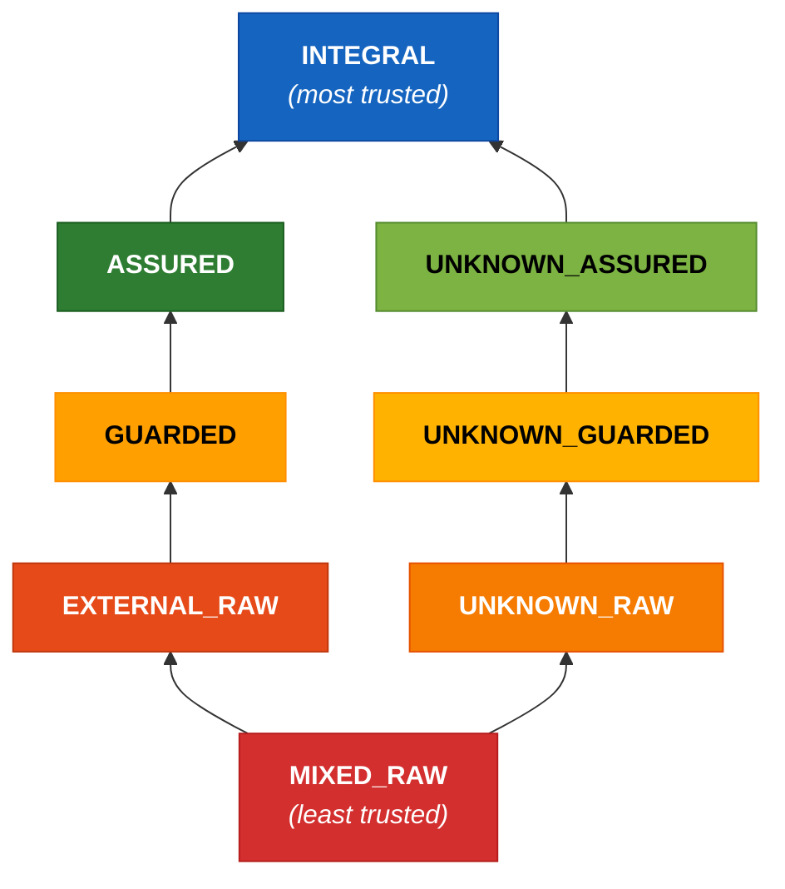

### 5. Authority tier model: enforcement specification

This section specifies the enforcement implementation of the four-tier authority model defined in §4. Tool implementers, scanner developers, and security assessors need this section; adopters and practitioners may skip to §6.

#### 5.1 Trust classification and validation status

The four tiers describe semantic authority. The eight effective states describe the enforcement contexts actually needed to grade pattern severity.

The tier model combines two orthogonal dimensions — trust classification (what guarantees the system may assume) and validation status (what processing the data has received) — to produce eight effective states.

| State | Trust Classification | Validation Status |
|-------|---------------------|-------------------|
| Audit Trail | Tier 1 | Not Applicable |
| Pipeline | Tier 2 | Not Applicable |
| Shape-Validated | Tier 3 | Shape-Validated |
| External Raw | Tier 4 | Raw |
| Unknown Raw | Unknown | Raw |
| Unknown Shape-Validated | Unknown | Shape-Validated |
| Unknown Semantically-Validated | Unknown | Semantically Validated |
| Mixed Raw | Mixed | Raw |

These eight states determine finding severity when pattern rules are evaluated: the same pattern may be an error in one state and suppressed in another (§7).

**Canonical tokens.** The following identifiers are normative and MUST be used consistently in manifest schemas, SARIF output, configuration files, and implementation code: `INTEGRAL`, `ASSURED`, `GUARDED`, `EXTERNAL_RAW`, `UNKNOWN_RAW`, `UNKNOWN_GUARDED`, `UNKNOWN_ASSURED`, `MIXED_RAW`. Prose may use the human-readable labels from the table above; machine-facing artefacts MUST use these tokens.

> **NOTE — Token names are canonical labels, not scope restrictions.** `INTEGRAL` encompasses all Tier 1 authoritative internal data (audit records, internal state, configuration), not only audit trails specifically. `ASSURED` encompasses all Tier 2 semantically validated data, not only pipeline-processed data. These names are historical; implementations MUST NOT narrow their semantics to match the everyday meaning of the token name.

**Join operation.** When data from two different taint states merges at a program point (assignment, function parameter, container construction), the resulting state is determined by the join. The general rule: any merge of values from different trust classifications produces MIXED_RAW. The validation status of the result is RAW regardless of the inputs' validation status — mixing data resets the validation dimension because the composite's structural guarantees are weaker than those of its strongest input.

**Join mental model.** Three principles govern the join before the full table:

- **Same classification, same or different validation** → result keeps the classification; validation demotes to the weaker of the two (raw beats shape-validated beats semantically-validated).
- **Different classifications (known or unknown)** → result is MIXED_RAW. Cross-classification merges always collapse to MIXED_RAW.
- **Anything + MIXED_RAW** → MIXED_RAW. Once mixed, always mixed — MIXED_RAW is the absorbing element.

The full table below specifies every case. The UNKNOWN chain is kept separate from the classified chain: merging known-provenance data with unknown-provenance data produces MIXED_RAW (not the known operand), because the composite's provenance is genuinely mixed, not merely unknown.

Specific join rules (the join is commutative, associative, and idempotent; MIXED_RAW is the absorbing element). These algebraic properties ensure convergence of fixed-point computation in standard worklist algorithms. Implementations MUST produce the same result regardless of operand order:

| Operand A | Operand B | Result | Examples |
|-----------|-----------|--------|----------|
| Any state in {INTEGRAL, ASSURED, GUARDED, EXTERNAL_RAW} | Different state in {INTEGRAL, ASSURED, GUARDED, EXTERNAL_RAW} | MIXED_RAW | join(INTEGRAL, ASSURED), join(ASSURED, EXTERNAL_RAW), join(GUARDED, ASSURED) |
| Any state in {INTEGRAL, ASSURED, GUARDED, EXTERNAL_RAW} | UNKNOWN_RAW | MIXED_RAW | join(ASSURED, UNKNOWN_RAW), join(INTEGRAL, UNKNOWN_RAW), join(GUARDED, UNKNOWN_RAW) |
| Any state in {INTEGRAL, ASSURED, GUARDED, EXTERNAL_RAW} | UNKNOWN_GUARDED | MIXED_RAW | join(EXTERNAL_RAW, UNKNOWN_GUARDED), join(ASSURED, UNKNOWN_GUARDED) |
| Any state in {INTEGRAL, ASSURED, GUARDED, EXTERNAL_RAW} | UNKNOWN_ASSURED | MIXED_RAW | join(GUARDED, UNKNOWN_ASSURED), join(INTEGRAL, UNKNOWN_ASSURED) |
| UNKNOWN_RAW | UNKNOWN_RAW | UNKNOWN_RAW | join(UNKNOWN_RAW, UNKNOWN_RAW) — provenance equally unknown |
| UNKNOWN_RAW | UNKNOWN_GUARDED | UNKNOWN_RAW | join(UNKNOWN_RAW, UNKNOWN_GUARDED) — validated status lost |
| UNKNOWN_RAW | UNKNOWN_ASSURED | UNKNOWN_RAW | join(UNKNOWN_RAW, UNKNOWN_ASSURED) — validated status lost |
| UNKNOWN_GUARDED | UNKNOWN_GUARDED | UNKNOWN_GUARDED | Identity — provenance equally unknown, same validation level |
| UNKNOWN_GUARDED | UNKNOWN_ASSURED | UNKNOWN_GUARDED | Semantic status lost to the weaker validation |
| UNKNOWN_ASSURED | UNKNOWN_ASSURED | UNKNOWN_ASSURED | Identity — provenance equally unknown, same validation level |
| Any state | MIXED_RAW | MIXED_RAW | MIXED absorbs further merges |
| X | X | X | join(ASSURED, ASSURED) = ASSURED |

**Design rationale for UNKNOWN joins.** The separation of UNKNOWN from classified states in the join table prevents UNKNOWN from silently inheriting a classification it has not earned. Implementations MUST use this join definition for consistent taint propagation.

> **Operational note — MIXED accumulation.** Because `MIXED_RAW` is the absorbing element of the join, deployments can lose taint precision over time if cross-classification joins are common and normalisation boundaries are rare. This is an intended safety bias, not a defect in the algebra. However, adopters should treat sustained growth in MIXED-heavy flows as a governance and architecture signal: either trust-boundary declarations are too coarse, or normalisation and construction boundaries are not keeping pace with data-composition patterns.

**Join operators: `join_fuse` and `join_product`.** The join table above applies uniformly to all merge operations in the current framework. However, not all merge operations are semantically equivalent. The framework distinguishes two conceptual join operators:

- **`join_fuse`** applies to operations that genuinely merge data into a single artefact where the contributing components lose their individual identity: string concatenation, dict merge (`{**a, **b}`), list extension, format-string interpolation. The result is a fused artefact whose provenance is inseparable. `join_fuse` produces MIXED_RAW when the operands span different trust classifications — this is the current behaviour, unchanged.

- **`join_product`** applies to operations that compose data into a product-type structure where each component retains its identity: dataclass construction, named-tuple packing, record/POJO construction, typed constructor invocation. The components are individually addressable after construction — `record.audit_field` and `record.external_field` remain distinct access paths.

At the framework level, `join_product` is treated identically to `join_fuse` — both produce MIXED_RAW when operands span different trust classifications. The eight-state model and the 8×8 severity matrix are unchanged.

**Binding extension: MIXED_TRACKED.** Language bindings MAY define a `MIXED_TRACKED` extension state for `join_product` on named product types where the binding can statically resolve field membership. In `MIXED_TRACKED`, each field retains its individual taint state; the composite carries a summary taint (the join of all fields) for contexts where field-level resolution is not available — e.g., when the composite is passed to a function that accepts a generic type, or when field-level tracking is lost through an untyped intermediary.

Bindings that implement `MIXED_TRACKED` SHOULD declare which named product types they can track at field level. Product types whose field membership cannot be statically resolved (e.g., dynamically constructed classes, untyped dicts, raw tuples) remain subject to `join_fuse` semantics and produce MIXED_RAW.

Bindings that do not implement field sensitivity treat `join_product` as `join_fuse` — conservative fallback to MIXED_RAW. This is the current behaviour and remains conformant. Field-sensitive taint is a binding requirement (SHOULD), not a framework invariant (MUST).

**Severity matrix extension for MIXED_TRACKED.** The framework severity matrix remains 8×8. Bindings that implement `MIXED_TRACKED` extend the matrix with a ninth column whose severity inherits from the MIXED_RAW column unless the binding explicitly narrows it. Narrowing is permitted (a binding MAY reduce severity where field-level resolution eliminates false positives); widening is not (a binding MUST NOT assign higher severity in the MIXED_TRACKED column than in the corresponding MIXED_RAW cell). This follows the overlay narrowing principle in §13.

**SARIF representation for MIXED_TRACKED.** MIXED_TRACKED findings MUST use `MIXED_TRACKED` as the taint-state token in SARIF output (`properties.taintState`). SARIF consumers that do not recognise `MIXED_TRACKED` SHOULD treat it as equivalent to `MIXED_RAW` for severity and display purposes. Bindings MUST include both the summary taint (`properties.taintState`: `MIXED_TRACKED`) and the per-field taint states (`properties.fieldTaintStates`: an object mapping field names to their individual taint-state tokens) in the SARIF properties bag.

**Binding-level specification requirements for MIXED_TRACKED.** Bindings that implement `MIXED_TRACKED` MUST specify in their language binding reference: (a) interaction with the join table — when `join(MIXED_TRACKED, X)` is evaluated, whether the summary taint or per-field taint governs the result; (b) interaction with serialisation boundaries — whether field-level tracking is preserved across serialisation/restoration or collapses to MIXED_RAW; (c) interaction with function parameter passing — when a MIXED_TRACKED value is passed to a function expecting a specific single-tier type, whether the function sees the per-field taint or the summary taint. These are binding-level design decisions; the framework does not prescribe the answers but requires that they are specified.

**Deferred: framework-level ninth state.** Full elevation of `MIXED_TRACKED` to a ninth framework state — with corresponding changes to the join table, cross-product table, and severity matrix — is deferred until at least one binding demonstrates field-sensitive taint tracking with specimen-level evidence and a worked example in its golden corpus. The binding refinement approach was chosen to reduce cascade cost: the conceptual split lands in Part I; bindings operationalise it at their own pace; the framework promotes the extension when binding-level evidence supports it.

**Trust ordering diagram.** The eight effective states have a natural trust-authority ordering: higher states represent greater institutional trust. The diagram below depicts this ordering — states connected by an upward path have increasing trust authority; states on separate branches are incomparable in the trust hierarchy.

**Relationship between the trust ordering and the join table.** The trust ordering and the join operation are distinct. The trust-ordering diagram is a Hasse diagram of the authority partial order, not the join semilattice used for dataflow. The trust ordering describes which states represent greater institutional authority (INTEGRAL is the most authoritative; MIXED_RAW is the least). The join table (above) defines what happens when data from different taint states merges — this is a taint-merge algebra, not the lattice join of the trust ordering. In particular, the join of two states that are comparable in the trust ordering does NOT necessarily produce the higher state: join(ASSURED, INTEGRAL) = MIXED_RAW, because they have different trust classifications (Tier 2 vs Tier 1), even though INTEGRAL is higher in the trust ordering. **The join table is normative.** Where the join table and the trust ordering could be read as contradictory, the join table governs. Implementations MUST derive the join function from the normative join table, not from the diagram, and MUST NOT use the trust ordering to short-circuit join computation (e.g., by assuming join(a, b) = b when a is below b in this diagram).

The key non-obvious property: UNKNOWN_ASSURED and ASSURED are on parallel chains — neither dominates the other in the trust ordering. Their join produces MIXED_RAW, not either operand.

Three properties to note: (1) MIXED_RAW is the absorbing element of the join — any cross-classification merge reaches it, and further merges stay there. (2) The UNKNOWN chain (UNKNOWN_RAW → UNKNOWN_GUARDED → UNKNOWN_ASSURED) and the classified chain (EXTERNAL_RAW → GUARDED → ASSURED) are parallel — validation can advance within either chain but cannot cross between them without a trust classification decision (which is a governance act, not a validation act). (3) EXTERNAL_RAW and UNKNOWN_RAW are incomparable in the trust ordering — neither dominates the other. Both sit above MIXED_RAW but on separate branches: EXTERNAL_RAW has a known classification (Tier 4) but no validation; UNKNOWN_RAW has no classification and no validation. The same incomparability holds between corresponding validated states on each chain. INTEGRAL is the highest-authority state, reachable only through the Tier 2 → Tier 1 construction transition.

**UNKNOWN** is data whose trust classification cannot be determined from available annotations. Entry conditions: the data enters a scope with no wardline annotation declaring its trust classification, or it is produced by an unannotated function whose inputs are themselves unannotated (no tier information available to the analysis). Invariants: UNKNOWN data receives conservative enforcement (equivalent to or stricter than EXTERNAL_RAW for most rules); UNKNOWN data that passes shape validation transitions to UNKNOWN_GUARDED; UNKNOWN data that passes semantic validation transitions to UNKNOWN_ASSURED. Neither transition grants a trust classification — the data remains unknown-origin.

**MIXED** is data derived from inputs spanning multiple authority tiers. Entry conditions: a function or expression combines inputs from two or more distinct trust classifications (e.g., Tier 1 audit data merged with Tier 4 external input). Invariants: MIXED data activates the pattern rules of every contributing tier — the enforcement burden is the union of all contributing tiers' restrictions. MIXED data cannot transition to a single-tier classification through ordinary validation, because validation establishes structural and semantic properties but does not decompose provenance. A declared normalisation boundary may collapse mixed inputs into a new Tier 2 artefact — the normalisation step is semantically a new construction (like the T2-to-T1 transition), not a passthrough of the original mixed data.

**The distinction between UNKNOWN and MIXED:** MIXED means the analysis *can show* that a real cross-tier combination occurred — the contributing tiers are known but heterogeneous. UNKNOWN means the analysis *cannot determine* the provenance at all — the tier is absent, not mixed. An unannotated function that combines Tier 1 and Tier 4 inputs produces MIXED (the analysis sees both tiers). An unannotated function whose inputs are themselves unannotated produces UNKNOWN (the analysis has no tier information to combine).

**Cross-product analysis.** The following table shows which of the 24 theoretical state combinations are reachable and which are impossible or collapsed. The full cross-product of six trust classifications (TIER_1, TIER_2, TIER_3, TIER_4, UNKNOWN, MIXED) and four validation statuses (NOT_APPLICABLE, RAW, GUARDED, SEMANTICALLY_VALIDATED) yields 24 theoretical combinations. Eight are reachable as effective states; sixteen are impossible or collapsed:

| Classification | Not Applicable | Raw | Shape-Validated | Sem. Validated | Rationale |
|----------------|----------------|-----|-----------------|----------------|-----------|
| Tier 1 | **Audit Trail** | Impossible | Impossible | Impossible | Tier 1 artefacts are produced under institutional rules — they are not raw and validation is not applicable to them |
| Tier 2 | **Pipeline** | Impossible | Collapsed to Pipeline | Collapsed to Pipeline | Tier 2 *is* the result of semantic validation — raw Tier 2 is contradictory; shape-only Tier 2 is contradictory (semantic validation requires prior shape validation); sem-validated Tier 2 is redundant |
| Tier 3 | Impossible | Impossible | **Shape-Validated** | Collapsed to Pipeline | Tier 3 *is* the result of shape validation — raw Tier 3 is contradictory; semantically validated Tier 3 becomes Tier 2 |
| Tier 4 | Impossible | **External Raw** | Collapsed to Shape-Validated | Collapsed to Pipeline | Tier 4 is by definition raw external data; shape-validated Tier 4 becomes Tier 3; semantically validated Tier 4 becomes Tier 2 (implying both validation steps occurred) |
| Unknown | Impossible | **Unknown Raw** | **Unknown Shape-Validated** | **Unknown Semantically-Validated** | Not Applicable is reserved for data produced under institutional rules. Unknown-origin data has not been produced under such rules, so Not Applicable does not apply. Both validated states are reachable because validation establishes properties without resolving provenance |
| Mixed | Impossible | **Mixed Raw** | Collapsed to Mixed Raw | Collapsed to Mixed Raw | Ordinary validation does not resolve mixed provenance — it establishes structure or semantics but cannot decompose the contributing tiers (see also the join table absorbing-element property: anything + MIXED_RAW = MIXED_RAW). A declared normalisation boundary may produce a new T2 artefact from mixed inputs |

All sixteen non-reachable combinations are accounted for by the Impossible or Collapsed entries in the Rationale column. The normalisation boundary mechanism for MIXED data is specified in §5.2 (transition semantics).

#### 5.2 Transition semantics

Tier transitions are directional and constrained:

```mermaid
graph LR
    T4["<b>Tier 4</b><br/>Raw Observation"]
    T3["<b>Tier 3</b><br/>Shape-Validated Representation"]
    T2["<b>Tier 2</b><br/>Semantically Validated Representation"]
    T1["<b>Tier 1</b><br/>Trusted Assertion"]
    RAW["Raw Representation<br/><i>(serialised bytes)</i>"]

    T4 -->|"Shape validation<br/>(structural establishment)"| T3
    T3 -->|"Semantic validation<br/>(domain establishment)"| T2
    T2 -->|"Trusted construction<br/>(institutional rules)"| T1
    T1 -->|"Serialisation<br/>(sheds direct authority)"| RAW
    RAW -->|"Trusted restoration<br/>(§5.3 evidence categories)"| T1
    RAW -.->|"Shape validation only<br/>(no provenance claim)"| USV["UNKNOWN_GUARDED"]
    USV -.->|"Semantic validation<br/>(no provenance claim)"| USEV["UNKNOWN_ASSURED"]

    style T1 fill:#2C3E5D,color:#fff,stroke:#2C3E5D
    style T2 fill:#4A6FA5,color:#fff,stroke:#4A6FA5
    style T3 fill:#6B8EC2,color:#fff,stroke:#6B8EC2
    style T4 fill:#8B9DC3,color:#fff,stroke:#8B9DC3
    style RAW fill:#D4D4D4,color:#333,stroke:#999
    style USV fill:#D4D4D4,color:#333,stroke:#999,stroke-dasharray: 5 5
    style USEV fill:#D4D4D4,color:#333,stroke:#999,stroke-dasharray: 5 5
```

- **T4 to T3 — structural establishment.** Via shape validation: the data passes through a defined validation boundary that guarantees structural properties — required fields present, types correct, data satisfies its declared structural guarantee. Shape-validated Tier 4 data *becomes* Tier 3. There is no "shape-validated Tier 4" state — shape validation is the mechanism by which raw observations become shaped representations. After this transition, the data is safe to handle (field access will not crash) but its values are not yet verified for domain use.
- **T3 to T2 — domain establishment.** Via semantic validation: the data passes through a validation boundary that establishes domain-constraint satisfaction for every intended use within the declared validation scope. Semantically validated Tier 3 data *becomes* Tier 2. The semantic validator MUST satisfy the constraints of every contract declared in its validation scope — it establishes that the data is safe to *use*, not merely safe to *handle*.

  *Scoping via boundary contracts.* Validation-scope adequacy is expressed through named boundary contracts (e.g., `"landscape_recording"`, `"partner_reporting"`) that specify what data crosses the boundary and at what tier, rather than through fully qualified function names. Each contract declares a stable semantic identifier, the data tier expected, and the direction of flow.

  *Contract-to-function mapping.* The function-level binding (which functions currently implement each contract) is a secondary mapping that resides in the overlay (§13.1.2) and survives refactoring independently of the contract declarations.
- **T2 to T1 — trusted construction.** The transition is an act of institutional interpretation: only via explicit trusted construction under institutional rules. A Tier 1 artefact is a new semantic object — an audit entry, a decision record, a fact assertion — produced from Tier 2 inputs under governed logic. The source inputs remain Tier 2 after the Tier 1 artefact is produced.

**Combined validation boundaries.** A single function may perform both shape and semantic validation (T4→T2) — this is a common pattern for simple data types where the structural and semantic checks are naturally interleaved. The model treats this as two logical transitions occurring within one function body: the structural checks establish T3 guarantees, and the semantic checks then establish T2 guarantees. The scanner MUST be able to establish that the boundary performs both structural and semantic validation, whether inline or through analysable helper calls. Field-by-field interleaving — validating a field's type and then immediately checking its domain range before moving to the next field — is conformant; invariant 3 requires that structural establishment logically precedes semantic establishment, not that all structural checks must complete before any semantic check begins.

Combined validation boundaries are declared with a combined-validation annotation (§6, Group 1) — e.g., `@validates_external` in the Python binding (Part II-A §A.4), `@ValidatesExternal` in the Java binding (Part II-B §B.4) — or the generic trust-boundary annotation with `from_tier=4, to_tier=2` (§6, Group 16). The decomposed annotations — shape validation (T4→T3) and semantic validation (T3→T2) — are used when the two phases are separate functions.

Seven invariants govern these transitions:

1. **Shape-validated T4 becomes T3.** Shape validation establishes structure — field presence, type correctness, schema conformance — not domain meaning. There is no intermediate state.
2. **Semantically validated T3 becomes T2.** Semantic validation establishes domain-constraint satisfaction for every intended use within the declared validation scope. There is no "partially validated" state — data is either semantically valid for all intended uses or it is not.
3. **Shape validation MUST precede semantic validation.** Semantic validation operates on structurally sound data. Applying domain-constraint checks to data whose field presence and type correctness have not been established is structurally unsound — the semantic checks may crash, produce misleading results, or silently operate on wrong types. A function that performs both checks in a single body satisfies this invariant internally; two separate functions MUST be ordered correctly.
4. **T2 does not automatically upgrade to T1.** Tier 1 artefacts are new semantic objects produced under institutional rules, not Tier 2 data with a higher label.
5. **Serialisation sheds direct authority at the representation layer.** A Tier 1 artefact written to storage becomes a raw representation. The act of serialisation strips the direct authority relationship — what remains is bytes whose provenance must be independently established on read. A serialisation boundary, from the taint engine's perspective, is any operation that converts an in-memory typed representation into a persistence or transport format: writing to a file, database, message queue, or socket; encoding to JSON, protobuf, or any wire format. The common property is that the output is bytes, not typed objects — the type system's guarantees do not survive the boundary.
6. **Trusted restoration may reinstate prior authority.** A raw representation may be restored to Tier 1 only through a declared *trusted restoration boundary* with provenance and integrity guarantees (see §5.3).
7. **Tier assignment is not contagious.** Authority assigned to a derived Tier 1 artefact does not retroactively alter the trust classification of its source inputs. This prevents laundering lower tiers into higher tiers by accident — the failure mode where "validated once" magically turns all downstream uses into authoritative truth.

#### 5.3 Trusted restoration boundaries

The serialisation/restoration model distinguishes *construction* from *restoration*. Construction produces a new Tier 1 artefact from Tier 2 inputs under institutional rules (§5.2, T2-to-T1 transition). Restoration reconstitutes a previously serialised Tier 1 artefact from its raw representation. The distinguishing criterion: restoration requires an evidence-backed provenance claim supported by institutional attestation — a mere assertion of internal origin does not suffice (see evidence categories below).

Four categories of provenance evidence support restoration boundary declarations, each progressively harder to verify technically. Evidence categories 1–3 are cumulative — each higher tier requires all lower categories (T1 requires structural + semantic + integrity; T2 requires structural + semantic; T3 requires structural). Category 4 (institutional) is orthogonal: it determines whether the restored data enters a known-provenance tier (T1–T3) or an unknown-provenance state (UNKNOWN_*). The restoration table below specifies the complete mapping.

1. **Structural evidence (REQUIRED for any restoration above raw).** The raw representation MUST pass shape validation — schema conformance, field completeness, type correctness. This is the minimum requirement and is machine-verifiable. WL-007-style structural verification applies: a restoration boundary function that contains no rejection path is structurally unsound.
2. **Semantic evidence (REQUIRED for restoration to Tier 2 or above).** The restored data MUST pass semantic validation — domain constraints satisfied for every intended use within the declared validation scope. Structural evidence alone establishes that the data is safe to handle; semantic evidence establishes that it is safe to use. This is particularly important for restoration because domain constraints may have changed since serialisation — business rules evolve, external dependencies shift, and data that was semantically valid at serialisation time may no longer be.
3. **Integrity evidence (REQUIRED for restoration to Tier 1).** Cryptographic or structural integrity checks that the representation has not been modified since serialisation — checksums, signatures, or equivalent mechanisms. Restoration with structural, semantic, and institutional evidence but without integrity evidence produces at most Tier 2 — the data's structure and domain validity are verified but its integrity since serialisation is not established. Integrity evidence may be absent by exception only, under STANDARD exception governance (§9). The exception MUST document why integrity verification is not feasible and MUST specify the compensating controls that mitigate the absence of integrity evidence.
4. **Provenance-institutional evidence (REQUIRED for restoration to any known-provenance tier).** Institutional attestation that the storage boundary is trustworthy — that the file, database, or message queue is under the organisation's control, that access controls are in place, and that the serialisation path is known. This evidence is explicitly institutional, not technical. It cannot be verified by the enforcement tool and is governed through the governance model (§9). Without institutional evidence, restoration cannot produce a known-provenance tier — only UNKNOWN states are reachable.

The four evidence categories determine the restored tier:

| Structural | Semantic | Integrity | Institutional | Restored Tier |
|:---:|:---:|:---:|:---:|---|
| Yes | Yes | Yes | Yes | **Tier 1** — full restoration. All four categories present; the restoration produces an artefact with the same authority as the original. |
| Yes | Yes | — | Yes | **Tier 2 maximum.** Structure and domain validity verified, provenance institutionally attested, but integrity since serialisation is not established. |
| Yes | — | — | Yes | **Tier 3 maximum.** Structure verified and provenance institutionally attested, but domain constraints have not been re-verified since serialisation. Appropriate when semantic validity may have been invalidated by time — business rules that have changed, domain constraints that depend on external state. |
| Yes | Yes | — | — | **UNKNOWN_ASSURED.** Structure and domain constraints verified, but no institutional attestation of provenance. The data passes all technical checks but its origin is unverified. |
| Yes | — | — | — | **UNKNOWN_GUARDED.** Structure verified but no provenance claim and no semantic re-verification. Shape-validated data of indeterminate origin. |
| — | — | — | — | **UNKNOWN_RAW.** No evidence present. The data is treated as fully untrusted. **NOTE: this is not Tier 4 (EXTERNAL_RAW).** Tier 4 denotes data positively classified as external. A raw representation with no evidence is of indeterminate origin, not necessarily external — the UNKNOWN/EXTERNAL distinction matters because their severity matrix columns differ. |

The key distinction: institutional evidence is the gate between known-provenance tiers (T1–T3) and unknown-provenance states (UNKNOWN_*). A mere assertion of internal provenance — without institutional attestation — does not elevate data above unknown-origin status. This prevents trust-classification uplift on assertion rather than evidence: an agent or developer claiming "this is internal data" without institutional backing receives no tier benefit from the claim.

#### 5.4 Cross-language taint propagation

In polyglot applications where data crosses language boundaries (e.g., a Python service calling a Go microservice, or a shared database accessed by multiple language runtimes), the receiving language's enforcement tool cannot verify the emitting language's taint assertions. Data crossing a language boundary resets to UNKNOWN_RAW in the receiving binding unless the receiving binding can independently verify the emitting binding's taint assertion. Independent verification means the receiving binding can establish the taint state from evidence available in its own enforcement context, without trusting an assertion from the emitting binding. The verification mechanism MUST be declared in the wardline manifest (§13). The current conformant mechanism is a shared wardline manifest that declares the cross-language interface as a typed trust boundary with both bindings enforcing the same tier assignment; future mechanisms (e.g., taint metadata in serialisation formats) are permitted provided they satisfy the independent-verification requirement and are manifest-declared.

This is conservative: it may over-taint data that was well-classified in the emitting language. The alternative — trusting cross-language taint assertions without verification — would allow a weaker binding to launder taint state through a language boundary. Polyglot applications that need tighter cross-language taint tracking are expected to declare their inter-language interfaces as explicit trust boundaries in the root wardline manifest, with both bindings' enforcement tools validating the shared boundary declarations.

The adoption consequence of this conservatism is intentional but real: frequent cross-language resets to `UNKNOWN_RAW` can make a polyglot deployment feel noisier and less precise than a single-binding deployment. The shared-manifest mechanism is therefore not only a soundness mechanism but also an adoption mechanism — it reduces unnecessary trust resets by making cross-language interfaces explicit and jointly governed.

**Scope clarification.** This section applies to cross-*binding* boundaries — where data passes between different language runtimes, each with its own enforcement tool. It does not apply to serialisation boundaries within the same binding (e.g., a Python application reading from a database that the same Python application wrote to). Serialisation boundaries within a single binding are governed by the restoration boundary model (§5.3) using the restoration boundary annotation (§6, Group 17), which provides more precise taint tracking through provenance evidence categories. A Python application reading its own audit trail from PostgreSQL is a restoration boundary, not a cross-language boundary — the emitting and receiving binding are the same, and the restoration model applies.

**Shared-storage polyglot pattern.** When different bindings share a storage medium — e.g., a Python service writes to PostgreSQL and a Java service reads from the same database — each binding's read is an independent restoration boundary (§5.3), not a cross-language boundary. The Java service does not receive data "from Python" — it reads a raw representation from storage and restores it under its own evidence categories and governance. The two bindings' restoration boundaries are independent: each declares its own evidence basis, each is governed separately, and neither trusts the other's classification. The shared wardline manifest (§13) ensures both bindings agree on the data source's tier assignment, but the restoration evidence is evaluated independently by each binding.

#### 5.5 Third-party in-process dependency taint

In-process calls to third-party libraries — code that executes within the same runtime but is not under the deploying organisation's governance — present an analogous problem to cross-language boundaries (§5.4). The enforcement tool cannot verify a third-party library's internal validation logic, taint handling, or failure semantics, because the library's code is outside the wardline's annotation surface and governance perimeter. A third-party library function that performs internal validation does not constitute a wardline validation boundary — the application has no governance evidence that the library's checks are adequate, comprehensive, or stable across releases.

Data returned from a third-party library call defaults to UNKNOWN_RAW unless a `dependency_taint` declaration (§13.1.2) assigns a specific taint state with governance rationale. The enforcement tool does not need a general mechanism to classify which calls are "third-party" — it matches call targets against the fully qualified function paths declared in `dependency_taint` entries, using the same import-resolution mechanism it uses for boundary declarations. Functions not declared in `dependency_taint` and not carrying wardline annotations receive UNKNOWN_RAW by default. This is conservative: it may over-taint data that the library has already validated. The alternative — trusting a third-party library's internal validation without independent verification — would allow ungoverned code to perform tier promotions, which is the same trust-laundering problem that §5.4 addresses for cross-language boundaries.

The correct application architecture validates data at *your* boundary regardless of what the library does internally. A third-party library that performs shape validation is defence in depth — the application's own `@validates_shape` boundary re-establishes structural guarantees under governance. The library's validation reduces the likelihood of rejection at the application boundary; it does not replace it. This is the same principle that governs cross-language taint: the receiving side validates independently because it cannot verify the emitting side's claims.

The "both MUST agree" constraint (§13.1.2) — which requires manifest boundary declarations to have corresponding code annotations — does not apply to `dependency_taint` declarations. These are taint source declarations about code outside the governance perimeter, not boundary declarations within it. The manifest declares what the data *is* when it arrives from ungoverned code; the application's own annotated boundaries declare what happens to it next.

**Compound call patterns.** The `dependency_taint` mechanism matches direct calls to declared function paths. Four compound patterns require additional specification to ensure consistent behaviour across implementations. The patterns below are described using Python-like semantics for illustration; language-specific equivalents (e.g., Java Stream API, try-with-resources, CompletableFuture chains) are specified in the respective language binding references (Part II-A, Part II-B):

- **Method chaining** (`lib.fetch().transform().validate()`): Each method in the chain is resolved independently against `dependency_taint` entries. If `lib.fetch` is declared but `transform` is not, the return of `fetch()` receives the declared taint, and the return of `.transform()` — as a method call on an object whose taint is known — SHOULD inherit the taint of its receiver unless `.transform` has its own `dependency_taint` declaration. This taint inheritance applies to fluent calls (where the return type is the same as or a subtype of the receiver) and to non-fluent calls (where the return type differs, e.g., `connection.cursor()`). In both cases, the undeclared method's return inherits its receiver's taint as the conservative default; for non-fluent calls where the returned object has materially different taint characteristics, a separate `dependency_taint` entry for the returned type's methods is the correct resolution. Taint does not improve through undeclared method calls.
- **Generators and iterators** (`for item in lib.stream()`): Each value yielded by a declared generator function SHOULD receive the taint declared for that function's return. The taint applies per-element, not to the iterator object itself.
- **Context managers** (`with lib.connection() as conn`): The bound variable (`conn`) SHOULD receive the taint declared for the context manager function's return. For `async with`, the same rule applies to the value bound by `__aenter__`.
- **Async iterators** (`async for item in lib.stream()`): The same rule as synchronous generators — per-element taint from the declared function. Implementations that cannot reliably track taint through `__aiter__`/`__anext__` protocols SHOULD fall back to UNKNOWN_RAW for the yielded values and document this as a conformance limitation.

Where an implementation cannot resolve a compound call pattern against `dependency_taint` entries, the implementation MUST fall back to UNKNOWN_RAW. Implementations SHOULD document which compound patterns they support and which fall back to UNKNOWN_RAW.

**Staleness detection for dependency_taint declarations.** Because `dependency_taint` declarations reference functions in third-party code that is outside the governance perimeter, these declarations can become stale when the library updates its API — function renames, signature changes, or removal. Enforcement tools SHOULD validate `dependency_taint` entries against import resolution at scan time: if a declared function path does not resolve to an importable symbol, the tool SHOULD emit a WARNING-level finding. This does not catch silent semantic changes (a function that keeps its name but changes its validation behaviour), but it catches the most common staleness vector — API renames across library version upgrades. The `package` version constraint in `dependency_taint` entries (§13.1.2) provides a secondary defence: version changes that fall outside the declared constraint range trigger a fingerprint baseline change (§9.2), surfacing the entry for governance review.
