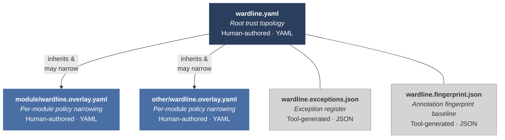

### 13. Portability and manifest format

The wardline classification framework is language-neutral — a single `wardline.yaml` serves all language bindings in a polyglot project. The authority tier model (§4), annotation vocabulary (§6), pattern rules (§7), governance model (§9), and verification properties (§10) are stated as requirements that any language-specific enforcement regime (§14.4) MUST satisfy. Languages with weaker type systems or object models will have structural gaps that require compensating controls (§11).

Two enforcement regimes are currently defined: *Wardline for Python* (Part II-A) and *Wardline for Java* (Part II-B). The conformance profiles (§14.3) allow each tool in a regime to implement the slice that matches its capabilities. Further language regimes (C#, Go, C++, Rust) are future work — the full candidate language list and per-language evaluation rationale are in §15.

#### 13.1 Wardline manifest format

The wardline manifest is the machine-readable declaration of an application's trust topology, rule configuration, and exception register. It is language-neutral — a project's wardline is a property of the application's semantic boundaries, not of the language it is written in. Polyglot applications declare a single wardline that their language-specific enforcement tools each consume.

The manifest (`wardline.yaml`) declares the trust topology and governance policy. Scanner operational settings — rule severity thresholds, external-call heuristic lists, determinism ban lists — reside in `wardline.toml`, which is binding-specific configuration, not part of the manifest system.

Manifest schemas identify boundaries, transitions, contracts, and supplementary-group policy using canonical schema fields and enumeration values, not language-specific annotation syntax. Python decorators, Java annotations, and future binding syntaxes each map onto the same manifest declarations. Cross-binding interchange therefore depends on manifest identifiers and SARIF group numbers (§10.1), not on any binding's surface spelling.

The manifest system is hierarchical, comprising four file types. The root manifest declares the trust topology; overlays narrow policy for specific modules; tool-generated files track exceptions and annotation state. Each file contains both policy artefacts and enforcement artefacts (§9.3.1) — the distinction is per-field, not per-file. The artefact class column in the table below identifies which governance regime applies to each file's contents.



| File | Format | Authored By | Purpose | Artefact class (§9.3.1) |
|------|--------|-------------|---------|------------------------|
| `wardline.yaml` | YAML | Human | Root trust topology — tier definitions, data source classifications, delegation policy, rule defaults, governance thresholds | Mixed — tier definitions and delegation policy are **policy**; rule defaults and governance thresholds are **enforcement** |
| `wardline.overlay.yaml` | YAML | Human | Per-module or per-application policy — boundary locations, rule overrides, module-tier mappings, supplementary group enforcement, default taint for unannotated code | Mixed — boundary declarations and optional-field declarations are **policy**; rule overrides are **enforcement** |
| `wardline.exceptions.json` | JSON | Tool (governance-approved) | Exception register — granted exceptions with reviewer identity, rationale, expiry, provenance | **Policy** — exception rationale is a governance decision |
| `wardline.fingerprint.json` | JSON | Tool | Annotation fingerprint baseline — per-function annotation hash, coverage metrics (§9.2) | **Enforcement** — tool-generated tracking artefact |

Human-authored files use YAML for readability — the manifest is a governance artefact that security assessors MUST be able to read, not only tooling configuration. All string identifiers MUST be quoted to prevent YAML implicit typing. Tool-generated files use JSON for schema strictness and round-trip fidelity — no hand-editing expected.

!!! info "The Norway problem"
    The ISO country code `"NO"` for Norway becomes the boolean `false` when unquoted in YAML 1.1. Many popular libraries (PyYAML, LibYAML) still default to YAML 1.1 behaviour. Always quote string identifiers in `wardline.yaml` and `wardline.overlay.yaml`.

**Location conventions.** The root manifest resides at the repository root: `wardline.yaml`. Overlays reside in module directories: `<module>/wardline.overlay.yaml`. Exception registers and fingerprint baselines are co-located with their governing manifest — `wardline.exceptions.json` at the root for cross-cutting exceptions, `<module>/wardline.exceptions.json` for module-level exceptions (subject to delegation). Each enforcement tool in a regime discovers manifests by walking up the directory tree from the analysed file to the repository root, merging overlays with the root manifest. In a multi-tool regime (§14.4), each tool independently discovers and validates the manifest — this is defence-in-depth, not redundancy. A regime orchestrator (Wardline-Governance tool) MAY additionally pre-validate the manifest and pass a validated configuration to other tools, but each tool MUST NOT skip its own validation on the assumption that another tool has already checked.

**Merge semantics.** Overlays inherit from the root manifest and MAY narrow but MUST NOT widen:

- An overlay CANNOT relax a tier assignment (declare Tier 1 data as Tier 2 or lower)
- An overlay CANNOT lower severity (change ERROR to WARNING for a rule)
- An overlay CAN raise severity, add boundaries, or further restrict rule configuration
- An overlay CANNOT grant exception classes it has not been delegated authority for (§13.1.3)
- Nested overlays compose from the repository root toward the analysed file's directory; the nearest in-scope overlay applies last, but only within the framework's narrowing-only rule
- If two in-scope overlays make incompatible declarations that cannot be composed by narrowing, the enforcement tool MUST reject the manifest set rather than choosing one silently

An enforcement tool that encounters a widening override in an overlay MUST reject the overlay with an error, not a warning. Widening is a policy violation, not a configuration issue.

#### 13.1.1 Root manifest schema

The root `wardline.yaml` contains five sections:

**Tier definitions.** Named data sources and their authority tier assignment. Each entry declares a data source identifier, its tier (1, 2, 3, or 4), and a human-readable description. These declarations are the root of the trust topology — they define what the application considers authoritative (Tier 1), semantically validated (Tier 2), guarded (Tier 3), and raw external (Tier 4). Tier numbers use the framework's four-tier model exclusively — custom tiers are not permitted.

**Rule configuration.** Global severity and exceptionability overrides. The default is the framework severity matrix (§7.3) — the manifest need not restate the matrix. Overrides are stated as tuples of (rule, taint state, severity, exceptionability) that replace specific cells in the matrix. Three constraints govern override power: the root manifest MAY narrow governable cells (raise severity or tighten exceptionability); the root manifest MUST NOT alter UNCONDITIONAL cells — changing an UNCONDITIONAL cell requires modifying the framework specification itself (§9.1), not project configuration; the root manifest MUST NOT lower the framework's minimum severity for any cell unless the framework explicitly permits project-level relaxation (currently no cells carry such permission). Without these constraints, a root manifest could quietly convert the specification into decorative wallpaper. This section also declares the project's precision and recall thresholds (§10) if they differ from the framework recommendations, and the expedited governance ratio threshold (§9.4).

**Delegation policy.** Which overlays may grant which exception classes. The root manifest declares a default delegation authority (RECOMMENDED: RELAXED) and per-path grants that raise or lower the authority for specific module paths. An overlay at a path with `authority: NONE` cannot self-grant any exceptions — all exceptions for that module MUST be registered in the root exception register. UNCONDITIONAL findings can never be excepted regardless of delegation — that constraint is structural, not delegable.

**Module-tier mappings.** Default taint state for unannotated code within each module. When a function in a module has no wardline annotations, the enforcement tool assigns the module's default taint state. This provides baseline enforcement even before full annotation investment — a module declared as INTEGRAL context has its unannotated functions treated as Tier 1, activating the full pattern-rule suite at the strictest severity.

Module-tier mappings are a coarse baseline, not a substitute for explicit boundary declarations or data-source classifications. They are most appropriate for modules with a strong dominant trust posture; mixed-trust modules SHOULD prefer finer-grained annotations and boundaries rather than relying on a single module default to carry semantic meaning.

**Manifest metadata.** Organisation name, ratifying authority (name and role), ratification date, and review interval. The ratification fields support the governance model's requirement that the wardline is an organisationally endorsed policy, not a developer's personal configuration. In contracted development — the dominant delivery context in government — the manifest is typically authored by the acquiring organisation and supplied to the contractor as part of the security requirements, analogous to a security plan or classification guide. The ratifying authority remains the acquiring organisation's CISO or delegate, not the contractor's, since the manifest encodes the organisation's institutional knowledge about its own data semantics. The enforcement tool MUST compute the age of the ratification (current date minus ratification date) and compare it to the declared review interval. When the ratification age exceeds the review interval, the enforcement tool produces a governance-level finding (analogous to the expedited ratio finding in §9.4) indicating the manifest is overdue for review. Without this enforcement, the review interval is advisory documentation, not an enforceable control.

**Root manifest example:**

```yaml
# wardline.yaml — root trust topology
metadata:
  organisation: "Department of Example"
  ratified_by: { name: "J. Smith", role: "CISO" }
  ratification_date: "2026-01-15"
  review_interval_days: 180

tiers:
  - id: "internal_database"
    tier: 1
    description: "PostgreSQL audit store under institutional control"
  - id: "partner_api"
    tier: 4
    description: "External partner data API"

rules:
  overrides: []   # Default severity matrix (§7.3) applies

delegation:
  default_authority: "RELAXED"
  grants:
    - path: "audit/"
      authority: "NONE"   # All audit exceptions require root-level approval

module_tiers:
  - path: "audit/"
    default_taint: "INTEGRAL"
  - path: "adapters/"
    default_taint: "EXTERNAL_RAW"
```

All root manifest fields are validated against a JSON Schema. Enforcement tools MUST validate the manifest against this schema before consuming it — a malformed manifest is a hard error, not a best-effort parse.

#### 13.1.2 Overlay schema

Overlays declare what is *here* — boundaries, local rule tuning, and module-specific policy — without restating or contradicting the trust topology.

**Overlay identity.** Every overlay MUST include an `overlay_for` field declaring its governing path. The overlay file MUST reside within the directory it claims to govern — `audit/wardline.overlay.yaml` governs `audit/`, not `config/overlays/audit-overlay.yaml`. The enforcement tool verifies that the overlay's `overlay_for` field is a prefix of the overlay file's actual path; an overlay whose file location is outside the governed directory is rejected regardless of what `overlay_for` declares. This is the stronger guarantee: it prevents an `adapters/` overlay from claiming governance over `audit/` through declaration alone.

##### Boundary declarations

**Boundary declarations.** The primary content of most overlays. Boundaries declare where tier transitions happen: shape-validation boundaries (Tier 4 → Tier 3), semantic-validation boundaries (Tier 3 → Tier 2), combined validation boundaries (Tier 4 → Tier 2), trust construction boundaries (Tier 2 → Tier 1), and restoration boundaries (raw representation → restored tier). Each boundary entry identifies the function (by fully qualified name), the tier transition, and — for restoration boundaries — the four provenance evidence categories from §5.3 (structural, semantic, integrity, institutional). The manifest says "a boundary exists here"; the code annotation on the function says "I am that boundary." Both MUST agree — an enforcement tool that finds a manifest boundary declaration without a corresponding code annotation, or vice versa, produces a finding. Changes to a declared boundary function's signature are governance-relevant when they affect the boundary's semantic scope — for example, adding, removing, or reclassifying parameters that participate in validation, restoration, or construction. Bindings SHOULD include the effective boundary signature in fingerprint-baseline tracking or an equivalent manifest-coherence check so that a semantically meaningful signature change is surfaced even when the wardline annotation itself is unchanged.

Boundary declaration schema:

```yaml
overlay_for: "adapters/"

boundaries:
  # Tier-flow boundaries: from_tier and to_tier use the four-tier model
  - function: "myproject.adapters.check_partner_structure"
    transition: "shape_validation"
    from_tier: 4
    to_tier: 3
  - function: "myproject.adapters.validate_partner_semantics"
    transition: "semantic_validation"
    from_tier: 3
    to_tier: 2
    validation_scope:           # Required for boundaries claiming Tier 2
      contracts:               # Named boundary contracts this validator satisfies
        - name: "landscape_recording"
          data_tier: 2
          direction: "inbound"
          description: "Partner data validated for landscape engine consumption"
        - name: "partner_reporting"
          data_tier: 2
          direction: "inbound"
          description: "Partner data validated for summary report generation"
      description: "Partner data for landscape recording and reporting"
  - function: "myproject.adapters.validate_partner"
    transition: "combined_validation"
    from_tier: 4
    to_tier: 2
    validation_scope:
      contracts:
        - name: "landscape_recording"
          data_tier: 2
          direction: "inbound"
        - name: "partner_reporting"
          data_tier: 2
          direction: "inbound"
      description: "Partner data for landscape recording and reporting"
  - function: "myproject.engine.create_risk_assessment"
    transition: "construction"
    from_tier: 2
    to_tier: 1

  # Restoration boundary: no from_tier — restoration semantics are
  # governed by the evidence object, not the tier-flow ordering.
  # The restored tier is determined by available evidence (§5.3).
  - function: "myproject.audit.load_audit_record"
    transition: "restoration"
    restored_tier: 1   # claimed restoration target (subject to evidence)
    provenance:
      structural: true       # body contains shape validation
      semantic: true         # body contains domain-constraint checks
      integrity: "checksum"  # "checksum", "signature", "hmac", or null
      institutional: "internal_database"  # institutional provenance attestation
    validation_scope:           # Required when semantic_evidence is true
      contracts:
        - name: "landscape_recording"
          data_tier: 1
          direction: "outbound"
          description: "Restored audit records consumed by landscape engine"
      description: "Restored audit records for landscape engine consumption"
```

**Tier-flow boundaries** (shape_validation, semantic_validation, combined_validation, construction) use `from_tier` and `to_tier` from the four-tier model. These declare transitions within the tier-flow ordering (§5.2). **Constraint on `to_tier=1`:** Tier 1 construction is a fundamentally different act from validation — it produces a new semantic object under institutional rules, not a validated representation of existing data (§5.2 invariant 4). Accordingly, `to_tier: 1` is valid only when `from_tier: 2`. Skip-promotions to Tier 1 (`from_tier: 3, to_tier: 1` or `from_tier: 4, to_tier: 1`) are schema-invalid — the enforcement tool MUST reject them. The rejection message SHOULD direct the author to the required composed-steps form, for example: T4→T3 shape validation, T3→T2 semantic validation, then T2→T1 construction. T4→T1 or T3→T1 MUST be expressed through composed steps: validation boundaries to reach Tier 2, then a construction boundary to reach Tier 1.

##### Validation-scope declarations

**Validation-scope declarations.** Every boundary that claims Tier 2 semantics — `semantic_validation` boundaries, `combined_validation` boundaries, and restoration boundaries with `semantic: true` in their provenance evidence — MUST include a `validation_scope` object.

- `contracts` — list of typed boundary contracts. Each contract declares:
    - `name` — a stable semantic identifier (e.g., `"landscape_recording"`, `"partner_reporting"`). Contract names describe *what crosses the boundary*, not which functions consume it. They survive refactoring — a rename or module restructure does not invalidate the contract
    - `data_tier` — the authority tier of data crossing the boundary under this contract
    - `direction` — direction of data flow relative to the boundary: `"inbound"` (data enters the validation scope), `"outbound"` (data leaves the validation scope)
    - `description` *(optional)* — free-text description of the contract's scope
    - `preconditions` *(optional)* — declared preconditions that the validator establishes for this contract. Structured precondition declarations are a future extension; the current schema accepts free-text descriptions
- `description` — free-text description of the overall validation scope

Conformant implementations SHALL identify boundary contracts by contract name, not by function signature. Contract identity MUST be preserved across function renames, signature changes, and refactoring. A boundary contract's `name` field is the stable identifier; the function-level binding (which function implements the contract) is configuration that updates independently.

##### Contract bindings

**Contract bindings.** The function-level binding — which functions currently implement each contract — resides in the overlay as a secondary mapping under `contract_bindings`. This separates the stable policy declaration (what crosses the boundary) from the volatile implementation detail (where the code currently lives). Contract bindings survive refactoring: when a function is renamed or moved, only the `contract_bindings` entry updates; the contract declarations and their governance history are unaffected.

```yaml
overlay_for: "adapters/"

contract_bindings:
  - contract: "landscape_recording"
    functions:
      - "myproject.engine.record_to_landscape"
      - "myproject.engine.update_landscape_record"
  - contract: "partner_reporting"
    functions:
      - "myproject.reports.generate_partner_summary"
```

Contract bindings are enforcement artefacts (§9.3.1) — they are governed under configuration management, not security policy. Changes to `contract_bindings` are tracked in the fingerprint baseline but do not trigger the governance escalation required for contract declaration changes.

**Scoped Tier 2.** A future revision MAY introduce scoped tier assignments within a validation scope — "Tier 2 for these contracts, Tier 3 for all others" — allowing graduated trust within a single boundary. The current contract model already permits a boundary to declare multiple contracts with different semantic purposes, but the boundary as a whole still claims a single effective output tier. A future scoped-tier extension would add per-contract trust effects within one boundary, not merely more contract names. This extension is deferred until the contract-based validation-scope model is validated in practice.

**Enforcement:** The tool presence-checks the `validation_scope` field — a boundary claiming Tier 2 semantics without a `validation_scope` declaration is a finding. The tool does not verify that the listed contracts' constraints are actually satisfied by the validator's body; that remains a governance judgement (see §12, residual risk 10).

Changes to the `validation_scope` (contracts added, removed, or modified) are tracked in the annotation fingerprint baseline as a distinct change category. Contract declaration changes (names, tiers, directions) are policy artefact changes (§9.3.1) and require the governance escalation appropriate to their artefact class. Contract binding changes (function mappings) are enforcement artefact changes and follow standard configuration management.

##### Restoration boundaries

**Restoration boundaries** use a distinct schema: `restored_tier` declares the claimed restoration target, and the `provenance` object declares the four evidence categories that determine whether the claim is justified. Restoration boundaries do not use `from_tier` because the input is a raw representation (serialised bytes whose authority was shed at serialisation time, §5.2 invariant 5), not Tier 4 external data — conflating the two would obscure the governance-heavy provenance requirements that distinguish restoration from validation.

The `provenance` object fields (with decorator parameter name equivalents from the Python binding, Part II-A §A.4):

- `structural` (`structural_evidence`) — boolean: whether the body performs shape validation
- `semantic` (`semantic_evidence`) — boolean: whether the body performs domain-constraint validation
- `integrity` (`integrity_evidence`) — string or null: integrity verification mechanism (`"checksum"`, `"signature"`, `"hmac"`, or null)
- `institutional` (`institutional_provenance`) — string or null: institutional provenance attestation

Without institutional evidence, the restored tier cannot exceed UNKNOWN_GUARDED or UNKNOWN_ASSURED regardless of other evidence (§5.3). Enforcement tools MUST map between manifest field names and decorator parameter names — a mismatch between the overlay declaration and the decorator arguments is a finding.

The enforcement tool validates restoration boundaries against the evidence matrix in §5.3: if the evidence declared in the manifest is insufficient for the `restored_tier` claim (e.g., `restored_tier: 1` but `integrity` is null), the tool produces a finding. The `restored_tier` is a *claim*, not a guarantee — the evidence MUST support it.

For combined validation boundaries (T4→T2), the enforcement tool verifies that the function performs both structural and semantic validation, satisfying invariant 3 from §5.2 (shape validation MUST precede semantic validation). The `combined_validation` transition type is syntactic sugar — it is equivalent to declaring a `shape_validation` (T4→T3) and `semantic_validation` (T3→T2) boundary at the same function location.

##### Optional-field declarations

**Optional-field declarations.** Boundaries may declare which fields are optional-by-contract, with approved defaults and governance rationale. This is the overlay-level counterpart to the code-level `schema_default()` function (Part II-A §A.4, Group 5). Each entry names the field, the approved default value, and the rationale for why a default is acceptable:

```yaml
optional_fields:
  - field: "middle_name"
    approved_default: ""
    rationale: "Middle name is not present in all partner systems"
  - field: "risk_indicators"
    approved_default: []
    rationale: "Some partner APIs do not provide risk indicators"
```

The enforcement tool verifies that every `schema_default()` call in the code has a corresponding `optional_fields` entry in the overlay. A `schema_default()` without an overlay declaration is a finding — the code claims a field is optional, but the governance artefact does not confirm it. See Part II-A §A.8 for a worked example of the three-state field classification (required, optional-with-approved-default, optional-no-default).

##### Rule overrides

**Rule overrides.** Per-module narrowing of the severity matrix. Overrides specify (rule, taint state, severity) tuples that replace specific cells for code within the overlay's scope. Only narrowing is permitted — raising severity or raising exceptionability (from RELAXED to STANDARD). The enforcement tool rejects lowering overrides.

##### Supplementary group enforcement

**Supplementary group enforcement.** Bindings define their own enforcement rules for supplementary contract annotations (Groups 5–15, §6). The overlay provides a structured location for these rules — each entry declares the annotation group, the scope (module path or function glob), the enforcement severity, and a description. This gives bindings a place to declare Groups 5–15 enforcement without polluting the core severity matrix, and gives assessors a single location to check which supplementary groups have enforcement rules in each module.

##### Dependency taint declarations

**Dependency taint declarations.** Third-party library functions — code that executes in-process but is outside the wardline's annotation surface and governance perimeter — are taint sources whose return values MUST be classified for the scanner's taint propagation engine. Without a declaration, data returned from an unannotated third-party function defaults to UNKNOWN_RAW (§5.5). The `dependency_taint` section allows the overlay to assign specific taint states to third-party function return values with governance rationale.

```yaml
overlay_for: "integrations/"

dependency_taint:
  - package: "my-library>=2.0,<3.0"
    functions:
      - function: "my_library.process"
        returns_taint: "UNKNOWN_RAW"
      - function: "my_library.validate_record"
        returns_taint: "GUARDED"
    rationale: "Source review of v2.3.1 validate_record (full function); structural checks confirmed, no semantic validation. process() unreviewed — conservative default."
    reviewed: "2026-02-15"
    elimination_path: "Wrap validate_record() return in @validates_shape at app/boundaries.py:intake_boundary"
```

Each entry declares:

- `package` — the third-party package name and version constraint. Version pinning is REQUIRED — a taint declaration that applies to an unpinned dependency is a governance risk, because a library update may change the function's validation behaviour without the wardline detecting it.
- `functions` — list of function paths and their declared return taint states. Taint states use the canonical tokens from §5.1 (e.g., `UNKNOWN_RAW`, `GUARDED`, `EXTERNAL_RAW`). Declaring a return taint that implies completed validation (e.g., `GUARDED`, `ASSURED`) requires documented rationale justifying the trust claim — the same governance scrutiny as a trust-escalation declaration (§9.2).
- `rationale` — documented justification for the taint assignment. For entries declaring `returns_taint` above UNKNOWN_RAW, the rationale SHOULD identify: (a) the evidence basis (source code review, upstream advisory, documentation review, test-verified behaviour, or prior-version inference), (b) the scope of review (full function implementation, API surface and documentation only, or inferred from usage patterns), and (c) whether the review was against the specific pinned version or inferred from a prior version. Under the Assurance governance profile, bindings SHOULD require these rationale elements as separately identifiable structured fields or an equivalent schema-validated representation rather than relying on undifferentiated free text. This structure does not eliminate the epistemic asymmetry inherent in assessing code outside the governance perimeter (§12, risk 14), but it makes the governance quality auditable — an assessor can distinguish "reviewed the source of v2.3.1" from "assumed based on documentation."
- `reviewed` — date of last review. The enforcement tool SHOULD flag dependency taint declarations whose review date exceeds the manifest's declared review interval.
- `elimination_path` (OPTIONAL) — a brief description of the application-side validation boundary that would eliminate the need for this taint declaration (e.g., "wrap `my_library.process()` return in `@validates_shape` at `app/boundaries.py:intake_boundary`"). This field makes visible the gap between the current state (trusting the library's claims via governance declaration) and the target state (independent verification at the application boundary). Where present, the enforcement tool SHOULD surface this field when the `dependency_taint` entry is reviewed, as a reminder that the declaration is a governance expedient, not a structural guarantee.
- `schema_defaults_reviewed` (OPTIONAL) — a list of model class paths (e.g., `my_library.Record`, `my_library.Config`) whose schema-level defaults have been reviewed and accepted at the governance level for use in tier-classified flows. When a model class is listed here, the enforcement tool SHOULD suppress per-field WL-001 findings for schema defaults on that model's fields in the consuming application. The governance reviewer is accepting the library's schema defaults as a batch rather than writing individual `optional_fields` overlay entries for each field — appropriate when the library's model is used as a data transfer object whose defaults are reasonable for the application's context. Each listed model SHOULD include a brief rationale (e.g., "Record defaults reviewed against v2.3.1 source; all defaults are sentinel/empty values, none are domain-significant"). This mechanism does not suppress WL-001 findings for `.get()` calls on instances of these models — only for schema-level defaults declared in the model class definition itself.

Dependency taint declarations are **policy artefacts** (§9.3.1) — they encode institutional decisions about what trust the application places in third-party code. They are subject to the same governance mechanisms as tier assignments: protected-file review, fingerprint baseline tracking, and ratification review.

Dependency taint declarations are NOT boundary declarations. They do not activate pattern rules on the library function's body, do not require the library function to carry a code annotation, and do not participate in the "both MUST agree" coherence check (§9.2). The library function is outside the governance perimeter — the declaration describes the taint state of data arriving from ungoverned code, not the behaviour of the code itself. The application's own annotated validation boundaries (§5.2) perform the actual tier promotion under governance.

The `package` field participates in the fingerprint baseline as a distinct change category. When the installed version of a declared dependency changes — detected through lock file comparison or equivalent mechanism — the enforcement tool SHOULD produce a governance-level finding flagging all `dependency_taint` declarations for that package as potentially stale. A library update may change the function's validation behaviour, error handling, or return structure, invalidating the taint assumption. The finding is non-blocking (governance-level, not code-level) but ensures the taint declaration is re-reviewed when the dependency it describes changes.

#### 13.1.3 Exception register

The exception register is a structured data store recording governance-approved exceptions to wardline findings. The schema below defines the logical record format — what each exception MUST contain. The access mechanism is an implementation detail of the enforcement toolchain: direct file manipulation, command-line interface, MCP tool interface, or API endpoint are all valid mechanisms. MCP tool interfaces may also serve as a delivery mechanism for pre-generation context projection (§8.5). The security guarantee comes from validation at consumption — the enforcement tool validates register integrity on every run — not from the recording mechanism.

Each exception record contains:

- **Identifier** — unique, sequential (e.g., EXC-2026-0042)
- **Rule and taint state** — which finding this exception covers
- **Location** — file, function, and line. Exceptions are specific — they do not cover broad swathes of code. If the function moves, the exception MUST be re-granted (the fingerprint baseline detects this)
- **Exceptionability class** — STANDARD or RELAXED. UNCONDITIONAL exceptions are schema-invalid — an enforcement tool that encounters one MUST reject the register
- **Severity at grant** — the severity of the finding when the exception was approved. If the framework or overlay later changes the severity, the exception does not silently cover a different risk level. When the enforcement tool detects that a finding's current severity differs from the exception's severity at grant, the exception is flagged as stale: a governance-level finding is produced (visible, non-blocking) indicating the severity has changed since the exception was granted. The exception continues to apply — to prevent unexpected CI breakage from upstream severity changes — but the governance-level finding ensures the version skew is visible and reviewable. If the severity has been *raised* (e.g., WARNING → ERROR), the stale exception SHOULD be treated as a priority review item, since the exception was granted under a lower risk assessment than the finding now carries
- **Exceptionability at grant** — the exceptionability class of the finding when the exception was approved. If the finding's current exceptionability becomes more restrictive than the stored value, the enforcement tool MUST surface the drift. A promotion to UNCONDITIONAL invalidates the exception outright: the register entry no longer applies and MUST be treated as a blocking governance error until removed or the underlying finding is resolved. Promotions between governable classes (for example, RELAXED → STANDARD) produce a stale-exception governance finding requiring re-review at the stricter class
- **Rationale** — documented justification for the exception
- **Reviewer** — identity, role, and date. The governance model requires reviewer identity; the role field supports auditing whether the reviewer had authority to grant at that exceptionability class
- **Temporal bounds** — grant date, expiry date, and review interval. Every exception has an expiry — no permanent exceptions. The governance model's temporal separation is enforced structurally in the schema
- **Provenance** — governance path (standard or expedited) and whether the exception was agent-originated (§9.3). The `expedited` field enables the expedited governance ratio metric (§9.4). The `agent_originated` field flags exceptions that were authored by an AI agent and require human review as a distinct governance step
- **Architectural consequence** *(optional but recommended)* — two fields that convert the exception register from a finding-suppression mechanism into an architectural debt ledger:
    - `elimination_path` — what architectural change would eliminate the need for this exception? Free-text description of the code or design change that would make the violation structurally impossible rather than governance-excepted. Examples: "Restructure `process_partner()` to receive validated `PartnerRecord` instead of raw `dict`"; "Move audit record construction into a dedicated factory with `@integral_construction`"
    - `elimination_cost` — estimated effort to implement the elimination path (e.g., "2 story points", "1 sprint", "requires API contract change with partner team"). This field is deliberately imprecise — its value is in making the cost visible and aggregatable, not in producing accurate estimates

    When populated, these fields enable a governance metric that the finding-suppression model alone cannot provide: the ratio of exceptions that represent *deferred architectural fixes* (elimination path exists and is feasible) versus *genuine domain variance* (no structural alternative — the exception reflects a real policy decision). In a healthy wardline deployment, this ratio shifts toward domain variance over time as architectural fixes are implemented. If the ratio remains dominated by deferred fixes, the wardline is functioning as a compliance layer over unresolved architectural debt — a "shifting the burden" dynamic where governance exceptions absorb the symptoms while the structural causes persist. This ratio SHOULD be surfaced as a SARIF run-level property (`wardline.deferredFixRatio`) alongside the expedited governance ratio (§9.4, `wardline.expeditedExceptionRatio`), so that assessors can see both governance health indicators — exception quality and exception process — in the same output.

#### 13.1.4 Fingerprint baseline

The fingerprint baseline interchange format is defined in §9.2. It is co-located with the exception register and follows the same access model — the logical record format is specified; the access mechanism is an implementation detail. The fingerprint baseline participates in manifest validation (§13.1.5): enforcement tools MUST validate the fingerprint file against its schema before consuming it, and a missing or malformed fingerprint baseline produces a governance-level finding. The fingerprint baseline's `generated_at` field is a governance timestamp, not a determinism-sensitive field. The deterministic output requirement (§10, property 5) applies to SARIF output only. Fingerprint baselines are regenerated on demand and their timestamps reflect the generation time.

**Record format.** Each entry in the fingerprint baseline records the annotation state of a single function at a point in time. The minimal record structure:

```json
{
  "version": "0.2.0",
  "generated_at": "2026-01-20T14:30:00Z",
  "functions": [
    {
      "qualified_name": "myproject.adapters.validate_partner_semantics",
      "module": "myproject/adapters.py",
      "decorators": ["@validates_semantic"],
      "annotation_hash": "a3f8c2d1e9b74a06",
      "tier_context": "GUARDED",
      "boundary_transition": { "from_tier": 3, "to_tier": 2 },
      "last_changed": "2026-01-15T09:12:00Z"
    },
    {
      "qualified_name": "myproject.engine.create_risk_assessment",
      "module": "myproject/engine.py",
      "decorators": ["@integral_construction"],
      "annotation_hash": "e7b4a9f052c3d816",
      "tier_context": "INTEGRAL",
      "boundary_transition": { "from_tier": 2, "to_tier": 1 },
      "last_changed": "2026-01-15T09:12:00Z"
    },
    {
      "qualified_name": "myproject.adapters.check_partner_structure",
      "module": "myproject/adapters.py",
      "decorators": ["@validates_shape"],
      "annotation_hash": "c1d5e8a20f6b39e7",
      "tier_context": "EXTERNAL_RAW",
      "boundary_transition": { "from_tier": 4, "to_tier": 3 },
      "last_changed": "2026-01-10T16:45:00Z"
    }
  ],
  "summary": {
    "total_annotated_functions": 47,
    "coverage_by_tier": { "1": 12, "2": 8, "3": 15, "4": 12 }
  }
}
```

**`annotation_hash` computation.** The hash is computed from the function's wardline decorator set and arguments — a change to any wardline annotation on the function produces a different hash. The computation: sort the function's wardline decorator names lexicographically, concatenate each decorator name and its arguments as `<decorator_name>(<canonical_args>)\n` where arguments are serialized in declaration order, then compute SHA-256 of the concatenated string (UTF-8 encoded). The `annotation_hash` field is the first 16 hexadecimal characters (64 bits) of the SHA-256 digest. A minimum of 16 hex characters (64 bits) is REQUIRED — shorter truncations are vulnerable to birthday collisions at modest annotation counts (32-bit truncation collides at ~65K annotations, which is reachable in large codebases). Implementations MAY emit the full 64-character SHA-256 hex digest. The governance model (§9.2) uses hash changes to detect annotation surface drift between governance review cycles. The `summary` section supports the coverage metrics referenced in the conformance criteria (§14.2).

Canonical argument serialisation uses explicit source-order rendering. A decorator with no arguments serialises as `decorator_name()`. Positional arguments are rendered first in declaration order; keyword arguments follow in declaration order as `name=value`; string values use JSON string literal form; booleans use `true`/`false`; lists use JSON array syntax with elements in declaration order. Example: `@trust_boundary(from_tier=4, to_tier=2)` contributes `trust_boundary(from_tier=4,to_tier=2)\n` to the hash input; `@deprecated_by("2026-12-31", replacement="new_fn")` contributes `deprecated_by("2026-12-31",replacement="new_fn")\n`.

The timestamp fields in the fingerprint baseline (`generated_at`, `last_changed`) are operational metadata, not inputs to `annotation_hash`. In verification-mode or byte-comparison workflows, tools SHOULD either omit volatile timestamp fields from generated baselines or normalise them to fixed values; otherwise a baseline regenerated from unchanged annotations may differ for purely temporal reasons.

#### 13.1.5 Manifest validation

Enforcement tools MUST validate all manifest files against their respective JSON Schemas before consuming them. Validation failures are hard errors — the tool does not proceed with a malformed manifest. The JSON Schemas for all four file types are normative artefacts of the framework and are versioned alongside this specification. A binding's conformance (§14) includes manifest schema validation. Schema files are not yet published as of DRAFT v0.2.0; they will be co-located with the reference implementation and versioned to match the specification revision. Until the normative schema bundle is published, implementations MAY derive manifest schemas from the field specifications in §13.1.1–§13.1.4, but MUST document the derived schema revision they are using and treat it as provisional rather than silently claiming final-schema conformance. Implementations deriving schemas at DRAFT v0.2.0 SHOULD publish their derived schemas alongside their tool for interoperability testing. Schema divergences discovered during interoperability testing are specification defects, not implementation defects — they indicate that the prose in §13.1.1–§13.1.4 is ambiguous and should be tightened before v1.0. Conformance at v1.0 requires validation against published schemas.

#### 13.2 Scanner operational configuration (`wardline.toml`)

Scanner operational settings reside in `wardline.toml`. This file is **not** part of the manifest system — it is binding-specific enforcement configuration, not trust topology. However, because `wardline.toml` controls the enforcement perimeter and rule enablement, a modification that excludes a directory from scanning is functionally equivalent to a tier reassignment. Implementations SHOULD protect `wardline.toml` with CODEOWNERS review alongside other governance artefacts.

**Artefact classification:** `wardline.toml` is an enforcement artefact (§9.3.1) — changes are subject to standard change management, not the policy artefact ratification process. However, changes to the enforcement perimeter (`[scanner.paths]`) and rule enablement (`[rules]`) SHOULD trigger a GOVERNANCE-level finding for reviewer visibility.

**Required keys:**

| Section | Key | Type | Default | Description |
|---------|-----|------|---------|-------------|
| `[scanner]` | `root` | string (path) | `"."` | Root directory for scanning (relative to `wardline.toml` location) |
| `[scanner]` | `include` | array of strings | `["**/*.py"]` (Python), `["**/*.java"]` (Java) | Glob patterns for files to include |
| `[scanner]` | `exclude` | array of strings | `["**/test_*", "**/tests/**", "**/.venv/**"]` | Glob patterns for files to exclude |
| `[scanner]` | `follow_symlinks` | boolean | `false` | Whether to follow symbolic links to directories |
| `[rules]` | `enabled` | array of strings | all rules | Rule IDs to enable (e.g., `["WL-001", "WL-002"]`). Unlisted rules are disabled |
| `[rules]` | `disabled` | array of strings | `[]` | Rule IDs to disable. Overrides `enabled`. Disabling an UNCONDITIONAL rule emits a GOVERNANCE-level finding |
| `[regime]` | `phase` | integer (1–5) | `2` | Declared adoption phase (§A.9/B.9). Phase transitions are governance events |
| `[regime]` | `governance_profile` | string | `"lite"` | `"lite"` or `"assurance"` (§14.3.2) |
| `[regime]` | `strict_registry` | boolean | `true` | Whether registry mismatch is a hard error or warning |
| `[corpus]` | `path` | string (path) | `"corpus/"` | Path to the golden corpus directory |
| `[output]` | `format` | string | `"sarif"` | Output format: `"sarif"`, `"json"`, or `"text"` |
| `[output]` | `verification_mode` | boolean | `false` | Emit deterministic SARIF (omit volatile invocation metadata) |

**Example `wardline.toml`:**

```toml
[scanner]
root = "src/"
include = ["**/*.py"]
exclude = ["**/test_*", "**/tests/**", "**/.venv/**", "**/migrations/**"]
follow_symlinks = false

[rules]
# All rules enabled by default; disable specific rules with documented rationale
# disabled = ["WL-006"]  # Disabled: runtime type-checking is used extensively in migration layer

[regime]
phase = 3
governance_profile = "lite"
strict_registry = true

[corpus]
path = "corpus/"

[output]
format = "sarif"
verification_mode = false
```

**Validation requirements:** Enforcement tools MUST validate `wardline.toml` at startup. Unknown keys MUST produce a structured error (exit code 2) — this prevents silent misconfiguration from typos. Invalid rule IDs, taint state tokens, or paths MUST produce structured errors. A missing `wardline.toml` is not an error — the tool runs with defaults (all groups enabled, all rules enabled, advisory mode).
