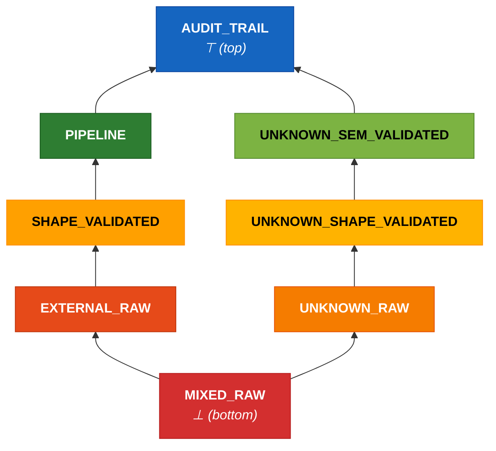
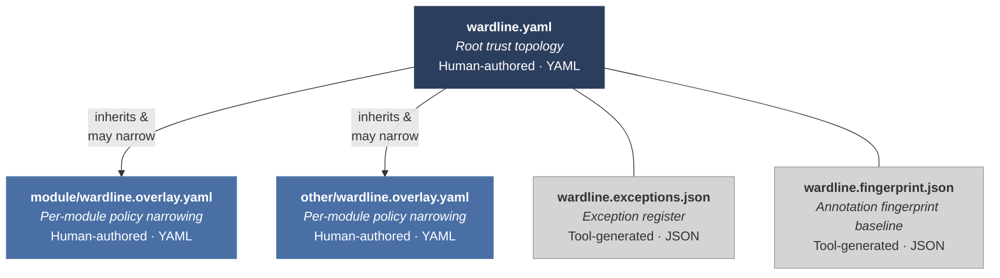

## Wardline Framework Specification
### Semantic Boundary Classification and Enforcement

**Date:** 18 March 2026
**Status:** Design — DRAFT v0.2.0
**Protective Marking:** OFFICIAL
**Prepared by:** Digital Transformation Agency
**Document type:** Conformity assessment scheme comprising a data classification model, enforcement rules, governance requirements, and conformance criteria
**Parent paper:** When Good Code Becomes Dangerous: A Threat Model for AI-Assisted Software Development in High-Stakes Code (GCBD)
**Language bindings:** Python (Part II-A), Java (Part II-B)

---

### How to read this document

This document comprises two parts: Part I (the framework specification) and Part II (language binding references for Python and Java). Not all readers need all sections. The paths below route to the most relevant content for each audience.

**Tool implementers** (building a Wardline-Core scanner, linter plugin, or type checker plugin):
→ Part I: §1–3 (concepts), §4 (tier model), §5 (enforcement specification), §6–7 (annotations, pattern rules), §8 (enforcement layers), §14 (conformance) → Part II: A.3/B.3 (interface contract — read first), then A.4/B.4 (annotation vocabulary)

**Security assessors** (IRAP or equivalent, evaluating a wardline deployment):
→ Part I: §1–3 (scope), §4 (tier model), §10 (verification properties and golden corpus), §14 (conformance criteria and profiles)
→ Part II: A.3/B.3 (interface contract), A.6/B.6 (regime composition), A.7/B.7 (residual risks)

**Adopters** (deploying wardline on a project):
→ Part I: §1–4 (what it is, why, tier model), §9 (governance model) → Part II: A.9/B.9 (adoption strategy), A.4/B.4 (annotation vocabulary)

**Governance leads** (managing wardline policy and exceptions):
→ Part I: §9 (governance model), §13 (manifest and exception register), §14.1 (conformance model)
→ Part II: A.7/B.7 (residual risks), A.10/B.10 (error handling and control law)

**Citizen programmers** (reviewing or writing code in a wardline-annotated codebase, without developer tooling):
→ Wardline Lite practical guide (`wardline-lite.md`, separate companion document): five review questions, worked code examples, hot-path identification. This guide is not part of the formal specification — it translates the annotation vocabulary (§6) and pattern rules (§7) into questions a non-specialist can apply during code review.

---

### Contents

**Part I — Wardline Framework Specification** (this document)

1. [What a Wardline is](#1-what-a-wardline-is)
2. [The problem a Wardline solves](#2-the-problem-a-wardline-solves)
3. [Non-goals](#3-non-goals)
4. [Authority tier model](#4-authority-tier-model)
    - 4.1 Four tiers
5. [Authority tier model: enforcement specification](#5-authority-tier-model-enforcement-specification)
    - 5.1 Trust classification and validation status — 5.2 Transition semantics — 5.3 Trusted restoration boundaries — 5.4 Cross-language taint propagation — 5.5 Third-party in-process dependency taint
6. [Annotation vocabulary](#6-annotation-vocabulary)
7. [Pattern rules](#7-pattern-rules)
    - 7.1 The rules — 7.2 Structural verification — 7.2.1 Structural-contract defaults and WL-001 — 7.3 Severity matrix — 7.4 Worked examples — 7.5 Derivation principles — 7.6 Taint analysis scope
8. [Enforcement layers](#8-enforcement-layers)
    - 8.1 Static analysis — 8.2 Type system — 8.3 Runtime structural — 8.4 Orthogonality principle — 8.5 Pre-generation context projection (advisory)
9. [Governance model](#9-governance-model)
    - 9.1 Exceptionability classes — 9.2 Governance mechanisms — 9.3 Scope of governance — 9.3.1 Artefact classification: policy and enforcement — 9.3.2 Manifest threat model — 9.4 Governance capacity — 9.5 Enforcement availability (control law)
10. [Verification properties](#10-verification-properties)
    - 10.1 Findings interchange format — 10.2 Finding presentation guidance
11. [Language evaluation criteria](#11-language-evaluation-criteria)
12. [Residual risks](#12-residual-risks)
13. [Portability and manifest format](#13-portability-and-manifest-format)
    - 13.1 Wardline manifest format — 13.2 Scanner operational configuration (wardline.toml)
14. [Conformance](#14-conformance)
    - 14.1 Conformance model — 14.2 Conformance criteria — 14.3 Conformance profiles (14.3.1 Enforcement profiles, 14.3.2 Governance profiles, 14.3.3 Graduation) — 14.4 Enforcement regimes — 14.5 Supplementary group enforcement scope — 14.6 Assessment procedure (14.6.1 Worked example: Phase 3 deployment, 14.6.2 Worked example: Lite governance deployment) — 14.7 Partial conformance
15. [Document scope](#15-document-scope)

**Part II — Language Binding Reference**

A. [Python Language Binding Reference](#part-ii-a-python-language-binding-reference)
    - A.1 Design history — A.2 Python language evaluation — A.3 Interface contract (normative) — A.4 Annotation vocabulary — A.5 Type system and runtime enforcement — A.6 Regime composition matrix — A.7 Residual risks — A.8 Worked example — A.9 Adoption strategy — A.10 Error handling and control law
B. [Java Language Binding Reference](#part-ii-b-java-language-binding-reference)
    - B.1 Design history — B.2 Java language evaluation — B.3 Interface contract (normative) — B.4 Annotation vocabulary — B.5 Type system and runtime enforcement — B.6 Regime composition matrix — B.7 Residual risks — B.8 Worked example — B.9 Adoption strategy — B.10 Error handling and control law

**Companion Documents**

- Wardline Lite practical guide (`wardline-lite.md`) — five review questions for non-specialist code reviewers
- Implementation design: Wardline for Python (`../2026-03-21-wardline-python-design.md`) — reference implementation work packages and build order

**Planned Companion Documents** (deferred to post-v1.0)

- Implementer's Guide: Scanner Architecture — detailed guidance for building a Wardline-Core scanner. Content from prior specification drafts is available in version control history.
- Agent Guidance — constraints and patterns for AI agents working in wardline-annotated codebases. Evolved from prior agent guidance sections; publication deferred until reference implementation reaches production maturity.

---
### 1. What a Wardline is

**Normative language.** This specification uses MUST, MUST NOT, SHALL, SHALL NOT, SHOULD, SHOULD NOT, MAY, REQUIRED, RECOMMENDED, and OPTIONAL as defined in RFC 2119 and clarified in RFC 8174. When these words appear in uppercase, they carry normative force. Lowercase equivalents (must, should, required) describe expected behaviour of user code under scanner enforcement, not implementation requirements.

#### 1.1 Terms and definitions

The following terms carry specific meaning in this specification. Where a term is used in its everyday sense, it appears in lowercase without emphasis; where it carries its defined meaning, the surrounding tier, boundary, or annotation context makes this clear.

| Term | Definition |
|---|---|
| **Authority tier** | One of four hierarchical classifications (Tier 1 through Tier 4) that describe the level of trust a system is entitled to assume about a data value. See §4.1 |
| **Boundary contract** | A named, stable semantic identifier declaring what data crosses a boundary and at what tier, replacing the previous function-name consumer list. Each contract specifies a contract name (e.g., `"landscape_recording"`, `"partner_reporting"`), the data tier expected, and the direction of flow. Contracts survive refactoring — the contract is stable; the function-level binding updates. See §5.2, §13.1.2 |
| **Bounded context** | The declared set of boundary contracts for which a semantic validation boundary establishes domain-constraint satisfaction. A validation is comprehensive within its bounded context — it establishes that data satisfies every domain constraint for every intended use within the declared scope. See §5.2, §13.1.2 |
| **Coding posture** | The programming style appropriate to a given tier: strict [offensive] (T1), governance-assured [confident] (T2), structure-verified [guarded] (T3), or untrusted-input [sceptical] (T4). See §4.1 |
| **Effective state** | One of eight enforcement contexts produced by combining trust classification and validation status. The severity matrix (§7.3) maps pattern rules to effective states |
| **Enforcement perimeter** | The set of source files, modules, or packages that a wardline declaration covers. Code outside the enforcement perimeter is not analysed; data crossing the perimeter boundary is treated as UNKNOWN |
| **Exception** (governance) | A documented, time-limited override of a scanner finding, managed through the exception register (§9, §13.1.3). Distinct from a programming-language exception |
| **Fingerprint baseline** | A cryptographic record of the annotation surface at a governance checkpoint. Baseline diffs surface all wardline-relevant changes for review. See §9.2 |
| **Normalisation boundary** | A declared boundary that collapses MIXED-taint inputs into a new Tier 2 artefact. Normalisation is semantically a new construction, not a passthrough. See §5.1 |
| **Overlay** | A YAML file (`wardline.overlay.yaml`) that narrows or extends the root manifest for a specific module, boundary, or data source. See §13.1.2 |
| **Rejection path** | A control-flow path within a validation boundary function that terminates without producing the function's normal return value (e.g., `throw`, guarded early return). See §7.2 |
| **Restoration boundary** | A declared function that reconstitutes a previously serialised artefact, reinstating a tier classification supported by evidence categories. See §5.3 |
| **Semantic boundary** | A point in the codebase where data crosses between authority tiers or where institutional meaning is assigned. Wardline annotations make semantic boundaries explicit and machine-readable |
| **Structural contract** | The set of structural guarantees that a data representation provides after shape validation — field presence, type correctness, schema conformance |
| **Taint state** | The effective state assigned to a data value by the taint analysis engine. Determined by the value's trust classification and validation status. See §5.1 |
| **Non-normative** | Content that advises or recommends but does not impose requirements on implementations. In Part II, sections not marked "This section is normative" are non-normative. Non-normative sections use "recommended", "preferred", "avoid" — never uppercase RFC 2119 keywords |
| **Trust topology** | The complete set of tier assignments, boundary declarations, and data-flow constraints declared in a project's wardline manifest and overlays |
| **Validation boundary** | A declared function that transitions data from one tier to another through structural (shape) or domain-constraint (semantic) verification |
| **Wardline manifest** | The root YAML file (`wardline.yaml`) that declares a project's trust topology, enforcement configuration, and governance policy. See §13 |

A wardline is the set of declarations an application makes about how it classifies and protects the semantic boundaries of its data and code paths. It declares:

- Which data belongs to which authority tier
- Which code paths must fail in which ways
- Which patterns are prohibited in which contexts
- What governance surrounds exceptions to those rules
- Where serialised representations of authoritative artefacts may be restored to a tier supported by available evidence (restoration boundary declarations)

An application that has declared a wardline has made its institutional knowledge machine-readable. An application without one has that knowledge in prose, in people's heads, or nowhere.

The wardline is the *classification*, not the enforcement tool. A wardline declares that deserialised audit records carry Tier 1 authority and that accessing their fields with fallback defaults is prohibited. An enforcement tool reads that declaration and produces findings when the codebase violates it. The relationship is analogous to a security classification guide and the systems that enforce it: the guide defines the policy; the systems implement it. Replacing the enforcement tool does not change the classification. Changing the classification changes what every enforcement tool must check.

This distinction matters because institutional knowledge outlives any particular toolchain. A wardline expressed as a machine-readable manifest can be consumed by static analysers, type checkers, runtime enforcement layers, prompted review systems, or assessment tooling — serially or in parallel, in any language. The manifest is the stable artefact. The tools are disposable.

A wardline is therefore a normative document: it describes what the application *commits to*, not what it currently achieves. The gap between declaration and enforcement is measurable, auditable, and — critically — visible to assessors who have no access to the development team's tacit knowledge.
### 2. The problem a Wardline solves

There is a structural gap between what automated tooling checks and what high-stakes code requires. The standard assurance stack — linters, type checkers, SAST, DAST, unit tests, conventional peer review — verifies *syntactic* and *conventional* correctness: Does the code parse? Does it conform to style rules? Are types consistent? Do tests pass? These checks are necessary but insufficient. They cannot determine whether a `.get()` default is institutionally appropriate, whether an exception handler preserves the audit trail, or whether data crossing a trust boundary has been validated.

Agent-generated code exploits this gap systematically. Agents produce code that follows established good practice — defensive programming, graceful error handling, sensible defaults — applied without contextual judgement. The patterns are individually correct and collectively dangerous. A `.get("security_classification", "OFFICIAL")` is syntactically identical to `.get("city", "Sydney")`. The first silently downgrades a document's security classification; the second provides a location default that may be harmless in many contexts. No tool in the standard assurance stack distinguishes them, because the distinction is *semantic*: it depends on what the field means in the application's institutional context, not on how the code is structured. Without a wardline, both patterns look identical to tooling. With a wardline, the distinction becomes enforceable — the framework makes it possible to declare which contexts prohibit fallback defaults and which permit them.

The wardline makes the invisible visible. By declaring that a particular data path carries Tier 1 authority and that fallback defaults are prohibited in that context, the application converts tacit institutional knowledge into a machine-readable constraint. The enforcement tool no longer needs to infer context — the wardline supplies it.

**What is and is not novel here.** The individual pattern rules (WL-001 through WL-006) are expressible as custom rules in existing SAST frameworks — Semgrep, CodeQL, Error Prone, or equivalent. Any team with SAST experience could write these rules. The contribution is not the detection primitives but the governance topology that surrounds them: the severity matrix that varies enforcement by declared semantic context, the exceptionability model that distinguishes project invariants from governable overrides, the taint lattice that tracks data authority across boundaries, the fingerprint baseline that makes governance erosion visible, and the institutional integration that connects enforcement to organisational policy. Well-understood SAST capability, freshly composed into a governance-aware framework — that is the claim.

**Why now.** The emergence of a semantic boundary layer fits a longer progression in software abstraction: machine operations gave way to source code (compilers), source code gave way to frameworks and modules (reuse), frameworks gave way to infrastructure-as-code (deployment automation). Each step moved human effort into a layer where leverage is greater, enabled by the layer below becoming cheap enough to automate. The next layer is policy and boundary as code — machine-readable encodings of trust semantics, data classification, boundary contracts, failure posture, evidence requirements, and governance rules. This layer is emerging now because AI-assisted development is making implementation cheap enough that the bottleneck shifts from code production to semantic intent. Once implementation becomes a compilation target, the scarce thing is no longer code production. It is semantic intent, risk posture, and institutional constraint. A wardline is an attempt to encode that scarce layer.

**The capacity baseline.** Human review of LLM-generated code at scale has already failed as a control. Teams are shipping code they have not meaningfully reviewed because volume exceeds capacity. The wardline is not adding governance burden to a team with spare review capacity — it is providing structured triage infrastructure for a review process that is already overwhelmed. The correct baseline comparison is not "wardline governance overhead versus functioning review" but "wardline governance overhead versus unmitigated semantic risk from unreviewed code." The governance model's overhead should be evaluated against this baseline.

Wardline addresses the semantic-boundary gap; it does not address all 13 ACF failure modes. The following table maps wardline coverage to the ACF taxonomy:

| ACF Entry | Wardline Coverage [^groups] |
|-----------|------------------|
| ACF-S1 (Competence Spoofing) | WL-001 (member access with fallback default) |
| ACF-S2 (Hallucinated Field Access) | WL-002 (existence-checking as structural gate); type system enforcement (§8.2) [^acf-s2] |
| ACF-S3 (Structural Identity Spoofing) | WL-002 (catches existence-checking structural gates — e.g., `hasattr()`/`in` in Python, `Map.containsKey()` in Java — the S3 surface), WL-006 (catches runtime type-checking on internal data — a signal of structural doubt that may indicate S3-adjacent problems) [^acf-s3] |
| ACF-T1 (Authority Tier Conflation) | Taint analysis (tier-flow enforcement between declared boundaries) |
| ACF-T2 (Silent Coercion) | WL-001 (defaults as implicit coercion) [^acf-t2] |
| ACF-R1 (Audit Trail Destruction) | WL-003, WL-004, WL-005 (exception handling rules) |
| ACF-R2 (Partial Completion) | WL-005, Group 2 audit primacy enforcement, Group 9 (atomicity and compensatable operation annotations) |
| ACF-R3 (Verification Displacement) | Not directly addressable by pattern rules — wardline coverage is indirect through test structure analysis (mock provenance, factory bypass detection) |
| ACF-I1/I2 (Information Disclosure) | Groups 8 and 11 (secret handling, data sensitivity); WL-003/WL-004 secondary [^acf-i] |
| ACF-D1/D2 (Review Capacity) | Not addressable — process threats |
| ACF-E1 (Implicit Privilege Grant) | Taint analysis (tier-flow enforcement) |
| ACF-E2 (Unvalidated Delegation) | Group 14 access/attribution enforcement, taint analysis (tier-flow enforcement) [^acf-e2] |

[^groups]: "Group N" references refer to the decorator/annotation vocabulary groups defined in Part II-A §A.4 (Python) and Part II-B §B.4 (Java).

[^acf-s3]: WL-002 is the primary S3 rule — it detects existence-checking patterns (e.g., `hasattr()` in Python, `Map.containsKey()` in Java) that substitute structural probing for proper type identity. WL-006 provides secondary coverage: runtime type-checking (e.g., `isinstance()` in Python, `instanceof` in Java) on data the wardline classifies as internal suggests the code does not trust the type system's guarantees, which may indicate an S3-adjacent structural identity problem. WL-006 is not the S3 fix (proper type identity via the language's type system is the fix — see the language binding's type-system enforcement section); it is a signal that the codebase may harbour S3-class issues.

[^acf-s2]: WL-002 catches concealment of hallucinated access via existence-checking patterns (e.g., `hasattr()` in Python, `Map.containsKey()` in Java). Type system enforcement catches the hallucinated access directly where type annotations are present — a misspelled field produces a type error.

[^acf-t2]: Covers default-based coercion only. Broader coercion surface — type coercion (`float()` hiding precision loss), encoding coercion (locale-dependent string operations), format coercion (date parsing with assumed timezone) — is not addressed by the current pattern rule set. A future WL rule targeting type coercion on tier-classified data would close this gap.

[^acf-i]: Group 8 provides taint tracking of SECRET-tagged values through logging, error-message, and persistence paths. Group 11 provides PII and classified data taint tracking. Both use the same taint propagation engine as authority-tier tracking but with sensitivity-specific taint types. Pattern rules WL-003/WL-004 provide secondary coverage via error handler detection.

[^acf-e2]: Authorisation-check-before-action within the annotated codebase. Single-process scope: delegation to subprocesses, external services, or dynamically loaded modules across process boundaries is outside enforcement scope and requires separate governance controls.
### 3. Non-goals

The following are explicitly outside the scope of this framework:

1. **Wardline does not prove semantic correctness in full.** It detects syntactic proxies for semantic violations in declared contexts (structural signals that correlate with semantic errors, not the semantic errors themselves).
2. **Wardline does not replace human judgement.** It structures what judgement must address. The governance model (§9) defines the decision points; the framework makes them visible but does not resolve them.
3. **Wardline does not independently establish provenance truth across storage boundaries.** The framework can enforce structural checks at restoration points, but the ultimate provenance claim rests on institutional trust and governance assurance, not technical proof.
4. **Wardline does not eliminate the need for ordinary assurance controls.** It supplements them. The standard assurance stack (linters, type checkers, SAST, DAST, unit tests, peer review) remains necessary; the wardline adds the semantic-boundary layer that the standard stack cannot address.
5. **Wardline does not guarantee complete coverage of all risky code paths.** Coverage depends on annotation investment, and the coverage boundary is made visible through the annotation fingerprint baseline. Unannotated code is outside the enforcement perimeter by definition.
6. **Wardline does not replace software design.** It constrains and structures the design search space. A wardline manifest captures data-flow boundaries, validation requirements, restoration semantics, failure posture, exception models, and audit obligations. It does not capture performance trade-offs, library choices, concurrency models, deployment constraints, or operational assumptions. These remain engineering decisions that the manifest neither encodes nor eliminates.
### 4. Authority tier model

The authority tier model is the foundation of any wardline. It defines how an application categorises its data according to the guarantees the system is entitled to assume about each value.

#### 4.1 Four tiers

| Tier | Classification | Meaning | Coding posture | Verification basis |
|------|---------------|---------|----------------|--------------------|
| **Tier 1: Trusted assertion** | Authoritative internal data | Audit records, decision products, fact records. Missingness or corruption is an integrity failure — halt, do not default. | Strict (offensive) programming (invariant-enforcing, halt-on-breach) — assume invariants, detonate on breach. | Institutional (not tool-verifiable) |
| **Tier 2: Semantically validated representation** | Semantically validated data | Has passed through both structural and semantic validation boundaries. Structure is trustworthy *and* values satisfy all domain constraints for every intended use within the declared bounded context (§13.1.2). This includes external data that has been fully validated and internal data that has been re-validated after deserialisation or restoration (§5.3). Safe to use for its declared semantic purposes without further value-level validation of the represented fields. | Governance-assured (confident) programming — trust field values for domain operations; guard only against cross-cutting concerns (authorisation, concurrency, freshness, state transitions) that value-level validation cannot address. | Machine-verified routing + governance-assured adequacy; bindings may partially mechanise |
| **Tier 3: Shape-validated representation** | Shape-validated data | Has passed through a structural validation boundary. Fields are present, types are correct, the data conforms to its declared structural contract. Safe to handle — will not crash code that accesses its fields — but values may be nonsensical, unsafe, or out of domain range. | Structure-verified (guarded) programming — direct field access is safe; validate domain constraints before using values in business logic, arithmetic, or security-sensitive operations. | Machine-verifiable (schema conformance is decidable) |
| **Tier 4: Raw observation** | Unvalidated external data | From outside the system boundary. May be malformed, malicious, or missing. Handling it without structural validation risks crashes; using its values risks silent corruption. | Untrusted-input (sceptical) programming — treat as hostile, validate structure first, normalise, reject. | None (no validation has occurred) |

The coding posture column is normative. Each tier's posture is a consequence of what the preceding validation step has established:

- **Tier 1** is not defensive against malformed data — it is strict (offensive) against invariant violation. Fallback idioms (field access with defaults, attribute access with fallbacks, broad exception handling) are prohibited because they convert integrity failures into undetected corruption.
- **Tier 2** trusts both structure and values. Domain constraints have been verified for every intended use within the declared bounded context, so per-site value-level re-validation is redundant. Code at Tier 2 may use field values directly in calculations, comparisons, and decision logic. Cross-cutting concerns — authorisation checks, freshness verification, concurrency guards, state-transition validation — remain necessary because they are not properties of the data's values.
- **Tier 3** trusts structure but not values. Field access is safe (the structural contract guarantees the field exists and has the right type), but using a value in a division, a URL fetch, or a security decision without checking domain constraints is unsafe. The `.get()` with a default is redundant in Tier 3 (the field is guaranteed present) but the value it returns may still be dangerous.
- **Tier 4** trusts nothing. Even accessing a field may crash if the field is absent or the data is malformed.

Once these postures are explicit, the pattern rules in §7 stop looking arbitrary and start looking like consequences. The scope of the failure response (process crash vs request rejection vs circuit-breaker activation) is path-specific and determined by the application's architecture. For a worked implementation of this lifecycle — tracing data from Tier 4 through to Tier 1 with concrete annotations and SARIF output — see Part II-A §A.8 (Python) and Part II-B §B.8 (Java).

**Coding posture model.** The conventional contrast in defensive programming literature is binary: fail-soft (graceful degradation) versus fail-fast (halt-on-anomaly). AI coding agents uniformly apply the former even where the latter is required. This framework extends the binary contrast to four postures — strict (offensive), governance-assured (confident), structure-verified (guarded), untrusted-input (sceptical) — each tied to a specific tier. The extension is motivated by the need for finer posture granularity: a binary model maps postures only to the endpoints (strict at Tier 1, untrusted-input at Tier 4). The intermediate postures — governance-assured (Tier 2) and structure-verified (Tier 3) — occupy the space between those endpoints that a two-way contrast does not distinguish.

**Bidirectional authority collapse.** Uniform defensive patterns produce a compound failure: they simultaneously give unvalidated external data more authority than it has earned (defaults and coercion allow Tier 4 data to cross inward as though validated) while treating authoritative internal data as more negotiable than it is allowed to be (the same patterns handle corruption of Tier 1 records as routine and recoverable rather than exceptional and evidentiary). The collapse is bidirectional because it degrades the authority model from both ends at once — too permissive at the perimeter and too casual at the core. This framework's tier model and pattern rules address both directions: rules WL-001 through WL-004 fire at Tier 1 taint states to prevent the downward collapse (authoritative data treated as negotiable), and the same rules fire at Tier 4 / UNKNOWN / MIXED states to prevent the upward collapse (unvalidated data given unearned authority). The severity matrix (§7) encodes these asymmetric enforcement consequences.

**The knowledge requirement at each promotion.** Each tier transition requires knowledge proportional to its scope. Shape validation (T4→T3) requires knowledge of the data's *structure* — its declared structural contract. Semantic validation (T3→T2) requires knowledge of the data's *usage across the declared bounded context* — every intended use of the data and the constraints each imposes. Trusted construction (T2→T1) requires knowledge of the data's *institutional meaning* — what authority the artefact carries and under what rules it may be produced. Each step is a wider knowledge claim than the last, and each is a correspondingly bigger deal to get wrong.

**Verification gradient.** The three transitions differ not only in knowledge scope but in *verification strength*, and the verification at each tier operates in layers of differing character.

T3 verifies both *ceremony* and *substance*: schema conformance is decidable, and the enforcement tool can confirm that the structural contract is satisfied — the check and the thing being checked are both machine-accessible. T2 verifies *ceremony* but governance-reviews *substance*: the enforcement tool machine-verifies the routing (a checkpoint exists in the declared data flow, taint flow passes through it, a rejection path is present, and declared contracts are coherent — §9.2), but the *adequacy* of the business logic inside the checkpoint is a governance-reviewed claim, not a machine-verified one (§12, residual risk 10). The machine guarantees the governance gate was hit; governance guarantees the gate is adequate. T1 verifies *neither*: trusted construction is an act of institutional interpretation that no tool can verify — both ceremony and substance are institutional.

Each step up the tier model widens the knowledge claim and weakens the verification guarantee. Readers should understand that Tier 2's governance-assured (confident) programming posture is backed by a softer guarantee than Tier 3's structure-verified (guarded) programming posture — the confidence rests on governance quality, not machine proof. The T2 guarantee is not purely governance, however: the machine-enforced routing layer is substantial, and language bindings with stronger type systems may partially mechanise T2's governance surface through type-level constraint encoding, narrowing the residual governance claim.

Bindings MAY define declarative constraint manifests for semantic validation boundaries. Where a binding can machine-verify that a validation function tests every constraint declared in its manifest, the residual governance surface at T2 is reduced to manifest adequacy review. The framework does not require this capability — T2's epistemic basis remains governance-assured at the framework level — but bindings that implement it provide a tighter verification envelope. Manifest completeness remains a governance responsibility; the gap narrows but does not close.

Semantic validation is always comprehensive within its scope: it establishes that the data satisfies every domain constraint for every intended use within the declared bounded context, not merely those of one particular code path. Data that has been validated for some uses but not all remains at Tier 3 until a validator with knowledge of all intended consumers has cleared it. In practice, this is often straightforward — a `base_url` must always be a valid, safe URL; an `amount` must always be non-negative — because the constraints are obvious and universal for that field. The hard cases are rare but important: they are the fields where different consumers impose different constraints, and the semantic validator must satisfy all of them.

The enforcement implementation of this model — effective states, taint-state algebra, transition semantics, restoration boundaries, and cross-language taint propagation — is specified in §5.
### 5. Authority tier model: enforcement specification

This section specifies the enforcement implementation of the four-tier authority model defined in §4. Tool implementers, scanner developers, and security assessors need this section; adopters and practitioners may skip to §6.

#### 5.1 Trust classification and validation status

The four tiers describe semantic authority. The eight effective states describe the enforcement contexts actually needed to grade pattern severity.

The tier model combines two orthogonal dimensions — trust classification (what guarantees the system may assume) and validation status (what processing the data has received) — to produce eight effective states.

| State | Trust Classification | Validation Status |
|-------|---------------------|-------------------|
| Audit Trail | Tier 1 | Not Applicable |
| Pipeline | Tier 2 | Not Applicable |
| Shape-Validated | Tier 3 | Shape-Validated |
| External Raw | Tier 4 | Raw |
| Unknown Raw | Unknown | Raw |
| Unknown Shape-Validated | Unknown | Shape-Validated |
| Unknown Semantically-Validated | Unknown | Semantically Validated |
| Mixed Raw | Mixed | Raw |

These eight states determine finding severity when pattern rules are evaluated: the same pattern may be an error in one state and suppressed in another (§7).

**Canonical tokens.** The following identifiers are normative and MUST be used consistently in manifest schemas, SARIF output, configuration files, and implementation code: `AUDIT_TRAIL`, `PIPELINE`, `SHAPE_VALIDATED`, `EXTERNAL_RAW`, `UNKNOWN_RAW`, `UNKNOWN_SHAPE_VALIDATED`, `UNKNOWN_SEM_VALIDATED`, `MIXED_RAW`. Prose may use the human-readable labels from the table above; machine-facing artefacts MUST use these tokens. The token names are canonical labels, not scope restrictions — `AUDIT_TRAIL` encompasses all Tier 1 authoritative internal data (audit records, internal state, configuration), not only audit trails specifically. Similarly, `PIPELINE` encompasses all Tier 2 semantically validated data, not only pipeline-processed data.

**Join operation.** When data from two different taint states merges at a program point (assignment, function parameter, container construction), the resulting state is determined by the join. The general rule: any merge of values from different trust classifications produces MIXED_RAW. The validation status of the result is RAW regardless of the inputs' validation status — mixing data resets the validation dimension because the composite's structural guarantees are weaker than those of its strongest input.

**Join mental model.** Three principles govern the join before the full table:

- **Same classification, same or different validation** → result keeps the classification; validation demotes to the weaker of the two (raw beats shape-validated beats semantically-validated).
- **Different classifications (known or unknown)** → result is MIXED_RAW. Cross-classification merges always collapse to the bottom of the lattice.
- **Anything + MIXED_RAW** → MIXED_RAW. Once mixed, always mixed — MIXED_RAW is the absorbing element.

The full table below specifies every case. The UNKNOWN chain is kept separate from the classified chain: merging known-provenance data with unknown-provenance data produces MIXED_RAW (not the known operand), because the composite's provenance is genuinely mixed, not merely unknown.

Specific join rules (the join is commutative — operand order does not matter):

| Operand A | Operand B | Result | Examples |
|-----------|-----------|--------|----------|
| Any classified state | Different classified state | MIXED_RAW | join(AUDIT_TRAIL, PIPELINE), join(PIPELINE, EXTERNAL_RAW), join(SHAPE_VALIDATED, PIPELINE) |
| Any state | UNKNOWN_RAW | MIXED_RAW | join(PIPELINE, UNKNOWN_RAW), join(AUDIT_TRAIL, UNKNOWN_RAW), join(SHAPE_VALIDATED, UNKNOWN_RAW) |
| Any state | UNKNOWN_SHAPE_VALIDATED | MIXED_RAW | join(EXTERNAL_RAW, UNKNOWN_SHAPE_VALIDATED), join(PIPELINE, UNKNOWN_SHAPE_VALIDATED) |
| Any state | UNKNOWN_SEM_VALIDATED | MIXED_RAW | join(SHAPE_VALIDATED, UNKNOWN_SEM_VALIDATED), join(AUDIT_TRAIL, UNKNOWN_SEM_VALIDATED) |
| UNKNOWN_RAW | UNKNOWN_RAW | UNKNOWN_RAW | join(UNKNOWN_RAW, UNKNOWN_RAW) — provenance equally unknown |
| UNKNOWN_RAW | UNKNOWN_SHAPE_VALIDATED | UNKNOWN_RAW | join(UNKNOWN_RAW, UNKNOWN_SHAPE_VALIDATED) — validated status lost |
| UNKNOWN_RAW | UNKNOWN_SEM_VALIDATED | UNKNOWN_RAW | join(UNKNOWN_RAW, UNKNOWN_SEM_VALIDATED) — validated status lost |
| UNKNOWN_SHAPE_VALIDATED | UNKNOWN_SHAPE_VALIDATED | UNKNOWN_SHAPE_VALIDATED | Identity — provenance equally unknown, same validation level |
| UNKNOWN_SHAPE_VALIDATED | UNKNOWN_SEM_VALIDATED | UNKNOWN_SHAPE_VALIDATED | Semantic status lost to the weaker validation |
| UNKNOWN_SEM_VALIDATED | UNKNOWN_SEM_VALIDATED | UNKNOWN_SEM_VALIDATED | Identity — provenance equally unknown, same validation level |
| Any state | MIXED_RAW | MIXED_RAW | MIXED absorbs further merges |
| X | X | X | join(PIPELINE, PIPELINE) = PIPELINE |

**Design rationale for UNKNOWN joins.** The separation of UNKNOWN from classified states in the join table prevents UNKNOWN from silently inheriting a classification it has not earned. This join definition is REQUIRED for consistent taint propagation across implementations.

**Join operators: `join_fuse` and `join_product`.** The join table above applies uniformly to all merge operations in the current framework. However, not all merge operations are semantically equivalent. The framework distinguishes two conceptual join operators:

- **`join_fuse`** applies to operations that genuinely merge data into a single artefact where the contributing components lose their individual identity: string concatenation, dict merge (`{**a, **b}`), list extension, format-string interpolation. The result is a fused artefact whose provenance is inseparable. `join_fuse` produces MIXED_RAW when the operands span different trust classifications — this is the current behaviour, unchanged.

- **`join_product`** applies to operations that compose data into a product-type structure where each component retains its identity: dataclass construction, named-tuple packing, record/POJO construction, typed constructor invocation. The components are individually addressable after construction — `record.audit_field` and `record.external_field` remain distinct access paths.

At the framework level, `join_product` is treated identically to `join_fuse` — both produce MIXED_RAW when operands span different trust classifications. The eight-state model and the 8×8 severity matrix are unchanged.

**Binding extension: MIXED_TRACKED.** Language bindings MAY define a `MIXED_TRACKED` extension state for `join_product` on named product types where the binding can statically resolve field membership. In `MIXED_TRACKED`, each field retains its individual taint state; the composite carries a summary taint (the join of all fields) for contexts where field-level resolution is not available — e.g., when the composite is passed to a function that accepts a generic type, or when field-level tracking is lost through an untyped intermediary.

Bindings that implement `MIXED_TRACKED` SHOULD declare which named product types they can track at field level. Product types whose field membership cannot be statically resolved (e.g., dynamically constructed classes, untyped dicts, raw tuples) remain subject to `join_fuse` semantics and produce MIXED_RAW.

Bindings that do not implement field sensitivity treat `join_product` as `join_fuse` — conservative fallback to MIXED_RAW. This is the current behaviour and remains conformant. Field-sensitive taint is a binding requirement (SHOULD), not a framework invariant (MUST).

**Severity matrix extension for MIXED_TRACKED.** The framework severity matrix remains 8×8. Bindings that implement `MIXED_TRACKED` extend the matrix with a ninth column whose severity inherits from the MIXED_RAW column unless the binding explicitly narrows it. Narrowing is permitted (a binding MAY reduce severity where field-level resolution eliminates false positives); widening is not (a binding MUST NOT assign higher severity in the MIXED_TRACKED column than in the corresponding MIXED_RAW cell). This follows the overlay narrowing principle in §13.

**Deferred: framework-level ninth state.** Full elevation of `MIXED_TRACKED` to a ninth framework state — with corresponding changes to the join table, cross-product table, and severity matrix — is deferred until at least one binding demonstrates field-sensitive taint tracking with specimen-level evidence and a worked example in its golden corpus. The binding refinement approach was chosen to reduce cascade cost: the conceptual split lands in Part I; bindings operationalise it at their own pace; the framework promotes the extension when binding-level evidence supports it.

**Lattice structure (Hasse diagram).** The eight effective states form a partial order under the join. The diagram below makes the ordering explicit — states connected by an upward path are ordered; states on separate branches are incomparable (their join produces a lower state).

**Lattice orientation note.** This diagram uses the mathematical convention where "bottom" (⊥) denotes the element that every other element joins toward — the most restrictive enforcement state, not the lowest trust level. MIXED_RAW is bottom because any merge of unlike states reaches it, and it cannot be escaped through ordinary validation. AUDIT_TRAIL is top (⊤) because it is the most authoritative state. Readers familiar with security lattices (e.g., BLP) may be accustomed to the reverse orientation where "top" means most restricted; this lattice describes enforcement burden, not access restriction, which is why AUDIT_TRAIL sits at top and MIXED_RAW at bottom.

The key non-obvious property: UNKNOWN_SEM_VALIDATED and PIPELINE are on parallel chains — neither dominates the other. Their join produces MIXED_RAW, not either operand.



Two properties to note: (1) MIXED_RAW is the absorbing element — any cross-classification merge reaches it, and further merges stay there. (2) The UNKNOWN chain (UNKNOWN_RAW → UNKNOWN_SHAPE_VALIDATED → UNKNOWN_SEM_VALIDATED) and the classified chain (EXTERNAL_RAW → SHAPE_VALIDATED → PIPELINE) are parallel — validation can advance within either chain but cannot cross between them without a trust classification decision (which is a governance act, not a validation act). AUDIT_TRAIL is the unique top element, reachable only through the Tier 2 → Tier 1 construction transition.

**UNKNOWN** is data whose trust classification cannot be determined from available annotations. Entry conditions: the data enters a scope with no wardline annotation declaring its trust classification, or it is produced by an unannotated function whose inputs span multiple tiers. Invariants: UNKNOWN data receives conservative enforcement (equivalent to or stricter than EXTERNAL_RAW for most rules); UNKNOWN data that passes shape validation transitions to UNKNOWN_SHAPE_VALIDATED; UNKNOWN data that passes semantic validation transitions to UNKNOWN_SEM_VALIDATED. Neither transition grants a trust classification — the data remains unknown-origin.

**MIXED** is data derived from inputs spanning multiple authority tiers. Entry conditions: a function or expression combines inputs from two or more distinct trust classifications (e.g., Tier 1 audit data merged with Tier 4 external input). Invariants: MIXED data activates the pattern rules of every contributing tier — the enforcement burden is the union of all contributing tiers' restrictions. MIXED data cannot transition to a single-tier classification through ordinary validation, because validation establishes structural and semantic properties but does not decompose provenance. A declared normalisation boundary may collapse mixed inputs into a new Tier 2 artefact — the normalisation step is semantically a new construction (like the T2-to-T1 transition), not a passthrough of the original mixed data.

**The distinction between UNKNOWN and MIXED:** MIXED means the analysis *can show* that a real cross-tier combination occurred — the contributing tiers are known but heterogeneous. UNKNOWN means the analysis *cannot determine* the provenance at all — the tier is absent, not mixed. An unannotated function that combines Tier 1 and Tier 4 inputs produces MIXED (the analysis sees both tiers). An unannotated function whose inputs are themselves unannotated produces UNKNOWN (the analysis has no tier information to combine).

**Cross-product analysis.** The following table shows which of the 24 theoretical state combinations are reachable and which are impossible or collapsed. The full cross-product of six trust classifications (TIER_1, TIER_2, TIER_3, TIER_4, UNKNOWN, MIXED) and four validation statuses (NOT_APPLICABLE, RAW, SHAPE_VALIDATED, SEMANTICALLY_VALIDATED) yields 24 theoretical combinations. Eight are reachable as effective states; sixteen are impossible or collapsed:

| Classification | Not Applicable | Raw | Shape-Validated | Sem. Validated | Rationale |
|----------------|----------------|-----|-----------------|----------------|-----------|
| Tier 1 | **Audit Trail** | Impossible | Impossible | Impossible | Tier 1 artefacts are produced under institutional rules — they are not raw and validation is not applicable to them |
| Tier 2 | **Pipeline** | Impossible | Collapsed to Pipeline | Collapsed to Pipeline | Tier 2 *is* the result of semantic validation — raw Tier 2 is contradictory; shape-only Tier 2 is contradictory (semantic validation requires prior shape validation); sem-validated Tier 2 is redundant |
| Tier 3 | Impossible | Impossible | **Shape-Validated** | Collapsed to Pipeline | Tier 3 *is* the result of shape validation — raw Tier 3 is contradictory; semantically validated Tier 3 becomes Tier 2 |
| Tier 4 | Impossible | **External Raw** | Collapsed to Shape-Validated | Collapsed to Pipeline | Tier 4 is by definition raw external data; shape-validated Tier 4 becomes Tier 3; semantically validated Tier 4 becomes Tier 2 (implying both validation steps occurred) |
| Unknown | Impossible | **Unknown Raw** | **Unknown Shape-Validated** | **Unknown Semantically-Validated** | Not Applicable is reserved for data produced under institutional rules. Unknown-origin data has not been produced under such rules, so Not Applicable does not apply. Both validated states are reachable because validation establishes properties without resolving provenance |
| Mixed | Impossible | **Mixed Raw** | Collapsed to Mixed Raw | Collapsed to Mixed Raw | Ordinary validation does not resolve mixed provenance — it establishes structure or semantics but cannot decompose the contributing tiers. A declared normalisation boundary may produce a new T2 artefact from mixed inputs |

All sixteen non-reachable combinations are accounted for by the Impossible or Collapsed entries in the Rationale column. The normalisation boundary mechanism for MIXED data is specified in §5.2 (transition semantics).

#### 5.2 Transition semantics

Tier transitions are directional and constrained:

```mermaid
graph LR
    T4["<b>Tier 4</b><br/>Raw Observation"]
    T3["<b>Tier 3</b><br/>Shape-Validated Representation"]
    T2["<b>Tier 2</b><br/>Semantically Validated Representation"]
    T1["<b>Tier 1</b><br/>Trusted Assertion"]
    RAW["Raw Representation<br/><i>(serialised bytes)</i>"]

    T4 -->|"Shape validation<br/>(structural establishment)"| T3
    T3 -->|"Semantic validation<br/>(domain establishment)"| T2
    T2 -->|"Trusted construction<br/>(institutional rules)"| T1
    T1 -->|"Serialisation<br/>(sheds direct authority)"| RAW
    RAW -->|"Trusted restoration<br/>(§5.3 evidence categories)"| T1
    RAW -.->|"Shape validation only<br/>(no provenance claim)"| USV["UNKNOWN_SHAPE_VALIDATED"]
    USV -.->|"Semantic validation<br/>(no provenance claim)"| USEV["UNKNOWN_SEM_VALIDATED"]

    style T1 fill:#2C3E5D,color:#fff,stroke:#2C3E5D
    style T2 fill:#4A6FA5,color:#fff,stroke:#4A6FA5
    style T3 fill:#6B8EC2,color:#fff,stroke:#6B8EC2
    style T4 fill:#8B9DC3,color:#fff,stroke:#8B9DC3
    style RAW fill:#D4D4D4,color:#333,stroke:#999
    style USV fill:#D4D4D4,color:#333,stroke:#999,stroke-dasharray: 5 5
    style USEV fill:#D4D4D4,color:#333,stroke:#999,stroke-dasharray: 5 5
```



- **T4 to T3 — structural establishment.** Via shape validation: the data passes through a defined validation boundary that guarantees structural properties — required fields present, types correct, data conforms to its declared structural contract. Shape-validated Tier 4 data *becomes* Tier 3. There is no "shape-validated Tier 4" state — shape validation is the mechanism by which raw observations become shaped representations. After this transition, the data is safe to handle (field access will not crash) but its values are not yet verified for domain use.
- **T3 to T2 — domain establishment.** Via semantic validation: the data passes through a validation boundary that establishes domain-constraint satisfaction for every intended use within the declared bounded context. Semantically validated Tier 3 data *becomes* Tier 2. Bounded-context adequacy is expressed through named boundary contracts (e.g., `"landscape_recording"`, `"partner_reporting"`) that specify what data crosses the boundary and at what tier, rather than through fully qualified function names. Each contract declares a stable semantic identifier, the data tier expected, and the direction of flow. The semantic validator MUST satisfy the constraints of every contract declared in its bounded context — it establishes that the data is safe to *use*, not merely safe to *handle*. The function-level binding (which functions currently implement each contract) is a secondary mapping that resides in the overlay (§13.1.2) and survives refactoring independently of the contract declarations.
- **T2 to T1 — trusted construction.** The transition is an act of institutional interpretation: only via explicit trusted construction under institutional rules. A Tier 1 artefact is a new semantic object — an audit entry, a decision record, a fact assertion — produced from Tier 2 inputs under governed logic. The source inputs remain Tier 2 after the Tier 1 artefact is produced.

**Combined validation boundaries.** A single function may perform both shape and semantic validation (T4→T2) — this is a common pattern for simple data types where the structural and semantic checks are naturally interleaved. The model treats this as two logical transitions occurring within one function body: the structural checks establish T3 guarantees, and the semantic checks then establish T2 guarantees. The scanner must be able to establish that the boundary performs both structural and semantic validation, whether inline or through analysable helper calls.

Combined validation boundaries are declared with a combined-validation annotation (§6, Group 1) — e.g., `@validates_external` in the Python binding (Part II-A §A.4), `@ValidatesExternal` in the Java binding (Part II-B §B.4) — or the generic trust-boundary annotation with `from_tier=4, to_tier=2` (§6, Group 16). The decomposed annotations — shape validation (T4→T3) and semantic validation (T3→T2) — are used when the two phases are separate functions.

Seven invariants govern these transitions:

1. **Shape-validated T4 becomes T3.** Shape validation establishes structure — field presence, type correctness, schema conformance — not domain meaning. There is no intermediate state.
2. **Semantically validated T3 becomes T2.** Semantic validation establishes domain-constraint satisfaction for every intended use within the declared bounded context. There is no "partially validated" state — data is either semantically valid for all intended uses or it is not.
3. **Shape validation must precede semantic validation.** Semantic validation operates on structurally sound data. Applying domain-constraint checks to data whose field presence and type correctness have not been established is structurally unsound — the semantic checks may crash, produce misleading results, or silently operate on wrong types. A function that performs both checks in a single body satisfies this invariant internally; two separate functions must be ordered correctly.
4. **T2 does not automatically upgrade to T1.** Tier 1 artefacts are new semantic objects produced under institutional rules, not Tier 2 data with a higher label.
5. **Serialisation sheds direct authority at the representation layer.** A Tier 1 artefact written to storage becomes a raw representation. The act of serialisation strips the direct authority relationship — what remains is bytes whose provenance must be independently established on read.
6. **Trusted restoration may reinstate prior authority.** A raw representation may be restored to Tier 1 only through a declared *trusted restoration boundary* with provenance and integrity guarantees (see §5.3).
7. **Tier assignment is not contagious.** Authority assigned to a derived Tier 1 artefact does not retroactively alter the trust classification of its source inputs. This prevents laundering lower tiers into higher tiers by accident — the failure mode where "validated once" magically turns all downstream uses into authoritative truth.

#### 5.3 Trusted restoration boundaries

The serialisation/restoration model distinguishes *construction* from *restoration*. Construction produces a new Tier 1 artefact from Tier 2 inputs under institutional rules (§5.2, T2-to-T1 transition). Restoration reconstitutes a previously serialised Tier 1 artefact from its raw representation. The distinguishing criterion: restoration requires an evidence-backed provenance claim supported by institutional attestation — a mere assertion of internal origin does not suffice (see evidence categories below).

Four categories of provenance evidence support restoration boundary declarations, each progressively harder to verify technically. The evidence requirements are cumulative — each restoration tier requires all evidence categories of the tiers below it:

1. **Structural evidence (REQUIRED for any restoration above raw).** The raw representation must pass shape validation — schema conformance, field completeness, type correctness. This is the minimum requirement and is machine-verifiable. WL-007-style structural verification applies: a restoration boundary function that contains no rejection path is structurally unsound.
2. **Semantic evidence (REQUIRED for restoration to Tier 2 or above).** The restored data must pass semantic validation — domain constraints satisfied for every intended use within the declared bounded context. Structural evidence alone establishes that the data is safe to handle; semantic evidence establishes that it is safe to use. This is particularly important for restoration because domain constraints may have changed since serialisation — business rules evolve, external dependencies shift, and data that was semantically valid at serialisation time may no longer be.
3. **Integrity evidence (REQUIRED for restoration to Tier 1).** Cryptographic or structural integrity checks that the representation has not been modified since serialisation — checksums, signatures, or equivalent mechanisms. Restoration with structural, semantic, and institutional evidence but without integrity evidence produces at most Tier 2 — the data's structure and domain validity are verified but its integrity since serialisation is not established. Integrity evidence may be absent by exception only, under STANDARD exception governance (§9) with explicit rationale documenting why integrity verification is not feasible and what compensating controls apply.
4. **Provenance-institutional evidence (REQUIRED for restoration to any known-provenance tier).** Institutional attestation that the storage boundary is trustworthy — that the file, database, or message queue is under the organisation's control, that access controls are in place, and that the serialisation path is known. This evidence is explicitly institutional, not technical. It cannot be verified by the enforcement tool and is governed through the governance model (§9). Without institutional evidence, restoration cannot produce a known-provenance tier — only UNKNOWN states are reachable.

The four evidence categories determine the restored tier:

| Structural | Semantic | Integrity | Institutional | Restored Tier |
|:---:|:---:|:---:|:---:|---|
| Yes | Yes | Yes | Yes | **Tier 1** — full restoration. All four categories present; the restoration produces an artefact with the same authority as the original. |
| Yes | Yes | — | Yes | **Tier 2 maximum.** Structure and domain validity verified, provenance institutionally attested, but integrity since serialisation is not established. |
| Yes | — | — | Yes | **Tier 3 maximum.** Structure verified and provenance institutionally attested, but domain constraints have not been re-verified since serialisation. Appropriate when semantic validity may have been invalidated by time — business rules that have changed, domain constraints that depend on external state. |
| Yes | Yes | — | — | **UNKNOWN_SEM_VALIDATED.** Structure and domain constraints verified, but no institutional attestation of provenance. The data passes all technical checks but its origin is unverified. |
| Yes | — | — | — | **UNKNOWN_SHAPE_VALIDATED.** Structure verified but no provenance claim and no semantic re-verification. Shape-validated data of indeterminate origin. |
| — | — | — | — | **UNKNOWN_RAW.** No evidence present. The data is treated as fully untrusted. Note: this is not Tier 4 (EXTERNAL_RAW) — Tier 4 denotes data from outside the system boundary. A raw representation with no evidence is of indeterminate origin, not necessarily external. |

The key distinction: institutional evidence is the gate between known-provenance tiers (T1–T3) and unknown-provenance states (UNKNOWN_*). A mere assertion of internal provenance — without institutional attestation — does not elevate data above unknown-origin status. This prevents trust-classification uplift on assertion rather than evidence: an agent or developer claiming "this is internal data" without institutional backing receives no tier benefit from the claim.

#### 5.4 Cross-language taint propagation

In polyglot applications where data crosses language boundaries (e.g., a Python service calling a Go microservice, or a shared database accessed by multiple language runtimes), the receiving language's enforcement tool cannot verify the emitting language's taint assertions. Data crossing a language boundary resets to UNKNOWN_RAW in the receiving binding unless the receiving binding can independently verify the emitting binding's taint assertion — for example, through a shared wardline manifest (§13) that declares the cross-language interface as a typed trust boundary with both bindings enforcing the same tier assignment.

This is conservative: it may over-taint data that was well-classified in the emitting language. The alternative — trusting cross-language taint assertions without verification — would allow a weaker binding to launder taint state through a language boundary. Polyglot applications that need tighter cross-language taint tracking should declare their inter-language interfaces as explicit trust boundaries in the root wardline manifest, with both bindings' enforcement tools validating the shared boundary declarations.

**Scope clarification.** This section applies to cross-*binding* boundaries — where data passes between different language runtimes, each with its own enforcement tool. It does not apply to serialisation boundaries within the same binding (e.g., a Python application reading from a database that the same Python application wrote to). Serialisation boundaries within a single binding are governed by the restoration boundary model (§5.3) using the restoration boundary annotation (§6, Group 17), which provides more precise taint tracking through provenance evidence categories. A Python application reading its own audit trail from PostgreSQL is a restoration boundary, not a cross-language boundary — the emitting and receiving binding are the same, and the restoration model applies.

#### 5.5 Third-party in-process dependency taint

In-process calls to third-party libraries — code that executes within the same runtime but is not under the deploying organisation's governance — present an analogous problem to cross-language boundaries (§5.4). The enforcement tool cannot verify a third-party library's internal validation logic, taint handling, or failure semantics, because the library's code is outside the wardline's annotation surface and governance perimeter. A third-party library function that performs internal validation does not constitute a wardline validation boundary — the application has no governance evidence that the library's checks are adequate, comprehensive, or stable across releases.

Data returned from a third-party library call defaults to UNKNOWN_RAW unless a `dependency_taint` declaration (§13.1.2) assigns a specific taint state with governance rationale. The enforcement tool does not need a general mechanism to classify which calls are "third-party" — it matches call targets against the fully qualified function paths declared in `dependency_taint` entries, using the same import-resolution mechanism it uses for boundary declarations. Functions not declared in `dependency_taint` and not carrying wardline annotations receive UNKNOWN_RAW by default. This is conservative: it may over-taint data that the library has already validated. The alternative — trusting a third-party library's internal validation without independent verification — would allow ungoverned code to perform tier promotions, which is the same trust-laundering problem that §5.4 addresses for cross-language boundaries.

The correct application architecture validates data at *your* boundary regardless of what the library does internally. A third-party library that performs shape validation is defence in depth — the application's own `@validates_shape` boundary re-establishes structural guarantees under governance. The library's validation reduces the likelihood of rejection at the application boundary; it does not replace it. This is the same principle that governs cross-language taint: the receiving side validates independently because it cannot verify the emitting side's claims.

The "both must agree" constraint (§13.1.2) — which requires manifest boundary declarations to have corresponding code annotations — does not apply to `dependency_taint` declarations. These are taint source declarations about code outside the governance perimeter, not boundary declarations within it. The manifest declares what the data *is* when it arrives from ungoverned code; the application's own annotated boundaries declare what happens to it next.

**Compound call patterns.** The `dependency_taint` mechanism matches direct calls to declared function paths. Four compound patterns require additional specification to ensure consistent behaviour across implementations:

- **Method chaining** (`lib.fetch().transform().validate()`): Each method in the chain is resolved independently against `dependency_taint` entries. If `lib.fetch` is declared but `transform` is not, the return of `fetch()` receives the declared taint, and the return of `.transform()` — as a method call on an object whose taint is known — SHOULD inherit the taint of its receiver unless `.transform` has its own `dependency_taint` declaration. This is conservative: taint does not improve through undeclared method calls.
- **Generators and iterators** (`for item in lib.stream()`): Each value yielded by a declared generator function SHOULD receive the taint declared for that function's return. The taint applies per-element, not to the iterator object itself.
- **Context managers** (`with lib.connection() as conn`): The bound variable (`conn`) SHOULD receive the taint declared for the context manager function's return. For `async with`, the same rule applies to the value bound by `__aenter__`.
- **Async iterators** (`async for item in lib.stream()`): The same rule as synchronous generators — per-element taint from the declared function. Implementations that cannot reliably track taint through `__aiter__`/`__anext__` protocols SHOULD fall back to UNKNOWN_RAW for the yielded values and document this as a conformance limitation.

Where an implementation cannot resolve a compound call pattern against `dependency_taint` entries, the conservative fallback is UNKNOWN_RAW. Implementations SHOULD document which compound patterns they support and which fall back to UNKNOWN_RAW.
### 6. Annotation vocabulary

A wardline MUST be able to express the following categories of institutional knowledge. Each category represents a class of semantic constraint that is invisible to standard tooling but routinely violated by agent-generated code. The categories are stated here as declaration requirements — what an application MUST be able to express — not as syntax in any particular language.

These 17 groups are the minimum practical declaration surface required for this framework's threat model. They are empirically derived (groups 1–8 from case study, 9–17 from generic extension) and expected to evolve as the framework is applied to additional codebases and domains.

The groups fall into two categories. **Core classification annotations** (groups 1–4, 16–17) declare the application's trust topology — which data belongs to which authority tier, where trust boundaries lie, and how data may cross them. These are the annotations that define the wardline's classification function. **Supplementary contract annotations** (groups 5–15) declare code-behaviour contracts — failure modes, sensitivity handling, lifecycle constraints — that the enforcement tool can verify but that are not classification decisions in themselves.

Both categories are part of the wardline vocabulary and REQUIRED for conformance (§14), but the distinction clarifies what the wardline *classifies* (trust topology) versus what it additionally *enforces* (code contracts). Organisations adopting the framework incrementally may deploy core classification annotations first and add supplementary contract annotations as annotation investment grows.

| # | Group | Institutional Knowledge | Key Declarations | Enforcement Consequences |
|---|-------|------------------------|------------------|--------------------------|
| **1** | **Authority Tier Flow** | Where the system's trust boundaries are — which functions receive external data, shape-validate it, semantically validate it, read authoritative records, or write to the audit trail | `@external_boundary`; `@validates_shape` (T4→T3); `@validates_semantic` (T3→T2); `@validates_external` (combined T4→T2); `@tier1_read`; `@audit_writer`; `@authoritative_construction` | Taint analysis between declared boundaries. Pattern rules (§7) activate per enclosing tier. Data reaching a sink without the validation required by its target tier produces a finding: T4 data reaching a T3/T2/T1 sink without shape validation; T3 data reaching a T2/T1 sink without semantic validation |
| **2** | **Audit Primacy** | Which operations constitute the legal record and their ordering constraints relative to telemetry and logging | Audit-critical operation; audit ordering | No catch-and-continue around audit calls. On any execution path where both occur, the audit call must dominate the telemetry call — that is, telemetry must not execute unless the audit action has already completed on that path. Fallback paths that skip the audit call produce a finding |
| **3** | **Plugin/Component Contract** | Which components are system-owned and what failure semantics apply | System-owned component | Crash-not-catch on internal failures. Broad exception handling within system components produces a finding |
| **4** | **Data Provenance** | Which data sources are provenance-sensitive — internal data that carries authority distinct from external input. Group 4 declares the *sources*; Group 17 declares the *restoration act* by which serialised representations regain their tier | Internal data source | Same restrictions as Tier 1 — no fallback defaults, no broad exception handling. Parse failure on internal data is an integrity failure, not a data quality issue |
| **5** | **Schema Contracts** | That transformations must map all fields from a source type, that outputs conform to declared schemas, that field coverage is complete, that optional fields with approved defaults are declared as such, and that schema-level defaults on tier-classified fields are governed — partial mappings and unmapped output fields risk silent data loss; undeclared defaults on external data risk silent data fabrication (§7.2.1); defaults declared in schema definitions (e.g., Pydantic model `Field(default=...)`, dataclass `field(default=...)`, JSON Schema `"default"` properties) on fields that participate in tier-classified flows are semantically equivalent to optional-field declarations and MUST be scanned and governed as such under the Assurance governance profile (§14.3.2), and SHOULD be scanned under the Lite governance profile | Complete field mapping from declared source type; output schema; field completeness; optional field with approved default; schema-level default governance | All fields of the source type must be accessed. Unmapped fields produce a finding. Multiple functions declaring the same output field produce a collision finding. Optional-field declarations interact with WL-001 at declared boundaries (§7.2.1). Schema-level defaults on fields that participate in tier-classified data flows MUST be treated as implicit optional-field declarations under the Assurance governance profile (§14.3.2) and SHOULD be treated as such under the Lite governance profile — if the default value has not been declared as an approved default in the overlay (§7.2.1), the enforcement tool SHOULD produce a finding equivalent to an undeclared WL-001 access with fallback default. This closes the evasion path where a fabricated default is declared in the schema definition rather than at the access site, bypassing WL-001's AST-level pattern detection |
| **6** | **Layer Boundaries** | The application's architectural layering and permitted dependency direction | Layer membership (level or name) | Import/dependency direction enforcement. Reverse-direction imports produce a finding |
| **7** | **Template/Parse Safety** | That certain operations (template compilation, schema parsing) should occur at initialisation, not per-record | Initialisation-only operation | Call-site context analysis. Initialisation-only functions called from per-record processing paths produce a finding |
| **8** | **Secret Handling** | Which functions handle sensitive credentials and what restrictions apply to their outputs | Secret handler | Return values must not be persisted in plaintext or logged. Taint tracking follows the return value to output paths |
| **9** | **Operation Semantics** | Whether a function is idempotent, atomic, or compensatable | Idempotent; atomic; compensatable | Guard-before-side-effect for idempotent functions. Transaction context for atomic functions. Declared compensation for compensatable functions |
| **10** | **Failure Mode** | How a function is required to fail and which functions may make terminal exception policy decisions | Fail-closed; fail-open; emit-or-explain; exception translation boundary | Declared vs actual failure behaviour comparison. Fail-closed functions with fallback paths produce a finding. Only authorised functions may translate exceptions from high-stakes paths |
| **11** | **Data Sensitivity** | Which functions handle PII or classified data, and which are authorised to downgrade classification level | PII handler; classified data handler; classification downgrade authority | Sensitive data must not appear in logs, error messages, or unprotected output. Taint tracking follows sensitive data through callers. Classification downgrade requires explicit declaration with source and target levels; undeclared downgrades are findings |
| **12** | **Determinism** | Whether a function must produce identical output for identical input | Deterministic; time-dependent | Deterministic functions must not call non-deterministic operations (RNG, wall-clock, unordered iteration) |
| **13** | **Concurrency/Ordering** | Thread safety, ordering constraints, reentrancy restrictions | Thread-safe; ordered-after; not-reentrant | Ordering verified at call sites. Invoking B without prior invocation of declared predecessor A produces a finding |
| **14** | **Access/Attribution** | Which operations require authenticated identity or elevated authorisation | Requires identity; privileged operation | Authorisation check must precede privileged action. Identity must be propagated to the function |
| **15** | **Lifecycle/Scope** | Whether code is test-only, deprecated, or feature-gated | Test-only; deprecated-by; feature-gated | Test-only imports from production produce a finding. Post-expiry use of deprecated functions produces a finding |
| **16** | **Generic Trust Boundary** | Parameterised tier transitions for non-standard trust models. Two declaration types: **trust boundary** (enforcement-bearing tier transition) and **data flow** (descriptive documentation marker for pass-through or consumption/production roles — no enforcement activated) | Trust boundary (from-tier, to-tier): tier values 1, 2, 3, 4. Constraint: to-tier=1 is valid only when from-tier=2 (§5.2 invariant 4). Data flow (consumes, produces): descriptive-only, does not activate tier-promotion enforcement | Trust boundary: parameterised tier flow validation. Declared transitions must be structurally supported. Promotions spanning multiple tiers (e.g., T4→T2) must satisfy the intermediate validation requirements (§5.2 invariant 3). Skip-promotions to Tier 1 (e.g., T4→T1, T3→T1) are schema-invalid — Tier 1 construction must be reached through composed steps. Data flow: no enforcement consequences — the declaration documents the function's tier role for humans and tooling but does not activate pattern rules, require rejection paths, or participate in taint-flow tracking. Functions that perform actual tier transitions must use a trust boundary declaration, not a data flow declaration |
| **17** | **Restoration Boundaries** | The governed restoration act by which raw representations may be restored to a tier supported by available evidence (§5.3) — distinct from Group 4, which declares provenance-sensitive data sources | Trusted restoration boundary; provenance evidence categories | Structural verification (WL-007) applies. Four evidence categories (structural, semantic, integrity, provenance-institutional) govern the restoration. Institutional evidence is the gate between known-provenance tiers (T1–T3) and unknown-provenance states (UNKNOWN_*). Without institutional evidence, only UNKNOWN_SHAPE_VALIDATED or UNKNOWN_SEM_VALIDATED is reachable. Full restoration to Tier 1 requires all four categories |
### 7. Pattern rules

This section defines eight rules in two categories. **Six pattern rules** (WL-001 through WL-006) detect syntactic proxies for semantic violations in declared semantic contexts. Each takes the form: "if the application declares context X, then pattern Y is prohibited." **Two structural verification rules** (WL-007 and WL-008) enforce invariants on declared boundary functions — they verify structural properties of the boundary itself rather than detecting patterns within annotated bodies. All eight rules are language-agnostic — they describe structural patterns whose danger depends on the declared semantic context, not on syntax alone. The distinction matters for conformance (§14): pattern rules and structural verification rules have different conformance criteria and may be implemented by different tools.

**Living pattern catalogue.** WL-001 through WL-006 are a starting vocabulary, not a closed set. Each pattern rule detects a syntactic proxy for a semantic violation, and models that learn to avoid flagged patterns will produce semantic equivalents — helper wrappers, conditional assignments, schema-level defaults, language-specific suppression idioms — that carry the same risk but do not match the original AST pattern. Language bindings MUST maintain version-tracked lists of semantic equivalents for each pattern rule, extending detection coverage as new evasion variants are identified. The precision/recall corpus (§10) SHOULD include evasion-variant specimens alongside standard specimens, so that detection of semantic equivalents is measured under the same precision floors as the base patterns. The rule set evolves as model capability evolves: patterns that current models produce clumsily will be produced cleanly by future models, and the enforcement surface must track that trajectory deliberately rather than assuming a fixed pattern vocabulary.

Three categories of validity underpin the rule vocabulary:

- **Structural validity** — machine-verifiable properties: field presence, type conformance, structural contract adherence. Enforcement tools can check these without human judgement.
- **Semantic validity** — properties requiring human judgement: whether a default is institutionally appropriate, whether an exception translation preserves severity, whether a field mapping captures the intended meaning.
- **Authority restoration** — properties requiring institutional permission: whether a serialised representation may be restored to a tier supported by available evidence, governed through restoration boundary declarations (§5.3).

Pattern rules operate at the structural-validity layer: they detect structural signals that correlate with semantic violations. They do not verify semantic correctness directly.

#### 7.1 The rules

| Rule | Pattern | Why It Is Dangerous |
|------|---------|---------------------|
| **WL-001** | Accessing a member (field or attribute) with a fallback default | Buries a policy decision inside a data access idiom. Where member absence is meaningful (Tier 1 contexts), fabricating a default converts an integrity failure into silent data corruption. A missing field on an authoritative record or a missing attribute on an authoritative object is a structural anomaly, not an expected condition. In shape-validated contexts (Tier 3), the structural contract guarantees field presence, so a fallback default is redundant — and redundant defaults mask defects when the contract changes. Language bindings map this single framework-level rule to language-specific patterns (e.g., `.get()` with default, `getattr()` with default, null-coalescing operators). This rule covers both field-level and attribute-level fallback defaults. Language bindings MAY split this framework rule into language-specific sub-rules where the target language has distinct access patterns for different member types (e.g., dictionary key access vs. object attribute access). When a binding splits WL-001, the sub-rules inherit WL-001's severity matrix entries and share its exceptionability class; the binding documents the mapping between its sub-rules and this framework rule. |
| **WL-002** | Using existence-checking as a structural gate | ERROR in all eight taint states, with exceptionability varying by context — UNCONDITIONAL where structural guarantees are declared, STANDARD elsewhere. In contexts where the wardline declares structural guarantees — Tier 1, Tier 2, Tier 3, and validated UNKNOWN states (UNKNOWN_SHAPE_VALIDATED, UNKNOWN_SEM_VALIDATED) — data structure is guaranteed by prior validation; existence-checking is unconditionally suspicious because it either masks a defect or is redundant noise. In EXTERNAL_RAW, UNKNOWN_RAW, and MIXED_RAW contexts — where structural guarantees have not been established — WL-002 fires as ERROR/STANDARD (governable), reflecting that existence-checking may be legitimate domain logic. The derivation principle: where the wardline declares structural guarantees, existence-checking is either redundant or masking a defect; where no guarantee is declared, the check may be legitimate and can be governed through the exception model. Architectural guidance: EXTERNAL_RAW (Tier 4) data processing should occur within validation boundaries where existence-checking is expected. |
| **WL-003** | Catching all exceptions broadly | Prevents crashes but also prevents errors from being recorded. In high-assurance contexts, unrecorded errors are worse than crashes. |
| **WL-004** | Catching exceptions silently (no action taken) | Destroys evidence. The exception and its diagnostic context are lost. In any context where failure is meaningful, silent exception handling is a repudiation vector. |
| **WL-005** | Audit-critical writes inside broad exception handlers | The audit write may fail silently, creating gaps in the legal record. The handler catches the audit failure along with everything else, and execution continues as though the record was written. |
| **WL-006** | Type-checking internal data at runtime | Internal data's type should be guaranteed by construction. Runtime type-checking suggests structural doubt about the system's own artefacts — either the construction guarantee is real (and the check is redundant noise) or it is not (and the check is masking a deeper problem). In shape-validated contexts (Tier 3), the structural contract has confirmed types, so runtime type-checking is suspicious but less alarming than in authoritative contexts. |
| **WL-007** | Boundary with no rejection path | A boundary function that accepts all input is structurally unsound. Applies to shape-validation boundaries (T4→T3), semantic-validation boundaries (T3→T2), combined-validation boundaries (T4→T2), and restoration boundaries (§5.3). The scanner enforces that at least one rejection path exists (§7.2). The expected nature of the rejection varies by boundary type — structural checks for shape validators, domain-constraint checks for semantic validators, evidence-appropriate checks for restoration boundaries — but the scanner enforces presence, not kind. |
| **WL-008** | Semantic validation without prior shape validation | Data reaching a declared semantic-validation boundary (e.g., `@validates_semantic` in Python, `@ValidatesSemantic` in Java, or equivalent) whose inputs have not passed through a declared shape-validation boundary is structurally unsound. Applying domain-constraint checks to data whose field presence and type correctness have not been established may crash, produce misleading results, or silently operate on wrong types. This rule formalises invariant 3 from §5.2: shape validation must precede semantic validation. |

#### 7.2 Structural verification

In addition to the pattern rules, structural verification requirements apply to validation boundary functions:

**WL-007: Boundary functions must contain rejection paths.** A function declared as a validation or restoration boundary that contains no conditional branching, no exception raising, and no early return is structurally unsound. A boundary that accepts all input is not a boundary. Under the four-tier model, shape-validation boundaries, semantic-validation boundaries, combined-validation boundaries, and restoration boundaries (§5.3) are all subject to WL-007. The scanner enforces **presence** of at least one rejection path, not the **kind** of check the rejection path performs. The expected nature of the rejection depends on the boundary type — shape validators are expected to reject on structural grounds (schema conformance, type correctness, field presence), semantic validators on domain-constraint grounds (value ranges, safety predicates, cross-field consistency), and restoration boundaries on grounds appropriate to their declared evidence categories — but this distinction is a review and governance concern, not a scanner enforcement target. Language bindings MAY define heuristic categories for structural vs domain-constraint checks as an advisory quality target, but such heuristics are not REQUIRED for WL-007 conformance.

**WL-008: Semantic validation must be preceded by shape validation.** This is an ordering constraint, not a body-content check. The scanner verifies that a declared semantic-validation boundary's inputs trace back to a shape-validation boundary's outputs. A combined validation boundary (e.g., `@validates_external` / `@ValidatesExternal`, T4→T2) satisfies this requirement internally because it performs both phases. Two separate functions must be ordered: shape validation must precede semantic validation on every data-flow path.

A **rejection path** is formally defined as a control-flow path within the function body that terminates without producing the function's normal return value. The following constructs constitute rejection paths:

- An exception-raising statement (`raise` in Python, `throw` in Java, or equivalent)
- An early return preceded by a conditional guard (the guard establishes that some inputs are rejected)
- A call to a function that unconditionally raises, if the called function is resolvable via two-hop call-graph analysis (§8.1) — real validation commonly delegates through two layers (validator → schema library → actual check), and one-hop analysis generates false positives on structurally sound validators that use thin wrappers

The following do NOT constitute rejection paths:

- An assertion statement (`assert` in Python, Java `assert`) — assertions may be disabled at runtime (`-O` in Python, `-da` in Java) and do not provide a reliable rejection mechanism in production
- A null/None return without a preceding conditional — this is an unconditional return, not a rejection
- A rejection path that is statically unreachable (e.g., guarded by `if False:` or equivalent constant-False expressions) — the scanner SHOULD detect trivially unreachable rejection paths (constant-False guards, `if 0:`, `if "":`) and treat them as absent. Full reachability analysis is not REQUIRED, but constant-expression guards are detectable via AST evaluation of literal nodes
- A function body that unconditionally raises — this satisfies the literal "contains a rejection path" requirement but never produces a valid output. This is a degenerate case: the scanner SHOULD emit an advisory finding (distinct from WL-007) when a validation boundary function contains no success path

#### 7.2.1 Structural-contract defaults and WL-001

WL-001 fires ERROR/STANDARD in EXTERNAL_RAW context. This is correct: fabricated defaults on external data bury policy decisions inside data access idioms, and this is the pattern that GCBD §2.3 uses as its flagship example (`.get("security_classification", "OFFICIAL")` on external data). However, external data processing legitimately handles optional fields — a partner feed where `middle_name` is genuinely absent in some records and `""` is the institutionally correct response. Without a governed mechanism for declaring such fields, WL-001 generates a STANDARD governance exception for every legitimate optional-field access, and governance volume becomes noise.

The solution is not to weaken WL-001's severity in EXTERNAL_RAW — that would reduce signal exactly where agents are most likely to spray "helpful" defaults. The solution is a **declared-domain-default** mechanism within Group 5 (Schema Contracts) in §6 that classifies fields on external data sources into three states:

**Three-state field classification for external data** (the Python worked example at Part II-A §A.8, Step 2 demonstrates this mechanism with `schema_default()` and overlay declarations):

- **Required** — field absence is an error. WL-001 fires as ERROR/STANDARD (no change from current behaviour). A `.get()` with a fallback default on a required field remains a finding regardless of any declaration, because the field should always be present and its absence signals a data integrity problem.
- **Optional with approved default** — field absence is expected by contract, and the default value is institutionally approved. WL-001 is SUPPRESS when three conditions are met simultaneously: (1) the field is declared as optional-by-contract in the wardline manifest or overlay boundary declaration, (2) the actual default in the code matches the declared approved default exactly, and (3) the access occurs within a declared validation or normalisation boundary — specifically, a shape-validation boundary (`@validates_shape`) or a combined validation boundary (`@validates_external`), since optional-field handling is a structural concern addressed during shape validation. Outside a declared boundary, the same access with the same default is still a WL-001 finding — the declaration is not a roaming licence to invent values wherever convenient.
- **Optional, no default** — field may be absent, but the correct handling is explicit representation of absence (None/null/sentinel), not value substitution. WL-001 fires as ERROR/STANDARD if you default it. This covers the case analysed in GCBD §2.3 (the allergy-field example): a missing allergy field should be represented as "unknown," not defaulted to an empty list.

This is a **classification decision**, not an exception. An exception says "this violation is acceptable"; an optional-field declaration says "this isn't a violation because the field's absence is expected and the default is institutionally approved." The distinction matters for governance: exceptions accumulate in the exception register and require periodic re-review; structural-contract declarations are part of the trust topology and are reviewed as part of the manifest.

**Where declarations live.** Optional-field declarations reside in the overlay's boundary declarations (§13.1.2), associated with a specific data source and validation boundary — they are properties of the data source's structural contract, not of individual functions. A partner feed's structural contract declares which fields are required, which are optional, and what the approved defaults are. Multiple functions may access the same optional field; the declaration is on the data source, not repeated at each access site. The enforcement tool checks that the code default matches the declared default — a `.get()` with a default that *differs* from the declared approved default is a stronger finding than a `.get()` with no declaration at all, because the developer has explicitly chosen a value the institution didn't approve. For a given data source and field, approved defaults SHOULD be unique across boundaries — the same feed should not mean different things depending on which parser touched it. If boundary-specific semantic variants are genuinely required, the manifest must explicitly declare the variance with documented rationale; implicit divergence (two boundaries declaring different defaults for the same field on the same source) is a manifest validation error.

**Mismatch severity.** When a `.get()` uses a default value that differs from the declared approved default for that field, the finding severity is ERROR/UNCONDITIONAL. This is more severe than the undeclared case (ERROR/STANDARD) because the mismatch represents a direct contradiction between the code and the institutional policy — someone has either made an error or is circumventing the declared structural contract.

**Third-party library models.** When an application imports a Pydantic model, dataclass, or equivalent type definition from a third-party library and uses it in a tier-classified flow, the library's schema defaults become governance-relevant under this section. The library maintainer chose those defaults for general-purpose API ergonomics — not for the application's institutional context. The correct response is not to modify the library or to write individual `optional_fields` overlay entries for every field. Instead, the application should either (a) wrap the library model in an application-owned validation boundary that constructs the tier-appropriate representation, treating the library model as a data transfer format rather than a governance artefact, or (b) review the library model's defaults as a batch using the `schema_defaults_reviewed` field in the `dependency_taint` declaration (§13.1.2), which suppresses per-field findings for models whose defaults have been assessed and accepted at the governance level. Option (a) is architecturally preferred — it places the validation boundary within the application's governance perimeter. Option (b) is a governance expedient for cases where wrapping every library model is disproportionate to the risk.

**Governance visibility.** Approved structural-contract default declarations are tracked in the fingerprint baseline (§9.2) as a distinct change category alongside annotation changes. A new optional-field declaration on a security-relevant field — declaring `security_classification` as optional with default `"OFFICIAL"` — is a high-risk classification decision that warrants the same governance scrutiny as a tier-escalation declaration. The fingerprint baseline makes it visible; the governance model ensures it's reviewed.

#### 7.3 Severity matrix

**How to read this matrix.** Each cell encodes severity / exceptionability as a two-letter code (see key below the next paragraph). Suppress severity always pairs with Transparent exceptionability (Su/T). Read across a row to see how a single rule varies by context; read down a column to see how a single context treats all rules. The exceptionability classes are defined in §9.1.

WL-007 and WL-008 are structural verification rules (not pattern rules) and apply only to declared boundary functions, but are shown in the matrix for completeness. Their severity is unconditional across all contexts because they are framework invariants rather than context-dependent judgements.

**Matrix key.** Severity: **E** = Error (wrong in this context), **W** = Warning (suspicious), **Su** = Suppress (expected). Exceptionability: **U** = Unconditional, **St** = Standard, **R** = Relaxed, **T** = Transparent.

| Rule | Pattern | Audit Trail | Pipeline | Shape Val. | Ext. Raw | Unk. Raw | Unk. Shape V. | Unk. Sem. V. | Mixed Raw |
|------|---------|---|---|---|---|---|---|---|---|
| **WL-001** | Member access with fallback default | E/U | E/St | E/St | E/St | E/St | E/St | E/St | E/St |
| **WL-002** | Existence-checking as structural gate | E/U | E/U | E/U | E/St | E/St | E/U | E/U | E/St |
| **WL-003** | Catching all exceptions broadly | E/U | E/St | W/St | W/R | E/St | W/St | W/St | E/St |
| **WL-004** | Catching exceptions silently | E/U | E/St | E/St | E/St | E/St | E/St | E/St | E/St |
| **WL-005** | Audit-critical writes in broad handlers | E/U | E/U | E/St | E/St | E/St | E/St | E/St | E/St |
| **WL-006** | Runtime type-checking internal data | E/St | W/R | W/R | Su/T | Su/T | W/R | W/R | W/St |
| **WL-007** | Validation with no rejection path | E/U | E/U | E/U | E/U | E/U | E/U | E/U | E/U |
| **WL-008** | Semantic validation without shape validation | E/U | E/U | E/U | E/U | E/U | E/U | E/U | E/U |

**Binding-level matrix deviations.** Language bindings MAY modify individual cells where the target language's type system structurally prevents a violation class. For example, the Java binding (Part II-B §B.4.4) changes WL-002 in SHAPE_VALIDATED from E/U to Su/T for records, because Java records guarantee complete construction. Such deviations must be documented in the binding's matrix with explicit rationale. See §11 (language evaluation criteria) for the general principle governing binding-level deviations.

#### 7.4 Worked examples

*Subsections 7.4 and 7.5 are non-normative. They explain the reasoning behind the severity matrix but do not impose additional requirements on implementations.*

Six pressure-point cells illustrate the matrix's reasoning:

**(a) WL-001 is always ERROR in EXTERNAL_RAW.** A fallback default on external data fabricates evidence of input shape that was never observed. If an external record lacks a field, a `.get("status", "active")` silently asserts that the record's status is "active" — destroying evidence of unexpected input structure. The default converts a detectable anomaly into invisible data corruption. This is categorically different from WL-003's WARNING in the same context: a broad exception catch degrades diagnostic fidelity but does not enrich the data that flows downstream; a fallback default eliminates the observability signal that the field was absent, and the fabricated value propagates forward through the T4→T3 shape-validation step and then through the T3→T2 semantic-validation step into the Tier 2 record. The two-step validation pipeline makes this *more* dangerous: a fabricated default will typically survive shape validation (it has the right type) and may also survive semantic validation (it has a plausible value), so the fabrication propagates silently through both gates. In EXTERNAL_RAW, fallback defaults are ERROR/STANDARD — wrong by default, but governable. Where domain policy genuinely requires a default for a missing field, the exception is managed through the governance model (§9): documented rationale, reviewer identity, expiry. The STANDARD exceptionability exists precisely for this case.

**(b) WL-002 is UNCONDITIONAL in SHAPE_VALIDATED but STANDARD in EXTERNAL_RAW.** This is the cell that most directly motivates the four-tier split. Shape-validated data has passed structural validation — field presence and type correctness are guaranteed by the T4→T3 transition. An `if "field" in record:` check on shape-validated data is unconditionally wrong: the structural contract guarantees the field exists, so the check is either redundant (masking dead code) or indicates that the structural contract is not trusted (masking a deeper problem). In EXTERNAL_RAW (Tier 4), the same check may be legitimate — the data has not been shape-validated, so field presence is genuinely uncertain. The STANDARD exceptionability accommodates domain logic where existence-checking is the appropriate pattern for raw data.

**(c) WL-003 is WARNING/STANDARD in SHAPE_VALIDATED but WARNING/RELAXED in EXTERNAL_RAW.** Shape-validated data has known structure, so broad exception catching is more suspicious — structural uncertainty has been resolved, and the remaining exceptions are more likely to signal semantic or logic errors that should surface. But the data's values are still unchecked, and semantic-validation logic may legitimately use broad catches as a defensive measure while checking domain constraints. Hence WARNING rather than ERROR — suspicious, not categorically wrong. In EXTERNAL_RAW, broad exception catching during parsing is tolerable (external data is expected to be malformed), so RELAXED governance suffices.

**(d) WL-006 is WARNING/RELAXED in SHAPE_VALIDATED but SUPPRESS in EXTERNAL_RAW.** The structural contract has confirmed types at Tier 3, so runtime type-checking is partially redundant — similar to PIPELINE. But the data hasn't been semantically vetted, so the suspicion is lower than in authoritative contexts. In EXTERNAL_RAW, type-checking is expected and appropriate (we don't know the types yet), so SUPPRESS.

**(e) WL-005 is UNCONDITIONAL in PIPELINE.** Audit-critical writes inside broad exception handlers in pipeline (Tier 2) contexts destroy diagnostic context for data transformation errors. The audit write records the transformation; the broad handler catches the audit failure alongside processing errors. Because pipeline data feeds downstream consumers, lost audit context for transformation errors is an integrity failure regardless of justification.

**(f) WL-003 in UNKNOWN_RAW vs EXTERNAL_RAW.** Broad exception catching in UNKNOWN_RAW is ERROR/STANDARD — more severe than EXTERNAL_RAW's WARNING/RELAXED. In unknown-origin data, the same pattern masks dangerous uncertainty: the code does not know whether the data is malformed external input or corrupted internal state, and the broad catch prevents the distinction from surfacing.

#### 7.5 Derivation principles

Three principles govern the matrix:

**Severity** answers "is this pattern correct in this context?" ERROR means the pattern is wrong regardless of intent — the wardline has declared that this context prohibits it. WARNING means the pattern is suspicious and should be reviewed. SUPPRESS means the pattern is expected or harmless in this context (e.g., type-checking external data at runtime is expected, not suspicious).

**Exceptionability** answers "can a human override this finding?" UNCONDITIONAL means the finding cannot be overridden — it is a project invariant, hardcoded in the wardline. STANDARD means the finding is wrong by default but overridable through the governance model (§9) with documented rationale, reviewer identity, and expiry. RELAXED means lighter governance burden — warning-level findings that can be acknowledged with less ceremony.

**Distribution.** Of the 64 cells, 26 (41%) are UNCONDITIONAL — project invariants that are not configurable.[^unconditional-count] These represent the non-negotiable core of the wardline: patterns that are always wrong in their declared context regardless of justification. The remaining cells are governable, with the governance burden proportional to severity.

[^unconditional-count]: Counted from the 8×8 framework matrix above: WL-001 (1) + WL-002 (5) + WL-003 (1) + WL-004 (1) + WL-005 (2) + WL-006 (0) + WL-007 (8) + WL-008 (8) = 26. Language bindings that split framework rules into multiple binding rules will have a larger matrix with a different count. The Python binding (Part II-A §A.3) splits WL-001 into PY-WL-001 and PY-WL-002, producing a 72-cell matrix with 27 UNCONDITIONAL cells — the additional cell is PY-WL-002's AUDIT_TRAIL entry, inherited from WL-001.

WL-002 (existence-checking as a structural gate) is UNCONDITIONAL in AUDIT_TRAIL, PIPELINE, SHAPE_VALIDATED, UNKNOWN_SHAPE_VALIDATED, and UNKNOWN_SEM_VALIDATED — contexts where the wardline declares structural guarantees (Tier 1 by construction, Tier 2 by semantic validation, Tier 3 by shape validation, UNKNOWN validated states by validation without provenance). In EXTERNAL_RAW, UNKNOWN_RAW, and MIXED_RAW, it is ERROR/STANDARD: existence-checking is still wrong where structural guarantees are declared, but these contexts may contain legitimate domain logic where the check is appropriate. The derivation principle: where the wardline declares structural guarantees, existence-checking is either redundant or masking a defect; where no guarantee is declared, the check may be legitimate domain logic.

WL-006 (runtime type-checking of internal data) ranges from ERROR/STANDARD in AUDIT_TRAIL contexts to SUPPRESS/TRANSPARENT in EXTERNAL_RAW and UNKNOWN_RAW — type-checking external data at runtime is expected and appropriate, while type-checking the system's own authoritative data suggests structural doubt. SHAPE_VALIDATED and the UNKNOWN validated states occupy the middle ground at WARNING/RELAXED — type correctness has been structurally confirmed, making runtime type-checking suspicious but not as alarming as in authoritative contexts.

WL-007 (validation boundary structural verification) and WL-008 (semantic validation ordering) are both UNCONDITIONAL across all eight states. A validation function that contains no rejection path is structurally unsound regardless of context. Semantic validation applied to structurally unverified data is a category error regardless of context. These are framework invariants, not context-dependent judgements.

#### 7.6 Taint analysis scope

Taint analysis for tier-flow enforcement is scoped to explicit flows (data dependencies) only. An explicit flow occurs when data from one tier is directly assigned, passed, or returned to a sink expecting a different tier. Implicit flows (control dependencies — where the mere fact that a branch was taken leaks information about a tier-classified value) are noted as a tool quality target for future enforcement but are not required by this framework. The rationale: explicit-flow taint analysis is tractable for static analysis at acceptable scaling cost; implicit-flow analysis requires substantially more sophisticated tooling and may not be achievable within the precision floors defined in §10.

The taint lattice has eight effective states (§5.1) and 36 unique state-pairs in the join table. The lattice height is five levels (raw → shape_validated → sem_validated → pipeline → audit_trail), which determines fixed-point convergence depth in dataflow analysis. The scaling impact is linear in the number of effective states and does not change the fundamental tractability of explicit-flow analysis.[^lattice-prior]

##### 7.6.1 Implicit-flow evasion heuristic

Full implicit-flow analysis is not required by this framework (see above), but the dominant implicit-flow evasion pattern is detectable with a simple heuristic. Enforcement tools SHOULD flag functions that contain both (a) a conditional branch whose predicate depends on a tier-classified value and (b) an assignment in both branches to the same target variable. This pattern — branching on a tier-classified value and writing content to a new, untainted variable in each branch — launders the tier-classified information into an untracked variable without any explicit data flow from the classified source. The heuristic catches the 80% case (the conditional-assignment pattern that models produce naturally when optimising for plausibility) without requiring the full implicit-flow analysis that would compromise the precision floors defined in §10. Findings from this heuristic SHOULD be classified as WARNING/STANDARD — suspicious and worth reviewing, but not ERROR, because legitimate conditional logic on tier-classified values is common (e.g., routing decisions based on data tier).

**Field sensitivity as a binding capability.** The `join_fuse` / `join_product` distinction (§5.1) enables bindings to implement field-level taint tracking for named product types — dataclasses, records, POJOs, and equivalent structures where field membership is statically resolvable. When a binding implements the `MIXED_TRACKED` extension state, taint analysis operates at field granularity within product-type composites: each field retains its individual taint state rather than collapsing to MIXED_RAW at the composite level. This reduces false-positive volume on container types without weakening the conservative join for genuinely fused artefacts (string concatenation, dict merge, format-string interpolation). Bindings that do not implement field sensitivity apply `join_fuse` semantics uniformly — the conservative fallback that the framework mandates as the default. The framework does not prescribe a field-sensitivity algorithm; bindings declare which product types they track and demonstrate precision through their golden corpus.

[^lattice-prior]: An earlier three-tier version of this framework (without the Tier 2 / Tier 3 distinction) had six effective states and 21 join pairs. The four-tier model adds two states and extends the lattice by one level — modest scaling cost for substantially finer enforcement granularity.
### 8. Enforcement layers

A wardline can be enforced at three layers, each catching different classes of violation. The layers are orthogonal: each catches things the others cannot. A single tool that implements only one layer still gains value; the combination closes residual risk surfaces that any single layer leaves open. In most language ecosystems, different tools will implement different layers — a type checker handles the type-system layer, a linter or pattern-matching tool handles static analysis, and a CI orchestrator handles governance. An enforcement regime (§14.4) is the set of tools that collectively cover all three layers.

These three layers implement a natural escalation path: institutional knowledge that is *machine-readable* (the wardline manifest) becomes *machine-checkable* (type system enforcement at development time) and *machine-enforceable* (static analysis at CI time, runtime structural enforcement at access time). The wardline manifest is the stable artefact; the enforcement layers are the graduated mechanisms that make its declarations progressively harder to violate.

Requirements within each layer are classified using a three-part taxonomy:

- **Framework invariant** — a requirement that any conforming implementation MUST satisfy regardless of language or toolchain. These are non-negotiable properties of the wardline model itself.
- **Binding requirement** — a requirement that language-specific bindings SHOULD satisfy using language-native mechanisms. The requirement is stable; the implementation varies by language.
- **Tool quality target** — a desirable property that improves enforcement quality but is not required for conformance. Implementations MAY pursue these as maturity targets.

The MUST/SHOULD/MAY gradient reflects achievability: static analysis is MUST because AST access and pattern matching are achievable in every language with a parser; type system enforcement is SHOULD because type system capabilities vary significantly across languages; runtime structural enforcement is SHOULD/MAY because it depends on the target language's object model and runtime architecture.

#### 8.1 Static analysis

| Property | Requirement |
|----------|-------------|
| **Enforcement point** | CI/commit time |
| **What it catches** | Pattern rule violations in annotated code; taint flow between declared boundaries |
| **Language requirement** | Parse tree or AST access; ability to read annotation metadata |

Requirements:

- MUST detect the six active pattern rules (WL-001 through WL-006) within annotated function and method bodies — intraprocedural analysis *(framework invariant)*
- SHOULD detect pattern rule violations that span function boundaries — interprocedural analysis *(binding requirement)*
- MAY provide context-sensitive analysis where a function's findings depend on the tier of its call site *(tool quality target)*
- MUST perform structural verification (WL-007) on all validation boundary functions — shape-validation, semantic-validation, combined-validation, and restoration boundary functions (§5.3) *(framework invariant)*. WL-007 is primarily intraprocedural: a validation function that delegates to a called function for rejection (e.g., calling a schema validator that raises on failure) does not satisfy WL-007 unless the delegation is resolvable via two-hop call-graph analysis. Two-hop delegation satisfies the requirement; deeper delegation requires full interprocedural analysis. The two-hop limit captures the common pattern of validator → schema library → actual check without requiring expensive full call-graph traversal. Scaling cost is linear in k, and WL-007 only applies to declared boundary functions (a small subset of the codebase)
- MUST enforce validation ordering (WL-008): data reaching a declared semantic-validation boundary must have passed through a declared shape-validation boundary *(framework invariant)*. Combined validation boundaries (T4→T2) satisfy this requirement internally
- MUST trace explicit-flow taint between declared boundaries — at minimum: direct flows and two-hop through unannotated intermediaries; ideally: full transitive inference across the call graph *(framework invariant for direct flows; tool quality target for full transitive inference)*
- SHOULD distinguish `join_fuse` from `join_product` operations (§5.1) when computing taint joins. `join_fuse` applies to operations that genuinely merge data (string concatenation, dict merge, format-string interpolation); `join_product` applies to product-type composites where components retain their identity (dataclass construction, named-tuple packing, typed constructor invocation). Bindings that implement this distinction MAY define a `MIXED_TRACKED` extension state for `join_product` on named product types where the binding can statically resolve field membership. Bindings that do not implement the distinction treat all cross-tier joins as `join_fuse`, producing MIXED_RAW — the conservative fallback *(binding requirement)*
- MUST produce deterministic, auditable output in a structured interchange format (SARIF or equivalent) *(binding requirement — the framework does not produce output; tools do)*
- SHOULD support incremental analysis — analysing only changed files and their transitive dependents rather than the full codebase on every commit *(binding requirement — critical for CI adoption at scale)*

**Scaling characteristics:** Pattern detection scales linearly with the annotated surface area; taint analysis scales O(V+E) with the call graph. These are desirable properties but not enforceable as framework invariants.

#### 8.2 Type system

| Property | Requirement |
|----------|-------------|
| **Enforcement point** | Development/compile time |
| **What it catches** | Tier mismatches in function signatures; unvalidated data reaching typed sinks |
| **Language requirement** | Structural or nominal type system with metadata capabilities |

Requirements:

- SHOULD make tier mismatches visible at development time — passing raw data where shape-validated data is expected, or shape-validated data where semantically validated data is expected, should produce a type error or equivalent diagnostic *(binding requirement)*
- SHOULD support metadata on type annotations that carries tier information (1, 2, 3, 4) through the type system *(binding requirement)*
- SHOULD enable structural typing that distinguishes raw, shape-validated, and semantically validated records — records at different tiers with identical field structures should be distinguishable types *(binding requirement)*

#### 8.3 Runtime structural

| Property | Requirement |
|----------|-------------|
| **Enforcement point** | Definition/access time |
| **What it catches** | Fabricated defaults on authoritative fields; unannotated subclass methods; serialisation boundary violations |
| **Language requirement** | Object model with descriptor, metaclass, or equivalent structural enforcement machinery |

Requirements:

- SHOULD make fabricated defaults on authoritative (Tier 1) fields structurally impossible — accessing an unset authoritative field raises an error rather than returning a default *(binding requirement)*
- SHOULD enforce that subclasses of protected base classes cannot add unannotated methods — preventing bypass of the wardline through inheritance *(binding requirement)*
- SHOULD make serialisation boundary violations detectable at access time — deserialised data that claims a tier it has not earned produces an error. This includes restoration boundary verification: deserialised data passing through a declared restoration boundary must satisfy the structural evidence requirement (§5.3) *(binding requirement)*
- MAY provide optional runtime enforcement that complements static analysis for contexts where static analysis alone is insufficient *(tool quality target)*

#### 8.4 Orthogonality principle

Static analysis cannot cross serialisation boundaries. Mainstream type systems cannot enforce behavioural constraints (dependent types and session types can, but are not available in the languages this framework targets). Runtime enforcement cannot catch patterns that succeed silently (a `.get()` with a default *works* — it just produces the wrong value). Each layer's blind spots are another layer's coverage area.

The orthogonality principle has a direct structural consequence for implementation: because each layer catches what the others cannot, there is no requirement — and no advantage — in building a single tool that spans all three. A multi-tool enforcement regime where a type checker handles §8.2, a linter handles §8.1, and a runtime library handles §8.3 achieves the same coverage as a monolithic tool, with the additional benefit that each component can evolve independently and that adopters can deploy layers incrementally as their annotation investment grows. The conformance profiles (§14.3) encode this principle: Wardline-Type, Wardline-Core, and Wardline-Governance correspond to the natural tool boundaries that the orthogonality principle predicts.

#### 8.5 Pre-generation context projection (advisory mechanism — not an enforcement layer)

The three enforcement layers above operate on code that has already been written. The following mechanism is **not a fourth enforcement layer** — it is an advisory, read-only projection that operates upstream of code generation. It does not enforce constraints, block merges, or produce findings. It reduces the volume of violations that reach the enforcement layers by shaping the information available during code generation. A complementary mechanism may operate upstream of generation by projecting the resolved governance state onto a specific file before modification.

The projection is a read-only query over existing wardline state. It is a lens over the enforcement surface, not a control surface itself. It does not modify the manifest, annotations, or exception register, and it introduces no policy artefacts. Its inputs are the same structured declarations that the enforcement layers consume; its output is a resolved summary tailored to a specific file at a specific point in time.

##### 8.5.1 Projection content

For a given file path, the projection resolves:

- **Taint state summary.** Per-region taint states resolved from the current manifest state and the latest available derived state (which may include the fingerprint baseline, §9.2). Where annotations are absent, the module-level default taint from the governing overlay (§13.1.2) applies.
- **Active rules.** The severity matrix (§7.3) projected onto the resolved taint states — which rules are active, at what severity, and whether each is UNCONDITIONAL or STANDARD in this context.
- **Live exceptions.** Exceptions from the exception register (§13.1.3) resolved against the current date. Expired exceptions do not appear.
- **Boundary context.** Any transition boundaries (§5.2) declared in this file, with source and destination tiers.
- **Rationale.** Narrative sufficient to explain the operational significance of active constraints in the current context, assembled from the manifest's `threat_model` metadata and the rule descriptions (§7.1).
- **Currency.** The commit at which the derived state was last computed (or a timestamp where commit identity is unavailable), so the consumer can assess alignment between the projection and the current repository state.

##### 8.5.2 Relationship to enforcement

Pre-generation projection does not replace post-generation enforcement. The enforcement layers remain the terminal control — an agent or developer that receives the projection may still produce a violation, and the static analysis, type system, and runtime structural layers detect it as before.

The projection reduces the volume of violations that reach those layers. Local projection of the governance state at the point of modification reduces reliance on persistent recall of constraints encountered earlier in the generation context. This has a compounding effect: fewer violations at the enforcement gate reduces fix-and-retry cycles, which reduces pressure on human review capacity.

Pre-generation projection is the primary mechanism for making the governance model sustainable at LLM code volumes. Without operational projection, violation volume is unmitigated and governance burden scales with code volume rather than annotation coverage. The capacity baseline (§2) establishes that human review has already failed at scale; projection is the mechanism that prevents the wardline from simply adding another layer of unscalable review on top of the existing overwhelmed process.

**Manifest poisoning amplification.** When LLMs consume wardline declarations via projection, a manifest error does not merely cause enforcement to miss violations — it causes the LLM to actively generate code conforming to the wrong policy at scale. The generated code passes enforcement (because enforcement faithfully implements the manifest) and appears correct to reviewers (because it is consistent with its declared context). This amplifies the consequences of residual risk 1 (declaration correctness, §12) when LLMs are active consumers of the projection. The accidental defensive patterns that would otherwise serve as symptoms of misclassification — patterns that a human reviewer might notice as anomalous — are eliminated by the projection, because the LLM generates code that is stylistically consistent with the (wrong) declared tier.

**Conformance tracking.** Under the Assurance governance profile (§14.3.2), deployments SHOULD track whether pre-generation projection is operational and report its availability in SARIF run-level properties (`wardline.projectionAvailable: true|false`). This is not an enforcement requirement — the projection has no findings, no blocking behaviour, and no conformance criteria. However, because it is the primary mechanism for reducing violation volume upstream of enforcement, its operational status is a meaningful governance signal. A deployment that removes projection without explanation may see increased finding volume, governance load, and exception pressure — all indicators the governance model monitors. Under the Lite governance profile, projection tracking is RECOMMENDED but not required.

##### 8.5.3 Delivery mechanisms

The projection may be delivered through any mechanism that interposes between the agent and the file at read or edit time. MCP tool servers (§13.1.3), IDE extensions, editor hooks, and agentic harness hooks are all valid delivery mechanisms. The specific mechanism is an implementation choice; the projection content (§8.5.1) is the stable interface.

For agentic development environments, delivery at file-read time is preferable to delivery at edit time. The agent reads the file, forms its editing plan, then modifies. Context that arrives at read time shapes the plan; context that arrives at edit time competes with it.
### 9. Governance model

A wardline without governance is an honour system. The governance model defines how designated reviewers manage exceptions to wardline declarations, who may authorise them, and what evidence trail they leave.

!!! tip "Start here: governance profiles"
    This section describes the **full governance model**. Most teams should start with the **Wardline Lite governance profile** (§14.3.2), which requires a subset of these mechanisms. Lite defers full temporal separation, the complete golden corpus, and the structured fingerprint baseline — these are graduated into when the project reaches specific maturity triggers (§14.3.3). Read this section to understand the mechanisms available; consult §14.3.2 to determine which ones apply to your project today.

    **If you are following the adopter reading path** and skipped §5–7: this section references concepts from those sections. The key concepts you need: a *restoration boundary* (§5.3) is a declared function that re-loads data your system previously stored, and the *evidence categories* are four things the governance model requires you to document when declaring such a boundary (structural checks, semantic checks, integrity verification, and institutional attestation of provenance). You can read §5.3 when you encounter restoration boundaries in practice.

!!! info "For governance leads and CISOs"
    **What you own:** The wardline manifest (§13.1) is a policy artefact — you ratify it, set the review interval, and approve tier assignments for data sources. Exception grants require a designated reviewer with documented rationale and expiry (§9.1). You decide the governance profile — Lite or Assurance (§14.3.2) — and when to graduate (§14.3.3).

    **What you approve:** Tier assignment changes (which data is trusted at which level), boundary declarations (where trust transitions occur), exception grants (which findings are overridden and why), and the expedited governance ratio threshold (how much emergency bypass is tolerable).

    **What you monitor:** Exception register growth, expedited/standard ratio trends (§9.4), annotation coverage in Tier 1 modules (§9.2), and manifest ratification currency. The enforcement tool produces governance-level findings for overdue ratification, ratio breaches, and anomalous annotation change patterns (§9.3.2).

    **Review cadence:** Manifest ratification at the interval you declare (recommended: 180 days). Exception re-review at expiry. Graduation readiness when triggers are met (§14.3.3).

**Governance mechanism summary.** The following table maps each governance mechanism to its status under the two governance profiles (§14.3.2). Use this as a quick reference; the subsections below provide full detail.

| Mechanism | Lite | Assurance | Reference |
|-----------|------|-----------|-----------|
| Root wardline manifest (`wardline.yaml`) | MUST | MUST | §13.1.1 |
| CODEOWNERS protection for governance artefacts | MUST | MUST | §9.2 |
| Exception register with reviewer identity, rationale, expiry | MUST | MUST | §9.1, §13.1.3 |
| Branch protection (CI gates before merge) | MUST | MUST | §9.2 |
| Temporal separation (separate change, different actor) | SHOULD (documented alternative permitted) | MUST (no alternatives) | §9.2 |
| Annotation change tracking | MUST (VCS diff or equivalent) | MUST (full fingerprint baseline) | §9.2 |
| Full fingerprint baseline (canonical hashing, structured change detection) | Deferred | MUST | §9.2 |
| Golden corpus | SHOULD (bootstrap: 20–30 specimens) | MUST (full: 126+ specimens) | §10 |
| Expedited governance ratio | RECOMMENDED | MUST (threshold declared, automated finding) | §9.4 |
| Exception recurrence tracking | MUST | MUST | §9.4 |
| Manifest coherence checks | RECOMMENDED | MUST (CI gate) | §9.2 |
| Governance audit logging | MUST | MUST | §9.2.1 |
| SIEM export of governance events | — | SHOULD (MUST for ISM-assessed) | §9.2.1 |
| Agent-authored governance change detection | MUST | MUST | §9.3 |

#### 9.1 Exceptionability classes

Four classes govern how findings may be overridden:

| Class | Meaning | Governance requirement |
|-------|---------|----------------------|
| **UNCONDITIONAL** | No exception permitted. Project invariant. | Hardcoded — cannot be overridden by any actor. Changing an UNCONDITIONAL cell requires modifying the wardline specification itself, not the project's exception register. |
| **STANDARD** | Wrong by default, but overridable. | Requires documented rationale, reviewer identity, and expiry date. The exception must be approved by a designated reviewer and recorded in the project's exception register. |
| **RELAXED** | Lighter governance burden. | Warning-level findings that can be acknowledged with documented rationale. Reviewer approval is recommended but not mandatory. |
| **TRANSPARENT** | No governance required. | Corresponds to SUPPRESS cells in the severity matrix. The pattern is expected in this context. |

#### 9.2 Governance mechanisms

The following mechanisms apply to the wardline declaration and its exception register, not only to the enforcement tool.

**Protected-file review.** Designated reviewers MUST approve changes to the wardline manifest, the enforcement baseline, and the verification corpus. Changes to these artefacts without designated reviewer approval are structurally prohibited by the version control system (CODEOWNERS or equivalent).

**Temporal separation.** The baseline update and the code change cannot be atomically combined by a single actor. If a developer adds a wardline exception and modifies the code that requires it in the same commit, the exception has no independent review.

*For deployments at the Assurance governance level (§14.3.2):* temporal separation is a MUST requirement. Minimum: separate change, different actor, approved before the dependent code merges. No documented alternatives are permitted.

*For deployments at the Lite governance level (§14.3.2):* temporal separation is a SHOULD requirement. Teams that cannot sustain full temporal separation MUST document their alternative in the root manifest. The documented alternative MUST include a compensating control — same-actor approval is permitted with mandatory retrospective review within a defined window (recommended: next sprint boundary or 10 business days, whichever is shorter). A Lite deployment that omits temporal separation entirely, without a documented alternative, does not satisfy the Lite governance checklist.

The specific mechanism (separate PR, approval gate, time window) is a binding-level decision.

**Branch protection.** CI gates — including wardline enforcement — MUST pass before merge to the protected branch. This prevents bypass through direct push and ensures that wardline findings are resolved before code enters the mainline.

**Annotation fingerprint baseline.** A persistent record of the application's annotation surface — the set of all wardline annotations and their locations. Changes to this surface (annotations added, removed, or modified) are flagged for human review. This includes changes that activate or deactivate SUPPRESS classifications — a trust-classification change that moves a finding from ERROR to SUPPRESS (or vice versa) is a policy change and must be visible in the fingerprint diff. This prevents silent erosion of the wardline through gradual annotation removal or classification drift.

*For deployments at the Assurance governance level (§14.3.2):* the full fingerprint baseline as described in this subsection is a MUST requirement — structured data store, canonical hashing, coverage reporting, and the three-category change detection (added, modified, removed).

*For deployments at the Lite governance level (§14.3.2):* annotation change tracking is required, but the full structured fingerprint baseline is deferred. Lite deployments MUST ensure that annotation changes are visible for human review — this MAY be implemented through VCS diff review of annotation-bearing files, PR-level annotation change summaries, or any mechanism that makes annotation additions, modifications, and removals visible to governance reviewers. The requirement is visibility of annotation changes, not a specific tracking mechanism. Lite deployments that adopt the full fingerprint baseline ahead of graduation satisfy this requirement and simplify the eventual transition to Assurance.

**Fingerprint record structure.** The fingerprint baseline is a structured data store (see §13 for the interchange format). Each entry records: the annotated function's fully qualified name, its file location, which of the 17 annotation groups are declared on it, the tier context, whether the function is a boundary (and of what type), the artefact class of any changed declarations (policy or enforcement, per §9.3.1), a cryptographic hash of the annotation declarations (not the function body — implementation changes do not trigger governance review), and temporal metadata (first appearance date, last change date).

**Hash scope and canonicalisation.** The hash scope is the annotation surface only: the set of wardline decorators, tier assignments, and group memberships declared on the function. A change to a function's implementation that does not alter its annotations does not change its fingerprint. The hash MUST be computed over a canonical serialisation of the annotation surface — a deterministic ordering of annotation groups, tier assignments, and boundary declarations — not over the raw source text. Without canonicalisation, equivalent annotations expressed in different syntactic order (e.g., `@wardline(tier=1, groups=[1,2])` versus `@wardline(groups=[1,2], tier=1)`) produce different hashes, generating spurious change-detection events. The canonical form is a binding-level decision — each language has its own annotation syntax — but the requirement for canonicalisation is a framework invariant.

**Coverage reporting.** The baseline MUST also report annotation coverage: the count and ratio of annotated functions to total functions, with specific enumeration of unannotated functions in Tier 1 modules. This directly addresses residual risk 4 (annotation coverage gaps — §12) — unannotated functions in high-authority modules are the highest-risk blind spots, and the baseline makes them visible.

Change detection operates by diff between the current annotation surface and the stored baseline. Three categories of change are flagged:

- **Annotation added** — a previously unannotated function now has wardline declarations. Low risk; increases coverage.
- **Annotation modified** — an existing annotation's group membership, tier assignment, or boundary type has changed. Medium risk; this is a classification policy change that may alter which rules apply and at what severity.
- **Annotation removed** — a previously annotated function no longer has wardline declarations. High risk; the function has left the enforcement surface entirely. Annotation removal in Tier 1 modules MUST be flagged as a priority review item.

**Policy and enforcement change presentation.** Fingerprint baseline diffs SHOULD distinguish policy artefact changes from enforcement artefact changes (§9.3.1). Changes to tier assignments, boundary declarations, bounded-context consumer lists, restoration boundary provenance claims, and optional-field declarations are policy changes — they alter the trust topology and require security-policy-grade review. Changes to rule severity overrides, precision thresholds, and tool configuration are enforcement changes — they alter detection behaviour and require standard configuration management review. Presenting these as distinct categories in the diff output allows governance reviewers to prioritise policy changes and delegate enforcement changes to standard CM processes.

The baseline is updated after governance review — the reviewed state becomes the new baseline. The specific access mechanism is an implementation detail (§13): the interchange format defines the logical record structure; file manipulation, CLI commands, or MCP tool interfaces are all valid mechanisms for reading and updating the baseline.

**Restoration boundary declarations.** Declarations that serialised representations may be restored with their original tier are subject to the same governance as trust-escalation declarations. The provenance justification must address the four evidence categories defined in §5.3. Restoration boundaries are reviewed as part of the annotation fingerprint baseline.

**Manifest coherence checks.** Before code-level enforcement runs, the manifest itself SHOULD pass a static coherence analysis that verifies internal consistency and completeness of the annotation surface. *For deployments at the Assurance governance level (§14.3.2):* manifest coherence is a MUST gate — all coherence conditions must pass before code-level findings are considered valid. *For deployments at the Lite governance level:* manifest coherence is RECOMMENDED. Manifest coherence checks operate on the manifest, overlay, and code-level annotation declarations — they do not analyse application behaviour. Five coherence conditions are checked:

- **Tier–topology consistency.** Tier assignments in the manifest are compared against declared data-flow topology (boundary declarations, bounded-context consumer lists). A data source declared at Tier 4 that feeds a consumer declared within a Tier 1 bounded context without an intervening validation boundary is a manifest-level contradiction — the policy surface permits a data flow that the enforcement surface would flag.
- **Orphaned annotations.** Code-level wardline annotations (decorators, type annotations, marker interfaces) that have no corresponding declaration in the manifest or any overlay. An orphaned annotation is enforced but ungoverned — it affects code-level findings without appearing in the governance surface. Orphaned annotations SHOULD be flagged as governance-level findings.
- **Undeclared boundaries.** Boundary declarations in the manifest or overlay that do not correspond to any code-level annotation. An undeclared boundary is governed but unenforced — the policy surface claims a validation boundary exists where no code-level annotation marks it. Undeclared boundaries SHOULD be flagged as governance-level findings.
- **Unmatched contracts.** Contract declarations in the manifest or overlay (e.g., bounded-context consumer entries) that do not match any code-level annotation at the declared location. This detects contract declarations that have drifted from the code through refactoring, renaming, or deletion without corresponding manifest updates.
- **Stale contract bindings.** A `contract_bindings` entry (§13.1.2) whose declared function path does not resolve to an existing function in the codebase. This is the inverse of unmatched contracts — a contract binding that silently points nowhere after a function deletion or rename, leaving the contract nominally satisfied but with no actual consumer. Detection is a simple existence check (no semantic analysis needed).

Manifest coherence checks run as a CI gate *before* code-level enforcement. The sequencing is deliberate: coherence failures indicate that the annotation surface is incomplete or contradictory, and code-level findings produced against an incoherent manifest are unreliable. A coherence failure SHOULD block the enforcement run — running pattern rules against a manifest with orphaned annotations or undeclared boundaries produces findings whose governance status is ambiguous.

Coherence check findings appear in the SARIF output with `ruleId` prefixed `COHERENCE-` (e.g., `COHERENCE-ORPHAN`, `COHERENCE-UNDECLARED`) and are subject to standard governance (STANDARD exceptionability — overridable with documented rationale, but not silently suppressible). The specific detection mechanisms are binding-level decisions — language bindings define how annotations are discovered and matched against manifest declarations.

**Provenance justification.** For high-risk trust-escalation declarations — particularly declarations that data from an external source should be treated as internal (Tier 1) — the governance model requires documented rationale of the actual data source, the trust basis, and the institutional authority for the escalation. "We trust this because we always have" is not a sufficient rationale.

#### 9.2.1 Governance audit logging

Governance events — exception grants, baseline changes, manifest modifications, and control-law transitions — MUST produce an auditable trail. This subsection defines the logging requirements.

**Events that MUST be logged:**

| Event | What is recorded | Source |
|---|---|---|
| Exception granted | Exception ID, rule, location, exceptionability class, reviewer identity, rationale, expiry, governance path (standard/expedited), agent-originated flag | Exception register (§13.1.3) |
| Exception expired or lapsed | Exception ID, expiry date, whether re-review occurred | Exception register + enforcement tool |
| Fingerprint baseline change | Change category (added/modified/removed), affected function, old and new annotation hash | Fingerprint baseline diff |
| Manifest modification | Changed section (tier definitions, rule overrides, delegation policy), old and new values, commit reference | VCS diff on `wardline.yaml` |
| Overlay modification | Changed overlay path, changed fields, commit reference | VCS diff on overlay files |
| Control-law transition | Previous state, new state, missing component, timestamp, acknowledged (yes/no) | SARIF run properties (§9.5; binding-specific: Part II-A §A.10 for Python, Part II-B §B.10 for Java) |
| Retrospective scan completed | Scan date, commit range covered, finding count | SARIF run properties (`wardline.retroactiveScan`) |
| Phase change | Previous phase, new phase, commit reference (adoption phase as declared in the binding's `wardline.toml` — see Part II adoption strategy sections A.9/B.9) | `wardline.toml` VCS diff |

**Storage and integrity.** Governance events are recorded in two locations: the wardline governance artefacts themselves (exception register, fingerprint baseline) and the SARIF output from each enforcement run. The SARIF output is the primary audit trail — it is produced by the enforcement tool, timestamped, and contains the manifest hash used for the run.

The exception register and fingerprint baseline are VCS-tracked files protected by CODEOWNERS. VCS history provides tamper-evident logging — each change is a commit with author identity, timestamp, and content hash. This is not append-only in the strict sense (VCS permits rewriting history), but branch protection rules that prevent force-push to the protected branch provide practical tamper resistance for most government environments.

**For environments requiring stronger tamper evidence** (e.g., systems under ISM-1228 or equivalent audit logging controls), the wardline CLI SHOULD support exporting governance events to an external append-only log (syslog, SIEM, or dedicated audit database). The export format is SARIF — each governance event is a SARIF result with `ruleId: "GOVERNANCE"` and the event details in the property bag. This allows governance events to flow into the same audit infrastructure that handles other security events.

**Retention.** Governance artefacts (exception register, fingerprint baseline, SARIF runs) SHOULD be retained for the duration of the system's accreditation period. For ISM-assessed systems, this is typically 3 years from the last IRAP assessment.

#### 9.3 Scope of governance

The governance model applies to the wardline *declaration*, not only to the enforcement tool's findings. A change to the wardline manifest — adding a new trust boundary, reclassifying a data source, modifying an authority tier assignment, or declaring a restoration boundary — is a policy change with potential security implications. It receives the same governance treatment as a change to the application's security controls, because that is what it is.

**Agent-authored governance changes.** In workflows where AI agents generate code, agents may also generate wardline governance artefacts — adding exception register entries, modifying allowlist configurations, or applying annotations that change the trust topology. These are policy edits, not merely code edits — in one documented incident, an agent resolved a linter conflict by adding a permanent per-file allowlist exception, bypassing the governance model entirely. Agent-authored changes to the wardline manifest, the exception register, the allowlist, or any governance artefact MUST be flagged as agent-originated and require human review as a distinct governance step. The fingerprint baseline flags the *change*; the governance model must additionally distinguish *who authored it*. An agent that produces a plausible-sounding rationale for a trust-escalation exception is exercising precisely the "competence spoofing" failure mode (ACF-S1) applied to governance rather than code.

The detection mechanism for agent authorship is a binding-level requirement. Language bindings MUST specify at least one of: a metadata field in the exception register recording authorship origin (human vs. agent), integration with VCS-level provenance tracking (e.g., commit-level author metadata distinguishing human and agent contributions), or a convention by which agents mark governance artefacts they generate (e.g., structured commit message tags). The specific mechanism varies by toolchain; the requirement is that agent-originated governance changes are distinguishable from human-originated ones. This is a framework invariant, not a binding convenience — the governance model's integrity depends on distinguishing human from agent authorship of policy artefacts.

The temporal separation requirement (§9.2) provides partial protection — the agent cannot atomically combine the governance change with the code that requires it — but "different actor" in temporal separation MUST mean a different *human* actor for the governance change when the dependent code change is agent-originated. An agent that generates both the governance exception and the code that requires it in separate commits satisfies temporal separation in form but not in spirit — the two artefacts share the same generative context. The human reviewer must understand that agent-authored rationales warrant the same scepticism as agent-authored code.

**Governance of supplementary contract annotations (Groups 5–15).** The severity matrix (§7) and its UNCONDITIONAL/STANDARD/RELAXED exceptionability classes govern findings from the eight rules — six pattern rules (WL-001 through WL-006) and two structural verification rules (WL-007 through WL-008). These rules apply to code annotated with core classification groups (1–4, 16–17). Findings generated by supplementary contract annotations (Groups 5–15 — operation semantics, failure mode, data sensitivity, determinism, concurrency, access/attribution, lifecycle) are subject to the same governance mechanisms (protected-file review, temporal separation, fingerprint baseline) but their exceptionability is binding-defined. Language bindings SHOULD classify supplementary findings as STANDARD by default, allowing governance override with documented rationale, unless the binding explicitly designates specific supplementary findings as UNCONDITIONAL. This distinction is stated here to prevent ambiguity: the severity matrix governs pattern rules; supplementary groups generate their own findings with their own severity, and the governance model applies to both.

#### 9.3.1 Artefact classification: policy and enforcement

Not all wardline artefacts carry the same governance weight. A tier assignment is a policy decision with security implications; a scanner severity threshold is operational configuration. Conflating the two — governing both through the same review process — either over-burdens configuration changes or under-governs policy changes. This subsection introduces an explicit classification that drives governance requirements.

**Policy artefacts** encode institutional decisions about trust, evidence, and permitted behaviour. Changes to policy artefacts alter what the wardline *means* — they change the security posture of the application. Policy artefacts include:

- **Tier assignments** — which data sources are classified at which authority tier (§13.1.1)
- **Boundary declarations** — where tier transitions occur, including bounded-context consumer lists (§13.1.2)
- **Restoration boundary provenance claims** — which serialised representations may be restored to which tiers, and on what evidence basis (§5.3, §13.1.2)
- **Exception rationale** — the documented justification for governance overrides, including the reviewer identity and expiry (§13.1.3)
- **Optional-field declarations** — which fields on which data sources are optional-by-contract, and what their approved defaults are (§7.2.1, §13.1.2)

Policy artefacts are governed under security policy procedures: changes require ratification by a designated authority, mandatory impact assessment before deployment, and scheduled adequacy review at intervals defined in the manifest metadata (§13.1.1). The governance mechanisms in §9.2 (protected-file review, temporal separation, fingerprint baseline) apply in full to policy artefact changes.

**Enforcement artefacts** encode how the wardline's policy is operationalised by tooling. Changes to enforcement artefacts alter how the wardline *works* — they affect detection capability and operational behaviour, but they do not change the trust topology. Enforcement artefacts include:

- **Pattern rule severity configuration** — per-cell overrides in the root manifest or overlays (§13.1.1, §13.1.2)
- **Scanner operational settings** — `wardline.toml` entries: rule severity thresholds, external-call heuristic lists, determinism ban lists
- **Precision and recall thresholds** — project-defined calibration points (§10)
- **Expedited governance ratio threshold** — the project's declared tolerance for expedited exceptions (§9.4)
- **Tool configuration** — scanner flags, CI integration settings, SARIF output options

Enforcement artefacts are governed under configuration management: version control, CI integration, standard code review. They do not require ratification authority, impact assessment, or scheduled adequacy review beyond standard CM practices.

**The manifest contains both types.** The root `wardline.yaml` (§13.1.1) carries tier definitions (policy) alongside rule configuration (enforcement). The overlay (§13.1.2) carries boundary declarations (policy) alongside rule overrides (enforcement). The distinction is per-field, not per-file. Enforcement tools SHOULD present policy artefact changes and enforcement artefact changes as distinct categories in the fingerprint baseline diff, so that governance reviewers can prioritise policy changes and configuration managers can handle enforcement changes through standard processes.

**Why this matters now.** The governance model (§9.2, §9.3) already implicitly distinguishes these categories — tier changes receive heavier governance scrutiny than tool configuration changes in practice. Making the distinction explicit serves three purposes: it gives the governance profile graduation (future work) its vocabulary — a "Wardline Lite" profile can require full governance for policy artefacts while relaxing governance for enforcement artefacts; it enables manifest-level threat modelling — governance-layer attack vectors (manifest poisoning, boundary manipulation) target policy artefacts specifically; and it aligns the wardline with established security governance practice — security classification guides are policy artefacts governed differently from the systems that enforce them.

#### 9.3.2 Manifest threat model

As annotation coverage grows, coding-level risk falls — annotations constrain generation by making institutional knowledge part of the agent's context window. But the governance risk rises correspondingly: the annotations themselves — who writes them, who approves changes, who decides a data source is Tier 1, who declares a bounded context adequate — become the dominant risk surface. This subsection defines the attack vectors that target the manifest as a policy surface and the integrity controls that address them.

**Three governance-layer attack vectors.** These are harder to detect than code-level evasion because they operate on policy artefacts rather than code:

**1. Manifest poisoning.** Corrupting tier assignments so that agents generate code compliant with the wrong policy. A tier assignment that classifies external API data as Tier 1 (AUDIT_TRAIL) causes downstream code to treat unvalidated input as authoritative — and the code will be structurally correct against the declared wardline. The poisoning is invisible to enforcement because enforcement faithfully implements the policy it is given. This vector targets the most consequential policy artefact: the tier definition in the root manifest (§13.1.1).

*Integrity control:* Tier assignment changes (particularly downgrades from a higher to a lower tier, e.g., Tier 1 → Tier 2, or upgrades from a lower to a higher tier, e.g., Tier 4 → Tier 1) MUST require two-person review. Tier changes MUST be tracked as a distinct change category in the fingerprint baseline (§9.2) and presented separately from annotation changes. A tier change on a data source that feeds Tier 1 consumers SHOULD trigger an impact assessment showing the cascade: which boundaries, which pattern rules, and which code paths are affected.

**2. Governance fatigue exploitation.** Submitting high volumes of annotation change requests that overwhelm review capacity, smuggling consequential changes in noise. This exploits the finite governance capacity (§9.4) by consuming reviewer attention with legitimate-looking changes, then including a boundary widening or tier reclassification in the same review batch. The attack is effective because the governance mechanisms (protected-file review, temporal separation) are per-change — they do not distinguish routine from consequential changes within a review session.

*Integrity control:* Enforcement tools SHOULD detect and flag anomalous annotation change patterns: volume spikes (more than N annotation changes in a single review window, where N is a project-defined threshold declared in the root manifest), clustered tier changes (multiple tier reassignments in the same commit or PR), and boundary widenings without corresponding code changes (a bounded-context consumer list grows without new consumer functions appearing). These anomaly signals are governance-level findings (distinct from code-level findings) that alert reviewers to potential fatigue exploitation. The expedited governance ratio metric (§9.4) provides a lagging indicator; the anomaly signals defined here provide a leading one.

**3. Boundary declaration manipulation.** Subtly widening bounded-context declarations so that prohibited data flows become policy-permitted. A bounded-context consumer list that grows to include a function with weaker preconditions effectively lowers the semantic validation standard for all consumers — the validator now satisfies a broader scope, and code that would previously have been flagged becomes compliant. This vector is particularly dangerous because it looks like legitimate architecture evolution (new consumers are common), and the governance review must distinguish genuine scope expansion from scope dilution.

*Integrity control:* Bounded-context changes (consumers added or removed) MUST require two-person review when the boundary claims Tier 2 semantics. New consumers added to a bounded-context declaration SHOULD be flagged for explicit review with a governance-level finding that identifies the new consumer and asks whether the validator's checks cover the new consumer's preconditions. Consumer removal SHOULD be flagged as a scope contraction that may indicate architectural change. The fingerprint baseline already tracks bounded-context changes as a distinct change category (§9.2); this control adds the two-person review requirement specifically for Tier 2 boundaries.

**Anomaly detection requirements.** The three attack vectors above share a common detection surface: unusual patterns in policy artefact changes. Enforcement tools SHOULD implement the following anomaly signals as governance-level findings:

| Signal | Trigger | Severity |
|--------|---------|----------|
| Tier reassignment volume | More than 2 tier changes in a single PR/commit | WARNING |
| Tier downgrade | Any change that lowers a data source's tier (e.g., Tier 1 → Tier 2) | ERROR — requires two-person review |
| Tier upgrade without evidence | Tier 4 → Tier 1 or Tier 4 → Tier 2 without corresponding boundary declarations | ERROR |
| Boundary widening | Bounded-context consumer list grows | WARNING — requires explicit review of new consumer preconditions |
| Boundary widening without code | Consumer added to bounded-context but no new function at that path | ERROR — likely declaration manipulation |
| Annotation volume spike | More than N annotation changes in a single review window (N project-defined) | WARNING |
| Agent-originated policy change | Any policy artefact change (§9.3.1) authored by an agent | ERROR — requires human ratification (§9.3) |
| New dependency taint above UNKNOWN_RAW | A `dependency_taint` entry is added with `returns_taint` above UNKNOWN_RAW (e.g., SHAPE_VALIDATED, PIPELINE) for a function not previously declared | WARNING — the reviewer is making a trust claim about code outside the governance perimeter; the rationale should identify the evidence basis (code review, upstream advisory, documentation, or test-verified behaviour) |
| Dependency taint finding suppression | Adding or modifying a `dependency_taint` entry suppresses more than a project-defined threshold of code-level findings | WARNING — governance-level signal that the declaration may be motivated by finding suppression rather than substantiated trust |

These signals are governance-level findings, not code-level findings. They appear in the SARIF output with `ruleId: "GOVERNANCE"` and are subject to the governance model's own exception mechanism (STANDARD exceptionability — they can be overridden with documented rationale, but they cannot be silently suppressed).

#### 9.4 Governance capacity

Governance capacity is finite. Every finding that requires human review consumes reviewer attention, and reviewer attention is the scarcest resource in any assurance process.

**Capacity substitution.** The wardline's governance model is designed to shift human review from syntactic pattern detection (which enforcement tooling and LLMs handle well) to semantic classification review (which requires human judgement). The governance burden is not purely additive — pattern-rule enforcement (§7) automates away code-level review that humans previously performed manually, and pre-generation context projection (§8.5) reduces violation volume upstream of enforcement. The net effect is that human attention is redirected from low-leverage syntactic review to high-leverage semantic classification decisions. However, the governance mechanisms in §9.2 (fingerprint baseline, temporal separation, manifest ratification) are net-new activities with no pre-wardline analogue. The substitution holds for code-level review; the governance surface is genuinely additional. The governance burden should be evaluated against the baseline described in §2 — in LLM-heavy development environments, the alternative to wardline governance is not "relaxed human review" but "no effective semantic review at all."

Three mechanisms implicitly regulate governance load:

- **Finding rate scales with annotation coverage.** Unannotated code produces no findings. As annotation coverage grows, finding volume grows proportionally. This means governance load is controllable through annotation investment — the organisation decides how much of its codebase to bring under wardline enforcement.
- **Precision floor as implicit load limiter.** The 80% precision floor (§10) ensures that no more than 20% of findings are false positives. A rule that generates excessive governance overhead through false positives is structurally prohibited from reaching blocking status.
- **Exception boundary dynamics.** Exception boundaries (STANDARD and RELAXED overrides) tend toward a reinforcing loop in which the more frequently an override is granted, the less scrutiny subsequent overrides receive — what began as an exception becomes the default behaviour, and the governance review becomes perfunctory. To counter this dynamic, bindings SHOULD implement age-based exception management *(binding requirement)*: STANDARD exceptions carry a maximum age (recommended: 180 days), after which they are flagged for mandatory re-review. RELAXED exceptions carry a longer maximum age (recommended: 365 days) — the lighter governance burden warrants a longer window, but the absence of any age limit would allow RELAXED overrides to accumulate indefinitely, which is how governance quietly turns into wallpaper. If re-review does not occur within a defined grace period, the exception lapses and the underlying finding reverts to its default severity. The specific age thresholds, grace period, and escalation mechanism are binding-level decisions — the framework requires the capability, not the parameters.

**Exception recurrence tracking.** The exception register MUST track recurrence: when an exception for the same rule at the same code location is renewed after expiry, the renewal MUST be flagged as a recurrence event. A first renewal is a governance-level WARNING — it may indicate a legitimate deferral. A second or subsequent renewal for the same rule at the same location MUST trigger automatic governance escalation: the exception requires approval from a higher authority than the original granting reviewer (e.g., the designated security reviewer rather than a peer reviewer, or escalation to the governance authority defined in §9.3.1 for policy artefacts). This prevents temporal gaming where agents regenerate the same violation with a fresh exception and new rationale after each expiry, exploiting the governance model's assumption that each exception is an independent decision. Recurrence tracking operates on the tuple (rule, code location) — a function that has been excepted for WL-001 three times is structurally suspect regardless of whether the rationale differs each time. The enforcement tool SHOULD surface recurrence counts in the fingerprint baseline diff and in the SARIF output as a `wardline.exceptionRecurrence` property on the relevant finding.

**Expedited governance paths.** For time-critical exceptions — production incidents, security patches, or other contexts where the standard temporal separation would introduce unacceptable delay — an expedited path MAY be defined at the binding level. The expedited path MUST still require documented rationale and reviewer identity, but MAY compress the temporal separation requirement (e.g., same-PR approval by a designated emergency reviewer). Expedited exceptions MUST be flagged for retrospective review within a defined window.

**Expedited governance ratio.** Each exception register entry carries a provenance field indicating whether the exception was granted through the standard or expedited governance path (§13). The enforcement tool MUST compute and report the expedited/standard ratio — the proportion of active (non-expired) exceptions granted through the expedited path — in its findings output (§10.1). This ratio is a leading indicator of governance decay (residual risk 6 — §12): a ratio that trends upward signals that "time-critical" has expanded to include routine work. The framework does not mandate a specific threshold — the appropriate ratio depends on operational tempo and organisational risk appetite — but projects SHOULD declare a threshold in their root wardline manifest. When the computed ratio exceeds the declared threshold, the enforcement tool produces a governance-level finding (distinct from code-level findings) that flags the ratio for review. The threshold is a governance parameter, not a precision metric — there is no "correct" value, only a value the organisation has chosen to defend.

*For deployments at the Assurance governance level (§14.3.2):* the expedited governance ratio MUST be computed and reported. Projects MUST declare a threshold in the root manifest. The automated governance-level finding when the threshold is exceeded is a MUST requirement.

*For deployments at the Lite governance level (§14.3.2):* the expedited governance ratio is RECOMMENDED. Projects that compute the ratio benefit from the governance decay signal immediately. Projects that do not yet compute the ratio MUST instead document their expedited exception approval process in the root manifest and review that process at each manifest ratification cycle. This provides a weaker but non-zero governance signal — the organisation is at least recording and periodically examining its use of expedited paths, even if the metric is not yet automated.

#### 9.5 Enforcement availability (control law)

The enforcement tool is itself a system that can fail. When it is unavailable — CI outage, tool crash, licence expiry, infrastructure failure — the branch protection gate (§9.2) cannot pass. Pure fail-closed blocks delivery indefinitely over tooling problems. Pure fail-open is uncontrolled bypass. Neither is acceptable. The framework adopts a three-state control law model:

**Normal law.** The enforcement tool runs under full capability: all rules active, manifest current (ratification not overdue), golden corpus maintained, precision and recall above floors. Merge requires enforcement pass. This is the expected operating state.

**Alternate law.** The enforcement tool runs but in a degraded state. Degradation conditions include: manifest ratification overdue (§13.1.1), golden corpus not updated within a defined window, a rule's precision or recall below the declared floor but not yet returned to development, partial rule coverage (some rules disabled for remediation), or advisory-only mode. The enforcement output reports which capabilities are degraded. Merge may proceed with documented acknowledgment of the specific degradation. Not all degradations are equal — bindings SHOULD classify alternate-law degradations into governance bands, with designated reviewer approval required for degradations that affect blocking rules, precision floors, or Tier 1 coverage. A stale corpus is a milder degradation than multiple disabled rules in Tier 1 modules; the governance response should be proportional. Alternate law covers the common real-world cases that are not full outages but are also not full enforcement.

**Direct law.** The enforcement tool cannot run at all. This is a governance incident, not an expedited exception. Merges may proceed only under **enforcement-unavailable governance**, which is structurally distinct from the expedited exception path (§9.4) — otherwise "tool unavailable" becomes a cheap costume that routine bypass can wear.

Enforcement-unavailable governance requires:

- **Authorisation record** — who authorised the bypass, why the tool was unavailable, the affected commit range, and the duration window
- **Scoped duration** — the authorisation covers a specific time window or commit set, not an open-ended bypass. The root wardline manifest SHOULD declare a maximum direct-law duration (recommended: 48 hours). When enforcement has been unavailable beyond the declared threshold, the governance-level finding escalates to indicate that security-sensitive code should not proceed under direct law
- **Governance artefact exclusion** — direct-law bypass MUST NOT cover changes to wardline policy artefacts: `wardline.yaml`, overlay files, exception registers, or fingerprint baselines. If the enforcement tool is down, code may proceed under emergency governance, but changes to the guardrails themselves remain blocked unless a stronger manual governance path exists (e.g., designated authority approval outside the normal CI flow). This prevents an outage from being used to rewrite the enforcement policy during the window when the enforcement tool cannot detect the rewrite
- **Mandatory retrospective scan** — the first successful enforcement run under normal law MUST scan all code merged during the degraded or direct-law window. The retrospective scan covers the full diff between the last normal-law enforcement pass and the current state — not per-commit analysis, because interactions between commits (taint flows that only emerge in the combined state) would be missed. Retrospective findings are tagged with a distinct provenance marker (`wardline.retroactiveScan: true` in the SARIF result properties) so reviewers can distinguish "this was always there but we couldn't check" from "this was introduced and caught at the normal boundary." Retrospective findings remain open until explicitly reviewed — they do not auto-clear

**Control law in SARIF output.** The current enforcement state is reported in the SARIF run properties as `wardline.controlLaw` with values `"normal"`, `"alternate"`, or `"direct"`. Runs under alternate or direct law are flagged as such so they are not treated as equivalent to normal-law runs for assessment purposes. An assessor reviewing SARIF output can see whether the findings were produced under full enforcement or degraded conditions. When the control law is alternate, the `wardline.controlLawDegradations` property lists the specific degradation conditions.

**Retrospective scan verification.** The mandatory retrospective scan (above) must be independently verifiable — an assessor must be able to detect whether the required scan was performed. The verification mechanism:

1. Every SARIF run under alternate or direct law records `wardline.controlLaw` and the commit range affected (`wardline.degradedCommitRange`)
2. The first SARIF run that returns to normal law MUST include `wardline.retroactiveScan: true` at the run level and `wardline.retroactiveScanRange` declaring the commit range covered
3. If the first normal-law run does NOT include the retrospective scan marker, the wardline CLI produces a governance finding: "Retrospective scan not performed for degraded window [commit range]"
4. The governance finding persists on every subsequent run until either the retrospective scan is performed or the finding is excepted through the standard governance path (STANDARD exceptionability — not RELAXED, because skipping a retrospective scan on code merged without enforcement is a genuine risk acceptance)

This mechanism makes the *absence* of a required scan detectable. Without it, an assessor reviewing SARIF history would see a direct-law window followed by normal-law runs, with no way to distinguish "retrospective scan was performed and found nothing" from "retrospective scan was never performed."
### 10. Verification properties

Six properties determine whether a wardline enforcement tool — or enforcement regime (§14.4) — is assessable by an independent evaluator (IRAP — Information Security Registered Assessors Program — or equivalent). These are evaluation criteria, not product features — they define what an assessor can verify, not what a vendor should market. In a multi-tool regime, each property applies per tool for the rules and layers that tool implements; the regime satisfies the property when its constituent tools collectively cover the full rule set.

**1. Golden corpus** *(framework invariant).* A curated set of known-good and known-bad specimens that the tool MUST correctly classify. Minimum smoke test: 3 true positives and 2 true negatives per rule — sufficient to verify basic functionality but not to establish statistical confidence in precision or recall. For meaningful measurement, the corpus should grow proportionally: sufficient samples per class (true positive, true negative, adversarial) per rule to support meaningful confidence intervals — approximately 30 or more per class as a practical lower bound for stabilising simple proportion estimates. The corpus must include adversarial specimens — code that looks like a violation but is not, and code that looks clean but contains one. The corpus is CODEOWNERS-protected; changes require designated reviewer approval. An assessor can run the corpus independently and compare results.

#### Specimen structure

Each corpus specimen is a self-contained, labelled test case in YAML format. A specimen declares: a unique identifier, the rule it tests, the taint state context, the expected severity and exceptionability, a verdict (positive — should fire, or negative — should not fire), a self-contained code fragment with wardline annotations, and the expected match (line and matched text). Specimens are organised by rule and taint state — `corpus/{rule}/{taint_state}/` — so that coverage gaps are visible at the filesystem level.

**Specimen YAML schema** (example shown for Python regime):

```yaml
# corpus/WL-001/AUDIT_TRAIL/wl001-audit-get-default.yaml
id: "WL-001-AT-001"
rule: "WL-001"                    # Framework rule identifier
binding_rule: "PY-WL-001"         # Binding-specific rule (if applicable)
taint_state: "AUDIT_TRAIL"        # One of the eight effective states (§5.1)
expected_severity: "ERROR"         # ERROR, WARNING, or SUPPRESS
expected_exceptionability: "UNCONDITIONAL"  # UNCONDITIONAL, STANDARD, or RELAXED
verdict: "positive"                # "positive" (should fire) or "negative" (should not)
category: "standard"               # "standard", "adversarial_false_positive",
                                   #   "adversarial_false_negative", or "taint_flow"
description: >
  A .get() call with a default value inside a @tier1_read function.
  This is the canonical Tier 1 fabricated-default pattern.
fragment: |
  from wardline import tier1_read

  @tier1_read
  def get_audit_record(run_id: str) -> dict:
      record = db.fetch(run_id)
      classification = record.get("security_classification", "OFFICIAL")
      return {"run_id": run_id, "classification": classification}
expected_match:
  line: 6                          # 1-indexed line within the fragment
  text: 'record.get("security_classification", "OFFICIAL")'
  function: "get_audit_record"
```

**Required fields:** `id`, `rule`, `taint_state`, `expected_severity`, `expected_exceptionability`, `verdict`, `fragment`, `expected_match`. **Optional fields:** `binding_rule` (required for binding-specific corpus), `category` (defaults to "standard"), `description`.

**Fragment requirements:** Each fragment MUST be a syntactically valid, self-contained compilation unit for the target binding (e.g., a Python module for the Python regime). Fragments MUST include all necessary imports, including wardline decorator imports. Fragments MUST NOT depend on external state, files, or network resources. The fragment's decorator annotations establish the taint context for rule evaluation — a fragment testing WL-001 in AUDIT_TRAIL context must include a function decorated with `@tier1_read`, `@audit_writer`, or equivalent Tier 1 decorator.

**Expected match format:** The `line` field is 1-indexed within the fragment (not within any external file). The `text` field is the matched source text as it appears in the fragment — not the AST `unparse()` output, but the literal source substring. For multi-line expressions, `line` refers to the first line of the expression and `text` is the full expression with internal whitespace preserved. The `function` field identifies the enclosing function for context. Verification compares these fields against the SARIF result's `locations[0].physicalLocation.region.startLine`, `locations[0].physicalLocation.region.snippet.text`, and the enclosing `logicalLocation`.

Minimum corpus coverage: one positive specimen and one negative specimen per cell in the severity matrix (rule × taint state). The eight rules — six pattern rules (WL-001 through WL-006) and two structural verification rules (WL-007 and WL-008) — across eight taint states yield 64 cells. The nominal floor under the one-positive/one-negative-per-cell rule is 128 specimens. In matrices containing SUPPRESS cells, the effective minimum is reduced because SUPPRESS cells require only negative specimens (confirming the rule does not fire in that context) — no positive specimen is needed where the expected behaviour is suppression. With the current severity matrix, two cells carry SUPPRESS severity, producing an effective minimum of 126 specimens. The exact count derives from the canonical matrix and adjusts if the matrix is revised. **Adversarial specimens** — code that resembles a violation but is structurally clean, or code that appears clean but contains a violation — are required in addition to the minimum and must target the highest-risk cells (UNCONDITIONAL severity, Tier 1 taint states). Adversarial specimens use the `category` field in the specimen schema to declare their type.

Minimum adversarial specimen requirements:

| Category | Description | Minimum Count | Target |
|----------|-------------|---------------|--------|
| `adversarial_false_positive` | Code that *looks like* a violation but is structurally clean — the tool must NOT fire | 1 per rule (8 minimum) | Rules with known false-positive patterns: WL-001 in validation boundary bodies (member access with defaults is legitimate validation); WL-002 existence-check inside validation boundaries; WL-003 broad exception catch with immediate re-raise |
| `adversarial_false_negative` | Code that *looks clean* but contains a violation — the tool MUST fire | 1 per rule (8 minimum) | Rules with known evasion patterns: WL-001 fabricated default via helper function; WL-007 unreachable rejection path (constant-false guard); WL-004 exception suppression via language-specific suppression idioms |
| `taint_flow` | Specimens testing taint propagation correctness across boundaries — the tool must correctly assign taint states at merge points and across function calls | See property 6 below | Tier contamination through container operations; one-hop indirection; declared-domain-default marker with and without overlay declaration |

The adversarial categories are not exhaustive — tool authors SHOULD add adversarial specimens for any pattern where the tool's analysis produces borderline results. The minimum counts above are the floor for conformance assessment.

The expected match in each specimen aligns with the SARIF result structure (§10.1): rule identifier, location (file, function, line), and matched text. Verification is a structural comparison — the enforcement tool's SARIF output for the specimen must match the specimen's expected result fields. This makes the "independently evaluable" claim concrete: an assessor runs the tool against the corpus, compares SARIF output to expected results, and produces a pass/fail determination without subjective judgement.

Specimen code fragments are language-specific — a Python regime's corpus contains Python code, a Go regime's contains Go code — but the specimen metadata schema (identifier, rule, taint state, verdict, expected match) is shared across all regimes. This means an assessor familiar with the corpus format can evaluate any regime's corpus without learning a new schema.

**Multi-tool corpus partitioning.** In an enforcement regime comprising multiple tools, each tool maintains corpus specimens for the rules it implements. A Wardline-Core linter that implements WL-001 through WL-004 maintains specimens for those four rules. A separate tool implementing WL-005 through WL-007 maintains specimens for those three rules. Each tool's specimens are tagged with the tool identifier so that an assessor can run each tool against its own specimen subset and verify independently. The regime's corpus is the union of all constituent tools' corpora; regime-level coverage must satisfy the minimum specimen counts (§10, per cell in the severity matrix) across the full rule set. Specimens MAY additionally be tagged with the enforcement layer they test (static analysis, type system, runtime structural) so that Wardline-Type tools can maintain type-system-specific specimens distinct from pattern-rule specimens.

**Corpus independence.** A golden corpus maintained solely by the tool implementer without independent review is self-assessment — the same actor defines the tests and claims conformance. To support independent evaluation, the corpus MUST satisfy the following independence requirements:

- **Separate publication.** The corpus is published as a versioned artefact independent of the tool release. An assessor can obtain the corpus without obtaining the tool, and can verify that the corpus was not modified to match the tool's behaviour.
- **Version binding.** Each corpus release declares the specification version (e.g., "Wardline v0.2.0") and the severity matrix revision it tests. A corpus tested against a different matrix version is not evidence of conformance.
- **Independent review.** Corpus additions and modifications SHOULD be reviewed by at least one reviewer who is not a contributor to the enforcement tool's implementation. This prevents the corpus from being shaped to match the tool's false-negative surface. The CODEOWNERS protection on the corpus directory enforces this structurally.
- **Integrity verification.** The published corpus includes a manifest file listing all specimens with their SHA-256 hashes. An assessor verifies corpus integrity before running tests. A specimen whose hash does not match the manifest is rejected.
- **Reproducible evaluation.** The `wardline corpus verify` command (a Wardline-Governance capability — see §14.3.1) takes a corpus path and a tool binary, runs the tool against every specimen, and produces a structured pass/fail report. The evaluation is deterministic (verification property 5) — identical corpus + identical tool = identical report.

At DRAFT v0.2.0, the corpus is maintained alongside the specification and is not yet independently published. Full independence requirements apply from v1.0.

**2. Self-hosting gate** *(framework invariant).* Each enforcement tool's own source must pass the rules that tool implements. A linter plugin that detects WL-001 must not violate WL-001 in its own source. A type checker plugin that enforces tier mismatches must pass tier-mismatch checks on its own code. The tool is used as part of the CI setup for the project that builds it. A tool that cannot enforce its own wardline on itself lacks credibility. Self-hosting is both a verification property and a development discipline — it surfaces false positives early and ensures the tool's authors experience the governance model they impose on others. Tools that perform no code analysis (e.g., a pure governance orchestrator satisfying Wardline-Governance) are exempt from self-hosting.

**3. Measured precision.** The false positive rate MUST be measured, tracked, and published per cell (rule × taint state), not merely per rule *(framework invariant)*. The recommended calibration point is an 80% precision floor applied to each cell individually: below this threshold, a rule should not earn blocking status in that cell's CI gate context. A rule at 90% precision in AUDIT_TRAIL but 55% in UNKNOWN_SHAPE_VALIDATED should not earn blocking status in the failing cell — the averaged number hides the context where trust is being lost. For MIXED_RAW cells specifically, a lower precision floor of 65% is permitted, acknowledging that the conservative join (§5.1) generates higher false-positive rates in mixed-taint contexts; this lower floor prevents MIXED_RAW noise from forcing premature demotion of rules that perform well in single-tier contexts. Projects may adjust thresholds with documented rationale — a greenfield project with limited corpus may accept 75% during early development. For systems under the ISM or equivalent high-assurance frameworks, the starting recommendation is 90% precision for UNCONDITIONAL cells, since false positives on invariant findings directly erode assessor confidence. The measurement and publication obligations are non-negotiable regardless of threshold. The golden corpus is already organised by rule and taint state (§10, property 1) — the infrastructure for per-cell measurement is present; this requirement makes the normative expectation match.

**Interaction with UNCONDITIONAL exceptionability.** The per-cell precision floor and the exceptionability model interact at a specific pressure point: if an UNCONDITIONAL cell measures below its precision floor, the rule cannot be granted exceptions in that cell (UNCONDITIONAL), cannot be demoted to STANDARD without modifying the specification, and cannot be made non-blocking without undermining the exceptionability model. The resolution: a cell below the precision floor is a *tool defect*, not a governance problem. The rule implementation for that context returns to development — the corpus is not adjusted to make the numbers work, because that would undermine the corpus's role as independent verification evidence. UNCONDITIONAL status is a commitment that the rule is correct when it fires; if it isn't, the rule is broken, not the policy.

Note: precision and recall measured against the golden corpus are *corpus precision* and *corpus recall* — they measure the tool's performance against curated specimens, not against the operational prevalence of violations in production code. Operational precision may differ from corpus precision if the corpus does not reflect the distribution of code patterns in the target codebase.

**Precision segmentation by code origin.** Bindings SHOULD track operational precision segmented by code origin — specifically, agent-generated code versus human-written code. As annotation coverage grows, annotations constrain the generation space and agents produce fewer pattern-rule violations in annotated contexts, but the false-positive rate may differ systematically between agent-generated and human-written code. Segmented measurement empirically validates whether annotation-constrained generation reduces MIXED_RAW noise (the conservative join is the primary source of false positives on container types — §5.1) and identifies whether the precision floors need separate calibration for agent-heavy codebases. The segmentation mechanism is a binding-level decision — bindings MAY use VCS-level provenance metadata (e.g., commit author tags distinguishing human and agent contributions), IDE-level origin tracking, or any mechanism that reliably attributes code origin. This is a SHOULD-level binding requirement, not a framework invariant — it produces operational intelligence, not conformance evidence.

**4. Measured recall.** The false negative rate MUST be measured against the golden corpus and published *(framework invariant)*. The recommended calibration point is a 70% recall floor for STANDARD and RELAXED cells: a rule that misses more than 30% of known-bad specimens should not ship — it returns to development. **For UNCONDITIONAL cells, the recommended recall floor is 90%.** UNCONDITIONAL findings represent patterns that are categorically wrong in their declared context — the framework commits that these patterns cannot be overridden. A 70% recall floor on UNCONDITIONAL cells would mean up to 30% of known-bad patterns in the highest-severity contexts are missed, which is inconsistent with the assurance claim that these patterns "cannot be overridden." The higher floor reflects the higher consequence: if the framework declares a pattern is always wrong, the tool must detect it reliably. The recall floor is lower than the precision floor for STANDARD cells because false negatives are less immediately corrosive to developer trust than false positives, but a tool that misses known threats cannot justify its governance burden. Projects may adjust with documented rationale, but recall MUST be measured and tracked. The same corpus-vs-operational distinction applies: corpus recall measures detection against known specimens; operational recall depends on the diversity and representativeness of the corpus.

**5. Deterministic output.** Identical input must produce byte-identical output. No randomness, no model inference, no non-deterministic ordering. An assessor who runs the tool twice on the same codebase and gets different results cannot certify the tool. Determinism is a binding requirement — language-specific bindings MUST ensure deterministic output for their enforcement tools. It is not a quality-of-life feature — it is an auditability requirement.

**6. Taint propagation correctness** *(binding requirement — tools implementing taint-flow tracking, conformance criterion 4).* Properties 1–5 verify that individual rules fire correctly in declared contexts. Property 6 verifies that the taint propagation engine correctly assigns taint states to values at merge points and across function boundaries. This is the core value claim of the framework — that data flowing from a Tier 4 source to a Tier 1 sink without passing through the required validation boundaries produces a finding — and it requires independent verification.

Taint-flow corpus specimens (category `taint_flow` in the specimen schema) test propagation correctness, not individual rule firing. Each specimen contains a multi-function code fragment where taint must be traced across at least one function boundary. Minimum taint-flow specimen requirements (binding-specific examples use Python syntax):

| Scenario | Description | Minimum |
|----------|-------------|---------|
| Direct boundary-to-boundary | Tier 4 return reaching Tier 1 sink without validation | 1 positive |
| Direct boundary-to-boundary (clean) | Tier 4 return reaching Tier 1 sink *with* shape and semantic validation | 1 negative |
| Two-hop indirection | Tier 4 data through up to two undecorated helpers to Tier 1 sink | 1 positive |
| Shape-only reaching T2 sink | Tier 3 (shape-validated) data reaching Tier 2 sink without semantic validation | 1 positive |
| Container contamination | Cross-tier container merge reaching a consumer at a different tier (e.g., Python: `{**tier1_data, **tier3_data}`) | 1 positive |
| Join semantics | Merge of two different-tier values produces MIXED_RAW | 1 positive |
| Declared-domain-default interaction | Correctly declared domain-default marker (binding-specific: Python `schema_default()`, other bindings substitute equivalent) does not fire WL-001 | 1 negative |
| Declared-domain-default without overlay | Domain-default marker wrapper with no overlay declaration fires WL-001 | 1 positive |

These specimens are in addition to the per-cell minimum (property 1) and the adversarial minimum. They are required for any tool claiming conformance criterion 4 (taint-flow tracking). Tools implementing only pattern detection without taint flow (e.g., advisory ruff rules) are exempt.

These properties are independently evaluable *(framework invariants — properties 1–4; binding requirements — properties 5–6)*. An assessor does not need access to the development team, the tool's source, or the project's history. They need the golden corpus, the tool binaries, and a test environment. For a single tool, if the tool satisfies all six properties for the rules it implements, the assessor can certify that the tool's declared enforcement behaviour is testable, deterministic, and evidenced against the supplied corpus. For an enforcement regime (§14.4), the assessor evaluates each constituent tool against the properties for its declared rule subset, then verifies that the union of all tools' coverage satisfies the regime-level requirements. If any tool or the regime as a whole does not satisfy its applicable properties, the claims are unverifiable regardless of actual capability.

#### 10.1 Findings interchange format

Enforcement tools MUST produce findings in SARIF v2.1.0 (Static Analysis Results Interchange Format, OASIS standard). SARIF is the established interchange format for static analysis tools; adopting it provides native integration with code scanning platforms (GitHub, Azure DevOps), IDE extensions, and existing assessment workflows without requiring custom tooling.

Wardline-specific metadata that SARIF does not natively represent is carried in SARIF's `properties` extension bags, which are designed for domain-specific extensions.

**Normative SARIF example.** The following example shows a complete single-finding SARIF result from a Wardline-Core scanner. This is the minimum structure an assessor should expect from any conformant tool:

```json
{
  "$schema": "https://raw.githubusercontent.com/oasis-tcs/sarif-spec/main/sarif-2.1/schema/sarif-schema-2.1.0.json",
  "version": "2.1.0",
  "runs": [{
    "tool": {
      "driver": {
        "name": "wardline-scanner",
        "version": "0.1.0",
        "rules": [{
          "id": "WL-001",
          "shortDescription": { "text": "Member access with fallback default" },
          "defaultConfiguration": { "level": "error" }
        }]
      }
    },
    "results": [{
      "ruleId": "WL-001",
      "level": "error",
      "message": {
        "text": "Fabricated default on tier-sensitive path: .get(\"security_classification\", \"OFFICIAL\")"
      },
      "locations": [{
        "physicalLocation": {
          "artifactLocation": { "uri": "src/main/java/com/myorg/adapters/PartnerAdapter.java" },
          "region": {
            "startLine": 42,
            "snippet": { "text": "record.get(\"security_classification\", \"OFFICIAL\")" }
          }
        },
        "logicalLocations": [{
          "fullyQualifiedName": "com.myorg.adapters.PartnerAdapter.parsePartnerRecord",
          "kind": "function"
        }]
      }],
      "properties": {
        "wardline.taintState": "AUDIT_TRAIL",
        "wardline.enclosingTier": 1,
        "wardline.annotationGroups": [1, 5],
        "wardline.exceptionability": "UNCONDITIONAL",
        "wardline.excepted": false,
        "wardline.dataSource": "partner-api",
        "wardline.retroactiveScan": false
      }
    }],
    "properties": {
      "wardline.manifestHash": "sha256:a1b2c3d4e5f6...",
      "wardline.overlayHashes": ["sha256:f6e5d4c3b2a1..."],
      "wardline.expeditedExceptionRatio": 0.05,
      "wardline.coverageRatio": 0.73,
      "wardline.controlLaw": "normal",
      "wardline.deterministic": true,
      "wardline.inputHash": "sha256:7a8b9c0d1e2f...",
      "wardline.governanceProfile": "assurance"
    }
  }]
}
```

**Key structural points for assessors:**
- Each `result` carries wardline property bags declaring taint state, tier, exceptionability, and exception status
- Each `run` carries regime-level metrics: manifest hash, coverage ratio, expedited ratio, and control-law state
- The `ruleId` matches the framework rule identifier (WL-001–WL-008) or binding rule identifier (JV-WL-001, PY-WL-001)
- `wardline.excepted: true` findings are still emitted — exceptions suppress CI failure, not finding visibility
- In verification mode (§10.1), `run.invocations` is omitted for byte-identical output

The following wardline-specific properties are required:

**Property name reuse — `wardline.retroactiveScan`.** This property is defined at both `result` level and `run` level with distinct semantics. The result-level property marks individual findings arising from retrospective review of code merged during a prior direct-law or alternate-law window (§9.5). The run-level property marks the run as containing any retrospective findings. Both may be present simultaneously and are independently meaningful.

**On each `result` (individual finding):**

- `wardline.taintState` — the taint state of the enclosing context (e.g., AUDIT_TRAIL, PIPELINE, EXTERNAL_RAW)
- `wardline.enclosingTier` — the authority tier (1, 2, 3, 4) of the enclosing scope
- `wardline.annotationGroups` — which of the 17 annotation groups are declared on the enclosing function
- `wardline.exceptionability` — the exceptionability class for this finding (UNCONDITIONAL, STANDARD, RELAXED, TRANSPARENT)
- `wardline.excepted` — boolean indicating whether an active exception covers this finding. Excepted findings are still emitted — they are visible, not suppressed
- `wardline.dataSource` — the named data source from the wardline manifest, if applicable
- `wardline.retroactiveScan` — boolean indicating whether this specific finding arose from retrospective review of code merged during a prior direct-law or alternate-law window (§9.5), as distinct from a finding caught at the normal enforcement boundary
- `wardline.exceptionRecurrence` *(SHOULD)* — integer count of how many times the exception at this location has been renewed (§9.4). Present only on findings with active exceptions. A count of 2 or more indicates the exception has been renewed at least once without resolving the underlying violation
- `wardline.tierLabel` *(SHOULD)* — human-readable label for the taint state (e.g., `"audit trail"` for AUDIT_TRAIL, `"unknown origin, shape-validated"` for UNKNOWN_SHAPE_VALIDATED). The canonical `wardline.taintState` token remains the machine-readable key; the label exists for SARIF viewers and IDE tooltips. See §10.2 for presentation-layer state collapse, which groups states into broader categories for developer-facing output — `wardline.tierLabel` carries the per-state label, not the collapsed group label

**On each `run` (tool execution):**

- `wardline.manifestHash` — cryptographic hash of the root wardline manifest used for this run
- `wardline.overlayHashes` — hashes of all overlay manifests consumed
- `wardline.expeditedExceptionRatio` — the proportion of active exceptions granted through the expedited governance path (§9.4), computed from the exception register
- `wardline.coverageRatio` — annotation coverage from the fingerprint baseline (§9.2)
- `wardline.controlLaw` — current enforcement state: `"normal"`, `"alternate"`, or `"direct"` (§9.5)
- `wardline.controlLawDegradations` — when control law is alternate, lists the specific degradation conditions (e.g., `["manifest_ratification_overdue", "WL-003_precision_below_floor"]`)
- `wardline.retroactiveScan` — boolean indicating whether this run includes retrospective findings from a prior direct-law or alternate-law window (§9.5)
- `wardline.deterministic` — boolean self-report that the tool believes its output is deterministic
- `wardline.governanceProfile` — the declared governance profile: `"lite"` or `"assurance"` (§14.3.2). Recorded from the root manifest's `governance_profile` field
- `wardline.inputHash` — cryptographic hash of the analysed source (the set of files consumed by this run, hashed in deterministic order). This enables an assessor to verify determinism independently from the SARIF output alone: two runs with identical `wardline.inputHash` and identical `wardline.manifestHash` MUST produce byte-identical SARIF in verification mode (§10.1). Without this property, an assessor comparing two SARIF runs cannot distinguish "different output because different input" from "different output because non-deterministic tool"

**Annotation change impact preview.** When a tier assignment or annotation changes, enforcement tooling SHOULD support a cascade view showing the downstream effect of the change. The SARIF output enables this through an optional `relatedLocations` array on each result and a run-level `wardline.impactPreview` property:

- **Primary span.** The changed annotation or tier assignment — carried in the result's `locations[0]` as usual.
- **Secondary spans.** Code locations whose compliance status changes as a consequence of the annotation change — carried in the result's `relatedLocations` array. Each related location uses `wardline.impactKind` in its properties bag to declare the nature of the impact: `"newFinding"` (a rule that now applies but did not before), `"resolvedFinding"` (a rule that no longer applies), or `"severityChange"` (same rule, different severity or exceptionability class).
- **Run-level summary.** The `wardline.impactPreview` property on the `run` object is a summary object declaring the total counts: `{"newFindings": 3, "resolvedFindings": 1, "severityChanges": 2, "affectedModules": ["src/adapters/", "src/service/"]}`.

This metadata is sufficient for bindings to render a cascade view — e.g., "changing `@validates_shape` to `@validates_external` on `parsePartnerResponse()` resolves 1 finding and introduces 2 new findings across 2 modules." The presentation is a binding-level UX concern (see Part II); Part I specifies only the SARIF metadata that enables it. Tools that do not implement impact preview simply omit the `wardline.impactPreview` run property and the `relatedLocations` entries — existing SARIF consumers are unaffected.

The SARIF `tool.driver.rules` array carries the rule definitions (WL-001 through WL-008) with their framework-level default severity. Per-taint-state severity — which varies by enclosing context, not by rule alone — is expressed on each `result` through the `wardline.taintState` property and the result's own `level` field. The rule definition is global; the severity is context-sensitive. An assessor reads the rule definition once and evaluates each result's severity against its taint state.

Determinism (verification property 5) applies to the normative SARIF output. Enforcement tools MUST support a **verification-mode** output profile in which `run.invocations` is either omitted entirely or normalised to fixed values (no wall-clock timestamps, no process identifiers, no run-specific metadata). In verification mode, identical input (same code, same manifest, same configuration) MUST produce byte-identical SARIF. This requires deterministic ordering of results (by file path, then line number, then rule identifier) and no sources of non-determinism in the output. Outside verification mode, tools MAY include volatile invocation metadata for operational use, but that output is not subject to the byte-identical requirement and MUST NOT be used for independent assessment.

**Multi-tool SARIF aggregation.** In an enforcement regime (§14.4) comprising multiple tools, each tool produces its own SARIF `run` within the SARIF log. A SARIF log is defined as an array of runs; multi-tool output is a single SARIF log containing one run per tool. Each run identifies its producing tool via the `tool.driver` object and declares which wardline rules it covers in the `tool.driver.rules` array. Regime-level run properties — `wardline.coverageRatio`, `wardline.expeditedExceptionRatio`, `wardline.controlLaw` — are computed by the regime orchestrator (typically a Wardline-Governance tool) and carried on a dedicated aggregation run whose `tool.driver.name` identifies the orchestrator. The aggregation run contains no code-level findings; it exists solely to carry regime-level metrics and to declare the regime composition (constituent tools and their profiles) in a `wardline.regimeComposition` property. This convention ensures that an assessor can distinguish per-tool findings from regime-level reporting and can verify regime coverage completeness from the SARIF log alone.

**`wardline.tierLabel`** — human-readable label *(SHOULD)*. Bindings SHOULD include a `wardline.tierLabel` property on each `result`, providing a plain-language label alongside the canonical `wardline.taintState` token. Examples: `"audit trail"` for AUDIT_TRAIL, `"unknown origin, shape-validated"` for UNKNOWN_SHAPE_VALIDATED, `"external, unvalidated"` for EXTERNAL_RAW. The label is a single short phrase — no sentence case, no terminal punctuation. The canonical token remains the machine-readable key; the label exists for SARIF viewers, IDE hover tooltips, and human readers who encounter raw SARIF output without access to the specification. Bindings MAY localise the label text provided the canonical token is unchanged. Cost: one string field per finding. Benefit: eliminates the need for downstream tools to maintain their own display-name mapping tables.

#### 10.2 Finding presentation guidance

This subsection is non-normative except where explicitly marked. It provides binding guidance for how findings are rendered to developers — in terminal output, IDE diagnostics, CI summaries, and code review annotations. The underlying SARIF output (§10.1) is unchanged; this subsection addresses the presentation layer that sits between SARIF and the developer.

The core principle: developers interact with findings, not matrices. The eight-state taint model and the 64-cell severity matrix are analytically necessary for the framework's precision guarantees, but exposing this machinery in primary finding messages trains developers to ignore findings rather than act on them. The presentation layer exists to translate framework semantics into actionable developer guidance without losing the precision that assessors require.

##### Three-layer finding message format

Bindings SHOULD present findings in three layers, progressively disclosing detail:

**Primary line** (always visible): consequence and offending code. No taint state token, no tier number, no framework internals. The developer sees *what is wrong* and *where*, without needing to understand the classification model. Example:

```
error[WL-001]: Fabricated default masks missing field
  --> src/adapters/partner.py:42:5
   |
42 |     classification = record.get("security_classification", "OFFICIAL")
   |                      ^^^^^^^^^^^^^^^^^^^^^^^^^^^^^^^^^^^^^^^^^^^^^^^^^^^
```

**Context line** (on expand or hover): tier context, plain-language explanation, and annotation provenance. The developer sees *why this matters here* — the connection between the annotation that established the context and the finding it produced. Example:

```
   note: taint context established here
  --> src/adapters/partner.py:38:1
   |
38 | @tier1_read
   | ^^^^^^^^^^^ this annotation declares audit-trail context
   |
   = help: in audit-trail data, member absence is an integrity failure —
           a fabricated default silently replaces missing evidence
   = note: this finding is UNCONDITIONAL and cannot be excepted
   = see: wardline explain WL-001 AUDIT_TRAIL
```

**Properties bag** (SARIF): full metadata unchanged. The `wardline.taintState`, `wardline.enclosingTier`, `wardline.exceptionability`, and all other properties defined in §10.1 remain in the SARIF output for assessors, governance tooling, and downstream automation. The presentation layer does not alter, filter, or summarise the SARIF — it renders a human-readable view on top of it.

The three-layer pattern follows established compiler diagnostic design (e.g., Rust's primary + secondary span model). The primary span marks the violation site; the secondary span marks the annotation that established the taint context. This dual-span rendering lets developers see both *what is wrong* and *where the context comes from* in a single diagnostic, without requiring them to understand the tier model before they can act on the finding.

##### Presentation-layer state collapse

For developer-facing output — terminal, IDE, code review — bindings SHOULD collapse the eight effective states into three groups:

| Presentation group | Effective states | Plain-language label |
|---|---|---|
| **Trusted** | AUDIT_TRAIL, PIPELINE | "trusted data" |
| **Validated** | SHAPE_VALIDATED, UNKNOWN_SHAPE_VALIDATED, UNKNOWN_SEM_VALIDATED | "validated data" |
| **Untrusted** | EXTERNAL_RAW, UNKNOWN_RAW, MIXED_RAW | "untrusted data" |

Findings display the collapsed group by default. The precise effective state is available on expansion (context line) and is always present in the SARIF output (properties bag). The collapsed groups are a rendering convenience — they do not alter the framework's eight-state model, the severity matrix, or any normative requirement. An assessor evaluating SARIF output sees the canonical tokens; a developer reading terminal output sees the group label unless they expand the finding.

The grouping reflects the developer's decision surface: trusted data requires no guard code, validated data has passed at least one verification gate, untrusted data requires validation before use. Distinctions within groups (e.g., SHAPE_VALIDATED vs. UNKNOWN_SEM_VALIDATED) matter for governance and assessment but rarely change what the developer does in response to a finding.

##### `wardline explain` subcommand

Bindings SHOULD implement a `wardline explain` subcommand that renders the full derivation for a finding, following the `rustc --explain` pattern. Two invocation forms:

- **`wardline explain WL-001 AUDIT_TRAIL`** — renders the full derivation for a specific rule in a specific taint-state context: why the rule exists, why it carries ERROR severity in this context, why it is UNCONDITIONAL, the relevant worked example from the severity matrix rationale (§7.4), and the detection approach. This is the developer's entry point to the matrix without reading a 64-cell table.

- **`wardline explain WL-001`** — renders the full row: the rule's purpose, its severity across all eight taint states, its exceptionability class, known false-positive patterns, and common resolution strategies. Equivalent to the rule's entry in the severity matrix with human-readable commentary.

The `wardline explain` output is static documentation derived from the specification — it does not depend on the current project's manifest, annotations, or configuration. Bindings MAY generate explain content from the specification at build time or bundle it as static text. The output SHOULD be renderable in a terminal (plain text with ANSI formatting) and as Markdown (for IDE hover panels and web documentation).

##### Disagree workflow for UNCONDITIONAL findings

The 41% UNCONDITIONAL ratio in the severity matrix is high by industry standards. Developers who encounter false positives on UNCONDITIONAL findings — which cannot be excepted — have no governance mechanism to manage the disagreement. Without a structured feedback channel, the likely response is disengagement: developers stop reading findings, which defeats the framework's purpose regardless of its analytical precision.

Bindings SHOULD implement a "disagree" workflow for UNCONDITIONAL findings. This is a feedback channel, not an exception mechanism — it creates an auditable record but does NOT suppress the finding, does NOT bypass CI, and does NOT alter the finding's exceptionability class. The workflow:

1. Developer marks a specific finding as disputed (e.g., `wardline disagree WL-001 src/adapters/partner.py:42` or an IDE action).
2. The tool records the disagreement in a structured log: finding identifier, location, developer identity, timestamp, and a required free-text rationale.
3. The disagreement log feeds corpus maintenance — disputed findings that recur across multiple developers or projects are candidates for corpus review, precision recalibration, or rule refinement.
4. The finding remains visible, remains blocking, and remains UNCONDITIONAL. The disagreement is metadata about the developer's judgement, not an override of the framework's.

This follows the pattern established by Google's Tricorder ("Not useful" button) — the primary mechanism for identifying precision problems at scale is structured developer feedback, not top-down rule tuning.

**Consumption cadence.** A disagreement log without a review process is a write-only artefact. The corpus maintainer (or designated governance role) SHOULD review the disagreement log at a defined cadence — recommended: once per manifest ratification cycle or quarterly, whichever is shorter. The review assesses whether recurring disagreements indicate a precision problem (the rule fires correctly but the context makes it feel wrong), a corpus gap (the rule fires incorrectly and the corpus does not cover the pattern), or a governance communication failure (the developer does not understand why the finding matters in this context). Disagreements that recur across multiple developers or projects are candidates for corpus review and rule recalibration. The review outcome — "corpus updated," "rule refined," "finding confirmed correct, developer guidance issued," or "no action" — SHOULD be recorded against the disagreement log entries to close the feedback loop.

##### Visual distinction for exceptionability classes

Bindings SHOULD render UNCONDITIONAL findings with a visually distinct presentation from STANDARD and RELAXED findings. The specific mechanism is binding-dependent — different prefix markers, colour coding, iconography, or severity indicators are all acceptable — but the developer SHOULD be able to determine a finding's exceptionability class from its visual presentation without expanding the detail view. The distinction answers the immediate question: "Can I govern this finding away, or must I fix the code?"

Suggested conventions (non-normative):

- UNCONDITIONAL: rendered as `error` with a distinct marker (e.g., `error[WL-001]!` or a lock icon in IDE contexts)
- STANDARD: rendered as `error` with standard formatting
- RELAXED: rendered as `warning`

##### Taint state omission for structural verification rules

For WL-007 (validation boundary integrity) and WL-008 (restoration boundary integrity), bindings SHOULD omit the taint state from primary finding messages. These structural verification rules are UNCONDITIONAL across all eight effective states — the taint state of the enclosing context is irrelevant to the finding because the rule fires on structural properties (boundary declaration completeness, rejection-path reachability) rather than data-flow properties.

Including the taint state in WL-007/WL-008 primary messages trains developers to believe it matters for structural verification, creating a false mental model of how these rules operate. The taint state remains in the SARIF properties bag (§10.1) for completeness and assessor use, but the presentation layer should not foreground it.

Example — WL-007 without taint state (preferred):

```
error[WL-007]!: Validation boundary has unreachable rejection path
  --> src/validators/partner_schema.py:15:1
   |
15 | @validates_shape("partner_record")
   | ^^^^^^^^^^^^^^^^^^^^^^^^^^^^^^^^^^
   |
   = help: the rejection path in this validator is guarded by a
           constant-false condition and will never execute
   = note: this finding is UNCONDITIONAL and cannot be excepted
```

Example — WL-007 with taint state (discouraged in primary output):

```
error[WL-007]: Validation boundary has unreachable rejection path
  in AUDIT_TRAIL context (Tier 1)
  ...
```

The "in AUDIT_TRAIL context" qualifier adds no information — WL-007 fires identically regardless of context. Omitting it reinforces the correct understanding that structural verification is context-independent.
### 11. Language evaluation criteria

The wardline classification framework is language-agnostic; language-specific enforcement regimes (§14.4) implement its requirements using language-native mechanisms. Not all languages provide equal support across the three enforcement layers. The following rubric assesses how well a given language ecosystem supports wardline enforcement across the three enforcement layers and the conformance profiles defined in §14.3.

| Criterion | What to Assess |
|-----------|---------------|
| **Annotation expressiveness** | Can the language express all 17 annotation groups at function, class, and field level without runtime overhead? |
| **Parse tree access** | Does the language provide AST or equivalent for static analysis? Is the parse tree stable across versions? |
| **Type system metadata** | Can type annotations carry tier/trust metadata? Does the type checker propagate this metadata through assignments, calls, and returns? |
| **Structural typing** | Can the type system distinguish raw, shape-validated, and semantically validated data with identical field structures? |
| **Runtime object model** | Can the language prevent invalid access patterns structurally (raising on access, not defaulting)? |
| **Class hierarchy enforcement** | Can base classes constrain what subclasses may do — preventing unannotated method addition? |
| **Serialisation boundary control** | Can the language detect or prevent tier violations at serialisation/deserialisation boundaries? |
| **Tooling ecosystem** | Does the language have mature static analysis infrastructure (custom lint rules, AST analysis frameworks)? |
| **Existing tool coverage** | Can existing tools in this ecosystem implement wardline conformance profiles (§14.3) without requiring a bespoke product? Which profiles are achievable through plugins or extensions to existing tools, and which require new tooling? |

Languages with stronger type systems (Rust, Haskell) may provide better type-system-layer coverage while requiring less runtime enforcement. Languages with rich object models but weaker types (Python, Ruby) may rely more heavily on runtime structural enforcement. Languages with minimal runtime introspection (C, Go) place greater burden on static analysis. The criteria identify where each language's enforcement regime will be strong and where it will have structural gaps requiring compensating controls. The "existing tool coverage" criterion is particularly important for adoption: a language where an existing type checker can implement Wardline-Type and an existing linter can implement Wardline-Core has a lower adoption barrier than a language requiring entirely new tooling for every profile.

**Advisory-to-structural spectrum.** Language bindings exist on a spectrum from advisory to structural. At the advisory end (e.g., Python decorators), annotations are metadata that enforcement tools read but the language itself does not enforce — a decorator marks a function as `@tier1_read`, but nothing in the language prevents the function from violating Tier 1 constraints. At the structural end (e.g., Rust phantom types encoding tier as a zero-sized type parameter), annotations are type constraints that make non-compliant code unrepresentable — tier mismatches are compile errors, not lint findings. Stronger bindings reduce *generation risk*: an agent coding against a structural binding receives tighter feedback and produces fewer violations, because the language itself rejects non-compliant code before any wardline tool runs. However, stronger bindings do not reduce *governance risk*: the type definitions that encode tier semantics still need human ratification, periodic review, and change authority (§9.3.1). A Rust binding where tier assignments are wrong at the type level produces code that is structurally compliant with the wrong policy — the same manifest poisoning risk (§9.3.2) as any other binding, expressed through the type system rather than through decorator metadata. The evaluation criteria in this section help identify where each language sits on this spectrum and where governance controls must compensate for the binding's enforcement limitations.

Some pattern rules may be structurally inapplicable in certain languages. In statically typed languages, WL-002 (existence-checking as a structural gate) and WL-006 (runtime type-checking) may be partially or wholly addressed by the type system itself — the patterns they detect cannot occur or are caught at compile time. The evaluation criteria are the mechanism for identifying these per-language structural gaps: where a language's type system already prevents a class of violation, the corresponding pattern rule is marked N/A in that binding's severity matrix, with documented rationale.
### 12. Residual risks

Fifteen risks are inherent to the wardline model regardless of language, tooling, or governance maturity. They are structural limitations, not implementation defects.

| # | Risk | Primary Compensating Control |
|---|------|------------------------------|
| 1 | Declaration correctness — wardline itself could be wrong | Governance model (§9), baseline ratification |
| 2 | Governance decay — rubber-stamping under deadline pressure | Annotation fingerprint baseline (§9.2) |
| 3 | Serialisation boundary blindness — static analysis cannot verify bytes on disk | Restoration boundaries (§5.3), institutional trust |
| 4 | Annotation coverage gaps — unannotated code is invisible | Coverage reporting in fingerprint baseline (§9.2) |
| 5 | Semantic downgrade — exception translation defeating original intent | Golden corpus specimens, governance review of translation authority |
| 6 | Expedited governance path normalisation — "time-critical" becomes default | Expedited governance ratio metric (§9.4) |
| 7 | Implicit-flow taint bypass — control-flow encoding launders taint | Implicit-flow evasion heuristic (§7.6.1), prompted review |
| 8 | SHOULD-layer verification gap — no independent verification for type/runtime layers | Binding-level corpus extension (tool quality target) |
| 9 | Adversarial annotation injection — deliberately dishonest declarations | Code review, WL-007, fingerprint baseline (§9.2) |
| 10 | Contract adequacy — bounded-context declarations may be incomplete | Contract declarations reviewable in fingerprint baseline |
| 11 | MIXED state coarseness — field-level taint lost on cross-tier composites | `join_product` / MIXED_TRACKED binding extension (§5.1) |
| 12 | Evasion surface trajectory — models learn to route around syntactic tripwires | Semantic equivalent catalogues, adversarial corpus specimens |
| 13 | Governance-layer attack surface — manifest poisoning, fatigue exploitation, boundary manipulation | Two-person review, anomaly detection (§9.3.2) |
| 14 | Third-party library boundary taint — ungoverned code performing tier promotions | `dependency_taint` declarations (§13.1.2), version pinning |
| 15 | Capacity-driven classification drift — manifest born wrong under capacity pressure | Lite governance profile (§14.3.2), phased adoption |

**1. Declaration correctness.** The wardline itself could be wrong. If the application declares the wrong tier for a data source — classifying external API data as Tier 1, or authoritative audit records as Tier 3 — enforcement is structurally correct but semantically meaningless. The tool faithfully enforces the wrong policy. Pre-generation context projection (§8.5) amplifies the consequences of declaration errors when LLMs are active consumers: a wrong tier declaration causes the LLM to generate code conforming to the wrong policy, and that code passes enforcement because enforcement faithfully implements the poisoned manifest. The accidental defensive patterns that would otherwise serve as symptoms of misclassification — patterns that a human reviewer might notice as anomalous — are eliminated by the projection, because the LLM generates code that is stylistically consistent with the (wrong) declared tier. Compensating control: governance model (§9), baseline ratification with classification confirmation, and independent review of trust-escalation declarations.

**2. Governance decay.** Every governance gate is a human activity. Protected-file review, temporal separation, provenance justification — each requires a human to exercise judgement under deadline pressure. Under sustained pressure, each becomes a candidate for rubber-stamping. The wardline cannot verify the quality of the human judgement that governs it. It can only make the judgement visible and auditable. Compensating control: annotation fingerprint baseline (§9.2), which makes governance erosion detectable even if it cannot prevent it.

**3. Serialisation boundary blindness.** Static analysis cannot cross the serialisation boundary to verify that bytes on disk were written by a trusted code path. When a function declares "this data is internal" and deserialises from a file, the enforcement tool verifies that the function's body treats the data as Tier 1 — but it cannot verify that the file was written by a Tier 1 code path rather than manually edited, corrupted, or replaced. Trust-escalation declarations at serialisation boundaries are governance-verified only. This is the point where the wardline's machine-readable guarantees yield to institutional trust. Restoration boundaries (§5.3, Group 17) are where this risk is most acute — and where it converges with risk #9 (adversarial annotation injection): an adversarially injected restoration boundary declaration bypasses technical enforcement entirely and relies solely on governance quality.

**4. Annotation coverage gaps.** Unannotated code is invisible to the enforcement system. A function without wardline annotations is not checked against any pattern rules, and its data flow is not traced through the taint model. The enforcement system MUST report coverage metrics (percentage of functions annotated, percentage of data paths traced) as a binding requirement — coverage below 100% means the wardline has blind spots, and those blind spots must be visible. In practice, 100% annotation coverage is neither achievable nor desirable — the annotation budget should be spent at boundaries, not on internal utility functions. The residual risk is that a critical code path falls outside the annotated surface. Compensating control: the annotation fingerprint baseline (§9.2) makes the coverage boundary visible and tracks its evolution over time, ensuring that coverage gaps do not silently widen.

**5. Semantic downgrade.** A function authorised as an exception translation boundary — architecturally permitted to make terminal policy decisions about exceptions from high-stakes paths — could translate those exceptions in ways that defeat the original function's intent. It could convert an audit integrity error into a generic warning, or translate a halt-required failure into a logged-and-continued event. Static analysis can enforce *structural* authorisation (only designated functions may translate these exceptions) but not *semantic* appropriateness (the translation preserves the original severity). This gap is irreducible by static means. Compensating control: golden corpus specimens that test exception translation boundaries, and governance review of functions granted translation authority.

**6. Expedited governance path normalisation.** Every expedited governance path becomes the default path under sustained delivery pressure. The ratio of expedited to standard governance approvals is a leading indicator of governance decay — a ratio that trends upward signals that "time-critical" has expanded to include routine work. Compensating control: the expedited governance ratio metric (§9.4), computed from the exception register's provenance field (§13.1.3) and reported in the SARIF findings output (§10.1), with a project-defined threshold declared in the root wardline manifest that triggers a governance-level finding when exceeded.

**7. Implicit-flow taint bypass.** The framework scopes taint analysis to explicit flows only (§7.6). An implicit flow — where the fact that a branch was taken leaks information about a tier-classified value (`if tier1_field == "sensitive": x = True; else: x = False`) — launders taint through control flow without a data dependency. This is a known limitation of explicit-flow taint analysis, deliberately accepted because implicit-flow analysis is computationally expensive and a prolific source of false positives. The residual risk is that an adversary or careless agent can bypass tier enforcement through control-flow encoding. Compensating control: prompted review and code inspection at tier boundaries.

**8. SHOULD-layer verification gap.** The verification properties (§10) define six independently evaluable criteria, but all six apply to the static analysis layer. There is no equivalent verification mechanism for the type system layer (§8.2) or the runtime structural layer (§8.3). A binding that claims SHOULD compliance for these layers has no independently assessable way to demonstrate it. Compensating control: language bindings MAY extend the golden corpus concept to cover type system and runtime enforcement — a type-checking corpus that verifies tier mismatches produce diagnostics, and a runtime corpus that verifies fabricated defaults raise errors. This extension is a tool quality target, not a framework invariant.

**9. Adversarial annotation injection.** Deliberate or agent-generated misannotation — declaring external data as Tier 1 to bypass enforcement, or annotating a validation boundary that performs no actual validation. This risk is distinct from residual risk #1 (declaration correctness), which addresses honest error. Adversarial injection is intentional or agent-induced: an agent that generates code with wardline annotations may produce structurally valid but semantically dishonest declarations, and a human reviewer may approve them without recognising the misclassification. Compensating controls: code review of annotation correctness (not just code correctness), structural checks where feasible (WL-007 catches validators with no rejection path), and the annotation fingerprint baseline (§9.2) which flags new or changed annotations for explicit review. The highest-risk combination is adversarial injection at restoration boundaries (Group 17), where risk #3 (serialisation boundary blindness) and this risk converge: an injected restoration boundary declaration faces no technical verification of the provenance claim and relies entirely on governance. Note: the fingerprint baseline's hash scope (§9.2) — which covers annotation declarations but not function bodies — is a deliberate trade-off that creates a documented gap in coverage for this attack vector. An adversary or agent can modify a function's body to circumvent the wardline's intent (e.g., making a rejection path unreachable by guarding it with a condition that is always false due to upstream logic rather than a constant expression) while leaving annotations untouched, and the fingerprint baseline will not flag the change. WL-007 catches structurally absent rejection paths but not rejection paths guarded by conditions that are practically unreachable — this is the gap. Including function bodies in the hash would close this gap but generate governance noise on every implementation change — the framework accepts this trade-off on the basis that code review of function bodies is already a standard development practice, whereas annotation changes are wardline-specific and require wardline-specific governance visibility.

**10. Contract adequacy.** The `bounded_context.contracts` declaration (§13.1.2) makes the scope of a Tier 2 semantic-validation claim explicit — each named boundary contract declares what data crosses the boundary and at what tier, replacing the previous function-name consumer list. The enforcement tool verifies that the declaration *exists* but cannot verify that it is *adequate*: whether the validator's checks actually satisfy the constraints implied by each declared contract is a semantic judgement that requires domain knowledge the scanner does not have. A validator that declares a `"landscape_recording"` contract but only checks half of the constraints that landscape recording actually requires passes all structural checks. The abstraction improvement — stable semantic identifiers rather than volatile function names — reduces governance noise from refactoring and makes contracts more legible for both human reviewers and agent consumers, but the core adequacy problem remains: the contract name describes intent, not coverage. Compensating controls: contract declarations are reviewable and auditable (tracked in the fingerprint baseline as policy artefact changes); the separation of contracts from contract bindings (§13.1.2) means that governance review focuses on semantic adequacy rather than function-name bookkeeping; and the consumers themselves may fail at runtime if the validator's coverage is incomplete — surfacing the gap through operational evidence rather than static analysis. The declaration converts the most important semantic claim in the framework from implicit to explicit, but the adequacy of that claim remains a governance judgement.

**11. MIXED state coarseness (partially addressed).** The framework now distinguishes `join_fuse` (operations that genuinely merge data into an inseparable artefact, e.g., string concatenation, dict merge) from `join_product` (operations that compose data into a product-type structure where components retain their identity, e.g., dataclass construction, named-tuple packing) — see §5.1. Bindings MAY implement a `MIXED_TRACKED` extension state for `join_product` on named product types where the binding can statically resolve field membership, preserving per-field taint rather than collapsing to MIXED_RAW. This reduces false-positive volume on container types without weakening the conservative join for genuinely fused artefacts. The risk is reduced but not eliminated. Bindings may implement `MIXED_TRACKED` inconsistently — tracking field-level taint for some product types but not others, or losing field resolution at untyped intermediaries. The conservative fallback (bindings that do not implement field sensitivity treat `join_product` as `join_fuse`, producing MIXED_RAW) prevents false negatives: a binding that cannot prove field-level resolution defaults to the safe behaviour. The residual risk is that field-sensitive tracking creates a precision disparity between bindings — the same composite type may be MIXED_TRACKED in one binding and MIXED_RAW in another, producing different finding sets for structurally equivalent code. Compensating controls: bindings that implement `MIXED_TRACKED` declare which product types they track, demonstrate precision through golden corpus specimens, and inherit MIXED_RAW severity unless they explicitly narrow it (§5.1). The STANDARD exceptionability on MIXED_RAW cells continues to allow governance overrides where the composite structure is documented but the binding does not implement field-level tracking.

**12. Evasion surface trajectory.** The evasion surface for pattern rules grows as model capability grows — but not monotonically. Current LLMs produce structurally sloppy code that trips syntactic rules (fabricated defaults, broad exception catches, missing rejection paths). As models improve at producing *structurally clean but semantically wrong* code, they will naturally route around syntactic tripwires without adversarial intent — through helper wrappers, `try/except` substitution, conditional assignment, schema-level defaults, and other semantic equivalents of the flagged patterns. However, in codebases with high annotation coverage, the trajectory partially reverses: annotations constrain the generation space by making institutional knowledge part of the agent's context window, reducing the rate at which agents produce violations in the first place. The net effect is that the coding-level risk falls as annotation coverage grows, while the governance risk rises — who writes annotations, who approves changes to tier assignments, and who controls the policy surface become the dominant concerns (see risks 1, 2, 9, and 10). The framework's extensibility — a living pattern catalogue, the golden corpus, binding-level heuristics — provides room to adapt to new evasion patterns, but that adaptation must be deliberate and adversarially informed. Compensating control: version-tracked semantic equivalent lists for each pattern rule (binding requirement), adversarial specimens in the golden corpus, and the governance mechanisms that address the manifest as a policy surface.

**13. Governance-layer attack surface.** The manifest threat model (§9.3.2) identifies three attack vectors that target the governance surface rather than the code surface: manifest poisoning (corrupting tier assignments so agents generate code compliant with the wrong policy), governance fatigue exploitation (overwhelming review capacity to smuggle consequential changes), and boundary declaration manipulation (widening bounded-context scope to permit previously prohibited data flows). These attacks are harder to detect than code-level evasion because they exploit the governance mechanisms that are supposed to catch code-level problems — the guardrails themselves become the target. The compensating controls specified in §9.3.2 (two-person review for tier changes and boundary widenings, anomaly detection for change patterns, mandatory human ratification for agent-originated policy changes) reduce the attack surface but do not eliminate it. The irreducible residual: governance quality depends on human attention, and human attention is the resource the governance model is designed to economise. A governance model that requires sustained high-quality human judgement to secure the policy surface on which automated enforcement depends is inherently fragile under sustained pressure — the same "governance decay" dynamic identified in risk 2, now operating at the meta-level.

**14. Third-party library boundary taint.** Government applications depend on third-party libraries — open-source packages maintained by communities with no relationship to the wardline specification, no ISM obligations, and no governance visibility into how their code is used in government pipelines. Third-party library functions are seams in the application's trust topology: data crosses them, but the library code is outside the wardline's annotation surface and governance perimeter. The enforcement tool cannot verify a library's internal validation logic, and the library maintainer has no obligation to annotate their code.

The framework addresses this through `dependency_taint` declarations (§13.1.2) — overlay entries that assign taint states to third-party function return values with governance rationale and version pinning. These are taint source declarations, not boundary declarations: the library function's return value is classified, but the library itself is not treated as a wardline validation boundary. The application's own annotated boundaries perform tier promotion under governance. A third-party library that performs internal validation provides defence in depth — it does not substitute for the application's own validation boundaries.

Three residual risks remain within this model. First, the taint declaration may be inaccurate — a library function declared as returning SHAPE_VALIDATED may not actually guarantee structural properties, and the enforcement tool cannot verify the claim. This is analogous to risk 1 (declaration correctness) applied to the dependency surface. Second, library updates may silently change the function's validation behaviour, error handling, or return structure, invalidating the taint assumption. The `package` version pinning and fingerprint baseline flagging (§13.1.2) provide a leading indicator but do not guarantee that the taint declaration is re-reviewed promptly. Third, the default conservative treatment (UNKNOWN_RAW) may generate governance noise in applications with heavy third-party library usage, creating pressure to over-declare taint states to reduce finding volume — the same "governance fatigue" dynamic identified in risk 6, applied to dependency declarations.

Compensating controls: `dependency_taint` declarations with version-pinned package constraints; fingerprint baseline flagging when dependency versions change; governance review of taint declarations at manifest ratification; the application's own validation boundaries as the terminal control regardless of the library's internal behaviour.

**15. Capacity-driven classification drift.** This risk is distinct from risk 2 (governance decay, which erodes something that was once good) and risk 9 (adversarial annotation injection, which requires intent). Capacity-driven classification drift occurs when a manifest is authored under the same capacity pressure the wardline exists to mitigate — the initial classification was never accurate because nobody had time to make careful tier assignments. The "already drowning" context (§2) makes this the most likely deployment scenario: the team adopting the wardline is the team that is already overwhelmed by unreviewed LLM-generated code, and the manifest authoring process inherits that capacity constraint. The result is a wardline that faithfully enforces a policy that was never carefully considered — enforcement is structurally sound but semantically hollow. Unlike governance decay (risk 2), there is no prior good state to erode; unlike adversarial injection (risk 9), there is no malicious or careless intent — the classification was simply never given the attention it required. Compensating controls: the Lite governance profile (§14.3.2), which reduces the governance surface to a manageable size for capacity-constrained teams; phased adoption with advisory-only early stages, which allows the team to observe enforcement behaviour before committing to blocking enforcement; and manifest ratification with explicit classification confirmation, which forces at least one deliberate review of tier assignments before the wardline becomes authoritative.
### 13. Portability and manifest format

The wardline classification framework is language-neutral — a single `wardline.yaml` serves all language bindings in a polyglot project. The authority tier model (§4), annotation vocabulary (§6), pattern rules (§7), governance model (§9), and verification properties (§10) are stated as requirements that any language-specific enforcement regime (§14.4) must satisfy. Languages with weaker type systems or object models will have structural gaps that require compensating controls (§11).

Two enforcement regimes are currently defined: *Wardline for Python* (Part II-A) and *Wardline for Java* (Part II-B). The conformance profiles (§14.3) allow each tool in a regime to implement the slice that matches its capabilities. Further language regimes (C#, Go, C++, Rust) are future work — the full candidate language list and per-language evaluation rationale are in §15.

#### 13.1 Wardline manifest format

The wardline manifest is the machine-readable declaration of an application's trust topology, rule configuration, and exception register. It is language-neutral — a project's wardline is a property of the application's semantic boundaries, not of the language it is written in. Polyglot applications declare a single wardline that their language-specific enforcement tools each consume.

The manifest (`wardline.yaml`) declares the trust topology and governance policy. Scanner operational settings — rule severity thresholds, external-call heuristic lists, determinism ban lists — reside in `wardline.toml`, which is binding-specific configuration, not part of the manifest system.

The manifest system is hierarchical, comprising four file types. The root manifest declares the trust topology; overlays narrow policy for specific modules; tool-generated files track exceptions and annotation state. Each file contains both policy artefacts and enforcement artefacts (§9.3.1) — the distinction is per-field, not per-file. The artefact class column in the table below identifies which governance regime applies to each file's contents.



| File | Format | Authored By | Purpose | Artefact class (§9.3.1) |
|------|--------|-------------|---------|------------------------|
| `wardline.yaml` | YAML | Human | Root trust topology — tier definitions, data source classifications, delegation policy, rule defaults, governance thresholds | Mixed — tier definitions and delegation policy are **policy**; rule defaults and governance thresholds are **enforcement** |
| `wardline.overlay.yaml` | YAML | Human | Per-module or per-application policy — boundary locations, rule overrides, module-tier mappings, supplementary group enforcement, default taint for unannotated code | Mixed — boundary declarations and optional-field declarations are **policy**; rule overrides are **enforcement** |
| `wardline.exceptions.json` | JSON | Tool (governance-approved) | Exception register — granted exceptions with reviewer identity, rationale, expiry, provenance | **Policy** — exception rationale is a governance decision |
| `wardline.fingerprint.json` | JSON | Tool | Annotation fingerprint baseline — per-function annotation hash, coverage metrics (§9.2) | **Enforcement** — tool-generated tracking artefact |

Human-authored files use YAML for readability — the manifest is a governance artefact that security assessors must be able to read, not only tooling configuration. All string identifiers MUST be quoted to prevent YAML implicit typing. Tool-generated files use JSON for schema strictness and round-trip fidelity — no hand-editing expected.

!!! info "The Norway problem"
    The ISO country code `"NO"` for Norway becomes the boolean `false` when unquoted in YAML 1.1. Many popular libraries (PyYAML, LibYAML) still default to YAML 1.1 behaviour. Always quote string identifiers in `wardline.yaml` and `wardline.overlay.yaml`.

**Location conventions.** The root manifest resides at the repository root: `wardline.yaml`. Overlays reside in module directories: `<module>/wardline.overlay.yaml`. Exception registers and fingerprint baselines are co-located with their governing manifest — `wardline.exceptions.json` at the root for cross-cutting exceptions, `<module>/wardline.exceptions.json` for module-level exceptions (subject to delegation). Each enforcement tool in a regime discovers manifests by walking up the directory tree from the analysed file to the repository root, merging overlays with the root manifest. In a multi-tool regime (§14.4), each tool independently discovers and validates the manifest — this is defence-in-depth, not redundancy. A regime orchestrator (Wardline-Governance tool) MAY additionally pre-validate the manifest and pass a validated configuration to other tools, but each tool MUST NOT skip its own validation on the assumption that another tool has already checked.

**Merge semantics.** Overlays inherit from the root manifest and may narrow but never widen:

- An overlay CANNOT relax a tier assignment (declare Tier 1 data as Tier 2 or lower)
- An overlay CANNOT lower severity (change ERROR to WARNING for a rule)
- An overlay CAN raise severity, add boundaries, or further restrict rule configuration
- An overlay CANNOT grant exception classes it has not been delegated authority for (§13.1.3)

An enforcement tool that encounters a widening override in an overlay MUST reject the overlay with an error, not a warning. Widening is a policy violation, not a configuration issue.

#### 13.1.1 Root manifest schema

The root `wardline.yaml` contains five sections:

**Tier definitions.** Named data sources and their authority tier assignment. Each entry declares a data source identifier, its tier (1, 2, 3, or 4), and a human-readable description. These declarations are the root of the trust topology — they define what the application considers authoritative (Tier 1), semantically validated (Tier 2), shape-validated (Tier 3), and raw external (Tier 4). Tier numbers use the framework's four-tier model exclusively — custom tiers are not permitted.

**Rule configuration.** Global severity and exceptionability overrides. The default is the framework severity matrix (§7.3) — the manifest need not restate the matrix. Overrides are stated as tuples of (rule, taint state, severity, exceptionability) that replace specific cells in the matrix. Three constraints govern override power: the root manifest MAY narrow governable cells (raise severity or tighten exceptionability); the root manifest MUST NOT alter UNCONDITIONAL cells — changing an UNCONDITIONAL cell requires modifying the framework specification itself (§9.1), not project configuration; the root manifest MUST NOT lower the framework's minimum severity for any cell unless the framework explicitly permits project-level relaxation (currently no cells carry such permission). Without these constraints, a root manifest could quietly convert the specification into decorative wallpaper. This section also declares the project's precision and recall thresholds (§10) if they differ from the framework recommendations, and the expedited governance ratio threshold (§9.4).

**Delegation policy.** Which overlays may grant which exception classes. The root manifest declares a default delegation authority (recommended: RELAXED) and per-path grants that raise or lower the authority for specific module paths. An overlay at a path with `authority: NONE` cannot self-grant any exceptions — all exceptions for that module must be registered in the root exception register. UNCONDITIONAL findings can never be excepted regardless of delegation — that constraint is structural, not delegable.

**Module-tier mappings.** Default taint state for unannotated code within each module. When a function in a module has no wardline annotations, the enforcement tool assigns the module's default taint state. This provides baseline enforcement even before full annotation investment — a module declared as AUDIT_TRAIL context has its unannotated functions treated as Tier 1, activating the full pattern-rule suite at the strictest severity.

**Manifest metadata.** Organisation name, ratifying authority (name and role), ratification date, and review interval. The ratification fields support the governance model's requirement that the wardline is an organisationally endorsed policy, not a developer's personal configuration. In contracted development — the dominant delivery context in government — the manifest is typically authored by the acquiring organisation and supplied to the contractor as part of the security requirements, analogous to a security plan or classification guide. The ratifying authority remains the acquiring organisation's CISO or delegate, not the contractor's, since the manifest encodes the organisation's institutional knowledge about its own data semantics. The enforcement tool MUST compute the age of the ratification (current date minus ratification date) and compare it to the declared review interval. When the ratification age exceeds the review interval, the enforcement tool produces a governance-level finding (analogous to the expedited ratio finding in §9.4) indicating the manifest is overdue for review. Without this enforcement, the review interval is advisory documentation, not an enforceable control.

**Root manifest example:**

```yaml
# wardline.yaml — root trust topology
metadata:
  organisation: "Department of Example"
  ratified_by: { name: "J. Smith", role: "CISO" }
  ratification_date: "2026-01-15"
  review_interval_days: 180

tiers:
  - id: "internal_database"
    tier: 1
    description: "PostgreSQL audit store under institutional control"
  - id: "partner_api"
    tier: 4
    description: "External partner data API"

rules:
  overrides: []   # Default severity matrix (§7.3) applies

delegation:
  default_authority: "RELAXED"
  grants:
    - path: "audit/"
      authority: "NONE"   # All audit exceptions require root-level approval

module_tiers:
  - path: "audit/"
    default_taint: "AUDIT_TRAIL"
  - path: "adapters/"
    default_taint: "EXTERNAL_RAW"
```

All root manifest fields are validated against a JSON Schema. Enforcement tools MUST validate the manifest against this schema before consuming it — a malformed manifest is a hard error, not a best-effort parse.

#### 13.1.2 Overlay schema

Overlays declare what is *here* — boundaries, local rule tuning, and module-specific policy — without restating or contradicting the trust topology.

**Overlay identity.** Each overlay declares its governing path (`overlay_for`). The overlay file MUST reside within the directory it claims to govern — `audit/wardline.overlay.yaml` governs `audit/`, not `config/overlays/audit-overlay.yaml`. The enforcement tool verifies that the overlay's `overlay_for` field is a prefix of the overlay file's actual path; an overlay whose file location is outside the governed directory is rejected regardless of what `overlay_for` declares. This is the stronger guarantee: it prevents an `adapters/` overlay from claiming governance over `audit/` through declaration alone.

**Boundary declarations.** The primary content of most overlays. Boundaries declare where tier transitions happen: shape-validation boundaries (Tier 4 → Tier 3), semantic-validation boundaries (Tier 3 → Tier 2), combined validation boundaries (Tier 4 → Tier 2), trust construction boundaries (Tier 2 → Tier 1), and restoration boundaries (raw representation → restored tier). Each boundary entry identifies the function (by fully qualified name), the tier transition, and — for restoration boundaries — the four provenance evidence categories from §5.3 (structural, semantic, integrity, institutional). The manifest says "a boundary exists here"; the code annotation on the function says "I am that boundary." Both must agree — an enforcement tool that finds a manifest boundary declaration without a corresponding code annotation, or vice versa, produces a finding.

Boundary declaration schema:

```yaml
boundaries:
  # Tier-flow boundaries: from_tier and to_tier use the four-tier model
  - function: "myproject.adapters.check_partner_structure"
    transition: "shape_validation"
    from_tier: 4
    to_tier: 3
  - function: "myproject.adapters.validate_partner_semantics"
    transition: "semantic_validation"
    from_tier: 3
    to_tier: 2
    bounded_context:           # Required for boundaries claiming Tier 2
      contracts:               # Named boundary contracts this validator satisfies
        - name: "landscape_recording"
          data_tier: 2
          direction: "inbound"
          description: "Partner data validated for landscape engine consumption"
        - name: "partner_reporting"
          data_tier: 2
          direction: "inbound"
          description: "Partner data validated for summary report generation"
      description: "Partner data for landscape recording and reporting"
  - function: "myproject.adapters.validate_partner"
    transition: "combined_validation"
    from_tier: 4
    to_tier: 2
    bounded_context:
      contracts:
        - name: "landscape_recording"
          data_tier: 2
          direction: "inbound"
        - name: "partner_reporting"
          data_tier: 2
          direction: "inbound"
      description: "Partner data for landscape recording and reporting"
  - function: "myproject.engine.create_risk_assessment"
    transition: "construction"
    from_tier: 2
    to_tier: 1

  # Restoration boundary: no from_tier — restoration semantics are
  # governed by the evidence object, not the tier-flow lattice.
  # The restored tier is determined by available evidence (§5.3).
  - function: "myproject.audit.load_audit_record"
    transition: "restoration"
    restored_tier: 1   # claimed restoration target (subject to evidence)
    provenance:
      structural: true       # body contains shape validation
      semantic: true         # body contains domain-constraint checks
      integrity: "checksum"  # "checksum", "signature", "hmac", or null
      institutional: "internal_database"  # institutional provenance attestation
    bounded_context:           # Required when semantic_evidence is true
      contracts:
        - name: "landscape_recording"
          data_tier: 1
          direction: "outbound"
          description: "Restored audit records consumed by landscape engine"
      description: "Restored audit records for landscape engine consumption"
```

**Tier-flow boundaries** (shape_validation, semantic_validation, combined_validation, construction) use `from_tier` and `to_tier` from the four-tier model. These declare transitions within the normal tier-flow lattice (§5.2). **Constraint on `to_tier=1`:** Tier 1 construction is a fundamentally different act from validation — it produces a new semantic object under institutional rules, not a validated representation of existing data (§5.2 invariant 4). Accordingly, `to_tier: 1` is valid only when `from_tier: 2`. Skip-promotions to Tier 1 (`from_tier: 3, to_tier: 1` or `from_tier: 4, to_tier: 1`) are schema-invalid — the enforcement tool MUST reject them. T4→T1 or T3→T1 must be expressed through composed steps: validation boundaries to reach Tier 2, then a construction boundary to reach Tier 1.

**Bounded-context declarations.** Every boundary that claims Tier 2 semantics — `semantic_validation` boundaries, `combined_validation` boundaries, and restoration boundaries with `semantic: true` in their provenance evidence — MUST include a `bounded_context` object.

- `contracts` — list of typed boundary contracts. Each contract declares:
    - `name` — a stable semantic identifier (e.g., `"landscape_recording"`, `"partner_reporting"`). Contract names describe *what crosses the boundary*, not which functions consume it. They survive refactoring — a rename or module restructure does not invalidate the contract
    - `data_tier` — the authority tier of data crossing the boundary under this contract
    - `direction` — direction of data flow relative to the boundary: `"inbound"` (data enters the bounded context), `"outbound"` (data leaves the bounded context)
    - `description` *(optional)* — free-text description of the contract's scope
    - `preconditions` *(optional)* — declared preconditions that the validator establishes for this contract. Structured precondition declarations are a future extension; the current schema accepts free-text descriptions
- `description` — free-text description of the overall validation scope

**Contract bindings.** The function-level binding — which functions currently implement each contract — resides in the overlay as a secondary mapping under `contract_bindings`. This separates the stable policy declaration (what crosses the boundary) from the volatile implementation detail (where the code currently lives). Contract bindings survive refactoring: when a function is renamed or moved, only the `contract_bindings` entry updates; the contract declarations and their governance history are unaffected.

```yaml
contract_bindings:
  - contract: "landscape_recording"
    functions:
      - "myproject.engine.record_to_landscape"
      - "myproject.engine.update_landscape_record"
  - contract: "partner_reporting"
    functions:
      - "myproject.reports.generate_partner_summary"
```

Contract bindings are enforcement artefacts (§9.3.1) — they are governed under configuration management, not security policy. Changes to `contract_bindings` are tracked in the fingerprint baseline but do not trigger the governance escalation required for contract declaration changes.

**Scoped Tier 2.** A future revision MAY introduce scoped tier assignments within a bounded context — "Tier 2 for these contracts, Tier 3 for all others" — allowing graduated trust within a single boundary. This extension is deferred until the contract-based bounded-context model is validated in practice.

**Enforcement:** The tool presence-checks the `bounded_context` field — a boundary claiming Tier 2 semantics without a `bounded_context` declaration is a finding. The tool does not verify that the listed contracts' constraints are actually satisfied by the validator's body; that remains a governance judgement (see §12, residual risk 10).

Changes to the `bounded_context` (contracts added, removed, or modified) are tracked in the annotation fingerprint baseline as a distinct change category. Contract declaration changes (names, tiers, directions) are policy artefact changes (§9.3.1) and require the governance escalation appropriate to their artefact class. Contract binding changes (function mappings) are enforcement artefact changes and follow standard configuration management.

**Restoration boundaries** use a distinct schema: `restored_tier` declares the claimed restoration target, and the `provenance` object declares the four evidence categories that determine whether the claim is justified. Restoration boundaries do not use `from_tier` because the input is a raw representation (serialised bytes whose authority was shed at serialisation time, §5.2 invariant 5), not Tier 4 external data — conflating the two would obscure the governance-heavy provenance requirements that distinguish restoration from validation.

The `provenance` object fields (with decorator parameter name equivalents from the Python binding, Part II-A §A.4):

- `structural` (`structural_evidence`) — boolean: whether the body performs shape validation
- `semantic` (`semantic_evidence`) — boolean: whether the body performs domain-constraint validation
- `integrity` (`integrity_evidence`) — string or null: integrity verification mechanism (`"checksum"`, `"signature"`, `"hmac"`, or null)
- `institutional` (`institutional_provenance`) — string or null: institutional provenance attestation

Without institutional evidence, the restored tier cannot exceed UNKNOWN_SHAPE_VALIDATED or UNKNOWN_SEM_VALIDATED regardless of other evidence (§5.3). Enforcement tools MUST map between manifest field names and decorator parameter names — a mismatch between the overlay declaration and the decorator arguments is a finding.

The enforcement tool validates restoration boundaries against the evidence matrix in §5.3: if the evidence declared in the manifest is insufficient for the `restored_tier` claim (e.g., `restored_tier: 1` but `integrity` is null), the tool produces a finding. The `restored_tier` is a *claim*, not a guarantee — the evidence must support it.

For combined validation boundaries (T4→T2), the enforcement tool verifies that the function performs both structural and semantic validation, satisfying invariant 3 from §5.2 (shape validation must precede semantic validation). The `combined_validation` transition type is syntactic sugar — it is equivalent to declaring a `shape_validation` (T4→T3) and `semantic_validation` (T3→T2) boundary at the same function location.

**Optional-field declarations.** Boundaries may declare which fields are optional-by-contract, with approved defaults and governance rationale. This is the overlay-level counterpart to the code-level `schema_default()` function (Part II-A §A.4, Group 5). Each entry names the field, the approved default value, and the rationale for why a default is acceptable:

```yaml
optional_fields:
  - field: "middle_name"
    approved_default: ""
    rationale: "Middle name is not present in all partner systems"
  - field: "risk_indicators"
    approved_default: []
    rationale: "Some partner APIs do not provide risk indicators"
```

The enforcement tool verifies that every `schema_default()` call in the code has a corresponding `optional_fields` entry in the overlay. A `schema_default()` without an overlay declaration is a finding — the code claims a field is optional, but the governance artefact does not confirm it. See Part II-A §A.8 for a worked example of the three-state field classification (required, optional-with-approved-default, optional-no-default).

**Rule overrides.** Per-module narrowing of the severity matrix. Overrides specify (rule, taint state, severity) tuples that replace specific cells for code within the overlay's scope. Only narrowing is permitted — raising severity or raising exceptionability (from RELAXED to STANDARD). The enforcement tool rejects lowering overrides.

**Supplementary group enforcement.** Bindings define their own enforcement rules for supplementary contract annotations (Groups 5–15, §6). The overlay provides a structured location for these rules — each entry declares the annotation group, the scope (module path or function glob), the enforcement severity, and a description. This gives bindings a place to declare Groups 5–15 enforcement without polluting the core severity matrix, and gives assessors a single location to check which supplementary groups have enforcement rules in each module.

**Dependency taint declarations.** Third-party library functions — code that executes in-process but is outside the wardline's annotation surface and governance perimeter — are taint sources whose return values must be classified for the scanner's taint propagation engine. Without a declaration, data returned from an unannotated third-party function defaults to UNKNOWN_RAW (§5.5). The `dependency_taint` section allows the overlay to assign specific taint states to third-party function return values with governance rationale.

```yaml
dependency_taint:
  - package: "my-library>=2.0,<3.0"
    functions:
      - function: "my_library.process"
        returns_taint: "UNKNOWN_RAW"
      - function: "my_library.validate_record"
        returns_taint: "SHAPE_VALIDATED"
    rationale: "Source review of v2.3.1 validate_record (full function); structural checks confirmed, no semantic validation. process() unreviewed — conservative default."
    reviewed: "2026-02-15"
    elimination_path: "Wrap validate_record() return in @validates_shape at app/boundaries.py:intake_boundary"
```

Each entry declares:

- `package` — the third-party package name and version constraint. Version pinning is REQUIRED — a taint declaration that applies to an unpinned dependency is a governance risk, because a library update may change the function's validation behaviour without the wardline detecting it.
- `functions` — list of function paths and their declared return taint states. Taint states use the canonical tokens from §5.1 (e.g., `UNKNOWN_RAW`, `SHAPE_VALIDATED`, `EXTERNAL_RAW`). Declaring a return taint that implies completed validation (e.g., `SHAPE_VALIDATED`, `SEM_VALIDATED`) requires documented rationale justifying the trust claim — the same governance scrutiny as a trust-escalation declaration (§9.2).
- `rationale` — documented justification for the taint assignment. For entries declaring `returns_taint` above UNKNOWN_RAW, the rationale SHOULD identify: (a) the evidence basis (source code review, upstream advisory, documentation review, test-verified behaviour, or prior-version inference), (b) the scope of review (full function implementation, API surface and documentation only, or inferred from usage patterns), and (c) whether the review was against the specific pinned version or inferred from a prior version. This structure does not eliminate the epistemic asymmetry inherent in assessing code outside the governance perimeter (§12, risk 14), but it makes the governance quality auditable — an assessor can distinguish "reviewed the source of v2.3.1" from "assumed based on documentation."
- `reviewed` — date of last review. The enforcement tool SHOULD flag dependency taint declarations whose review date exceeds the manifest's declared review interval.
- `elimination_path` (OPTIONAL) — a brief description of the application-side validation boundary that would eliminate the need for this taint declaration (e.g., "wrap `my_library.process()` return in `@validates_shape` at `app/boundaries.py:intake_boundary`"). This field makes visible the gap between the current state (trusting the library's claims via governance declaration) and the target state (independent verification at the application boundary). Where present, the enforcement tool SHOULD surface this field when the `dependency_taint` entry is reviewed, as a reminder that the declaration is a governance expedient, not a structural guarantee.
- `schema_defaults_reviewed` (OPTIONAL) — a list of model class paths (e.g., `my_library.Record`, `my_library.Config`) whose schema-level defaults have been reviewed and accepted at the governance level for use in tier-classified flows. When a model class is listed here, the enforcement tool SHOULD suppress per-field WL-001 findings for schema defaults on that model's fields in the consuming application. The governance reviewer is accepting the library's schema defaults as a batch rather than writing individual `optional_fields` overlay entries for each field — appropriate when the library's model is used as a data transfer object whose defaults are reasonable for the application's context. Each listed model SHOULD include a brief rationale (e.g., "Record defaults reviewed against v2.3.1 source; all defaults are sentinel/empty values, none are domain-significant"). This mechanism does not suppress WL-001 findings for `.get()` calls on instances of these models — only for schema-level defaults declared in the model class definition itself.

Dependency taint declarations are **policy artefacts** (§9.3.1) — they encode institutional decisions about what trust the application places in third-party code. They are subject to the same governance mechanisms as tier assignments: protected-file review, fingerprint baseline tracking, and ratification review.

Dependency taint declarations are NOT boundary declarations. They do not activate pattern rules on the library function's body, do not require the library function to carry a code annotation, and do not participate in the "both must agree" coherence check (§9.2). The library function is outside the governance perimeter — the declaration describes the taint state of data arriving from ungoverned code, not the behaviour of the code itself. The application's own annotated validation boundaries (§5.2) perform the actual tier promotion under governance.

The `package` field participates in the fingerprint baseline as a distinct change category. When the installed version of a declared dependency changes — detected through lock file comparison or equivalent mechanism — the enforcement tool SHOULD produce a governance-level finding flagging all `dependency_taint` declarations for that package as potentially stale. A library update may change the function's validation behaviour, error handling, or return structure, invalidating the taint assumption. The finding is non-blocking (governance-level, not code-level) but ensures the taint declaration is re-reviewed when the dependency it describes changes.

#### 13.1.3 Exception register

The exception register is a structured data store recording governance-approved exceptions to wardline findings. The schema below defines the logical record format — what each exception must contain. The access mechanism is an implementation detail of the enforcement toolchain: direct file manipulation, command-line interface, MCP tool interface, or API endpoint are all valid mechanisms. MCP tool interfaces may also serve as a delivery mechanism for pre-generation context projection (§8.5). The security guarantee comes from validation at consumption — the enforcement tool validates register integrity on every run — not from the recording mechanism.

Each exception record contains:

- **Identifier** — unique, sequential (e.g., EXC-2026-0042)
- **Rule and taint state** — which finding this exception covers
- **Location** — file, function, and line. Exceptions are specific — they do not cover broad swathes of code. If the function moves, the exception must be re-granted (the fingerprint baseline detects this)
- **Exceptionability class** — STANDARD or RELAXED. UNCONDITIONAL exceptions are schema-invalid — an enforcement tool that encounters one MUST reject the register
- **Severity at grant** — the severity of the finding when the exception was approved. If the framework or overlay later changes the severity, the exception does not silently cover a different risk level. When the enforcement tool detects that a finding's current severity differs from the exception's severity at grant, the exception is flagged as stale: a governance-level finding is produced (visible, non-blocking) indicating the severity has changed since the exception was granted. The exception continues to apply — to prevent unexpected CI breakage from upstream severity changes — but the governance-level finding ensures the version skew is visible and reviewable. If the severity has been *raised* (e.g., WARNING → ERROR), the stale exception SHOULD be treated as a priority review item, since the exception was granted under a lower risk assessment than the finding now carries
- **Rationale** — documented justification for the exception
- **Reviewer** — identity, role, and date. The governance model requires reviewer identity; the role field supports auditing whether the reviewer had authority to grant at that exceptionability class
- **Temporal bounds** — grant date, expiry date, and review interval. Every exception has an expiry — no permanent exceptions. The governance model's temporal separation is enforced structurally in the schema
- **Provenance** — governance path (standard or expedited) and whether the exception was agent-originated (§9.3). The `expedited` field enables the expedited governance ratio metric (§9.4). The `agent_originated` field flags exceptions that were authored by an AI agent and require human review as a distinct governance step
- **Architectural consequence** *(optional but recommended)* — two fields that convert the exception register from a finding-suppression mechanism into an architectural debt ledger:
    - `elimination_path` — what architectural change would eliminate the need for this exception? Free-text description of the code or design change that would make the violation structurally impossible rather than governance-excepted. Examples: "Restructure `process_partner()` to receive validated `PartnerRecord` instead of raw `dict`"; "Move audit record construction into a dedicated factory with `@authoritative_construction`"
    - `elimination_cost` — estimated effort to implement the elimination path (e.g., "2 story points", "1 sprint", "requires API contract change with partner team"). This field is deliberately imprecise — its value is in making the cost visible and aggregatable, not in producing accurate estimates

    When populated, these fields enable a governance metric that the finding-suppression model alone cannot provide: the ratio of exceptions that represent *deferred architectural fixes* (elimination path exists and is feasible) versus *genuine domain variance* (no structural alternative — the exception reflects a real policy decision). A healthy wardline deployment should see this ratio shift toward domain variance over time as architectural fixes are implemented. If the ratio remains dominated by deferred fixes, the wardline is functioning as a compliance layer over unresolved architectural debt — a "shifting the burden" dynamic where governance exceptions absorb the symptoms while the structural causes persist. This ratio SHOULD be surfaced as a SARIF run-level property (`wardline.deferredFixRatio`) alongside the expedited governance ratio (§9.4, `wardline.expeditedExceptionRatio`), so that assessors can see both governance health indicators — exception quality and exception process — in the same output.

#### 13.1.4 Fingerprint baseline

The fingerprint baseline interchange format is defined in §9.2. It is co-located with the exception register and follows the same access model — the logical record format is specified; the access mechanism is an implementation detail. The fingerprint baseline participates in manifest validation (§13.1.5): enforcement tools MUST validate the fingerprint file against its schema before consuming it, and a missing or malformed fingerprint baseline produces a governance-level finding.

**Record format.** Each entry in the fingerprint baseline records the annotation state of a single function at a point in time. The minimal record structure:

```json
{
  "version": "0.2.0",
  "generated_at": "2026-01-20T14:30:00Z",
  "functions": [
    {
      "qualified_name": "myproject.adapters.validate_partner_semantics",
      "module": "myproject/adapters.py",
      "decorators": ["@validates_semantic"],
      "annotation_hash": "a3f8c2d1",
      "tier_context": "SHAPE_VALIDATED",
      "boundary_transition": { "from_tier": 3, "to_tier": 2 },
      "last_changed": "2026-01-15T09:12:00Z"
    },
    {
      "qualified_name": "myproject.engine.create_risk_assessment",
      "module": "myproject/engine.py",
      "decorators": ["@authoritative_construction"],
      "annotation_hash": "e7b4a9f0",
      "tier_context": "AUDIT_TRAIL",
      "boundary_transition": { "from_tier": 2, "to_tier": 1 },
      "last_changed": "2026-01-15T09:12:00Z"
    },
    {
      "qualified_name": "myproject.adapters.check_partner_structure",
      "module": "myproject/adapters.py",
      "decorators": ["@validates_shape"],
      "annotation_hash": "c1d5e8a2",
      "tier_context": "EXTERNAL_RAW",
      "boundary_transition": { "from_tier": 4, "to_tier": 3 },
      "last_changed": "2026-01-10T16:45:00Z"
    }
  ],
  "summary": {
    "total_annotated_functions": 47,
    "coverage_by_tier": { "1": 12, "2": 8, "3": 15, "4": 12 }
  }
}
```

The `annotation_hash` is computed from the function's decorator set and arguments — a change to any wardline annotation on the function produces a different hash. The governance model (§9.2) uses hash changes to detect annotation surface drift between governance review cycles. The `summary` section supports the coverage metrics referenced in the conformance criteria (§14.2).

#### 13.1.5 Manifest validation

Enforcement tools MUST validate all manifest files against their respective JSON Schemas before consuming them. Validation failures are hard errors — the tool does not proceed with a malformed manifest. The JSON Schemas for all four file types are normative artefacts of the framework and are versioned alongside this specification. A binding's conformance (§14) includes manifest schema validation. Schema files are not yet published as of DRAFT v0.2.0; they will be co-located with the reference implementation and versioned to match the specification revision. At DRAFT v0.2.0, implementations MAY derive manifest schemas from the field specifications in §13.1.1–§13.1.4 pending publication of normative schemas. Conformance at v1.0 requires validation against published schemas.

#### 13.2 Scanner operational configuration (`wardline.toml`)

Scanner operational settings reside in `wardline.toml`. This file is **not** part of the manifest system — it is binding-specific enforcement configuration, not trust topology. However, because `wardline.toml` controls the enforcement perimeter and rule enablement, a modification that excludes a directory from scanning is functionally equivalent to a tier reassignment. Implementations SHOULD protect `wardline.toml` with CODEOWNERS review alongside other governance artefacts.

**Artefact classification:** `wardline.toml` is an enforcement artefact (§9.3.1) — changes are subject to standard change management, not the policy artefact ratification process. However, changes to the enforcement perimeter (`[scanner.paths]`) and rule enablement (`[rules]`) SHOULD trigger a GOVERNANCE-level finding for reviewer visibility.

**Required keys:**

| Section | Key | Type | Default | Description |
|---------|-----|------|---------|-------------|
| `[scanner]` | `root` | string (path) | `"."` | Root directory for scanning (relative to `wardline.toml` location) |
| `[scanner]` | `include` | array of strings | `["**/*.py"]` (Python), `["**/*.java"]` (Java) | Glob patterns for files to include |
| `[scanner]` | `exclude` | array of strings | `["**/test_*", "**/tests/**", "**/.venv/**"]` | Glob patterns for files to exclude |
| `[scanner]` | `follow_symlinks` | boolean | `false` | Whether to follow symbolic links to directories |
| `[rules]` | `enabled` | array of strings | all rules | Rule IDs to enable (e.g., `["WL-001", "WL-002"]`). Unlisted rules are disabled |
| `[rules]` | `disabled` | array of strings | `[]` | Rule IDs to disable. Overrides `enabled`. Disabling an UNCONDITIONAL rule emits a GOVERNANCE-level finding |
| `[regime]` | `phase` | integer (1–5) | `2` | Declared adoption phase (§A.9/B.9). Phase transitions are governance events |
| `[regime]` | `governance_profile` | string | `"lite"` | `"lite"` or `"assurance"` (§14.3.2) |
| `[regime]` | `strict_registry` | boolean | `true` | Whether registry mismatch is a hard error or warning |
| `[corpus]` | `path` | string (path) | `"corpus/"` | Path to the golden corpus directory |
| `[output]` | `format` | string | `"sarif"` | Output format: `"sarif"`, `"json"`, or `"text"` |
| `[output]` | `verification_mode` | boolean | `false` | Emit deterministic SARIF (omit volatile invocation metadata) |

**Example `wardline.toml`:**

```toml
[scanner]
root = "src/"
include = ["**/*.py"]
exclude = ["**/test_*", "**/tests/**", "**/.venv/**", "**/migrations/**"]
follow_symlinks = false

[rules]
# All rules enabled by default; disable specific rules with documented rationale
# disabled = ["WL-006"]  # Disabled: runtime type-checking is used extensively in migration layer

[regime]
phase = 3
governance_profile = "lite"
strict_registry = true

[corpus]
path = "corpus/"

[output]
format = "sarif"
verification_mode = false
```

**Validation requirements:** Enforcement tools MUST validate `wardline.toml` at startup. Unknown keys MUST produce a structured error (exit code 2) — this prevents silent misconfiguration from typos. Invalid rule IDs, taint state tokens, or paths MUST produce structured errors. A missing `wardline.toml` is not an error — the tool runs with defaults (all groups enabled, all rules enabled, advisory mode).
### 14. Conformance

#### 14.1 Conformance model

The wardline classification framework is designed to be implemented by existing tooling ecosystems, not only by bespoke enforcement products. A single tool need not — and in most ecosystems will not — satisfy every conformance criterion. A type checker may enforce tier mismatches in signatures. A linter or pattern-matching tool may detect pattern rule violations. A CI orchestrator may handle manifest validation, governance reporting, and SARIF aggregation. The framework's value is realised when these tools collectively cover the enforcement surface, each contributing the slice that matches its capabilities.

To support this, the conformance model distinguishes between **tool-level conformance** (what a single tool implements) and **regime-level conformance** (what the combined tooling achieves for a given language ecosystem).

#### 14.2 Conformance criteria

Ten criteria define the full wardline conformance surface. They are grouped by what they certify: *expressiveness* (can the ecosystem represent the wardline?), *enforcement capability* (can tools detect violations?), and *governance infrastructure* (can exceptions be managed?).

**Expressiveness** (non-negotiable):

1. The ecosystem can express all 17 annotation groups at the function, class, or field level using language-native mechanisms (§6)

**Enforcement capability** (non-negotiable):

2. Pattern rule detection: the six active pattern rules (WL-001 through WL-006) are detected intraprocedurally within annotated bodies (§7, §8.1)
3. Structural verification: WL-007 is enforced on all validation boundary functions (shape, semantic, combined, and restoration) and WL-008 (validation ordering) is enforced on semantic-validation boundaries (§7.2, §8.1)
4. Taint-flow tracking: explicit-flow taint between declared boundaries is traced for at minimum direct flows and two-hop unannotated intermediaries (§8.1). The two-hop scope also applies to WL-007 delegation — a validation function that delegates to a called validator satisfies WL-007 through two-hop call-graph analysis (§8.1)
5. Precision and recall are measured, tracked, and published per rule, per tool (§10)
6. A golden corpus of labelled specimens exists and is maintained (§10)
7. Each enforcement tool passes its own rules where applicable (self-hosting gate) (§10)
8. Enforcement output is deterministic SARIF v2.1.0 with the wardline-specific property bags defined in §10.1

**Governance infrastructure** (necessary for assessable enforcement):

9. The governance model supports at minimum: protected-file review, temporal separation, and annotation fingerprint baseline (§9)
10. The wardline manifest (§13) — root manifest, overlays, exception register, and fingerprint baseline — is consumed and validated against the framework's JSON Schemas

#### 14.3 Conformance profiles

All-or-nothing conformance deters adoption. The conformance model therefore defines two orthogonal profile dimensions: **enforcement profiles** partition the ten criteria into implementable slices that match existing tool categories; **governance profiles** partition the governance burden into maturity-appropriate levels. A deployment declares both: an enforcement profile (or regime of profiles) and a governance profile. The enforcement profiles tell an assessor *what the tools can do*; the governance profiles tell an assessor *how rigorously the organisation governs the policy surface*.

##### 14.3.1 Enforcement profiles

An open-source type checker maintainer who sees a ten-criterion checklist spanning static analysis, taint tracking, governance registers, and SARIF output will correctly conclude that the specification expects a bespoke product, not a community contribution. Enforcement profiles partition the criteria into implementable slices that match the capabilities of existing tool categories.

Four enforcement profiles are defined. Each profile declares which of the ten criteria it requires. A tool declares which profile(s) it satisfies; an enforcement regime declares which profiles its constituent tools collectively cover.

| Profile | What it covers | Criteria (minimum + conditional) | Typical implementer |
|---------|---------------|-------------------|---------------------|
| **Wardline-Core** | Manifest consumption, schema validation, wardline SARIF output, pattern rule detection for a declared rule subset | 2, 5, 6, 8, 10 (+ 3, 4, 7 conditionally) | Linter plugin (ruff, semgrep, CodeQL), custom AST scanner |
| **Wardline-Type** | Tier metadata in the type system, tier mismatch diagnostics in signatures | 1, 5, 6 (+ 7 conditionally) | Type checker (mypy, pyright, mypy plugin) |
| **Wardline-Governance** | Exception register, fingerprint baseline, control-law reporting, retrospective scan markers | 9, 10 | CI orchestrator, thin wardline runner |
| **Wardline-Full** | The complete conformance surface | All ten criteria | An enforcement regime (§14.4 below), or a monolithic tool that covers everything |

Conditional criteria are elaborated in the profile semantics below.

**Profile semantics:**

- **Wardline-Core** requires criteria 2 and 8, but a Wardline-Core tool MAY implement a *declared subset* of the pattern rules rather than all eight. The tool's documentation MUST declare which rules it implements. Criteria 5 and 6 (precision/recall measurement and golden corpus) apply only to the rules the tool claims — a ruff plugin implementing WL-001 and WL-003 maintains corpus specimens and measures precision for those two rules only. Criterion 3 (WL-007 structural verification and WL-008 validation ordering) and criterion 4 (taint-flow tracking) are included in Wardline-Core when the tool's declared rule set includes WL-007, WL-008, or taint-dependent rules; they are not required for a tool that implements only pattern-matching rules (WL-001 through WL-006). Criterion 7 (self-hosting) applies when the tool's own source code can meaningfully be checked against the rules it implements — a scanner written in the same language it analyses should pass its own rules on its own codebase. Tools whose source is not in the analysed language (e.g., a Rust-based scanner that analyses Python) are exempt.
- **Wardline-Type** requires that the type-system layer (§8.2) makes tier mismatches visible at development time. It requires criterion 1 at the type layer — the type system can express tier metadata — but does not require the full 17-group annotation vocabulary, only the core classification groups (1–4, 16–17) to the extent that the type system can represent them. Criterion 5 applies: precision and recall for type-system enforcement are measured against type-system-specific corpus specimens.
- **Wardline-Governance** covers the governance infrastructure that no analysis tool naturally provides: exception register management, fingerprint baseline tracking, manifest validation and ratification enforcement, control-law state reporting, and the expedited governance ratio metric. A governance tool need not perform any code analysis.
- **Wardline-Full** is not a separate profile — it is the assertion that all ten criteria are satisfied. A single tool MAY claim Wardline-Full. More commonly, Wardline-Full conformance is a property of an enforcement regime (§14.4).

##### 14.3.2 Governance profiles

Enforcement profiles partition what the tools implement. Governance profiles partition what the organisation commits to governing. The conformance criteria in §14.2 describe the full governance surface — but the full surface is calibrated for mature teams with dedicated security governance capacity. A five-person team adopting wardline for the first time faces a governance burden designed for a 50-person team with an established IRAP assessment cycle. The conformance profiles partition enforcement but not governance — and governance is where adoption stalls.

Two governance profiles are defined. A deployment MUST declare which governance profile it operates under. The governance profile is recorded in the root wardline manifest (§13.1.1) and reported in SARIF output as `wardline.governanceProfile` with values `"lite"` or `"assurance"`.

**Wardline Lite.** The small-team and early-adopter governance profile. Wardline Lite provides a viable governance baseline for teams that lack the capacity for the full governance surface but need more than ungoverned enforcement. It requires the essential governance mechanisms and defers the governance mechanisms that depend on organisational maturity.

Wardline Lite requirements:

| Requirement | Status | Notes |
|-------------|--------|-------|
| Root wardline manifest (`wardline.yaml`) | MUST | Tier definitions, ratification authority, review interval — the policy surface exists and is declared |
| SARIF output with wardline property bags | MUST | Enforcement output is structured and assessable |
| CODEOWNERS protection for governance artefacts | MUST | Policy artefact changes require designated reviewer approval |
| Exception tracking | MUST | Exception register with reviewer identity, rationale, and expiry. The register exists and is maintained — exceptions are not granted informally |
| Temporal separation | SHOULD | Separate change, different actor, approved before dependent code merges. Teams that cannot sustain temporal separation MUST document their alternative: same-actor approval is permitted for *enforcement artefact* changes (§9.3.1) with mandatory retrospective review within a defined window (recommended: next sprint boundary or 10 business days, whichever is shorter). However, *policy artefact* changes (tier definitions, delegation policy, bounded-context declarations) MUST require different-actor approval even under the Lite profile — the governance risk of same-actor policy changes is categorically higher, since a poisoned policy artefact corrupts all downstream enforcement (§9.3.2). The documented alternative is recorded in the root manifest and is an assessable governance decision, not a silent omission |
| Bootstrap golden corpus | SHOULD | A minimum of 20–30 specimens covering UNCONDITIONAL cells and Tier 1 taint states (AUDIT_TRAIL, PIPELINE). The bootstrap corpus demonstrates that the enforcement tools detect the highest-consequence violations. The full 126+ specimen requirement (§10) is deferred to the Assurance governance profile |
| Annotation change tracking | MUST | Changes to the annotation surface (annotations added, modified, or removed) are flagged for human review. This MAY be implemented through VCS diff review of annotation-bearing files rather than a full fingerprint baseline — the requirement is visibility of annotation changes, not a specific tracking mechanism |
| Expedited governance ratio | RECOMMENDED | The ratio metric (§9.4) SHOULD be computed and reported. Projects that do not yet compute the ratio MUST instead document their expedited exception approval process and review it at each manifest ratification |

Wardline Lite deferred items — these are not omitted, they are explicitly deferred with a graduation path (§14.3.3):

- **Full golden corpus** (126+ specimens with adversarial cases) — deferred until the team has sufficient enforcement experience to curate meaningful adversarial specimens
- **Full fingerprint baseline** (structured data store with canonical hashing per §9.2) — deferred in favour of annotation change tracking through simpler mechanisms. The full baseline is required at Assurance level
- **Expedited ratio threshold enforcement** — the metric is recommended at Lite level; the automated threshold and governance-level finding are required at Assurance level

Wardline Lite is not "Wardline minus the unpleasant bits." It includes a governance checklist (below) that makes the governance posture assessable even without the full artefact set. An assessor evaluating a Lite deployment verifies the checklist, not a reduced version of the Assurance procedure. For the graduation path from Lite to Assurance — including triggers and a pre-graduation checklist — see §14.3.3.

> **ISM-layer perspective.** The companion recommendations document (*Proposed Framework Changes and Recommendations*, §3.2) proposes ISM-style controls for manifest governance — semantic policy change authority, adequacy review, exception governance, and tool assurance — framed as outcome-stated controls sitting above this specification. Those controls address the same governance surface from the policy framework's perspective: where this section specifies *how* the governance mechanisms work, the ISM-layer controls specify *what outcomes* the organisation must demonstrate to an assessor.

**Wardline Lite governance checklist.** An assessor evaluating a Lite deployment verifies the following:

1. Root manifest exists, is schema-valid, and has a current ratification (ratification age < review interval)
2. CODEOWNERS (or equivalent) protects `wardline.yaml`, overlay files, and the exception register
3. Exception register entries have reviewer identity, documented rationale, and expiry date
4. Temporal separation is either implemented or a documented alternative is recorded in the manifest
5. Annotation changes in the most recent assessment window were reviewed (evidence: PR review history, commit review records, or equivalent)
6. If a bootstrap corpus exists: enforcement tools detect the specimens correctly
7. If expedited exceptions were granted: the process is documented and retrospective review occurred

**Wardline Assurance.** The full governance profile as described in §9. Wardline Assurance requires all governance mechanisms defined in §9.2 without relaxation: full temporal separation (MUST, no documented alternatives), full golden corpus (126+ specimens with adversarial cases per §10), full fingerprint baseline with canonical hashing and structured change detection, expedited governance ratio computation with declared threshold and automated governance-level findings when exceeded, and SIEM export for ISM-assessed systems (SHOULD). Wardline Assurance is the governance profile expected for systems undergoing IRAP assessment, systems processing data at PROTECTED or above, or any deployment where the organisation's risk appetite requires the full governance surface.

Wardline Assurance requirements add to or strengthen the Lite requirements:

| Requirement | Status at Assurance | Change from Lite |
|-------------|--------------------|------------------|
| Temporal separation | MUST | No documented alternatives — separate change, different actor, full stop |
| Golden corpus | MUST — full 126+ specimens | Expanded from bootstrap corpus of 20–30 specimens |
| Fingerprint baseline | MUST — full structured baseline per §9.2 | Replaces annotation change tracking |
| Expedited governance ratio | MUST — computed, threshold declared, automated finding | Strengthened from RECOMMENDED |
| SIEM export of governance events | SHOULD (MUST for ISM-assessed systems) | New requirement |

A deployment declares its governance profile in the root manifest. Assessors evaluate against the declared profile — a Lite deployment is not penalised for lacking Assurance-level artefacts, but it is penalised for lacking Lite-level artefacts. The governance profile is distinct from the enforcement profile: a Wardline-Full enforcement regime operating at the Lite governance level is a valid deployment (full tool coverage, graduated governance). Conversely, a Wardline-Core enforcement regime at the Assurance governance level is also valid (partial tool coverage, full governance) — though unusual, this might apply where a single scanner covers the required rules and the organisation's accreditation demands full governance.

##### 14.3.3 Governance profile graduation

Graduation from Lite to Assurance is tied to team maturity and accreditation requirements. It is not a calendar milestone — it occurs when the organisation's governance capacity and risk context warrant the full governance surface.

**Graduation triggers.** A deployment SHOULD graduate from Lite to Assurance when any of the following apply:

- The system is submitted for IRAP assessment or equivalent accreditation
- The system processes data at PROTECTED classification or above
- The team size exceeds 15 active contributors (governance capacity is no longer the limiting factor)
- The deployment has operated at Lite level for more than two manifest ratification cycles (the team has sufficient enforcement experience)
- The organisation's risk appetite requires the full governance surface (a policy decision, not a technical one)

**Graduation checklist.** Before changing the governance profile declaration from Lite to Assurance, the following MUST be satisfied:

1. **Golden corpus expansion.** The bootstrap corpus has been expanded to the full 126+ specimen requirement (§10), including at least one adversarial false positive and one adversarial false negative per rule
2. **Fingerprint baseline established.** The full structured fingerprint baseline (§9.2) is in place with canonical hashing, and at least one baseline review cycle has been completed
3. **Temporal separation operational.** Temporal separation is implemented without documented alternatives — all governance artefact changes are reviewed by a different actor before dependent code merges
4. **Expedited ratio threshold declared.** The root manifest declares an expedited governance ratio threshold, and the enforcement tool computes and reports the ratio
5. **Retrospective review.** All Lite-era exceptions have been reviewed under Assurance-level governance: reviewer identity confirmed, rationale validated against current context, expiry dates current

The graduation is recorded as a manifest change — the `governance_profile` field changes from `"lite"` to `"assurance"` — and is itself a policy artefact change subject to ratification. The first Assurance-level enforcement run establishes the fingerprint baseline as the new governance reference point.

#### 14.4 Enforcement regimes

An **enforcement regime** is the set of tools that collectively enforce a wardline for a given language ecosystem. The regime is Wardline-Full conformant if and only if the union of its constituent tools' profiles covers all ten criteria with no gaps.

**Regime composition rules:**

- **Coverage completeness.** Every criterion must be satisfied by at least one tool in the regime. A regime comprising a Wardline-Core tool (criteria 2, 5, 6, 8, 10) and a Wardline-Governance tool (criteria 9, 10) is missing criteria 1 (full annotation expressiveness), 3 (WL-007), and 4 (taint-flow). Criterion 7 (self-hosting) applies to the Wardline-Core tool conditionally on its implementation language. Adding a Wardline-Type tool and ensuring the Wardline-Core tool covers WL-007 and taint-flow closes the gap.
- **Rule coverage completeness.** The union of all Wardline-Core tools in the regime must cover all eight rules — six pattern rules (WL-001 through WL-006) and two structural verification rules (WL-007 and WL-008). If tool A implements WL-001 through WL-004 and tool B implements WL-005, WL-006, WL-007, and WL-008, the regime's rule coverage is complete. Gaps in rule coverage must be documented.
- **Corpus union.** Each tool maintains corpus specimens for the rules it implements. The regime's corpus is the union of all constituent tools' corpora. Regime-level corpus coverage must satisfy the minimum specimen counts defined in §10 across the full rule set.
- **SARIF aggregation.** Each tool produces its own SARIF run. The regime's combined output is a multi-run SARIF log (§10.1). A regime orchestrator — which may be a Wardline-Governance tool — aggregates runs and computes regime-level metrics (coverage ratio, expedited ratio, control-law state).
- **Self-hosting.** Criterion 7 (self-hosting gate) applies per tool: each enforcement tool in the regime must pass the wardline rules that it itself implements, applied to its own source code. A type checker plugin that enforces tier mismatches must pass tier-mismatch checks on its own source. A linter plugin that detects WL-001 must not violate WL-001 in its own code. Tools that perform no code analysis (e.g., a pure governance orchestrator) are exempt from self-hosting.

**Regime documentation.** A regime MUST be documented: which tools, which profiles, which rules each tool covers, and which criteria remain unmet (if any). This documentation is the artefact an assessor evaluates. The assessor does not need to understand each tool's internals — they need the regime composition table and the combined corpus. The regime composition is documented in the language binding reference — for example, Part II-A §A.6 provides the regime composition matrix for the Python ecosystem, and Part II-B §B.6 for Java. Assessors evaluating a regime consult the binding reference for the composition table and the combined corpus.

#### 14.5 Supplementary group enforcement scope

Criterion 1 requires that the ecosystem can *express* all 17 annotation groups. Criteria 2–8 require *enforcement* only for the eight rules — six pattern rules (WL-001–WL-006) and two structural verification rules (WL-007–WL-008) — plus taint-flow tracking — all of which operate on core classification annotations (Groups 1–4, 16–17). The framework does not mandate standardised enforcement semantics for supplementary contract annotations (Groups 5–15). Tools define their own enforcement rules for supplementary groups, with their own severity and exceptionability (§9.3), declared in the overlay's supplementary section (§13.1.2). This means a regime can be Wardline-Full conformant while providing rich enforcement for some supplementary groups and minimal enforcement for others. An assessor evaluating a regime SHOULD document which supplementary groups have enforcement rules and which are expressiveness-only — the overlay supplementary section provides the structured location for this documentation, so that adopters understand the regime's actual coverage versus the full annotation vocabulary.

#### 14.6 Assessment procedure

This subsection defines a repeatable verification procedure for assessors evaluating a wardline deployment. The procedure is tool-agnostic — it applies to any conformant regime regardless of language binding.

**Step 1: Regime documentation review.**
- Obtain the regime composition document (Part II-A §A.6 for Python, Part II-B §B.6 for Java)
- Verify that the documented tools collectively cover all 10 conformance criteria
- Identify any documented gaps and their compensating controls

**Step 2: Manifest validation.**
- Run `wardline manifest validate` against the project's `wardline.yaml` and all overlays
- Verify exit code 0 (schema-valid)
- Review manifest content: tier definitions, boundary declarations, delegation policy, ratification date and review interval
- Check that ratification is not overdue (ratification age < review interval)

**Step 2.5: Manifest coherence verification.**
- Run manifest coherence checks (§9.2) against the project's manifest, overlays, and code-level annotations
- Verify that no orphaned annotations exist (code annotations without manifest declarations)
- Verify that no undeclared boundaries exist (manifest boundary declarations without corresponding code annotations)
- Verify that tier assignments are consistent with declared data-flow topology
- Verify that contract declarations match code-level annotations at the declared locations

*For deployments at the Assurance governance level (§14.3.2):* manifest coherence is a MUST gate. All five coherence conditions MUST pass before code-level enforcement findings (Steps 3–4) are considered valid. Coherence failures that are excepted through the standard governance path (STANDARD exceptionability) MUST have documented rationale explaining why the incoherence is acceptable.

*For deployments at the Lite governance level (§14.3.2):* manifest coherence checking is RECOMMENDED. Lite deployments that run coherence checks benefit from early detection of annotation surface drift. Lite deployments that do not yet run coherence checks SHOULD document their approach to maintaining manifest–code alignment (e.g., periodic manual review of annotation coverage against manifest declarations).

**Step 3: Golden corpus verification.**
- Obtain the corpus artefact and verify integrity (specimen hashes against manifest)
- Run `wardline corpus verify` with each tool in the regime against its specimen subset
- Record pass/fail per specimen, per tool
- Compute corpus precision and recall per rule. Verify precision ≥ 80% floor and recall ≥ 70% floor (§10 properties 3–4)
- Check adversarial specimen coverage: ≥1 adversarial false positive and ≥1 adversarial false negative per rule

**Step 4: Enforcement execution.**
- Run the full regime against the project codebase
- Verify SARIF output contains required wardline property bags (§10.1)
- Verify `wardline.controlLaw` reports "normal" for the declared adoption phase
- Verify `wardline.deterministic: true`
- Run the tool twice on the same codebase and verify byte-identical SARIF in verification mode (property 5)

**Step 5: Governance artefact review.**
- Inspect the exception register: verify entries have reviewer identity, rationale, expiry, and provenance
- Check the expedited exception ratio (`wardline.expeditedExceptionRatio` in SARIF) against the project's declared threshold
- Inspect the fingerprint baseline: verify VCS tracking, CODEOWNERS protection, and that baseline age is within the review interval
- Check for direct-law or alternate-law SARIF runs in recent history; verify retrospective scans were performed for any degraded windows

**Step 6: Self-hosting verification.**
- For each tool in the regime that analyses code in its own implementation language: verify that the tool's own source passes the rules it implements
- Tools exempt from self-hosting (different implementation language, governance-only tools): document the exemption

**Pass/fail criteria:**
| Criterion | Pass | Fail |
|---|---|---|
| Regime covers all 10 criteria | All criteria mapped to a tool | Any criterion unmapped without documented compensating control |
| Manifest schema-valid | Exit code 0 | Schema validation error |
| Manifest coherence (Assurance) | No orphaned annotations, undeclared boundaries, tier–topology contradictions, unmatched contracts, or stale contract bindings | Any coherence failure without documented exception |
| Corpus precision per rule | ≥ 80% (or project-declared threshold) | Below threshold |
| Corpus recall per rule | ≥ 70% (or project-declared threshold) | Below threshold |
| SARIF property bags present | All required properties on results and runs | Missing properties |
| Control law normal | Normal for declared phase | Alternate or direct without governance acknowledgement |
| Deterministic output | Byte-identical SARIF on repeated runs (verification mode) | Non-deterministic output |
| Exception register well-formed | All entries have reviewer, rationale, expiry | Missing required fields |
| Self-hosting passes | Tool passes own rules | Tool violates own rules |

A deployment that fails any criterion is not conformant at the corresponding profile level. The assessor documents which criteria pass, which fail, and the overall conformance determination (Wardline-Full, partial, or non-conformant).

#### 14.6.1 Worked example: conformant Phase 3 deployment

This example shows the governance artefacts and CI configuration for a synthetic government Java project ("partner-landscape") at Phase 3 (Wardline-Core) conformance. It is not a real project — it demonstrates the minimum artefact set an assessor should expect.

**Project structure:**

```
partner-landscape/
├── wardline.yaml                    # Root manifest
├── wardline.fingerprint.json        # Annotation fingerprint baseline
├── wardline.exceptions.json         # Exception register
├── wardline.toml                    # Scanner configuration
├── CODEOWNERS                       # Protected-file reviewers
├── .github/workflows/ci.yml         # CI pipeline
├── adapters/
│   ├── wardline.overlay.yaml        # Module overlay — shape validation boundaries
│   └── src/main/java/...
├── domain/
│   ├── wardline.overlay.yaml        # Module overlay — semantic validation
│   └── src/main/java/...
├── audit/
│   ├── wardline.overlay.yaml        # Module overlay — T1 construction + restoration
│   └── src/main/java/...
└── corpus/                          # Golden corpus
    ├── WL-001/AUDIT_TRAIL/...
    ├── WL-001/EXTERNAL_RAW/...
    └── ...
```

**Root manifest (`wardline.yaml`):**

```yaml
wardline:
  version: "0.2.0"

  ratification:
    authority: "Jane Smith, Chief Information Security Officer"
    date: "2026-02-01"
    review_interval_days: 180

  tier_definitions:
    - name: "partner-api"
      tier: 4
      description: "External partner data from Partner Gateway API"
    - name: "internal-database"
      tier: 1
      description: "Authoritative audit records in PostgreSQL"

  rule_configuration:
    # No overrides — framework defaults apply
    expedited_ratio_threshold: 0.10

  delegation:
    default_authority: RELAXED
    grants:
      - path: "audit/"
        authority: NONE  # All audit exceptions require root-level approval

  module_tier_mappings:
    - module: "adapters"
      default_taint: EXTERNAL_RAW
    - module: "domain"
      default_taint: PIPELINE
    - module: "audit"
      default_taint: AUDIT_TRAIL
```

**CI pipeline (relevant steps from `.github/workflows/ci.yml`):**

```yaml
- name: Compile with Error Prone advisory
  run: mvn compile  # Error Prone fires during javac (Phase 2 advisory)

- name: Wardline scanner (Phase 3 authoritative)
  run: |
    wardline-scanner \
      --config wardline.toml \
      --manifest wardline.yaml \
      --output sarif/wardline-scanner.sarif

- name: Wardline governance
  run: |
    wardline manifest validate
    wardline regime status --phase 3
    wardline regime verify

- name: Gate on findings
  run: |
    # Exit code 0 = no ERROR findings; 1 = ERROR findings; 2 = config error
    wardline-scanner --check sarif/wardline-scanner.sarif
```

**CODEOWNERS (governance artefact protection):**

```
wardline.yaml               @security-team
wardline.exceptions.json     @security-team
wardline.fingerprint.json    @security-team
*/wardline.overlay.yaml      @security-team @domain-leads
corpus/                      @security-team
```

**Exception register excerpt (`wardline.exceptions.json`):**

```json
[
  {
    "id": "EXC-2026-0003",
    "rule": "WL-001",
    "taint_state": "EXTERNAL_RAW",
    "location": {
      "file": "adapters/src/main/java/com/myorg/adapters/LegacyAdapter.java",
      "function": "parseLegacyRecord",
      "line": 47
    },
    "exceptionability": "STANDARD",
    "severity_at_grant": "ERROR",
    "rationale": "Legacy partner API v1 omits 'status' field on inactive partners. Default 'INACTIVE' approved by data owner (JIRA-4521).",
    "reviewer": {
      "identity": "jane.smith@myorg.gov.au",
      "role": "CISO",
      "date": "2026-02-15"
    },
    "expires": "2026-08-15",
    "provenance": {
      "governance_path": "standard",
      "agent_originated": false
    },
    "elimination_path": "Migrate to Partner API v2 which includes 'status' on all records",
    "elimination_cost": "1 sprint — requires partner team coordination"
  }
]
```

**What the assessor verifies against this deployment** (mapped to §14.6 steps):

1. `wardline manifest validate` → exit code 0 ✓
2. Ratification date (2026-02-01) within review interval (180 days) ✓
3. Scanner runs in CI and gates on exit code ✓
4. `wardline regime status --phase 3` → "normal" ✓
5. SARIF output contains wardline property bags (§10.1) ✓
6. Exception register entries have reviewer, rationale, expiry ✓
7. CODEOWNERS protects all governance artefacts ✓
8. Golden corpus present with specimens covering non-SUPPRESS cells ✓

This is a Phase 3 deployment at the Assurance governance level — the Checker Framework is not present, and `wardline regime status --phase 3` correctly reports "normal" because Phase 3 does not expect it (Part II-B §B.10; this worked example uses the Java binding — Python equivalent: Part II-A §A.10).

**Phase-to-profile mapping.** Language bindings define numbered adoption phases that map to the framework's conformance profiles. The phase numbers differ between bindings because each language's tooling ecosystem has different entry points and capabilities. The mapping is:

| Adoption Phase | Python Binding (Part II-A §A.9) | Java Binding (Part II-B §B.9) | Conformance Profile |
|---|---|---|---|
| **1** | Decorators + advisory ruff rules | Annotations only | None (documentation value only) |
| **2** | Manifest + reference scanner | Advisory Error Prone checks | Python: Wardline-Core / Java: None (advisory) |
| **3** | Type-system enforcement (mypy) | Authoritative scanner in CI | Python: Wardline-Type / Java: Wardline-Core |
| **4** | Runtime structural enforcement | Type-system enforcement (Checker Framework) | Python: (structural complement) / Java: Wardline-Type |
| **5** | Full regime governance | *(not applicable)* | Wardline-Governance |

Python has five phases because its tooling ecosystem layers differently — the reference scanner (Phase 2) precedes type-system integration (Phase 3), and governance tooling is a distinct Phase 5. Java has four phases because the advisory Error Prone path (Phase 2) is integrated into compilation, and governance tooling ships alongside the authoritative scanner at Phase 3. Both bindings reach Wardline-Full conformance through a regime (§14.4) that combines all constituent tools, not through any single phase.

#### 14.6.2 Worked example: Lite governance deployment

This example shows a five-person team ("health-notifications") adopting wardline at the Lite governance level. The team builds a Python service that processes health notification records from an external API and stores summaries in an internal database. They have no dedicated security team — governance is handled by the tech lead and one senior developer.

**Project structure:**

```
health-notifications/
├── wardline.yaml                    # Root manifest (Lite governance)
├── wardline.exceptions.json         # Exception register
├── wardline.toml                    # Scanner configuration
├── CODEOWNERS                       # Protected-file reviewers
├── .github/workflows/ci.yml         # CI pipeline
├── ingest/
│   ├── wardline.overlay.yaml        # Module overlay — external API boundary
│   └── src/...
├── store/
│   ├── wardline.overlay.yaml        # Module overlay — internal DB writes
│   └── src/...
└── corpus/                          # Bootstrap corpus (24 specimens)
    ├── WL-001/AUDIT_TRAIL/...
    ├── WL-001/EXTERNAL_RAW/...
    ├── WL-003/AUDIT_TRAIL/...
    └── ...
```

**Root manifest (`wardline.yaml`):**

```yaml
wardline:
  version: "0.2.0"

  governance_profile: "lite"

  ratification:
    authority: "Alex Chen, Tech Lead"
    date: "2026-03-01"
    review_interval_days: 90

  tier_definitions:
    - name: "health-api"
      tier: 4
      description: "External health notification records from partner API"
    - name: "notification-db"
      tier: 1
      description: "Authoritative notification summaries in PostgreSQL"

  rule_configuration:
    # Framework defaults apply

  temporal_separation:
    alternative: "same-actor-with-retrospective"
    retrospective_window_days: 10
    rationale: >
      Team of five — only two members have governance authority.
      Same-actor approval permitted with mandatory retrospective review
      within 10 business days. Retrospective reviews are tracked as
      PR comments on the original governance change.

  delegation:
    default_authority: RELAXED
    grants:
      - path: "store/"
        authority: NONE  # Tier 1 writes — all exceptions require tech lead approval
```

**CODEOWNERS:**

```
wardline.yaml               @alex-chen @sam-kumar
wardline.exceptions.json     @alex-chen @sam-kumar
*/wardline.overlay.yaml      @alex-chen @sam-kumar
```

**Bootstrap corpus (`corpus/`):**

The team maintains 24 specimens covering UNCONDITIONAL cells and Tier 1 taint states:

| Rule | Taint states covered | Specimen count |
|------|---------------------|----------------|
| WL-001 | AUDIT_TRAIL, EXTERNAL_RAW, PIPELINE | 6 (2 per state: 1 true positive, 1 true negative) |
| WL-002 | AUDIT_TRAIL, EXTERNAL_RAW | 4 |
| WL-003 | AUDIT_TRAIL, PIPELINE | 4 |
| WL-004 | AUDIT_TRAIL, EXTERNAL_RAW | 4 |
| WL-005 | AUDIT_TRAIL | 2 |
| WL-006 | AUDIT_TRAIL, EXTERNAL_RAW | 4 |

The bootstrap corpus focuses on the cells where findings are UNCONDITIONAL or ERROR at Tier 1. Full coverage of all 126+ cells is deferred to governance graduation.

**CI pipeline (relevant steps):**

```yaml
- name: Wardline scanner
  run: |
    wardline-scanner \
      --config wardline.toml \
      --manifest wardline.yaml \
      --output sarif/wardline-scanner.sarif

- name: Wardline manifest validation
  run: wardline manifest validate

- name: Gate on findings
  run: wardline-scanner --check sarif/wardline-scanner.sarif
```

**What the assessor verifies against this deployment** (Lite governance checklist — §14.3.2):

1. `wardline manifest validate` → exit code 0 ✓
2. Ratification date (2026-03-01) within review interval (90 days) ✓
3. CODEOWNERS protects `wardline.yaml`, overlays, and exception register ✓
4. Exception register entries have reviewer identity, rationale, and expiry ✓
5. Temporal separation alternative is documented in the manifest (`same-actor-with-retrospective`, 10-day window) ✓
6. PR review history shows annotation changes were reviewed in the assessment window ✓
7. Bootstrap corpus present: 24 specimens covering UNCONDITIONAL/Tier 1 cells; scanner detects all specimens correctly ✓

**What the assessor does not verify at Lite level** (deferred to Assurance graduation):

- Full 126+ specimen golden corpus with adversarial cases
- Structured fingerprint baseline with canonical hashing
- Expedited governance ratio threshold and automated findings
- SIEM export of governance events

**Graduation notes.** This team would graduate to Assurance when they submit for IRAP assessment, or when the service begins processing PROTECTED data. The 90-day ratification cycle means they would have completed at least two review cycles within 180 days — sufficient enforcement experience to expand the corpus and establish the full fingerprint baseline.

#### 14.6.3 Navigating to Part II

Part I defines the framework; Part II translates it to language-specific enforcement. The Python binding (Part II-A) and Java binding (Part II-B) show how the tiers, patterns, and governance model are expressed in each language. They do not modify the framework — where a binding statement conflicts with Part I, Part I governs. Start with Part II-A if you are implementing or evaluating a Python regime; start with Part II-B for Java. Both bindings follow the same structure: design history, language evaluation, normative interface contract, non-normative annotation vocabulary and worked examples, regime composition matrix, and residual risks.

#### 14.7 Partial conformance

Tool quality targets (MAY) are not conformance criteria — they represent maturity targets that improve enforcement quality.

A tool that satisfies some but not all criteria for a profile is a partial implementation of that profile. A regime that covers some but not all ten criteria is a partial regime. In both cases, the assessor documents which criteria are met, which are unmet, and what compensating controls (if any) address the gaps. Partial conformance is expected during adoption — few ecosystems will achieve Wardline-Full on day one. The profiles exist precisely to make partial conformance legible: a project that deploys a Wardline-Core linter plugin and a Wardline-Governance orchestrator has assessable, documented coverage even without type-system enforcement.

The conformance profiles also serve an adoption function beyond assessment. By defining implementable slices that match existing tool categories, they answer the question that deters community participation: "how much of this do I have to build?" A mypy plugin author can target Wardline-Type without understanding exception registers. A ruff rule author can target Wardline-Core without understanding taint analysis. A CI platform can target Wardline-Governance without understanding AST pattern matching. The profiles make wardline something tools can implement, not something they must become.
### 15. Document scope

This document defines the language-agnostic wardline classification framework. Language-specific enforcement regimes (§14.4) — which implement the framework's requirements using language-native mechanisms and existing tooling ecosystems — are defined in separate companion documents. This document governs; companion documents implement. A companion document describes the enforcement regime for a language ecosystem: which tools implement which conformance profiles (§14.3), how they compose into a regime, and where structural gaps exist.

Two language bindings are currently defined in Part II:

- *Python Language Binding Reference* (Part II-A) describes how Python's ecosystem — type checkers (mypy, pyright), linters (ruff, semgrep), AST analysis, and CI orchestration — can compose a Wardline-Full regime.
- *Java Language Binding Reference* (Part II-B) describes how Java's ecosystem — Error Prone, the Checker Framework's pluggable type system, a reference scanner, and Java's records and module system — can compose a Wardline-Full regime. Java's annotation system provides richer enforcement layer coverage than Python's decorator model, and the Checker Framework enables compile-time tier-flow enforcement that has no Python equivalent.

Future companions for other languages will reference this specification as their normative basis and evaluate their language against the criteria in §11, with particular attention to which conformance profiles existing tools in that ecosystem can implement.

**Candidate language bindings.** The following languages are candidates for future bindings. C# and Go are the next regimes under active consideration; C++ and Rust are listed for completeness based on prevalence across government enterprise and defence software estates:
- **C#/.NET** — widely used in Australian and UK government systems. C# attributes, Roslyn analysers, and the .NET type system provide good coverage across all three enforcement layers.
- **Go** — increasingly adopted for cloud-native government services. Go's structural typing, `go vet`, and `staticcheck` ecosystem provide static analysis coverage, though the minimal annotation system requires different declaration mechanisms.
- **C++** — prevalent in defence, signals intelligence, and safety-critical systems (avionics, weapons systems, real-time platforms). C++ attributes (`[[nodiscard]]`, custom attributes via Clang), clang-tidy, and the ownership model provide enforcement leverage, though the absence of runtime reflection limits the runtime structural layer. C++ bindings are particularly relevant to Five Eyes defence programmes and AUKUS Pillar II software interoperability.
- **Rust** — relevant for new safety-critical and cryptographic systems. Rust's ownership model, trait system, and `clippy` linting provide the strongest structural guarantees of any candidate language — two pattern rules (WL-002, WL-006) may be structurally inapplicable because the type system already prevents the violations they detect.

The binding roadmap is driven by community demand and contribution. Organisations whose software estates are concentrated in languages not yet covered should engage with the consultation process to signal priority — see the project repository's issue tracker or the contact details in the front matter.
## Part II — Language Binding Reference

This part provides compressed binding references for each language the Wardline framework currently targets. Each binding maps the framework's 17 abstract annotation groups (Part I §6) to concrete language mechanisms, defines the interface contract for conformant scanners, and documents language-specific residual risks.

**Normative status.** This part uses per-section normative markers. Interface contract sections (A.3, B.3) are normative — they define the boundary between the specification and any implementation. All other sections (mapping tables, regime matrices, worked examples, design rationale, residual risks) are non-normative — they provide implementation guidance and assessment material.

**Relationship to Part I.** Part I defines the framework: tier model, taint algebra, pattern rules, governance model, conformance criteria, and manifest format. This part translates those framework requirements into language-specific enforcement. Where a binding-level statement conflicts with Part I, Part I governs.

**Current bindings:**

- **A. Python** — targets Python 3.12+. Uses decorator-based annotation, `typing.Annotated` for type-system enforcement, and descriptors for runtime structural enforcement.
- **B. Java** — targets Java 17+. Uses annotation-based vocabulary with meta-annotation composition, Checker Framework pluggable types for type-system enforcement, and sealed classes with records for runtime structural enforcement.

**Future bindings** (not yet specified): C#, Go, Rust. The candidate language list and per-language evaluation rationale are in Part I §15. The evaluation criteria in Part I §11 define how to assess a new target language.

**Companion documents** (not part of this specification):

- **Implementer's Guide: Scanner Architecture** — reference scanner design, call-graph analysis, taint model implementation, static analysis limitations. For tool authors building Wardline-Core scanners. *(Deferred to post-v1.0 — content from the prior Parts II/IV scanner architecture sections is available in version control history.)*
- **Agent Guidance: Generating Wardline-Compliant Code** — context-window payloads and system prompt guidance for AI agents generating code within wardline-annotated codebases. *(Deferred to post-v1.0 — evolved from the prior Parts III/V agent guidance sections; publication deferred until reference implementation reaches production maturity.)*

---
### Part II-A: Python Language Binding Reference

This section provides the Python-specific binding reference for the Wardline framework specification (Part I). It covers the annotation vocabulary, interface contract, enforcement mechanisms, and residual risks specific to Python. The parent specification (Part I) governs; this binding implements.

**Normative status.** Section A.3 (interface contract) is normative. All other sections are non-normative — they provide design rationale, worked examples, and implementation guidance.

---

#### A.1 Design history

*This section is non-normative.*

The wardline concept emerged through three iterations of structured adversarial deliberation using prompted AI agent teams. Iteration 1 asked whether Python's permissive defaults could be addressed at the language level (a stricter dialect, a transpiler, or a runtime enforcement layer). An agent team concluded unanimously that the approach was not viable — ecosystem orphaning, the adoption cliff, and the maintenance burden were each independently fatal.

Iteration 2 — operating with knowledge of the first team's conclusions but no other constraint — independently generated the concept that became the semantic boundary enforcer: a standalone AST-based analysis layer that extends Python's existing annotation machinery rather than creating a parallel system. The creative pivot — from "change the language" to "analyse the language" — was generated by the agent team, not by the human operator. This team's design was implemented as a pattern-matching enforcement gate and deployed in production on the case study codebase.

Iteration 3 used seven specialist agent perspectives to refine the design. Binary taint tracking was rejected by all seven agents; the team replaced it with the two-dimensional model tracking trust classification and validation status as orthogonal dimensions — now formalised in the parent specification (§5).

**Feasibility finding.** The deployed predecessor validates the approach at the pattern-matching level: automated detection of common agentic code failure modes is technically feasible for Python, compatible with existing development workflows, and buildable at modest cost relative to typical internal tooling.

**Posture: reference implementation, not product.** The Python enforcement regime described in this document is not a single product. It is a composition of existing ecosystem tools — ruff for syntactic pattern detection, mypy for type-layer tier diagnostics — and a reference implementation that covers the analysis surface no existing tool addresses: tier-aware taint-flow tracking, structural verification, and governance orchestration. The specification is the durable artefact. The reference implementation proves the specification is implementable. But the specification is designed so that any tool author can implement a compatible Wardline-Core scanner, Wardline-Type plugin, or Wardline-Governance orchestrator independently. The regime matures when DTA owns the specification, not the code.

---

#### A.2 Python language evaluation

*This section is non-normative. It models how future binding authors should assess their language against Part I §11's evaluation criteria.*

| Criterion | Assessment | Detail |
|-----------|------------|--------|
| **Annotation expressiveness** | Strong | Decorators can express all 17 annotation groups. Decorators are metadata-only, visible to `ast.parse()` without execution, and compose naturally. |
| **Parse tree access** | Strong | The `ast` standard library module ships with every CPython install. Zero external dependencies for full AST analysis. |
| **Type system metadata** | Moderate | `typing.Annotated` (Python 3.9+) enables field-level tier marking. However, type hints are optional and not enforced at runtime. |
| **Structural typing** | Moderate | `typing.Protocol` (Python 3.8+) enables structural subtyping. `@runtime_checkable` Protocols support `isinstance()` checks. However, Protocols are not widely adopted for trust semantics, and mypy adoption remains optional. |
| **Runtime object model** | Strong | Descriptors (`__get__`/`__set__`/`__set_name__`), `__init_subclass__`, and metaclasses provide rich runtime structural enforcement. Standard CPython machinery, not extensions. |
| **Class hierarchy enforcement** | Strong | `__init_subclass__` fires at class definition time (import time), not at instance creation time. Violations caught at module load. |
| **Serialisation boundary control** | Weak | Static analysis cannot cross serialisation boundaries. `json.loads()` returns `dict` regardless of what was serialised. Descriptors provide partial runtime coverage, but the fundamental blind spot remains. |
| **Tooling ecosystem** | Strong | mypy, pyright, ruff, bandit, and extensive AST tooling. SARIF is the standard interchange format. |

##### A.2.1 Where Python falls short

Three significant limitations shape this language binding:

**No linear types.** Python cannot prevent aliasing of validated data. A `ValidatedRecord` can be assigned to multiple variables, passed to functions that mutate it, or stored in containers that mix tiers — and the type system cannot track which aliases are still valid. Languages with ownership models (Rust) or linear types can prevent this at the type level; Python cannot.

**No compile-time enforcement.** Type checking in Python is optional. A codebase can use `typing.Annotated` for tier marking and `Protocol` for trust-typed signatures, but nothing prevents a developer (or agent) from ignoring these annotations entirely. The AST scanner compensates by checking decorator contracts at CI time, but there is a gap between authoring time and CI feedback.

**No ownership model.** Python cannot prevent lower-tier data from being aliased as Tier 1 at runtime without active enforcement mechanisms (descriptors, runtime checks). In a language with ownership semantics, a tier promotion would consume the original value, making it structurally impossible to reference the pre-promotion data.

These limitations define the ceiling of assurance achievable through this language binding. Adopters should understand that Python's assurance ceiling is lower than what a language with ownership semantics and mandatory type checking could provide.

##### A.2.2 Ecosystem tool coverage

| Conformance Profile | Candidate Tool | Implementation Path | Fit |
|---|---|---|---|
| Advisory fast path (non-conformant) | ruff | Custom rule plugin — syntactic pattern matching for PY-WL-001 through PY-WL-005 | Strong — ruff's per-file AST rule architecture matches pattern detection directly. Advisory only: no manifest, no tier-graded SARIF |
| Wardline-Core (authoritative) | Bespoke scanner | Two-pass AST analysis with taint tracking, manifest consumption, SARIF output | Required — no existing tool provides tier-aware severity grading |
| Wardline-Type | mypy plugin | Plugin using mypy's type analysis hooks to understand `Annotated` tier metadata | Strong — mypy's plugin API supports custom type metadata and diagnostic hooks |
| Wardline-Type (baseline) | pyright (no plugin) | Standard `typing.Protocol` and `typing.Annotated` mechanisms | Moderate — structural conformance but no tier-flow analysis |
| Wardline-Governance | Bespoke CLI | Manifest validation, fingerprint baseline, SARIF aggregation, control-law reporting | Required — governance orchestration is wardline-specific |

---

#### A.3 Interface contract (Wardline-Core)

*This section is normative.*

Any tool that implements Wardline-Core rules for the Python regime — whether a ruff plugin, the reference scanner, a Semgrep rule pack, or a future competing implementation — MUST satisfy the following interface contract:

1. **Manifest consumption.** The tool MUST consume the wardline manifest (`wardline.yaml` and any overlays) and validate the manifest against the framework's JSON Schemas before producing findings. A tool that produces findings without validating the manifest is non-conformant. (Note: `wardline.yaml` is the trust topology manifest. `wardline.toml` is the scanner's operational configuration. The two files serve different purposes.)

2. **Decorator discovery.** The tool MUST discover wardline decorator syntax from the target codebase's AST — identifying which functions carry which decorators and extracting their arguments. The tool SHALL NOT rely on runtime introspection or dynamic attribute inspection as the primary discovery mechanism. The canonical decorator names and their argument schemas are defined in §A.4.

3. **Schema default recognition.** The tool MUST recognise `schema_default()` as a PY-WL-001 suppression marker. Calls wrapped in `schema_default()` where the default value matches the overlay's declared approved default are governed by the overlay declaration, not by PY-WL-001.

4. **SARIF output.** The tool MUST produce findings in SARIF v2.1.0 with the wardline-specific property bags defined in the parent specification (§10.1). The Python regime requires the following mandatory property bag keys on each `result` object:

    | Key | Type | Description |
    |-----|------|-------------|
    | `wardline.rule` | string | Binding rule ID (e.g., `PY-WL-001`) |
    | `wardline.taintState` | string | Canonical taint state token (e.g., `AUDIT_TRAIL`) |
    | `wardline.severity` | string | `ERROR`, `WARNING`, or `SUPPRESS` |
    | `wardline.exceptionability` | string | `UNCONDITIONAL`, `STANDARD`, `RELAXED`, or `TRANSPARENT` |
    | `wardline.analysisLevel` | integer | Analysis level that produced the finding (1, 2, or 3) |

5. **Rule declaration.** The tool MUST declare which rules it implements and MUST maintain golden corpus specimens for those rules.

6. **Verification mode.** The tool SHOULD support the `--verification-mode` output profile for deterministic byte-identical output against the golden corpus.

A tool that satisfies this contract and implements at least one PY-WL rule is a partial Wardline-Core tool. A tool that implements all nine binding rules (PY-WL-001 through PY-WL-009) with tier-aware severity grading is a complete Wardline-Core tool.

**Rule mapping.** The nine Python binding rules derive from the eight framework rules (Part I §7) as follows. WL-001 splits into two binding rules because Python has two distinct access-with-fallback idioms (`dict.get()` and `getattr()`); all other framework rules map one-to-one with a numbering offset:

| Python Rule | Framework Rule | Pattern |
|---|---|---|
| PY-WL-001 | WL-001 (split) | Dict key access with fallback default (`.get()`, `.setdefault()`, `collections.defaultdict`) |
| PY-WL-002 | WL-001 (split) | Attribute access with fallback default (`getattr()` with default) |
| PY-WL-003 | WL-002 | Existence-checking as structural gate (`if key in dict`, `hasattr()` guards as validation proxy) |
| PY-WL-004 | WL-003 | Broad exception handlers swallowing errors (`except Exception`, bare `except`) |
| PY-WL-005 | WL-004 | Catching exceptions silently — no action taken in handler (`except: pass`, bare `except` with no re-raise or logging) |
| PY-WL-006 | WL-005 | Audit-critical writes inside broad exception handlers |
| PY-WL-007 | WL-006 | Runtime type-checking internal data (tier-dependent — suppressed at Tier 4) |
| PY-WL-008 | WL-007 | Validation boundary with no rejection path (structural verification) |
| PY-WL-009 | WL-008 | Semantic validation without prior shape validation (validation ordering) |

PY-WL-001 through PY-WL-005 are syntactic patterns detectable by per-file AST analysis (the ruff advisory path). PY-WL-006 through PY-WL-009 require semantic context — audit-path awareness, tier classification, structural verification, or validation ordering — and are implemented by the reference scanner.

Tools that detect wardline-relevant patterns without satisfying this contract — e.g., ruff rules that match `.get()` calls without consuming the manifest — are **advisory tools**, not Wardline-Core tools. Advisory tools provide useful early-warning feedback but their findings are not governance-grade.

---

#### A.4 Annotation vocabulary: design principles, mapping table, and rationale

*This section is non-normative except where explicitly stated.*

##### A.4.1 Design principles

**Parasitic, not parallel.** The decorators extend Python's existing machinery. They are standard decorators importable from a PyPI package. No custom syntax, no runtime overhead beyond attribute assignment, no framework lock-in.

**Sparse annotation, dense inference.** Developers annotate **boundaries** — where trust changes, where failure modes matter, where ordering is required. The scanner infers everything between boundaries. Target: ~50–100 decorators for an 80k-line codebase in the initial annotation pass.

**Library, not framework.** The decorator vocabulary is a reusable PyPI package. Projects pick what they need via `wardline.toml` configuration — unused decorator groups are ignored by the scanner.

**Decorators as machine-readable institutional knowledge.** Each decorator converts a prose-level institutional constraint ("audit records must not have fabricated defaults") into a machine-checkable declaration.

**Coding posture per tier.** The parent specification's authority tier model (§4) implies distinct programming styles:

| Tier | Posture | Philosophy |
|------|---------|------------|
| **Tier 4** | Untrusted-input (sceptical) programming | Treat everything as hostile sludge. Validate structure first, normalise, reject. |
| **Tier 3** | Structure-verified (guarded) programming | Structure is trustworthy. Direct field access is safe; validate domain constraints before using values in business logic. |
| **Tier 2** | Governance-assured (confident) programming | Structure and domain meaning are trustworthy within the declared bounded context. Guard only cross-cutting concerns. |
| **Tier 1** | Strict (offensive) programming (assert invariants; never silently recover) | Assume invariants, detonate on breach. Anomalies must surface immediately as faults. |

**Minimum Python version: 3.12+.** The scanner targets Python 3.12+ only. `ast.Constant` is the canonical node at this floor; `ast.Match` (3.10+) and `ast.unparse()` (3.9+) are available.

##### A.4.2 Decorator mapping table

The 17 annotation groups are defined as language-agnostic semantic requirements in Part I §6. This table provides the Python-specific decorator syntax. Decorators set `_wardline_*` metadata attributes on the decorated callable; they do almost nothing at runtime.

| # | Group | Python Decorator(s) | Signature / Parameters | Scanner Checks |
|---|-------|---------------------|----------------------|----------------|
| 1 | Authority Tier Flow | `@external_boundary` | *(none)* | Return value tagged TIER_4. Auto-detected for known external call sites but explicit annotation preferred. |
| 1 | | `@validates_shape` | *(none)* | Body must contain rejection path (WL-007). T4 → T3 constructor. |
| 1 | | `@validates_semantic` | *(none)* | Body must contain rejection path (WL-007). Inputs must trace to `@validates_shape` output (WL-008/PY-WL-009). T3 → T2 constructor. Bounded context declared in overlay. |
| 1 | | `@validates_external` | *(none)* | Combined T4 → T2. Body must contain rejection path (WL-007). Must perform both structural and semantic checks (§5.2). |
| 1 | | `@tier1_read` | *(none)* | Body bans: `.get()` with defaults, `getattr()` with fallbacks, `hasattr()`, broad `except`. Return tagged TIER_1. |
| 1 | | `@audit_writer` | *(none)* | Call-site bans: enclosing swallowing `except`. Audit must dominate telemetry on shared execution paths. Fallback paths that bypass the audit call produce a finding. Return tagged TIER_1. |
| 1 | | `@authoritative_construction` | *(none)* | Same body restrictions as `@tier1_read`. Semantically equivalent to `@audit_writer` but for non-audit authoritative artefacts. Return tagged TIER_1. |
| 2 | Audit Primacy | `@audit_critical` | *(none)* | Superset of `@audit_writer` — call sites must not have fallback paths that skip the audit call. |
| 3 | Plugin Contract | `@system_plugin` | *(none)* | Body bans top-level broad `except`. Allows narrower `except` for external calls and row-value operations. "Wrap your external calls; let your own bugs crash." |
| 4 | Data Provenance | `@int_data` | *(none)* | Tier 1 body restrictions. Return value is UNKNOWN_RAW unless composed with `@restoration_boundary`. Allow-list/deny-list on call targets. |
| 5 | Schema Contracts | `@all_fields_mapped(source=Class)` | `source`: the class whose fields must all appear in the body | Verifies every field on `source` appears as attribute access on the parameter. |
| 5 | | `@output_schema(fields=[...])` | `fields`: list of output field names | Field collision detection at call sites. |
| 5 | *(access-site)* | `schema_default(expr)` | Wraps a `.get()` expression | Suppression marker for PY-WL-001. Scanner verifies overlay declaration, default value match, and validation boundary context. Part of Wardline-Core interface contract. |
| 6 | Layer Boundaries | `@layer(N)` | `N`: integer layer number | Import direction enforcement. Upward imports are findings. Hybrid: default layer from directory path via `wardline.toml`, decorator overrides per symbol. |
| 7 | Template Safety | `@parse_at_init` | *(none)* | Call sites must be in `__init__`, `__post_init__`, or setup methods. Calls from per-row methods are findings. |
| 8 | Secret Handling | `@handles_secrets` | *(none)* | Return tagged SECRET (orthogonal taint dimension). SECRET reaching logger, print, persistence without hashing is a finding. |
| 9 | Operation Semantics | `@idempotent` | *(none)* | First state-modifying call must be preceded by existence/dedup guard. |
| 9 | | `@atomic` | *(none)* | Multiple state-modifying calls must be within transaction context. |
| 9 | | `@compensatable(rollback=fn)` | `rollback`: reference to rollback function | Rollback function must exist with compatible signature. |
| 10 | Failure Mode | `@fail_closed` | *(none)* | Same body restrictions as `@tier1_read`. Carries implicit `@must_propagate`. Severity lookups use AUDIT_TRAIL. |
| 10 | | `@fail_open` | *(none)* | Explicitly permits graceful degradation patterns. Composition requirement: must carry a trust classification decorator (WARNING if alone). |
| 10 | | `@emits_or_explains` | *(none)* | Every return/exit path must reach an emit call or an explain/logging call. |
| 10 | | `@exception_boundary` | *(none)* | Authorises exception handling from high-stakes call sites. Still subject to PY-WL-005. Placement governed via `wardline.toml` (lenient/controlled/strict modes). |
| 10 | | `@must_propagate` | *(none)* | Exceptions must propagate to an `@exception_boundary`. No intermediate catch-and-continue. |
| 10 | | `@preserve_cause` | *(none)* | Every `raise X(...)` in `except` blocks must include `from` clause. One-hop traversal into helper calls. |
| 11 | Data Sensitivity | `@handles_pii(fields=[...])` | `fields`: list of PII field names | Named fields must not reach logger, error messages, unprotected persistence. |
| 11 | | `@handles_classified(level=str)` | `level`: classification level (e.g., `"PROTECTED"`) | No mixing with lower classification levels. No downgrading without `@declassifies`. |
| 11 | | `@declassifies(from_level=str, to_level=str)` | `from_level`, `to_level`: classification levels | Body must contain rejection path. CODEOWNERS-protected. |
| 12 | Determinism | `@deterministic` | *(none)* | Body ban on non-deterministic stdlib calls (random, uuid4, datetime.now, set iteration). |
| 12 | | `@time_dependent` | *(none)* | Suppresses `@deterministic`-style findings. |
| 13 | Concurrency/Ordering | `@thread_safe` | *(none)* | Body must protect shared mutable state or be pure. |
| 13 | | `@ordered_after(name)` | `name`: function name that must precede | At call sites where both functions appear, named function must lexically precede. |
| 13 | | `@not_reentrant` | *(none)* | Call graph cycle detection through the decorated function. |
| 14 | Access/Attribution | `@requires_identity` | *(none)* | Identity-typed parameter must appear in `@audit_writer`/`@audit_critical` call within body. |
| 14 | | `@privileged_operation` | *(none)* | Authorisation check must precede state-modifying call. |
| 15 | Lifecycle/Scope | `@test_only` | *(none)* | No production module may import this symbol. |
| 15 | | `@deprecated_by(date=str, replacement=str)` | `date`: expiry date; `replacement`: replacement function | Post-expiry: blocking. Pre-expiry: advisory. |
| 15 | | `@feature_gated(flag=str)` | `flag`: feature flag name | Static reference counting; stale flag detection. |
| 16 | Generic Trust Boundary | `@trust_boundary(from_tier=N, to_tier=M)` | `from_tier`, `to_tier`: integers 1–4 | Parameterised tier transition. Promotion requires rejection path. Skip-promotions to T1 are schema-invalid. |
| 16 | | `@data_flow(consumes=N, produces=M)` | `consumes`, `produces`: integers 1–4 | Descriptive-only documentation marker. No enforcement. Advisory if produces > consumes. |
| 17 | Restoration Boundaries | `@restoration_boundary(...)` | `restored_tier`: int; `institutional_provenance`: str (opt); `structural_evidence`: bool; `semantic_evidence`: bool (opt); `integrity_evidence`: str (opt) | Body must satisfy WL-007. Evidence must support claimed tier per §5.3 evidence matrix. Scanner demotes effective taint state when evidence is insufficient. |

**Group 1 aliases and Group 16 equivalences.** Group 1 decorators are convenience aliases for common Group 16 configurations:

| Group 1 Decorator | Equivalent Group 16 | Notes |
|---|---|---|
| `@external_boundary` | Sources TIER_4 (no `from_tier`) | |
| `@validates_shape` | `@trust_boundary(from_tier=4, to_tier=3)` | |
| `@validates_semantic` | `@trust_boundary(from_tier=3, to_tier=2)` | |
| `@validates_external` | `@trust_boundary(from_tier=4, to_tier=2)` | |
| `@tier1_read` | Sources TIER_1 (no `from_tier`) | |
| `@audit_writer` | `@trust_boundary(from_tier=2, to_tier=1)` + call-site enforcement | Audit-ordering semantics not expressible via `@trust_boundary` alone |
| `@authoritative_construction` | `@trust_boundary(from_tier=2, to_tier=1)` | |

##### A.4.3 Non-obvious design rationale

**Why Python uses decorator stacking.** Python decorators compose naturally via stacking — `@int_data` above `@restoration_boundary` produces a function with both Group 4 body restrictions and Group 17 evidence verification. This is standard Python idiom. Each decorator sets its own `_wardline_*` metadata attributes independently. The scanner reads all attributes and applies each group's rules. No decorator needs awareness of the others in the stack.

**Which groups share decorators and why.** Groups 1 and 16 share the tier-transition concept — Group 1 decorators are aliases for common Group 16 configurations. This means `@validates_shape` and `@trust_boundary(from_tier=4, to_tier=3)` are semantically identical. The aliases exist for readability: most codebases use the Group 1 names; Group 16 exists for non-standard transitions. Groups 8 and 11 share the `sensitivity.py` module because both deal with data sensitivity (secrets vs. classification levels) and use the same taint propagation engine with different taint dimensions. Groups 9 and 10 share `operations.py` because both deal with function-level behavioural contracts.

**`functools.wraps` preservation.** When a wardline decorator is applied to a function, `_wardline_*` metadata attributes are set on the wrapper function. If the function is subsequently wrapped by another decorator that uses `functools.wraps`, the metadata attributes are preserved because `functools.wraps` copies the `__wrapped__` attribute and updates `__dict__`. The scanner resolves decorated functions through `__wrapped__` chains to find wardline metadata, ensuring decorators from third-party libraries (e.g., Flask's `@route`, pytest's `@fixture`) do not hide wardline annotations.

**Metaclass and descriptor implications (from §21).** Python's descriptor protocol (`__get__`/`__set__`/`__set_name__`) provides runtime structural enforcement that complements the static analysis layer. The key design decision: `AuthoritativeField` descriptors raise on access-before-set, making fabricated defaults structurally impossible for Tier 1 data at the Python object model level. This catches violations that the AST scanner cannot reach (dynamic dispatch, cross-module indirection, generated code). The limitation: `__dict__` manipulation bypasses the descriptor's `__set__` sentinel check — a fundamental constraint of Python's descriptor protocol. Similarly, `__init_subclass__` fires at class definition time (import time) to enforce that subclass methods carry wardline decorators, but composition-based delegation (creating unannotated helper classes within annotated method bodies) bypasses this enforcement.

**How `@validates_external` relates to the decomposed validators.** `@validates_external` (combined T4→T2) performs both shape and semantic validation in a single function body. The model treats this as two logical transitions (T4→T3→T2) occurring within one function. The scanner must establish that the body performs both structural and semantic checks (§5.2 invariant 3). The decomposed form (`@validates_shape` + `@validates_semantic` on separate functions) is preferred for large validators where the structural and semantic concerns are distinct. The combined form is appropriate when both checks are simple enough to co-locate without confusion. Stacking `@validates_shape` + `@validates_semantic` on the same function is contradictory (SCN-021) — use `@validates_external` for the combined case.

**Body evaluation context for validation boundaries.** At the first analysis level, the scanner evaluates pattern rules within validation boundary bodies using the severity lookups of the **input tier** — the tier the validator operates on, not the tier it produces:

| Decorator | Input tier | Body evaluation severity | PY-WL-003 (existence-checking) suppression |
|-----------|-----------|-------------------------|----------------------|
| `@validates_shape` | TIER_4 | EXTERNAL_RAW | Yes — existence-checking is the purpose of shape validation |
| `@validates_semantic` | TIER_3 | SHAPE_VALIDATED | No — structural guarantees already established |
| `@validates_external` | TIER_4 | EXTERNAL_RAW | Yes — encompasses shape validation |

**`@fail_closed` strictness ordering.** When decorators compose, severity dominates exceptionability: ERROR > WARNING > SUPPRESS regardless of exceptionability class. Within the same severity, exceptionability is ordered UNCONDITIONAL > STANDARD > RELAXED. When `@fail_closed` is composed with a validation boundary decorator, body pattern rules fire at ERROR severity but exceptionability is capped at STANDARD — the findings remain governable. UNCONDITIONAL exceptionability is reserved for AUDIT_TRAIL-native contexts.

**Exception translation boundaries.** The failure mode decorators (`@fail_closed`, `@fail_open`, `@emits_or_explains`) govern what happens *within* a function. The exception propagation decorators (`@exception_boundary`, `@must_propagate`, `@preserve_cause`) govern what happens to exceptions *after* they leave the function. Without `@exception_boundary`, a `@fail_closed` function correctly raises on failure — and then a caller three frames up catches with `except Exception: use_default()`, defeating the `@fail_closed` intent entirely. `@exception_boundary` declares which functions are architecturally authorised to make terminal policy decisions about exceptions from high-stakes paths. `@must_propagate` carries implicit from `@fail_closed` and `@audit_critical`.

**Contradictory combination detection (SCN-021).** The scanner detects mutually exclusive decorator combinations as ERROR findings. The 29 detected combinations (26 contradictory, 3 suspicious) are:

| # | Combination | Type | Rationale |
|---|---|---|---|
| 1 | `@fail_open` + `@fail_closed` | Contradictory | Mutually exclusive failure modes |
| 2 | `@fail_open` + `@tier1_read` | Contradictory | Tier 1 requires strict (offensive) programming — fail-open is structurally incompatible |
| 3 | `@fail_open` + `@audit_writer` | Contradictory | Audit writes must not silently degrade |
| 4 | `@fail_open` + `@authoritative_construction` | Contradictory | Authoritative artefacts must not have fallback construction paths |
| 5 | `@fail_open` + `@audit_critical` | Contradictory | Audit-critical paths must not have fallback paths |
| 6 | `@external_boundary` + `@int_data` | Contradictory | External and internal data sources are mutually exclusive |
| 7 | `@external_boundary` + `@tier1_read` | Contradictory | External data is Tier 4; Tier 1 reads are internal |
| 8 | `@external_boundary` + `@authoritative_construction` | Contradictory | External data cannot be directly authoritative |
| 9 | `@validates_shape` + `@validates_semantic` | Contradictory | Use `@validates_external` for combined T4→T2 |
| 10 | `@validates_shape` + `@tier1_read` | Contradictory | Shape validation produces T3, not T1 |
| 11 | `@validates_semantic` + `@external_boundary` | Contradictory | Semantic validation operates on T3 input, not T4 |
| 12 | `@exception_boundary` + `@must_propagate` | Contradictory | Exception boundaries terminate; must-propagate requires forwarding |
| 13 | `@idempotent` + `@compensatable` | Contradictory | Idempotent operations need no compensation |
| 14 | `@deterministic` + `@time_dependent` | Contradictory | Time-dependent operations are inherently non-deterministic |
| 15 | `@deterministic` + `@external_boundary` | Contradictory | External calls are non-deterministic by definition |
| 16 | `@tier1_read` + `@restoration_boundary` | Contradictory | Tier 1 reads access existing authoritative data; restoration reconstructs from raw representation |
| 17 | `@audit_writer` + `@restoration_boundary` | Contradictory | Audit writes create new records; restoration reconstructs existing ones |
| 18 | `@fail_closed` + `@emits_or_explains` | Contradictory | Fail-closed raises on failure; emits-or-explains requires structured error output |
| 19 | `@audit_critical` + `@fail_open` | Contradictory | (Alias of #5 — caught regardless of decorator ordering) |
| 20 | `@validates_external` + `@validates_shape` | Contradictory | `@validates_external` already encompasses shape validation |
| 21 | `@validates_external` + `@validates_semantic` | Contradictory | `@validates_external` already encompasses semantic validation |
| 22 | `@int_data` + `@validates_shape` | Contradictory | Internal data does not need shape validation (already T1) |
| 23 | `@preserve_cause` + `@exception_boundary` | Contradictory | (Alias of #12 — `@preserve_cause` implies propagation) |
| 24 | `@compensatable` + `@audit_writer` | Contradictory | Audit writes must not be compensated (reversed) |
| 25 | `@data_flow(produces=...)` + `@external_boundary` | Contradictory | External boundaries produce T4 data; data-flow produces declared-tier data |
| 26 | `@system_plugin` + `@tier1_read` | Contradictory | Plugins receive external input; Tier 1 reads are internal |
| 27 | `@fail_open` + `@deterministic` | Suspicious | Fail-open with fallback defaults may produce non-deterministic output |
| 28 | `@compensatable` + `@deterministic` | Suspicious | Compensation introduces state changes that may affect determinism |
| 29 | `@time_dependent` + `@idempotent` | Suspicious | Time-dependent operations may not be idempotent across invocations |

**Severity matrix.** The Python binding inherits the parent specification's 8×8 severity matrix (Part I §7.3) without modification. Where the binding splits a framework rule into binding-specific sub-rules (e.g., WL-001 → PY-WL-001 and PY-WL-002), the sub-rules inherit the framework rule's severity matrix entries. The Java binding (Part II-B §B.4.4) documents two cells where Java's type system structurally prevents certain violations, warranting SUPPRESS; Python's weaker type system does not support equivalent structural guarantees, so no cells are modified.

---

#### A.5 Type system and runtime enforcement

*This section is non-normative.*

Python uses three complementary enforcement mechanisms beyond the AST scanner:

**Type system enforcement via `typing.Annotated`.** Tier metadata is embedded in type hints: `Annotated[str, Tier1, FailFast]`. The `Tier1`, `Tier2`, `Tier3`, `Tier4`, and `FailFast` markers are annotation-only. They serve as documentation, scanner input (field-level tier classification), and mypy plugin integration (tier-flow checking). The mypy plugin's unique contribution is understanding `Annotated[str, Tier1]` as carrying tier metadata and flagging where a `Tier4`-annotated value flows to a `Tier1`-annotated parameter without validation.

**Structural typing via `typing.Protocol`.** Protocols encode trust requirements as structural types — e.g., `ValidatedRecord` requires `_wardline_validated: bool` and `_wardline_trust_tier: Literal[1, 2]`. Protocols use integer tier values (not string tokens) because Python's `Literal` types provide compile-time tier discrimination that mypy/pyright enforce statically. `@runtime_checkable` Protocols enable `isinstance()` checks as scaffolding for accidental tier mismatches, though they check structural conformance, not semantic authority.

**Runtime structural enforcement via descriptors and `__init_subclass__`.** `AuthoritativeField` descriptors raise on access-before-set, making fabricated defaults structurally impossible for Tier 1 fields. `__init_subclass__` enforcement requires subclass methods to carry wardline decorators, firing at import time. Both are standard CPython OOP machinery shipped in the `wardline-decorators` package.

| Layer | When It Fires | What It Catches | Coverage |
|-------|--------------|-----------------|----------|
| **AST scanner** | CI time | Pattern violations across entire codebase | Broad. Known false-negative surface (undecorated intermediaries, dynamic dispatch). |
| **Type system (Protocols)** | Development time (IDE) | Tier mismatches at function call sites | Narrow — only where mypy/pyright enabled. Optional. |
| **Runtime (descriptors)** | Access time | Fabricated defaults on Tier 1 fields | Narrow but absolute within scope. |
| **Runtime (`__init_subclass__`)** | Import time | Unclassified methods on high-assurance base classes | Narrow but absolute within scope. |

---

#### A.6 Regime composition matrix

*This section is non-normative.*

The Python enforcement regime composes existing ecosystem tools with a reference implementation to achieve Wardline-Full conformance (Part I §14.4).

| Capability | Best Home | Profile | Rationale |
|---|---|---|---|
| Syntactic pattern detection (PY-WL-001 through PY-WL-005) | ruff rules | Advisory (not conformant) | Pure AST pattern match. Fast, fires at IDE time. Advisory only: no manifest, no tier-graded SARIF. |
| Tier-aware severity grading (all WL rules) | Reference scanner | Wardline-Core (authoritative) | Requires manifest consumption and decorator metadata for context-sensitive grading. |
| Taint-flow tracking between declared boundaries | Reference scanner | Wardline-Core | No existing tool consumes the manifest's trust topology. |
| Context-dependent rules (PY-WL-006 through PY-WL-009) | Reference scanner | Wardline-Core | Requires semantic context: audit-path awareness, tier classification, structural verification, validation ordering. |
| Type-layer tier-mismatch diagnostics | mypy plugin | Wardline-Type | Extends mypy's existing type-flow analysis with tier metadata. |
| Runtime tier enforcement | Decorator library | Foundation | Python-native OOP machinery; ships with decorator vocabulary. |
| Manifest validation, schema checking | wardline CLI | Wardline-Governance | Validates `wardline.yaml`, overlays, exception registers. |
| Fingerprint baseline management | wardline CLI | Wardline-Governance | Tracks annotation surface changes. |
| SARIF aggregation across regime tools | wardline CLI | Wardline-Governance | Combines per-tool SARIF into regime-level output. |
| Control-law state reporting | wardline CLI | Wardline-Governance | Reports normal/alternate/direct based on tool success. |

The regime is temporally layered: ruff catches patterns while the developer types (advisory); the reference scanner grades them with tier-aware severity at CI time (authoritative). These are not redundant — they are layered by speed and precision.

**Anti-recommendations.** Do not force tier-aware taint analysis into ruff (its architecture is per-file, per-rule). Do not make mypy own governance artefacts. Do not use Semgrep as the normative rule source unless it can consume the wardline manifest faithfully. Do not build a pyright plugin until the mypy plugin is proven.

**Stable interoperability surfaces.** Third-party tools target: (1) manifest schema, (2) decorator metadata conventions, (3) rule identifiers and semantics, (4) golden corpus format, (5) SARIF property bags, (6) conformance profile vocabulary, (7) regime composition contract. If these interfaces are stable, any tool author can build wardline-compatible tooling without coordination with DTA.

---

#### A.7 Residual risks

*This section is non-normative. Assessors evaluating a Python wardline deployment should review these risks alongside the framework-level residual risks (Part I §12), particularly risk 12 (evasion surface trajectory) — as annotation coverage grows, coding-level risk falls but governance risk rises, and the risks below should be read in that context.*

##### A.7.1 Dynamic dispatch and metaprogramming

Python's dynamic nature creates fundamental blind spots for static analysis. `getattr(obj, method_name)()`, `**kwargs` forwarding, decorator factories that modify function signatures, and metaclass-generated methods are all invisible to the AST scanner. The scanner tags these as UNKNOWN — conservative but noisy in heavily dynamic codebases. Projects with heavy dynamic dispatch should use the coverage metric to measure whether the UNKNOWN surface is acceptable.

##### A.7.2 Taint laundering via serialisation

The serialisation boundary creates a fundamental blind spot for trust-escalation paths (a Python-specific instantiation of ACF-T1, authority tier conflation). Tier 4 data written to a database by one code path and read back through an `@int_data`-decorated function or a `@restoration_boundary` function may be classified at a higher tier than its actual provenance warrants. This is a structural limitation of static analysis in any language — no analysis depth can cross the serialisation boundary.

The `@restoration_boundary` decorator partially mitigates this by requiring declared provenance evidence categories and verifying that the function body contains corresponding checks. However, the *correctness* of the evidence remains governance-verified. `@int_data` without `@restoration_boundary` provides no evidence verification at all — the return value is tagged UNKNOWN_RAW.

**Blast radius.** The most cost-effective circumvention paths in the design are composed declarations — `@int_data` + `@restoration_boundary` with dishonest or incorrect evidence claims. The allow-list, deny-list, provenance justification, and fingerprint baseline are compensating controls.

##### A.7.3 Combined false-negative surface

Two analysis approximations compound at the first analysis level: the two-hop undecorated heuristic misses deeper indirection chains, and the function-level taint approximation treats all values within a function body under the enclosing function's trust classification. When both apply simultaneously, the scanner may miss tier-flow violations. The combined effect is multiplicative, not additive. Variable-level tracking (level 2) and transitive call-graph inference (level 3) eliminate these false-negative surfaces respectively.

##### A.7.4 Decorator selection correctness

The scanner verifies structural consistency *given* a declared decorator. It **cannot verify that the decorator choice itself is correct.** An agent that applies `@fail_open` to a function that should be `@fail_closed` produces no structural finding. Partial mitigations: contradictory-combination detection (SCN-021), suspicious-combination advisories, body-behaviour contradiction advisories, and baseline ratification with selection confirmation. The irreducible residual: choosing the correct decorator requires understanding business context — a semantic judgement the scanner cannot make.

##### A.7.5 Governance decay

The governance model specifies rigorous human gates: CODEOWNERS review, temporal separation, baseline ratification, provenance justification. Every one of these is a human activity. Under deadline pressure, each gate becomes a candidate for rubber-stamping. The scanner cannot verify the quality of the human judgement that governs the scanner's own trust topology. The governance capacity mechanisms defined in §9.4 — particularly the expedited governance ratio — provide quantitative signals that can detect governance decay before it reaches systemic rubber-stamping.

##### A.7.6 Fingerprint baseline deletion

Deleting `wardline.fingerprint.json` resets the entire governance history. If the scanner silently re-establishes the baseline, any injected misannotations become the accepted baseline with no diff. Compensating controls: the scanner distinguishes initial establishment from deletion by checking VCS history; CODEOWNERS protection on governance artefacts.

##### A.7.7 Runtime structural enforcement bypass

The `AuthoritativeField` descriptor stores values as `obj.__dict__["_authoritative_{name}"]`. Direct `__dict__` manipulation bypasses the descriptor's `__set__` sentinel check — a fundamental limitation of Python's descriptor protocol. Compensating controls: AST scanner rules, fingerprint baseline, and supplementary `__dict__`-access advisory findings.

##### A.7.8 Third-party library taint accuracy

Python applications commonly depend on third-party libraries for data processing, validation, and serialisation — Pydantic, marshmallow, pandas, requests, and similar packages. These libraries execute in-process but are outside the wardline's annotation surface. The framework's `dependency_taint` declarations (§13.1.2) allow the overlay to assign taint states to third-party function return values, but the accuracy of those declarations depends on governance review, not machine verification.

Two Python-specific concerns sharpen this risk. First, Pydantic model defaults on fields that participate in tier-classified data flows are subject to the Group 5 scanning requirement (§6, SHOULD). When a Pydantic model is defined in a third-party library, the enforcement tool's ability to scan those defaults depends on whether it analyses installed package source — which is binding-specific and not specified in the §A.3 interface contract. Library-defined Pydantic defaults that escape scanning create a gap at exactly the point where §6 Group 5 says they SHOULD be caught. Second, the two-hop call-graph heuristic (§8.1) that enables WL-007 delegation analysis may or may not follow calls into third-party library source depending on the scanner's resolution of installed packages. A `@validates_shape` function whose body delegates to a library function (e.g., `return my_library.validate(raw)`) satisfies WL-007 only if the scanner follows the delegation and finds a rejection path in the library's source. If the scanner does not resolve library internals, the delegation appears to have no rejection path.

Compensating controls: `dependency_taint` declarations with version pinning; the application's own validation boundaries as the terminal control; governance review of taint declarations when dependency versions change; the two-hop heuristic as a best-effort mechanism for delegation resolution into available source.

---

#### A.8 Worked example with SARIF output

*This section is non-normative. It demonstrates decorators in context through the full tier lifecycle — from raw external input to authoritative artefact — proving implementability.*

**Scenario.** A government risk assessment system receives partner data from an external API, validates it, and produces an authoritative risk assessment record for the audit trail.

**Data flow:**

```
External API response (T4)
    → parse_partner_response() → PartnerDTO (T3)
        → validate_partner_semantics() → ValidatedPartner (T2)
            → create_risk_assessment() → RiskAssessment (T1)
```

**Step 1: External boundary — receiving raw data (T4)**

```python
from wardline import external_boundary

@external_boundary
def fetch_partner_data(partner_id: str) -> dict:
    """Returns T4 raw data from external partner API."""
    response = requests.get(f"{PARTNER_API_URL}/{partner_id}")
    response.raise_for_status()
    return response.json()
```

Return value tagged EXTERNAL_RAW. No field access, no defaults, no assumptions about structure.

**Step 2: Shape validation — establishing structure (T4 → T3)**

```python
from dataclasses import dataclass
from wardline import validates_shape, schema_default

@dataclass(frozen=True)
class PartnerDTO:
    """T3 — shape-validated. Safe to handle; values unchecked."""
    partner_id: str
    name: str
    country_code: str
    classification: str
    risk_indicators: list[str]

@validates_shape
def parse_partner_response(raw: dict) -> PartnerDTO:
    """T4 → T3. Establishes structural contract."""
    required = {"partner_id", "name", "country_code", "security_classification"}
    missing = required - raw.keys()
    if missing:
        raise SchemaError(f"Missing fields: {missing}")

    for field in ("partner_id", "name", "country_code", "security_classification"):
        if not isinstance(raw[field], str):
            raise SchemaError(
                f"{field}: expected str, got {type(raw[field]).__name__}"
            )

    indicators = schema_default(raw.get("risk_indicators", []))
    if not isinstance(indicators, list):
        raise SchemaError(
            f"risk_indicators: expected list, got {type(indicators).__name__}"
        )

    for i in indicators:
        if not isinstance(i, str):
            raise SchemaError(
                f"risk_indicators item: expected str, got {type(i).__name__}"
            )

    return PartnerDTO(
        partner_id=raw["partner_id"],
        name=raw["name"],
        country_code=raw["country_code"],
        classification=raw["security_classification"],
        risk_indicators=indicators,
    )
```

Note: `risk_indicators` is optional-by-contract — the external API may omit it. The `schema_default()` wrapper links this `.get()` to the overlay declaration for this data source, which declares the field as optional with an approved default of `[]`. Without `schema_default()`, the `.get()` would fire PY-WL-001 at ERROR/STANDARD severity.

**Step 3: Semantic validation — establishing domain fitness (T3 → T2)**

```python
from wardline import validates_semantic

@dataclass(frozen=True)
class ValidatedPartner:
    """T2 — semantically validated for landscape recording and reporting."""
    partner_id: str
    name: str
    country_code: str
    classification: str
    risk_indicators: tuple[str, ...]

# bounded_context declared in overlay: consumers:
#   ["record_to_landscape", "generate_partner_report"]
@validates_semantic
def validate_partner_semantics(dto: PartnerDTO) -> ValidatedPartner:
    """T3 → T2. Domain fitness for landscape and reporting consumers."""
    if dto.country_code not in VALID_COUNTRY_CODES:
        raise DomainValidationError(
            f"Unrecognised country code: {dto.country_code!r}"
        )
    if dto.classification not in VALID_CLASSIFICATION_LEVELS:
        raise DomainValidationError(
            f"Invalid classification: {dto.classification!r}"
        )
    if not dto.name.strip():
        raise DomainValidationError("Partner name is empty")
    if len(dto.name) > MAX_PARTNER_NAME_LENGTH:
        raise DomainValidationError(
            f"Name exceeds {MAX_PARTNER_NAME_LENGTH} characters"
        )
    for indicator in dto.risk_indicators:
        if indicator not in KNOWN_RISK_INDICATORS:
            raise DomainValidationError(
                f"Unknown risk indicator: {indicator!r}"
            )

    return ValidatedPartner(
        partner_id=dto.partner_id,
        name=dto.name.strip(),
        country_code=dto.country_code,
        classification=dto.classification,
        risk_indicators=tuple(dto.risk_indicators),
    )
```

**Step 4: Trusted construction — creating institutional authority (T2 → T1)**

```python
from wardline import authoritative_construction

@authoritative_construction
def create_risk_assessment(
    partner: ValidatedPartner,
    context: AuditContext,
) -> RiskAssessment:
    """T2 → T1. Produces an authoritative risk assessment.
    This is an institutional act, not a data transformation."""
    return RiskAssessment(
        assessment_id=generate_assessment_id(),
        partner_id=partner.partner_id,
        partner_name=partner.name,
        risk_level=compute_risk_level(partner),
        classification=partner.classification,
        assessed_by=context.identity,
        assessed_at=context.timestamp,
    )
```

**The complete call chain:**

```python
def assess_partner(partner_id: str, context: AuditContext) -> RiskAssessment:
    """Full pipeline: T4 → T3 → T2 → T1."""
    raw = fetch_partner_data(partner_id)         # T4
    dto = parse_partner_response(raw)            # T3
    validated = validate_partner_semantics(dto)  # T2
    assessment = create_risk_assessment(         # T1
        validated, context
    )
    return assessment
```

Each line is a tier transition. Each function has one decorator declaring one transition. A reviewer can read this pipeline and trace the tier at every step.

**Corresponding SARIF output.** If the monolith version of this code were scanned — e.g., a function that uses `raw_data.get("security_classification", "OFFICIAL")` in a Tier 1 context — the scanner would produce:

```json
{
  "version": "2.1.0",
  "runs": [{
    "tool": {
      "driver": {
        "name": "wardline-scanner",
        "version": "0.2.0",
        "rules": [{
          "id": "PY-WL-001",
          "shortDescription": {
            "text": "Dictionary key access with fallback default"
          },
          "defaultConfiguration": { "level": "error" }
        }]
      }
    },
    "results": [{
      "ruleId": "PY-WL-001",
      "level": "error",
      "message": {
        "text": "Fabricated default on tier-sensitive path: .get(\"security_classification\", \"OFFICIAL\")"
      },
      "locations": [{
        "physicalLocation": {
          "artifactLocation": {
            "uri": "src/adapters/partner_adapter.py"
          },
          "region": {
            "startLine": 42,
            "snippet": {
              "text": "raw_data.get(\"security_classification\", \"OFFICIAL\")"
            }
          }
        },
        "logicalLocations": [{
          "fullyQualifiedName": "myproject.adapters.partner_adapter.process_partner_update",
          "kind": "function"
        }]
      }],
      "properties": {
        "wardline.rule": "PY-WL-001",
        "wardline.taintState": "AUDIT_TRAIL",
        "wardline.severity": "ERROR",
        "wardline.exceptionability": "UNCONDITIONAL",
        "wardline.analysisLevel": 1,
        "wardline.enclosingTier": 1,
        "wardline.annotationGroups": [1],
        "wardline.excepted": false,
        "wardline.dataSource": "partner-api"
      }
    }],
    "properties": {
      "wardline.manifestHash": "sha256:a1b2c3d4e5f6...",
      "wardline.coverageRatio": 0.73,
      "wardline.controlLaw": "normal",
      "wardline.deterministic": true
    }
  }]
}
```

The SARIF output carries: the binding rule ID (`PY-WL-001`), the taint state of the enclosing context (`AUDIT_TRAIL`), the tier-graded severity (`ERROR`), the exceptionability class (`UNCONDITIONAL` — this finding cannot be excepted), and the analysis level. An assessor reading this finding knows immediately: a fabricated default was detected in a Tier 1 (audit trail) context, it is an unconditional error, and no exception can suppress it.

**Agent guidance note.** When generating code that interacts with wardline-annotated boundaries, agents should determine the input tier, the expected output tier, and the required transition — then apply the most specific decorator. If the tier is unknown, leave the function unannotated; UNKNOWN is safer than a wrong declaration. Full agent guidance is maintained as a living document outside the specification (evolved from Part III §37).

**Annotation change impact preview.** Python binding implementations SHOULD support annotation change impact preview using the SARIF metadata defined in Part I §10.1. When a developer modifies a tier assignment or decorator — e.g., changing `@validates_shape` to `@validates_external`, or promoting a module from Tier 3 to Tier 2 — the tool shows the cascade: newly applicable pattern rules, resolved findings, severity changes, and affected modules. The primary span is the changed annotation; secondary spans (carried in SARIF `relatedLocations`) are code locations whose compliance status changes. This gives developers and reviewers a before-and-after view of a governance change before it is committed, reducing the risk of annotation changes that inadvertently widen the enforcement surface or silently resolve findings that should remain visible.

---

#### A.9 Adoption strategy

*This section is non-normative.*

Adoption follows a phased model. Each phase is independently valuable.

| Phase | Components | Coverage |
|-------|-----------|----------|
| **1: Decorators + advisory ruff rules** | `wardline-decorators`, `wardline-ruff` | IDE-time and pre-commit advisory warnings for PY-WL-001 through PY-WL-005 at uniform severity. No manifest required. Lowest-cost entry point. |
| **2: Manifest + reference scanner** | Add `wardline.yaml`, `wardline-scanner` | Tier-aware severity grading for all nine binding rules. Taint-flow tracking. SARIF output. Governance-grade findings begin here. |
| **3: Type-system enforcement** | `wardline-mypy` | Development-time tier-mismatch diagnostics. Requires `typing.Annotated` tier annotations on data models. |
| **4: Runtime structural enforcement** | `AuthoritativeField` descriptors, `__init_subclass__` bases | Specific high-risk paths become structurally impossible to violate. Deploy on audit records and decision products first. |
| **5: Full regime governance** | `wardline-cli` | Fingerprint baseline tracking, exception register management, SARIF aggregation, control-law state reporting. Provides governance evidence for independent assessment. |

**Annotation budget.** Target ~50–100 decorators for an 80k-line codebase in the initial annotation pass — external boundaries (15–25), validators (15–25), audit writers/readers (10–15), sensitive data handlers (5–10), layer declarations (module-level). Phases are a recommended ordering, not a mandatory sequence; a project may skip Phase 3 (no mypy) and still achieve Phases 1, 2, 4, and 5.

---

#### A.10 Error handling and control law

*This section is non-normative.*

**Scanner error handling.**

| Scenario | Behaviour |
|----------|----------|
| Syntax error in Python file | Skip; WARNING. Escalate to ERROR if file is in Tier 1 module. |
| Unresolvable import | Tag UNKNOWN in symbol table. |
| Unrecognised decorator | Ignore. |
| Invalid `wardline.yaml` | Exit non-zero. Do not scan. |
| Missing `wardline.yaml` | Exit non-zero. Do not scan. |
| Missing `wardline.toml` | Run with defaults (all groups enabled). Advisory. |
| Baseline file missing (initial) | Record current surface as baseline. |
| Baseline file missing (deleted) | ERROR, exit non-zero. Do not silently re-establish. |
| File exceeds size limit | Skip; WARNING. Escalate to ERROR if Tier 1 module. |

**Exit codes:** 0 (no ERROR findings), 1 (at least one ERROR finding), 2 (internal error), 3 (direct law — regime cannot produce meaningful enforcement output; `wardline regime` only).

**Regime-level control-law state transitions.**

| Scenario | Control Law | Impact |
|---|---|---|
| All configured tools ran successfully | Normal | Full enforcement |
| ruff plugin unavailable or failed | Alternate | Advisory fast-path absent; reference scanner provides authoritative coverage at CI time |
| mypy plugin unavailable or failed | Alternate | Type-layer diagnostics absent; no compensating tool at development time |
| Reference scanner unavailable | Alternate (severe) | Authoritative analysis absent; ruff provides advisory coverage for five of nine rules only |
| Manifest validation failed | Direct | Trust topology unavailable; no governance-grade findings possible |
| wardline CLI itself unavailable | Direct | No regime orchestration, SARIF aggregation, or control-law reporting |

The distinction between alternate and direct law follows Part I §9.5: alternate means degraded but running; direct means no meaningful enforcement output. Changes to wardline policy artefacts MUST NOT proceed under direct-law bypass.

---
### Part II-B: Java Language Binding Reference

This section defines the Java language binding for the Wardline classification framework. It maps the 17 abstract annotation groups (Part I §6) to concrete Java annotations, defines the interface contract for conformant scanners, and documents the residual risks specific to Java's language and ecosystem characteristics.

**Normative status.** Section B.3 (interface contract) is normative. All other sections are non-normative — they provide design rationale, implementation guidance, and assessment material.

**Minimum Java version.** This binding targets **Java 17+**. Records (Java 16), sealed classes (Java 17), and pattern matching for instanceof (Java 16) are essential language features for the binding's type-system enforcement and runtime structural model.

---

#### B.1 Design history

The Java binding is the second wardline language binding, developed after the Python binding (Part II-A) with the benefit of knowing which design decisions were framework-dictated versus Python-specific compensations.

**Why Java second.** The case study that motivated the wardline concept is Python-based. Java is the second target because it is the dominant language in Australian government enterprise systems — the ISM's constituency. A specification that addresses only Python reaches the analyst and data-engineering community but misses the enterprise application layer where the bulk of government code lives.

**What transferred.** The annotation vocabulary maps all 17 groups from the parent specification. The scanner uses the same two-pass analysis model (symbol collection, then rule evaluation). The severity matrix, governance model, manifest schema, SARIF output contract, and golden corpus specification are binding-independent.

**What did not transfer.** The Python binding dedicates substantial effort to compensating for language weaknesses: optional type checking, dynamic dispatch blind spots, runtime-only construction discipline, absent ownership semantics. Java eliminates several of these structurally. The Java binding is shorter in some areas (runtime structural enforcement is brief because the language provides it) and longer in others (residual risks address Java-specific concerns — framework proxy blind spots, Lombok-generated code, JPA entity lifecycle — that have no Python equivalent).

**Reference implementation posture.** This binding is a reference implementation design, not a product specification. It demonstrates that the wardline framework is implementable on the Java platform and identifies the design decisions a production implementation must make. A production scanner may use different analysis tools (e.g., CodeQL instead of JavaParser) provided it satisfies the interface contract (B.3).

---

#### B.2 Java language evaluation

The parent specification (§11) defines language evaluation criteria for wardline bindings. This section assesses Java against those criteria, modelling how future binding authors should evaluate their target language.

| Criterion | Assessment | Detail |
|-----------|------------|--------|
| **Annotation expressiveness** | Very strong | Java annotations are first-class language constructs, retained in bytecode (`@Retention(RUNTIME)` or `@Retention(CLASS)`), parameterisable, repeatable (since Java 8), and composable via meta-annotations. All 17 annotation groups are expressible without runtime overhead. |
| **Parse tree access** | Very strong | Multiple mature AST frameworks: JavaParser (standalone), Eclipse JDT (IDE-grade), IntelliJ PSI (IDE-grade), `javac` plugin API (compiler-integrated), and Tree-sitter (language-agnostic). |
| **Type system metadata** | Very strong | Type-use annotations (`@Target(TYPE_USE)`, since Java 8) can annotate any type occurrence. The Checker Framework extends this into a pluggable type system with custom qualifier hierarchies, flow-sensitive refinement, and compile-time enforcement. |
| **Structural typing** | Strong | Sealed interfaces (Java 17) constrain the type hierarchy. Records (Java 16) provide structural data types with compiler-generated accessors. Pattern matching (Java 16+) enables exhaustive deconstruction of sealed hierarchies. Java's type system is nominative, not structural — but sealed hierarchies achieve the same discrimination as Python's Protocols with stronger guarantees. |
| **Runtime object model** | Very strong | Records are immutable by construction — all components are `final`, no setters, canonical constructor requires all components. The access-before-set problem that motivates Python's `AuthoritativeField` descriptor cannot occur with records. |
| **Class hierarchy enforcement** | Very strong | `sealed` classes and interfaces restrict which classes may extend or implement them — enforced at compile time and at the JVM level. `final` classes prevent extension entirely. The module system restricts visibility across package boundaries. |
| **Serialisation boundary control** | Moderate | Jackson `@JsonCreator` and `@JsonProperty` annotations provide structured deserialisation. Records' canonical constructors naturally serve as deserialisation entry points. However, `ObjectInputStream` remains a known attack surface, and JPA entity lifecycle blurs tier boundaries in ORM-heavy applications. |
| **Tooling ecosystem** | Very strong | Error Prone (compile-time, Google-maintained), SpotBugs (bytecode), PMD (source-level), SonarQube (enterprise), Checker Framework (pluggable types), ArchUnit (architectural constraints), NullAway (null safety). |

##### Where Java falls short

**No ownership model.** Like Python, Java lacks ownership semantics. A validated record can be aliased and referenced after the validation context has changed. Records mitigate this partially — immutability means aliases cannot diverge — but the fundamental aliasing problem remains for mutable domain objects.

**Framework runtime magic.** Enterprise Java frameworks (Spring, Jakarta EE, Quarkus) rely on runtime mechanisms invisible to static analysis: AOP proxy generation, CDI interceptor chains, JPA entity state transitions, dependency injection container lifecycle. A method annotated `@ValidatesShape` may be intercepted by a Spring proxy that wraps it in a transaction, exception handler, or caching layer — none visible in the source AST. These blind spots are introduced by *framework conventions*, not by *language dynamism*, distinguishing them from Python's dynamic dispatch issues.

**Lombok-generated code.** Lombok generates bytecode not present in source. A scanner operating on source AST does not see Lombok-generated constructors, getters, or builders. A `@Builder` on a Tier 1 class generates a permissive builder pattern that accepts partial construction — exactly the anti-pattern the wardline exists to prevent.

##### Where Java structurally exceeds Python

1. **Compile-time enforcement is mandatory.** Java's type system is not optional. Checker Framework qualifiers are enforced at compile time. There is no gap between authoring time and CI feedback.

2. **No existence-checking blind spot.** If a field is declared on a class, the compiler guarantees it exists. WL-002 applies only to `Map`-based access patterns and nullable fields — a dramatically narrower surface than Python's `hasattr()` / `"key" in dict` patterns.

3. **Immutability by construction.** Java records are immutable by language guarantee. Every component is `final`, there are no setters, and the canonical constructor requires all components. The Python binding's `AuthoritativeField` descriptor is unnecessary — records make this structurally impossible.

These structural advantages mean the Java binding's assurance ceiling is meaningfully higher than the Python binding's.

##### Ecosystem tool coverage

| Conformance Profile | Candidate Tool | Implementation Path | Fit |
|---|---|---|---|
| Advisory fast path (non-conformant) | Error Prone | Custom `BugChecker` — compile-time pattern matching for JV-WL-001 through JV-WL-004. Fires during `javac` | Very strong |
| Wardline-Core (authoritative) | Bespoke scanner (JavaParser-based) or `javac` plugin | Two-pass AST analysis with taint tracking, manifest consumption, SARIF output | Required — no existing tool consumes the wardline manifest |
| Wardline-Type | Checker Framework plugin | Custom qualifier hierarchy with tier-flow analysis | Very strong — designed for pluggable type systems |
| Wardline-Type (baseline) | Standard Java type system | Sealed interfaces, records, generic type constraints | Strong — structural conformance without a plugin |
| Wardline-Governance | Bespoke CLI (shared with Python binding) | Manifest validation, fingerprint baseline, SARIF aggregation | Reusable — governance is language-agnostic |

The "Required — bespoke" surface is smaller than in Python. Error Prone provides compile-time advisory feedback (vs. ruff's pre-commit feedback). The Checker Framework provides mandatory type-system enforcement (vs. mypy's optional enforcement). The Java regime achieves higher assurance with less bespoke tooling.

---

#### B.3 Interface contract (NORMATIVE)

*This section is normative.*

Any tool that implements Wardline-Core rules for the Java regime MUST satisfy the following interface contract (extending the parent specification's conformance criteria):

1. **Manifest consumption.** The tool MUST consume the wardline manifest (`wardline.yaml` and overlays) and validate it against the framework's JSON Schemas before producing findings.

2. **Annotation discovery.** The tool MUST discover wardline annotation syntax from the target codebase — either from source AST or from compiled bytecode — identifying which methods carry which annotations and extracting their parameters. The canonical annotation names and parameter schemas are defined in B.4.

3. **Schema default recognition.** The tool MUST recognise `SchemaDefault.of()` as a JV-WL-001 suppression marker. Calls wrapped in `SchemaDefault.of()` where the default value matches the overlay's declared approved default are governed by the overlay declaration, not by JV-WL-001.

4. **SARIF output.** The tool MUST produce findings in SARIF v2.1.0 with the wardline-specific property bags defined in the parent specification (§10.1).

5. **Rule declaration.** The tool MUST declare which rules it implements and MUST maintain golden corpus specimens for those rules.

6. **Verification mode.** The tool SHOULD support `--verification-mode` for deterministic output against the golden corpus.

---

#### B.4 Annotation vocabulary: design principles, mapping table, and rationale

##### B.4.1 Design principles

**Meta-annotations for composition.** Java's meta-annotation mechanism allows wardline annotations to be composed into project-specific shorthand:

```java
@ValidatesShape
@FailClosed
@Target(ElementType.METHOD)
@Retention(RetentionPolicy.CLASS)
public @interface StrictShapeValidator {
    // Project-specific composed annotation — the scanner resolves
    // meta-annotations transitively and sees both @ValidatesShape
    // and @FailClosed on any method annotated @StrictShapeValidator.
}
```

Scanner implementations MUST resolve meta-annotations transitively. This is the primary mechanism for managing annotation burden — projects define domain-meaningful composed annotations during Phase 1 adoption, before enforcement tooling is active.

**Annotation inheritance.** Scanner implementations MUST resolve annotations transitively through interface implementation and class inheritance. If an interface method carries a wardline annotation and a class implements that interface without repeating the annotation, the scanner treats the implementation as carrying the interface method's annotation. When both the interface and implementation carry wardline annotations and they differ, the implementation takes precedence — consistent with Java's method override semantics. The scanner SHOULD emit an advisory finding recommending that implementations repeat annotations for documentation clarity.

**No runtime behaviour in annotations.** Wardline annotations are declarative metadata. They do not modify behaviour at runtime. There is no aspect-oriented interceptor, no bytecode weaving, no proxy generation. This is a deliberate departure from the Spring/Jakarta convention where annotations trigger runtime behaviour.

**Annotation placement.** All wardline annotations target `ElementType.METHOD` unless otherwise specified. Field-level tier annotations target `ElementType.TYPE_USE` (for use with the Checker Framework). Class-level annotations (e.g., `@TestOnly`) target `ElementType.TYPE`.

**Retention policy.** All wardline annotations use `@Retention(CLASS)` — preserved in bytecode for analysis tools but not requiring runtime reflection. Annotations that activate runtime structural enforcement additionally use `@Retention(RUNTIME)`. The Checker Framework tier qualifiers (`@Tier1` through `@Tier4`, `@TierBottom`) use `@Retention(RUNTIME)` as required by the Checker Framework.

##### B.4.2 Meta-annotation composition model

Where the Python binding uses decorator stacking to compose wardline markers, the Java binding uses meta-annotation composition. The difference is architectural:

- **Python:** `@validates_shape` and `@fail_closed` are stacked on the function definition. The scanner discovers them by inspecting the function's decorator list. Composition is runtime — decorators execute top-to-bottom.
- **Java:** `@ValidatesShape` and `@FailClosed` can be composed into a single meta-annotation (`@StrictShapeValidator`). The scanner discovers them by resolving meta-annotations transitively. Composition is declarative — no runtime execution order.

Meta-annotation composition is Java's native mechanism for annotation reuse and is widely understood in the ecosystem (Spring's `@RestController` is a meta-annotation composing `@Controller` and `@ResponseBody`). Projects SHOULD define their meta-annotation vocabulary during Phase 1 adoption so the vocabulary is stable when enforcement begins.

**`@Retention` choices for composed annotations.** A composed annotation MUST use `@Retention(CLASS)` or `@Retention(RUNTIME)`. If any constituent annotation requires `RUNTIME` (e.g., for Checker Framework integration), the composed annotation MUST also be `RUNTIME`. The scanner resolves meta-annotations from bytecode (`CLASS` retention) or from source (`SOURCE` retention would be invisible to bytecode-level tools — avoid).

##### B.4.3 Annotation mapping table

The following table maps each of the 17 abstract annotation groups (Part I §6) to their concrete Java annotations.

| Group | Abstract Name | Java Annotation(s) | Signature / Parameters | Brief Description |
|---|---|---|---|---|
| **1** | Trust boundary declarations | `@ExternalBoundary` | `@Target(METHOD)` | Marks method returning T4 (EXTERNAL_RAW) data from outside the system boundary |
| | | `@ValidatesShape` | `@Target(METHOD)` | T4 → T3 transition. Body must contain rejection path (JV-WL-007) |
| | | `@ValidatesSemantic` | `@Target(METHOD)` | T3 → T2 transition. Body must contain rejection path. Scanner verifies validation ordering (JV-WL-008) |
| | | `@ValidatesExternal` | `@Target(METHOD)` | Combined T4 → T2. Body must satisfy both shape and semantic validation requirements |
| | | `@Tier1Read` | `@Target(METHOD)` | Returns T1 (AUDIT_TRAIL) data. Body rules at AUDIT_TRAIL severity |
| | | `@AuthoritativeConstruction` | `@Target(METHOD)` | T2 → T1 transition. All return type fields must be explicitly supplied |
| | | `@AuditWriter` | `@Target(METHOD)` | Audit-sensitive write. AUDIT_TRAIL severity. Must precede `@EmitsTelemetry`. Fallback paths that bypass the audit call produce a finding |
| **2** | Audit primacy | `@AuditCritical` | `@Target(METHOD)` | All `@AuditWriter` rules plus implicit `@MustPropagate` on exception paths |
| | | `@EmitsTelemetry` | `@Target(METHOD)` | Telemetry emission. Must not precede `@AuditWriter` on shared code paths |
| **3** | Plugin/component contract | `@SystemComponent` | `@Target(METHOD)` | System-owned contract. Crash-not-catch semantics; exceptions must propagate |
| **4** | Internal data provenance | `@IntData` | `@Target(METHOD)` | Declares internal provenance. AUDIT_TRAIL body restrictions. Return tagged UNKNOWN_RAW without `@RestorationBoundary` |
| **5** | Schema contracts | `@AllFieldsMapped` | `@Target(METHOD)` | Every field of return type must be explicitly supplied or wrapped in `SchemaDefault.of()` |
| | | `@OutputSchema(fields = {...})` | `@Target(METHOD)`, `String[] fields` | Returned object must contain all declared fields |
| **6** | Layer boundaries | `@Layer(value)` | `@Target(TYPE)`, `String value` | Enforces import direction constraints between architectural layers |
| **7** | Template/parse safety | `@TemplateRenderer` | `@Target(METHOD)` | Template rendering must use parameterised APIs. Input must be T2+ |
| | | `@ParseAtInit` | `@Target(METHOD)` | Method called only from constructors, static initialisers, or `@PostConstruct` |
| **8** | Secret handling | `@HandlesSecrets` | `@Target(METHOD)` | Return value must not appear in logger calls, string concatenation reaching loggers, or serialisation reaching persistence |
| **9** | Operation semantics | `@Idempotent` | `@Target(METHOD)` | First state-modifying call must be preceded by a guard |
| | | `@Atomic` | `@Target(METHOD)` | Multiple state-modifying calls must be within `@Transactional` or explicit transaction |
| | | `@Compensatable(rollback)` | `@Target(METHOD)`, `String rollback` | Referenced rollback method must exist with compatible signature |
| **10** | Failure mode | `@FailClosed` | `@Target(METHOD)` | No fallback values, no continue-on-error. Must throw on failure |
| | | `@FailOpen` | `@Target(METHOD)` | Graceful degradation permitted. Requires trust classification annotation |
| | | `@EmitsOrExplains` | `@Target(METHOD)` | Every exit path must emit or explain |
| | | `@ExceptionBoundary` | `@Target(METHOD)` | Authorised exception translation point |
| | | `@MustPropagate` | `@Target(METHOD)` | Exceptions must propagate to an `@ExceptionBoundary` |
| | | `@PreserveCause` | `@Target(METHOD)` | Every catch-and-rethrow must chain the cause. *Java-specific extension* |
| **11** | Data sensitivity | `@HandlesPii(fields)` | `@Target(METHOD)`, `String[] fields` | Named fields must not appear in logs, exceptions, or unencrypted persistence |
| | | `@HandlesClassified(level)` | `@Target(METHOD)`, `String level` | No mixing with lower classification levels |
| | | `@Declassifies(fromLevel, toLevel)` | `@Target(METHOD)`, `String fromLevel`, `String toLevel` | Body must contain rejection path. Input must not leak unchanged to output |
| **12** | Determinism | `@Deterministic` | `@Target(METHOD)` | Body must not contain non-deterministic calls (Random, UUID, Instant.now, HashMap iteration) |
| | | `@TimeDependent` | `@Target(METHOD)` | Explicitly declares wall-clock dependency |
| **13** | Concurrency/ordering | `@ThreadSafe` | `@Target(METHOD)` | Shared mutable state access must be synchronised |
| | | `@OrderedAfter(value)` | `@Target(METHOD)`, `String value` | At call sites, named method must be called first |
| | | `@NotReentrant` | `@Target(METHOD)` | Call graph must not lead back to this method |
| **14** | Access/attribution | `@RequiresIdentity` | `@Target(METHOD)` | Identity-typed parameter must be received and passed to audit/persistence |
| | | `@PrivilegedOperation` | `@Target(METHOD)` | Authorisation check must precede state modification |
| **15** | Lifecycle/scope | `@TestOnly` | `@Target(TYPE)` | No production module may import this symbol |
| | | `@DeprecatedBy(date, replacement)` | `@Target(METHOD)`, `String date`, `String replacement` | After expiry: BLOCKING finding. Before: advisory |
| | | `@FeatureGated(flag)` | `@Target(METHOD)`, `String flag` | Tracks flag lifecycle and stale flag detection |
| **16** | Generic trust boundary | `@TrustBoundary(fromTier, toTier)` | `@Target(METHOD)`, `int fromTier`, `int toTier` | Generic tier transition. Valid tiers 1–4. Skip-promotions to T1 are schema-invalid |
| | | `@DataFlow(consumes, produces)` | `@Target(METHOD)`, `int consumes`, `int produces` | Descriptive only — no enforcement |
| **17** | Restoration boundaries | `@RestorationBoundary(...)` | `@Target(METHOD)`, `int restoredTier`, `String institutionalProvenance`, `boolean structuralEvidence`, `boolean semanticEvidence`, `IntegrityMethod integrityEvidence` | Restores serialised internal data to declared tier. Evidence-to-tier mapping per §5.3 |

##### B.4.4 Non-obvious design rationale

**Why meta-annotation composition, not decorator stacking.** Python decorators are functions — they execute at function definition time, top-to-bottom. Java annotations are metadata — they are discovered by tools, not executed by the runtime. The Python binding stacks decorators because Python has no meta-decorator mechanism. The Java binding uses meta-annotations because they are the idiomatic Java mechanism for annotation composition and are understood by the entire ecosystem (IDE autocompletion, framework documentation, annotation processor resolution).

**`@Retention` choices.** The binding uses `@Retention(CLASS)` as the default, not `@Retention(RUNTIME)`, because wardline annotations are consumed by static analysis tools that read bytecode (Error Prone, reference scanner), not by runtime reflection. `CLASS` retention preserves annotations in `.class` files without the runtime overhead of reflection-accessible metadata. The Checker Framework tier qualifiers require `@Retention(RUNTIME)` because the Checker Framework's annotation processing infrastructure uses runtime reflection during type-checking.

**`@PreserveCause` — Java-specific extension.** `@PreserveCause` has no Python equivalent because Python's exception chaining (`raise ... from ...`) is idiomatic but not enforced by the Python binding. The Java binding adds this annotation because Java's checked exception system makes cause-chain loss a common and consequential problem — a `throw new SomeException(message)` inside a `catch` block that drops the caught exception destroys diagnostic information.

**`@ValidatesExternal` — combined T4 → T2.** This annotation combines shape and semantic validation into a single method. It exists because the decomposed `@ValidatesShape` + `@ValidatesSemantic` pair requires two methods and an intermediate T3 type. For simple external data sources where the T3 intermediate adds no value, `@ValidatesExternal` avoids ceremony. The scanner enforces both shape and semantic validation requirements on the method body. The decomposed pair remains available for complex validation pipelines where the T3 intermediate is meaningful.

**Spring-specific considerations.** The annotation vocabulary deliberately avoids runtime behaviour. Spring annotations (`@Transactional`, `@Cacheable`, `@Async`) trigger runtime proxy generation; wardline annotations are pure metadata. This means wardline annotations and Spring annotations can coexist on the same method without interaction — except where the Spring proxy's behaviour contradicts the wardline annotation's intent (see B.7 for residual risks). The safe-composition table in B.7 defines which Spring annotations are known-safe with wardline annotations.

**Checked exception interaction with `@FailClosed`.** A method declared to throw a checked exception forces callers to handle or declare it — compiler-enforced propagation. The scanner treats checked exception declarations as complementary to `@MustPropagate`. For Tier 1 integrity errors, the binding recommends unchecked exceptions — they should halt processing, not be declared in signatures where every caller must decide what to do with them.

**`SchemaDefault.of()` formal semantics.** `SchemaDefault` is a static utility class in the `dev.wardline.annotations` package:

```java
public final class SchemaDefault {
    private SchemaDefault() {}
    public static <T> T of(T value) { return value; }
}
```

The scanner recognises `SchemaDefault.of(...)` syntactically and suppresses JV-WL-001 for the wrapped expression when the overlay declares the field as optional with an approved default matching the code default. Three conditions must all be met for suppression: (1) the field is declared in the overlay's `optional_fields`, (2) the code default matches the overlay's `approved_default` exactly, and (3) the call occurs within a `@ValidatesShape` or `@ValidatesExternal` boundary. `SchemaDefault.of()` inside `@ValidatesSemantic` is a finding — by the time semantic validation runs, field presence should be guaranteed by the T3 contract.

**Java-specific severity matrix changes.** The Java binding's 8-rule × 8-state severity matrix reproduces the parent specification's framework matrix with two cell changes, both moving toward SUPPRESS (less severe):

| Cell | Parent Spec | Java Binding | Rationale |
|---|---|---|---|
| JV-WL-002 × SHAPE_VALIDATED | E/U | S/T | Records guarantee complete construction — `Map.containsKey()` patterns do not arise on record types |
| JV-WL-006 × SHAPE_VALIDATED | W/R | S/T | Sealed interfaces with pattern matching provide compile-time exhaustive type dispatch, making runtime `instanceof` redundant |

The Java matrix has 4 SUPPRESS cells (vs. the framework's 2), 25 UNCONDITIONAL cells (vs. 26), and a corpus minimum of 120 effective specimens (60 active cells × 2).

---

#### B.5 Type system and runtime enforcement

##### Type system enforcement

Java uses the Checker Framework for pluggable type-system enforcement. The Checker Framework extends Java's type-use annotations (`@Target(TYPE_USE)`) into a qualifier hierarchy with flow-sensitive type refinement. A wardline Checker plugin implements the Wardline-Type conformance profile.

**Tier qualifiers** follow a subtype lattice: `@Tier1 <: @Tier2 <: @Tier3 <: @Tier4` (top = least trusted). Unannotated types default to `@Tier4` — the conservative choice. The plugin ships with stub files for common libraries (`ObjectMapper.readValue()` returns `@Tier4`; `ResultSet` getters return `@Tier4`).

**Key design decisions:**

- Records with tier-qualified components enforce tier-flow at construction: `new AuditRecord(@Tier4 rawValue, ...)` produces a compile error
- Sealed interfaces with pattern matching provide exhaustive type dispatch — the compiler enforces tier discrimination
- Standard Java type system (records, sealed interfaces, `final`) provides substantial wardline benefit without any plugin — the Checker Framework adds mandatory compile-time tier-flow enforcement on top

**Coverage gap.** The UNKNOWN and MIXED taint states are not modelled in the Checker Framework qualifier hierarchy. The reference scanner handles these states independently.

**No reference implementation exists** at the time of writing. The Checker Framework design is specified to implementation-ready detail but has not been validated against a production codebase.

##### Runtime structural enforcement

Java's runtime structural enforcement layer is **substantially thinner** than Python's because the language provides most enforcement structurally:

- **Access-before-set is impossible.** Records require all components in the constructor. `final` fields require initialisation by the end of the constructor — the compiler enforces this.
- **Subclass enforcement is compile-time.** `sealed` classes restrict extension. `final` classes prevent it entirely.
- **Type discrimination is compile-time.** Sealed interface pattern matching replaces Protocol-based `isinstance()` checks.

Two areas benefit from runtime enforcement: **record compact constructors** (validate component values at construction time — runs on every construction path including deserialisation), and the **module system** (`module-info.java` restricts which packages are accessible, providing module-level access control over authoritative construction paths, enforced by the JVM).

---

#### B.6 Regime composition matrix

| Capability | Best Home | Profile | Why |
|---|---|---|---|
| Syntactic pattern detection (JV-WL-001–004) | Error Prone `BugChecker` rules | Advisory (not conformant) | Fires during `javac` — integrated into compilation. Advisory only: no manifest, no tier grading |
| Tier-aware severity grading (all WL rules) | Reference scanner | Wardline-Core (authoritative) | Requires manifest consumption and annotation metadata |
| Taint-flow tracking | Reference scanner | Wardline-Core | No existing tool consumes the manifest's trust topology |
| Context-dependent rules (JV-WL-005–008) | Reference scanner | Wardline-Core | Requires audit-path annotation awareness, tier classification, structural verification |
| Tier-flow type checking | Checker Framework plugin | Wardline-Type | Compile-time enforcement — mandatory, not optional |
| Runtime structural enforcement | Records + module system | Foundation | Language-native; no additional library |
| Manifest validation, fingerprint baseline, SARIF aggregation, control-law reporting | wardline CLI | Wardline-Governance | Shared with Python regime |

**Temporal layering:**

```
Compile time:  Error Prone (advisory) + Checker Framework (tier-flow)
CI time:       Reference scanner (authoritative, tier-graded)
Governance:    wardline CLI (manifest, baseline, SARIF aggregation)
```

In the Python regime, advisory feedback (ruff) requires a separate pre-commit step. In the Java regime, advisory feedback fires during `javac` — developers receive advisory and type-system feedback simultaneously during compilation, before any separate analysis step.

**Profile coverage by tool:**

| Tool | Criteria Covered | Profile |
|---|---|---|
| `wardline-annotations` | 1 | Foundation |
| Error Prone rules | (advisory — not conformant) | — |
| Reference scanner | 2, 3, 4, 5, 6, 7, 8, 10 | Wardline-Core |
| Checker Framework plugin | 1, 5, 6, 7 | Wardline-Type |
| `wardline-cli` | 9, 10 | Wardline-Governance |
| **Full regime** | **All 10** | **Wardline-Full** |

**What does not fit existing tools:**

- Do not force tier-aware taint analysis into Error Prone — it lacks cross-method taint propagation
- Do not use SpotBugs as the normative scanner — bytecode analysis loses source-level annotation context. Use as supplementary for Lombok-affected classes
- Do not build an IntelliJ plugin until Checker Framework integration is proven
- Do not duplicate governance tooling — `wardline-cli` is shared across regimes

**Ecosystem migration candidates.** SonarQube (enterprise analysis — SARIF import available since 9.4+), PMD (alternative advisory), SpotBugs (supplementary bytecode), ArchUnit (architectural constraints), CodeQL (deep call-graph analysis). All optional — the core regime provides Wardline-Full conformance.

---

#### B.7 Residual risks

The following residual risks are specific to the Java language binding. The parent specification (§12) documents binding-independent residual risks — particularly risk 12 (evasion surface trajectory), which applies to both bindings: as annotation coverage grows, coding-level risk falls but governance risk rises.

**Scope clarification: tiers are not security classifications.** The wardline's four-tier authority model classifies data by provenance and validation status. It does NOT classify data by PSPF security classification. Assessors SHOULD NOT equate "Tier 1" with "SECRET" or "Tier 4" with "OFFICIAL" — the dimensions are orthogonal.

##### Framework proxy blind spots

Enterprise Java frameworks generate runtime proxies that wrap annotated methods in interceptor chains. The scanner analyses source code and does not see the proxy's behaviour.

**Spring AOP proxies.** In the normal case, `@Transactional` is compatible with wardline semantics. The proxy becomes dangerous in specific edge scenarios:

- **`@Retryable` + `@Recover`:** A `@Recover` method provides a fallback value after retry exhaustion — an implicit `@FailOpen` invisible to source analysis of the `@FailClosed` method. The scanner SHOULD emit a BLOCKING finding.
- **`@Cacheable`:** Returns a cached value, bypassing the method body. If the method carries `@ValidatesShape`, the validation is skipped on subsequent calls.
- **`@Async void`:** Changes execution context. Exceptions in `@Async void` methods are dispatched to an `AsyncUncaughtExceptionHandler`, which by default logs and discards them — a severe `@FailClosed` violation.
- **Checked exception rollback:** `@Transactional` rolls back only on unchecked exceptions by default. Checked exceptions cause commit — the opposite of fail-closed. Either use unchecked exceptions for tier-sensitive failures or configure `@Transactional(rollbackFor = Exception.class)`.

**Safe proxy compositions** (closed set — everything else presumed unsafe and flagged for review):

| Spring Annotation | Safe With | Rationale |
|---|---|---|
| `@Transactional` (default propagation) | `@FailClosed`, `@ValidatesShape`, `@ValidatesSemantic`, `@AuthoritativeConstruction` | Unchecked exceptions → rollback, normal return → commit. Does not alter exception or return semantics |
| `@Validated` / `@Valid` | All wardline annotations | Bean Validation runs before method body |
| `@PreAuthorize` / `@PostAuthorize` | All wardline annotations | Security checks before/after method. Rejection is an exception, compatible with `@FailClosed` |

**`@Transactional` no-op scenarios.** Self-invocation (`this.method()`) bypasses the proxy. No active `PlatformTransactionManager` causes silent no-op. `protected`/package-private methods are not proxied by CGLIB. `final` methods cannot be overridden. All are dangerous when the method also carries `@Atomic` or `@FailClosed`.

**Self-invocation proxy bypass.** The scanner SHOULD emit an advisory finding when a class contains both wardline annotations and Spring AOP annotations and contains intra-class method calls targeting those annotated methods.

##### JPA entity lifecycle

JPA entities transition through managed → detached → merged states. A managed entity is live — field changes are automatically persisted. `entityManager.merge()` is a restoration boundary in disguise — it reinstitutes a detached representation as managed without explicit provenance evidence.

**Compensating controls:** Do not use JPA entities as T1 data models. Use records or immutable domain objects for T1 artefacts. Annotate repository methods with `@IntData` and `@RestorationBoundary`. Prefer DTO projection queries (`SELECT new PartnerDTO(...)`) or Spring Data interface projections over entity fetching for read-only paths.

##### Lombok-generated code

**`@Builder` on tier-sensitive classes** generates a permissive `build()` that accepts partial construction — an unconditional finding. **`@Data`** generates mutable setters violating immutability expectations for T1/T2. **`@With`** creates modified copies without governed construction paths. **`@SneakyThrows`** silently converts checked exceptions, undermining `@MustPropagate` and `@FailClosed`.

**Graduated Lombok posture:**

| Phase | Posture |
|---|---|
| **1–2** | Lombok permitted. Enable bytecode analysis pass as recommended |
| **3** | Scanner flags specific patterns on tier-sensitive classes: `@Builder` on T1/T2 (ERROR), `@Data` on T1/T2 (WARNING), `@With` on T1 (WARNING). Lombok on T3/T4 produces no findings |
| **4** | Same as Phase 3. Checker Framework analyses source-level annotations; bytecode pass compensates |

Migration is remediation, not prerequisite. The recommended migration target for flagged classes is Java records.

##### Reflection bypass

Java reflection (`setAccessible(true)`, `Field.set()`) can bypass access controls and modify final fields. The module system restricts reflection access: if the package is not `opens`-ed in `module-info.java`, external modules cannot use reflection. The fingerprint baseline tracks classes in tier-sensitive modules.

##### Serialisation attacks

`ObjectInputStream.readObject()` is a restoration boundary that provides no evidence — an object deserialised from untrusted bytes is T4 regardless of class type. Jackson/Gson deserialisation is safer but still creates objects without validation boundaries. Never use Java serialisation for tier-sensitive data. Annotate Jackson deserialisation entry points with `@ExternalBoundary` or `@RestorationBoundary`.

##### Annotation retention and injection

A build tool or obfuscator (ProGuard, R8) may strip annotations from bytecode. A malicious annotation processor could inject annotations not present in source. The reference scanner compensates: it operates on source files (JavaParser), so processor-injected annotations are invisible. The Checker Framework does see processor-injected annotations — this vector is covered by the supply chain threat model.

##### Spring-specific residual risks

**`@Async void` exception swallowing.** Exceptions are dispatched to `AsyncUncaughtExceptionHandler`, which by default logs and discards. Scanner SHOULD emit BLOCKING when `@Async` (without `CompletableFuture` return) appears with `@FailClosed`, `@MustPropagate`, or `@AuditCritical`. The same applies to `@Scheduled` and `@EventListener` / `@TransactionalEventListener` methods.

**`@Retryable` + `@Recover`.** `@Retryable` alone is compatible with `@FailClosed`. `@Recover` provides an implicit `@FailOpen`. Scanner SHOULD emit BLOCKING when a `@FailClosed` method's class contains a `@Recover` with compatible return type.

**Dependency injection container resolution.** `@Profile`, `@ConditionalOnProperty`, and `@Qualifier` cause different implementations to be injected at deployment time. The scanner sees each implementation individually but cannot determine which is active at runtime. Annotate each implementation with its actual tier, not the interface's declared tier.

##### Reactive and asynchronous pipelines

Reactive pipelines (Spring WebFlux, Project Reactor) express data flow as lambda chains connected by operators. The scanner analyses each method individually but cannot verify that the pipeline composition respects tier ordering or that error operators (`onErrorResume`, `onErrorReturn`) do not introduce implicit `@FailOpen` paths.

**Compensating controls:** Perform tier transitions imperatively at module boundaries, then pass validated data into the reactive pipeline. Annotate terminal operations with the expected output tier. Document reactive pipeline tier flows in governance.

##### Combined false-negative surface

Java's stronger type system narrows the false-negative surface compared to Python, but virtual method dispatch on non-sealed, non-final classes introduces an additional false-negative source proportional to the codebase's use of non-sealed hierarchies.

---

#### B.8 Worked example with SARIF output

This example traces data through the full tier lifecycle — from raw external input to authoritative artefact — demonstrating annotations in context.

**Scenario.** A government risk assessment system receives partner data from an external API, validates it, and produces an authoritative risk assessment record.

**Data flow:**

```
External API response (T4)
    → parsePartnerResponse() → PartnerDTO (T3)
        → validatePartnerSemantics() → ValidatedPartner (T2)
            → createRiskAssessment() → RiskAssessment (T1)
```

**Step 1: External boundary — receiving raw data (T4)**

```java
@ExternalBoundary
public Map<String, Object> fetchPartnerData(String partnerId) {
    try {
        var request = HttpRequest.newBuilder()
            .uri(URI.create(partnerApiUrl + "/" + partnerId))
            .GET().build();
        var response = httpClient.send(request, BodyHandlers.ofString());
        return objectMapper.readValue(response.body(), MAP_TYPE);
    } catch (IOException | InterruptedException e) {
        throw new ExternalDataException(
            "Failed to fetch partner data: " + partnerId, e);
    }
}
```

**Step 2: Shape validation (T4 → T3)**

```java
public record PartnerDTO(
    String partnerId, String name,
    String countryCode, String classification,
    List<String> riskIndicators
) {
    public PartnerDTO {
        Objects.requireNonNull(partnerId);
        Objects.requireNonNull(name);
        Objects.requireNonNull(countryCode);
        Objects.requireNonNull(classification);
        Objects.requireNonNull(riskIndicators);
        riskIndicators = List.copyOf(riskIndicators);
    }
}

@ValidatesShape
public PartnerDTO parsePartnerResponse(Map<String, Object> raw) {
    var partnerId = requireString(raw, "partner_id");
    var name = requireString(raw, "name");
    var countryCode = requireString(raw, "country_code");
    var classification = requireString(raw, "security_classification");

    // risk_indicators is optional-by-contract — declared in overlay
    List<String> indicators;
    var rawIndicators = raw.get("risk_indicators");
    if (rawIndicators == null) {
        indicators = SchemaDefault.of(List.of());
    } else if (rawIndicators instanceof List<?> list) {
        indicators = list.stream()
            .map(item -> {
                if (!(item instanceof String s)) {
                    throw new SchemaException(
                        "risk_indicators item: expected String, got "
                        + item.getClass().getSimpleName());
                }
                return s;
            })
            .toList();
    } else {
        throw new SchemaException(
            "risk_indicators: expected List, got "
            + rawIndicators.getClass().getSimpleName());
    }

    return new PartnerDTO(partnerId, name, countryCode,
        classification, indicators);
}
```

**Step 3: Semantic validation (T3 → T2)**

```java
public record ValidatedPartner(
    String partnerId, String name,
    String countryCode, String classification,
    List<String> riskIndicators
) {
    public ValidatedPartner {
        riskIndicators = List.copyOf(riskIndicators);
    }
}

// bounded_context in overlay:
//   consumers: ["recordToLandscape", "generatePartnerReport"]
@ValidatesSemantic
public ValidatedPartner validatePartnerSemantics(PartnerDTO dto) {
    if (!VALID_COUNTRY_CODES.contains(dto.countryCode())) {
        throw new DomainValidationException(
            "Unrecognised country code: " + dto.countryCode());
    }
    if (!VALID_CLASSIFICATION_LEVELS.contains(dto.classification())) {
        throw new DomainValidationException(
            "Invalid classification: " + dto.classification());
    }
    if (dto.name().isBlank()) {
        throw new DomainValidationException("Partner name is empty");
    }
    for (var indicator : dto.riskIndicators()) {
        if (!KNOWN_RISK_INDICATORS.contains(indicator)) {
            throw new DomainValidationException(
                "Unknown risk indicator: " + indicator);
        }
    }
    return new ValidatedPartner(
        dto.partnerId(), dto.name().strip(),
        dto.countryCode(), dto.classification(),
        dto.riskIndicators());
}
```

**Step 4: Trusted construction (T2 → T1)**

```java
public record RiskAssessment(
    String assessmentId, String partnerId,
    String partnerName, String riskLevel,
    String classification, String assessedBy,
    Instant assessedAt
) {
    public RiskAssessment {
        Objects.requireNonNull(assessmentId);
        Objects.requireNonNull(partnerId);
        Objects.requireNonNull(partnerName);
        Objects.requireNonNull(riskLevel);
        Objects.requireNonNull(classification);
        Objects.requireNonNull(assessedBy);
        Objects.requireNonNull(assessedAt);
    }
}

@AuthoritativeConstruction
public RiskAssessment createRiskAssessment(
        ValidatedPartner partner, AuditContext context) {
    return new RiskAssessment(
        generateAssessmentId(),
        partner.partnerId(),
        partner.name(),
        computeRiskLevel(partner),
        partner.classification(),
        context.identity(),
        context.timestamp());
}
```

**The complete call chain:**

```java
public RiskAssessment assessPartner(String partnerId, AuditContext context) {
    var raw = fetchPartnerData(partnerId);                    // T4
    var dto = parsePartnerResponse(raw);                      // T3
    var validated = validatePartnerSemantics(dto);             // T2
    var assessment = createRiskAssessment(validated, context); // T1
    return assessment;
}
```

Each line is a tier transition. Each method has one annotation declaring one transition. The types in the signatures tell the tier story even without the annotations.

**SARIF output for a violation.** If the monolithic version of this code used `getOrDefault()` on the T1 construction path, the scanner would produce:

```json
{
  "version": "2.1.0",
  "$schema": "https://raw.githubusercontent.com/oasis-tcs/sarif-spec/main/sarif-2.1/schema/sarif-schema-2.1.0.json",
  "runs": [{
    "tool": {
      "driver": {
        "name": "wardline-scanner",
        "version": "0.2.0",
        "rules": [{
          "id": "JV-WL-001",
          "shortDescription": {
            "text": "Member access with fallback default"
          }
        }]
      }
    },
    "results": [{
      "ruleId": "JV-WL-001",
      "level": "error",
      "message": {
        "text": "Map.getOrDefault() provides fabricated default on AUDIT_TRAIL path"
      },
      "locations": [{
        "physicalLocation": {
          "artifactLocation": {
            "uri": "src/main/java/com/myorg/service/PartnerService.java"
          },
          "region": {
            "startLine": 47,
            "startColumn": 29
          }
        }
      }],
      "properties": {
        "wardline.rule": "JV-WL-001",
        "wardline.taintState": "AUDIT_TRAIL",
        "wardline.enclosingTier": 1,
        "wardline.severity": "ERROR",
        "wardline.exceptionability": "UNCONDITIONAL",
        "wardline.excepted": false,
        "wardline.annotationGroups": [1, 16],
        "wardline.enclosingAnnotation": "@AuthoritativeConstruction",
        "wardline.boundaryFunction": "com.myorg.service.PartnerService.createRiskAssessment"
      }
    }],
    "properties": {
      "wardline.manifestHash": "sha256:a1b2c3d4e5f6...",
      "wardline.coverageRatio": 0.68,
      "wardline.controlLaw": "normal",
      "wardline.deterministic": true
    }
  }]
}
```

The mandatory property bags (`wardline.rule`, `wardline.taintState`, `wardline.enclosingTier`, `wardline.severity`, `wardline.exceptionability`, `wardline.excepted`, `wardline.annotationGroups`) follow the parent specification's SARIF contract (Part I §10.1). The additional properties (`wardline.enclosingAnnotation`, `wardline.boundaryFunction`) are binding-specific extensions that provide Java-specific diagnostic context — they are not required by the interface contract but are recommended for implementers.

**Agent guidance note.** For agents working in wardline-annotated Java codebases, the scanner finding-to-remediation mapping in the original §60.9 provides specific actions for each JV-WL rule. Key patterns: replace `.orElse(default)` with `.orElseThrow()` for JV-WL-001; narrow `catch (Exception e)` to specific types for JV-WL-003; add rejection paths for JV-WL-007; verify validation ordering for JV-WL-008. Multi-agent workflows should treat wardline annotations and governance artefacts as requiring the same human review as single-agent output.

**Annotation change impact preview.** Java binding implementations SHOULD support annotation change impact preview using the SARIF metadata defined in Part I §10.1. When a developer modifies a tier assignment or annotation — e.g., adding `@ValidatesExternal` to replace a `@ValidatesShape` + `@ValidatesSemantic` pair, or changing a module's tier declaration in the manifest — the tool shows the cascade: newly applicable pattern rules, resolved findings, severity changes, and affected modules. The primary span is the changed annotation; secondary spans (carried in SARIF `relatedLocations`) are code locations whose compliance status changes. Because Error Prone fires during `javac`, Phase 2 advisory implementations MAY surface a simplified cascade view at compile time; the full SARIF-based impact preview is a Phase 3 (Wardline-Core) capability.

---

#### B.9 Adoption strategy

The Java regime supports four incremental adoption phases:

| Phase | What You Add | What You Get | Build Integration |
|---|---|---|---|
| **1. Annotations only** | `wardline-annotations` (`compileOnly`, zero transitive dependencies) | Documentation value. Annotations visible in code review and IDE navigation | None |
| **2. Advisory checks** | `wardline-errorprone` | Compile-time warnings for JV-WL-001–004. Immediate developer feedback during `javac` | `javac` plugin (integrated into compilation) |
| **3. Authoritative scanner** | `wardline-scanner` in CI | Tier-aware severity grading, taint-flow analysis, governance-grade SARIF | CI step |
| **4. Type system enforcement** | `wardline-checker` | Compile-time tier-flow enforcement via Checker Framework. No reference implementation exists at time of writing | `javac` annotation processor |

**Phase 2 is the adoption accelerator.** Error Prone fires during `javac` — advisory findings appear in the IDE as developers type, with no additional configuration. This makes Phase 2 nearly frictionless.

**Phase 2 is not conformant.** A project at Phase 2 does not achieve any wardline conformance profile. It provides advisory warnings that help developers learn the pattern language but does not consume the manifest, produce tier-graded SARIF, or enforce pattern rules authoritatively.

**Phase 3 is a legitimate end state.** Wardline-Core achieves meaningful assurance: authoritative tier-graded findings, taint-flow analysis, governance-grade SARIF. Phase 4 adds compile-time enforcement but is not required for conformance.

**Java version requirement.** Java 17+ is a hard minimum. Records, sealed classes, and pattern matching are essential. Projects on earlier versions should plan a Java 17 migration before adopting this binding. A Java 11 project receives more value from the Python binding on its Python services than from a degraded Java binding.

**The adoption bottleneck is organisational, not technical.** Annotating code (Phase 1) is immediate. Phase 2 requires platform team approval for Error Prone. Phase 3 requires a new CI step. Phase 4 requires Checker Framework — a GPL-licensed dependency that government legal may flag. Each transition crosses an organisational boundary.

**Realistic timeline.** Plan for 6–12 months from initial interest to Phase 4 deployment when accounting for dependency approval, security assessment, platform team onboarding, and pilot validation. Phase 1 can proceed immediately while remaining dependencies are in the approval pipeline.

---

#### B.10 Error handling and control law

The Java regime's scanner error handling follows the same principles as the Python binding, with Java-specific adaptations.

**Exit codes** are consistent across all wardline regimes:

| Code | Meaning | Action |
|---|---|---|
| 0 | All files scanned, no ERROR-severity findings | CI pass |
| 1 | At least one ERROR-severity finding | CI fail |
| 2 | Scanner internal error | CI fail — fix configuration |
| 3 | Direct law — authoritative scanner did not run | Governance policy determines CI behaviour |

**Phase-parameterised control law.** The control law is parameterised by the project's declared adoption phase. Each phase defines its own normal/alternate/direct thresholds:

| Phase | Normal Operation | Alternate | Direct |
|---|---|---|---|
| **1** | wardline CLI validates manifest | — | CLI absent |
| **2** | Error Prone + wardline CLI | CLI absent | Error Prone absent |
| **3** | Reference scanner + wardline CLI | Error Prone absent (advisory) | Scanner absent OR CLI absent |
| **4** | Error Prone + Scanner + Checker + CLI | Error Prone absent OR Checker absent | Scanner absent OR CLI absent |

The declared phase is set in `wardline.toml` (`[regime] phase = 3`). Phase transitions are governance events requiring review. Regressing from Phase 4 to Phase 3 reduces assurance and should be documented.

**Control-law transition governance:**

- Transitions from normal to alternate/direct SHOULD require acknowledgement from the governance authority
- Every state change MUST be recorded in SARIF output (`wardline.controlLaw.transition`)
- Recommended maximum alternate-law duration: 14 days. Direct-law: 48 hours
- When returning from degraded operation, a retrospective scan of all code committed during the period SHOULD be performed

---
# Reviewing AI-Generated Code: A Practical Guide for Government Staff

**What you need to know when you are the only reviewer — and there is no CI pipeline to catch what you miss.**

---

## 1. You Are Not Doing Anything Wrong

You are not doing anything wrong. You are using AI to write code — to automate reports, process data, connect systems, do useful work. That is productive, increasingly normal, and supported by government policy. This guide is not here to tell you to stop.

It is here to help you spot the one thing AI consistently gets wrong: **code that looks right but makes the wrong decision about data that matters.**

Here is a concrete example. An AI writes a script to process incoming records. One line reads:

```python
classification = record.get("security_classification", "OFFICIAL")
```

This says: if the security classification field is missing, use OFFICIAL as the default. In a weather app, that kind of defensive coding is fine. In a government system, a missing classification might mean the upstream system failed. That one line silently downgrades an unknown document to OFFICIAL — and nobody is told. No error, no alert, no log entry.

AI produces this pattern routinely. It looks like good practice because it *is* good practice — in most software. In systems where data integrity, auditability, or classification accuracy matter, the same pattern is quietly dangerous.

This guide teaches you to see those invisible mistakes, even without specialised tools. It gives you five questions to ask about any AI-generated code that touches data you care about. The code examples use Python and SQL — the most common languages for government data processing scripts — but the same patterns exist in every language. The five questions work regardless of which language your code is in. These are interim — automated semantic enforcement tooling will eventually complement them. A companion specification — the Wardline Framework Specification (`docs/wardline/wardline-01-00-front-matter.md` through `wardline-01-15-document-scope.md`, with language bindings in `wardline-02-A-python-binding.md` and `wardline-02-B-java-binding.md`) — illustrates what that tooling could look like; the approach is buildable with standard language tooling, and several implementation paths are possible. Until that tooling arrives, these five questions are your enforcement layer.

> **Why This Matters for Government:** A script that silently defaults a security classification to OFFICIAL when the field is missing does not crash. It does not throw an error. It processes PROTECTED documents at the wrong level, and nobody finds out until an audit — or an incident. AI produces this pattern routinely.


## 2. Three Patterns That Will Fool You

These are the core ways AI-generated code goes invisibly wrong. Each follows the same structure: what the AI wrote, why it looks right, what is actually wrong, what you should write instead, and what it means if this goes wrong in a government system.

### 2.1 The Friendly Default

The AI writes `.get(field, "OFFICIAL")` — if the security classification field is missing, use OFFICIAL as the default. This is standard defensive programming. Every tutorial teaches it.

In a government system, a missing classification field might mean the upstream system failed. The correct response is to *stop and investigate*, not to silently invent an answer. The AI just downgraded an unknown document to OFFICIAL and nobody was told.

```python
# WRONG — silently invents a classification
classification = record.get("security_classification", "OFFICIAL")

# CORRECT — missing classification is an error, not a default
classification = record["security_classification"]
# If the key is missing, this crashes — and crashing is safer
# than silently processing PROTECTED documents as OFFICIAL.
# (The full discussion paper §2.3 shows an even better version
# that crashes with a diagnostic error message — but crashing
# at all is the important part.)
```

**Q1 to ask:** "If this value is missing, is that *normal* or is that *evidence something is broken*?"

In the discussion paper's taxonomy, this pattern is called *Competence Spoofing* — rated *High*. The AI presents a confident result based on fabricated input. The code does not know the classification — it invents one and carries on as if it always knew.

> **Why This Matters:** This is how PROTECTED documents get processed at the wrong level. No error, no alert, no log entry. The system runs with a confident wrong answer.

### 2.2 The Helpful Error Handler

The AI wraps an audit-critical operation in `try/except` — if it fails, log the error and continue. This looks like robust error handling. Every coding tutorial teaches it.

In a system with audit obligations, a swallowed exception means an auditable operation happened with no record. If someone asks "did this transaction complete?", the answer is "we don't know — the error was logged somewhere but the audit trail says nothing happened."

```python
# WRONG — swallows the audit trail
try:
    write_audit_record(transaction)
except Exception as e:
    logger.error(f"Audit write failed: {e}")
    # Continues as if nothing happened

# RIGHT — audit failure stops the operation
write_audit_record(transaction)
# If this fails, the exception propagates.
# The calling code must handle it — not silently continue.
```

**Q2 to ask:** "If this operation fails, does someone need to *know* it failed — not just that something was logged?"

In the taxonomy, this is *Audit Trail Destruction* — rated *High*. The code appears to handle errors gracefully, but "graceful" is the wrong response when the audit trail is the legal record. A gap in the audit trail is not a logging failure — it is a compliance failure that may have legal consequences.

> **Why This Matters:** Under many compliance frameworks, a missing audit record is not a bug — it may be treated as evidence of tampering rather than a technical failure.

### 2.3 The Invisible Promotion

The AI reads data from an external API and passes it directly to an internal function. The types match, the code runs, no errors. But the data just crossed from "untrusted external source" to "internal authoritative data" with no validation boundary.

```python
# WRONG — external data treated as internal
external_data = api_client.get_records()
process_internal_records(external_data)

# RIGHT — validate before promoting
external_data = api_client.get_records()
validated = validate_and_quarantine(external_data)
process_internal_records(validated)
# The validation function checks structure, types, ranges,
# and flags anything that doesn't match expectations.
```

**Q3 to ask:** "Did this data come from *us* or from *outside*? Am I treating outside data as if we produced it?"

In the taxonomy, this is *Authority Tier Conflation* — rated *Critical*, the highest severity. The AI sees both data sources as "a dictionary" and treats them identically because nothing in the programming language distinguishes them. Once external data enters your internal data store without validation, every downstream consumer trusts it as if your system produced it.

> **Why This Matters:** This is how a partner API's data quality problems become your reporting errors — and nothing in your system will distinguish their data from yours. If the API sends bad data, your reports are wrong, your dashboards are wrong, and every decision made from them is based on unvalidated external input that your system treated as authoritative.

A closely related pattern: AI-generated code that accepts an external system's *assertion* and acts on it without question. A partner API says `"verified": true` and the code grants system access — without independent verification, without recording the basis for the decision, and without considering what happens if the partner system is compromised or simply changes its contract. External systems can stop sending fields, change their meaning, or start returning unexpected shapes — and AI-generated code typically handles all of these silently rather than surfacing them. If the API stops sending a `username` field tomorrow and the code `.get()`s a default instead of failing, you have users with no identity attached to their session. The question is the same: "Am I trusting an external system's shape, values, and claims as if we verified them ourselves?"


## 3. The Five Questions

These five questions work against any AI-generated code that touches data you care about. You do not need to understand every line of code to use them — they are designed to catch the patterns above by asking about *consequences*, not syntax.

- **Q1. If this value is missing, does my code crash or invent an answer?** Crashing is usually safer than inventing. A crash tells you something is broken. A silent default tells you everything is fine when it might not be.

- **Q2. If this operation fails, does my code tell someone or quietly continue?** Quiet continuation destroys audit trails. If an audit-critical operation fails and the code carries on, the audit trail has a gap that cannot be reconstructed.

- **Q3. Where did this data come from? Am I checking it or trusting it?** The boundary between "ours" and "outside" is where risk concentrates. Data from an external API, a user upload, or a partner system should be validated before it enters your internal processes.

- **Q4. Did AI suggest this pattern? Do I understand why it chose this over another?** AI defaults to what is common, not what is correct for your context. The patterns in Section 2 are all standard good practice in general software — they are dangerous specifically because AI does not distinguish your context from a web tutorial. *In practice:* the AI generated `ON CONFLICT (case_id) DO UPDATE` for the audit table. You could have used `INSERT` without `ON CONFLICT` — which would fail on a duplicate, forcing investigation. The question is: did you make that choice, or did the AI make it for you? If you do not know why it chose one over the other, ask it.

- **Q5. If this code is wrong, how would I find out?** If the answer is "I wouldn't," that is your highest-priority hot path. Silent failures are the hardest to detect and the most damaging in government systems. *In practice:* the reporting script produces a summary CSV. If it wrote "Unknown" for every department for three months, would your current process catch that? If the answer is "probably not until someone noticed the dashboard looked wrong," then the CSV output is a hot path — and you need an output check, not just a code check.

Print these. Pin them next to your monitor. Run through them every time you accept AI-generated code that touches classification, PII (personally identifiable information), financial data, or audit records.

> **Questions to Ask Your IT Security Team:** "We use AI to generate scripts that touch [classification/PII/financial] data. Do we have any static analysis rules that would catch the patterns described in this guide? If not, what is the interim guidance for our team?"
>
> Your IT security team may not have encountered this specific risk class yet — it is new, and the existing frameworks do not cover it. That is normal. You are not reporting a failure; you are putting a new risk on their radar. Bring this guide and the companion document (*Understanding AI Code Risk in Government Systems*). Suggest a 30-minute meeting to walk through the three patterns together.


## 4. How This Connects to What You Already Know

If you work in government IT, you are already familiar with several of the frameworks that this guide extends into new territory.

| If you know... | Then this maps to... |
|---|---|
| PSPF classification obligations | The friendly default (Section 2.1) — silent classification downgrade. Q1 catches the pattern where AI invents a classification instead of surfacing a missing one. |
| ISM controls for software development | Q1–Q5 extend ISM review into *semantic* territory — not "is the code structured correctly?" but "does the code do the right thing in this institutional context?" |
| Essential Eight patching and hardening | These patterns are not caught by Essential Eight — they sit in the gap between infrastructure-level security and application-level semantic correctness. E8 protects the platform; Q1–Q5 protect the logic running on it. |
| Audit and accountability requirements | The helpful error handler (Section 2.2) — audit trail destruction. Q2 catches the pattern where AI swallows the exception that should have preserved the audit record. |
| Data sovereignty and data handling | The invisible promotion (Section 2.3) — untrusted data entering authoritative paths. Q3 catches the pattern where AI treats external data as if it came from an internal, trusted source. |

The five questions are not a replacement for these frameworks. They are an extension into a gap that existing frameworks were not designed to cover: the semantic correctness of AI-generated code.


## 5. Finding Your Hot Paths

Not all code is equally dangerous. A function that formats dates is not the same as a function that decides what security classification to apply. Most of the risk in a 500-line script concentrates in perhaps 30 lines. Those 30 lines are your *hot paths* — the places where Q1–Q5 matter most.[^hot-paths]

[^hot-paths]: The full discussion paper calls these *high-stakes code paths* — code where a wrong answer has consequences for security, compliance, or people. "Hot path" is the same concept in plainer language.

### 5.1 What makes a path "hot"

A code path is hot if **a wrong answer has real-world consequences.** That means it touches classifications, PII, financial amounts, audit records, access decisions, or any data where corruption or silent mishandling affects people, compliance, or trust. Defaulting a missing location in a weather app is not a hot path — a wrong forecast inconveniences someone. Defaulting a missing security classification is a hot path — that decision downgrades documents and nobody is told.

Everything else — formatting, logging messages, building display strings, iterating over lists — is not where the risk lives. Focus your review energy on the hot paths.

**Once you've found a hot path, look for these behaviours inside it:**

- **Data handling and assignment.** How does the code deal with the data flowing through this path? What happens if a value is missing, malformed, or unexpected — does the code crash, invent a default, or silently coerce it into something else? (Q1, Q3)
- **Exception handling.** How does the code deal with failures in this path? Are errors reported to someone who can act, or are they logged and swallowed? Does the error handler preserve the audit trail or destroy it? (Q2)
- **Boundary crossings.** Does data enter this path from outside — an external API, a user upload, a partner system — and get used without validation? Does the code distinguish between "ours" and "not ours"? (Q3)
- **Implicit decisions.** Is the code making a policy decision without being explicit about it? A `.get()` with a default is a policy decision: "if this value is missing, use this one instead." A `try/except` that continues is a policy decision: "if this fails, carry on as if it did not." These decisions are fine in low-consequence code. In a hot path, they need to be deliberate and visible. (Q4, Q5)

### 5.2 A walkthrough: finding the hot lines in a reporting script

Here is a small reporting script that reads records from an external partner API, processes them, and writes summary rows to a local database. It is about 30 lines long. The comments mark which lines are hot and which question applies. Lines that are not hot paths — setup, formatting, cleanup — are marked "cold."

```python
import requests
import sqlite3
from datetime import datetime

def generate_partner_report(api_url, db_path):
    # --- HOT (Q3): db_path comes from the caller — and every
    #     hot line below depends on this connection working. ---
    conn = sqlite3.connect(db_path)
    cursor = conn.cursor()
    report_date = datetime.now().strftime("%Y-%m-%d")

    # --- HOT (Q3): data crosses from external to internal ---
    # --- HOT (Q4): AI chose .json() with no error handling — do you know why? ---
    response = requests.get(f"{api_url}/daily-summary")
    records = response.json()

    for record in records:
        # --- HOT (Q1): what if "department" is missing? ---
        dept = record.get("department", "Unknown")

        # --- HOT (Q1): what if "total_amount" is missing? ---
        amount = record.get("total_amount", 0)

        # --- HOT (Q3): external data inserted without validation ---
        cursor.execute(
            "INSERT INTO daily_reports (report_date, department, amount) "
            "VALUES (?, ?, ?)",
            (report_date, dept, amount),
        )

    # --- HOT (Q2): what if the commit fails? ---
    try:
        conn.commit()
    except Exception as e:
        print(f"Database error: {e}")
        # Silently continues — report data may be partially written

    # --- Cold: timing stats — nice to have, not load-bearing ---
    try:
        elapsed = (datetime.now() - datetime.strptime(report_date, "%Y-%m-%d")).seconds
        print(f"Report took {elapsed}s for {len(records)} records")
    except Exception:
        pass  # Stats are cosmetic — swallowing this is fine

    conn.close()

    # --- HOT (Q5): this returns "success" regardless — how would you know
    #     if the data was wrong? ---
    return f"Report generated for {report_date}"
```

Now apply the five questions to the hot lines:

**Q1 — the `.get()` defaults:** If `department` is missing, the script writes "Unknown" to the database. If `total_amount` is missing, it writes 0. Are these values *normal defaults* or *evidence that the partner API sent bad data*? In a financial reporting context, a department of "Unknown" and an amount of 0 will pollute your reports silently. Fix: access the keys directly and let missing data raise an error.

**Q3 — the external data path:** The data from `response.json()` is external. It is inserted directly into the local database with no validation. The partner API could send unexpected fields, wrong types, or missing required data — and the script will write whatever it receives. Fix: validate the structure of each record before inserting.

**Q2 — the `try/except` block:** If `conn.commit()` fails, the script prints the error and continues. The return message says "Report generated" even if the data was never committed. Fix: let the exception propagate so the caller knows the report failed.

Here is the corrected version:

```python
def generate_partner_report(api_url, db_path):
    conn = sqlite3.connect(db_path)
    cursor = conn.cursor()
    report_date = datetime.now().strftime("%Y-%m-%d")

    response = requests.get(f"{api_url}/daily-summary")
    response.raise_for_status()  # Q3: fail on HTTP errors
    records = response.json()

    for record in records:
        # Q3: validate external data before internal use
        if "department" not in record or "total_amount" not in record:
            raise ValueError(
                f"Partner record missing required fields: {record}"
            )
        # Q1: no silent defaults — use validated values directly
        dept = record["department"]
        amount = record["total_amount"]

        if not isinstance(amount, (int, float)):
            raise TypeError(
                f"Expected numeric total_amount, got {type(amount)}: {amount}"
            )

        cursor.execute(
            "INSERT INTO daily_reports (report_date, department, amount) "
            "VALUES (?, ?, ?)",
            (report_date, dept, amount),
        )

    # Q2: no try/except — if commit fails, the caller must know
    conn.commit()
    conn.close()
    return f"Report generated for {report_date}"
```

The corrected version is about the same length. It does not add complexity — it removes silent failures and makes problems visible.

### 5.3 SQL hot paths

If your scripts include SQL — queries, inserts, data transformations — the same three patterns apply. AI generates SQL with the same blind spots it has in Python.

**The SQL-flavoured friendly default (Q1):**

```sql
-- WRONG — silently invents a classification when the field is NULL
SELECT
    document_id,
    COALESCE(security_classification, 'OFFICIAL') AS classification
FROM documents;
-- If security_classification is NULL, it means the classification
-- is unknown — not that it should be OFFICIAL.

-- RIGHT — surface the problem
SELECT
    document_id,
    security_classification AS classification
FROM documents
WHERE security_classification IS NOT NULL;
-- Handle NULLs separately — investigate why they are missing.
```

`COALESCE` is the SQL version of `.get()` with a default. In a reporting query, it silently converts "we do not know the classification" into "OFFICIAL" — and anyone reading the report sees a confident answer.

**The SQL-flavoured invisible promotion (Q3):**

```sql
-- WRONG — external data inserted directly into internal table
INSERT INTO internal_records (name, department, clearance_level)
SELECT name, department, clearance_level
FROM external_staging;
-- No validation. external_staging could contain anything.

-- RIGHT — validate at the boundary
INSERT INTO internal_records (name, department, clearance_level)
SELECT name, department, clearance_level
FROM external_staging
WHERE clearance_level IN ('BASELINE', 'NV1', 'NV2', 'PV')
  AND department IS NOT NULL
  AND name IS NOT NULL;
-- Reject rows that don't match expected values.
-- Investigate rejected rows separately.
```

`INSERT INTO ... SELECT FROM` without a `WHERE` clause is the SQL equivalent of passing external data directly to an internal function. The database does not care where the data came from — it trusts whatever you give it.

**The SQL-flavoured error swallowing (Q2):**

```sql
-- WRONG — silently overwrites existing records
INSERT INTO audit_decisions (case_id, decision, decided_by, decided_at)
VALUES (1042, 'APPROVED', 'jsmith', '2026-03-18')
ON CONFLICT (case_id)
DO UPDATE SET
    decision = EXCLUDED.decision,
    decided_by = EXCLUDED.decided_by,
    decided_at = EXCLUDED.decided_at;
-- If case 1042 already has a decision, this silently replaces it.
-- The original decision is gone. No record that it was changed.

-- RIGHT — conflict means something went wrong
INSERT INTO audit_decisions (case_id, decision, decided_by, decided_at)
VALUES (1042, 'APPROVED', 'jsmith', '2026-03-18');
-- If case 1042 already has a decision, this fails with a constraint
-- violation — which is what you want. A duplicate decision is a
-- problem to investigate, not a conflict to silently resolve.
```

`ON CONFLICT ... DO UPDATE` is the SQL version of a `try/except` that silently continues. In an audit context, a conflict on a decision record means something has gone wrong — a case was decided twice, or a record was duplicated. Silently overwriting it destroys the evidence.

### 5.4 When this guide stops being enough

This guide works for scripts up to a few thousand lines where you are the primary author and reviewer. If your project has grown beyond that — multiple contributors, dependencies on other systems, or code that other teams rely on — you need developer support.

The threshold is not exact, but these are signals:

- Your project has grown to multiple interconnected scripts that depend on each other.
- You have users who are not on your team.
- You cannot hold the whole codebase in your head.
- You are spending more time reviewing AI output than writing prompts.

At that point, engage your IT team or a developer to help apply the five questions at scale. The patterns are the same — they just need to be enforced systematically rather than manually.


## 6. Using AI to Review AI-Generated Code

> **Important caveat:** Unprompted AI review will miss the same patterns it introduced — it has the same training-data blind spots whether writing or reviewing. Prompted review is substantially better: when you tell AI exactly what to look for, it can find patterns it would not have avoided during generation. Use these prompts as a supplement to your own review against Q1–Q5, not as a replacement — but prompted and monitored AI review is dramatically better than no review at all.

You already use AI to write code. You can also use it to review code — with the right prompts. Prompted review is substantially better than no review. The key insight is that AI is better at *finding* patterns when you tell it exactly what to look for than it is at *avoiding* those patterns when writing.

**Here is how to use AI to check AI-generated code:**

1. AI generates the code.
2. You read through it once, marking the hot paths (Section 5).
3. You paste the hot-path code back to the AI with the relevant prompt below.
4. You review the AI's findings against Q1–Q5 yourself.
5. You apply fixes where needed.

This takes 5–10 minutes per script. It is not perfect — but it is dramatically better than accepting AI output without review. The prompts below are designed for step 3.

### Prompts that work

Copy and paste these into your AI tool when reviewing AI-generated code:

**For Q1 — finding friendly defaults:**

> Review this code. For every `.get()`, `COALESCE`, default value, or fallback: tell me what happens if that value is genuinely missing. Is the default safe, or could it mask a real problem? For each one, tell me whether the missing value is "normal and expected" or "evidence that something upstream is broken."

**For Q2 — finding error swallowing:**

> Review this code. For every try/except, catch block, or error handler: tell me what happens to the error. Is it reported to someone who can act on it, or is it logged and ignored? For each one, tell me: if this operation fails in production, will a human find out before the next audit?

**For Q3 — finding boundary crossings:**

> Review this code. Identify every place where data from an external source (API, file, user input, partner system) is used in an internal function or written to an internal database. Is there a validation step between the source and the use? For each one, tell me what would happen if the external source sent unexpected or malformed data.

**For the full checklist:**

> Review this code against these five questions: (1) Do missing values crash or get a silent default? (2) Do failed operations get reported or quietly swallowed? (3) Is external data validated before internal use? (4) Are there patterns here that could have been different — and can you explain why this approach was chosen over alternatives? (5) If this code produces a wrong answer, what would make that visible? For each finding, rate it as HIGH (touches classification, PII, financial, or audit data), MEDIUM (touches operational data), or LOW (cosmetic or non-consequential).

**For SQL (Q1, Q2, Q3):**

> Review this SQL. For every COALESCE, ISNULL, or default value: what happens if that column is genuinely NULL — is the default safe or could it mask a data quality problem? For every INSERT INTO ... SELECT FROM: is the source data validated before insertion? For every ON CONFLICT ... DO UPDATE: could a silent overwrite destroy audit-relevant information?

### What these prompts will — and will not — catch

These prompts are one layer in a defence-in-depth approach to reviewing AI-generated code. They will surface issues you would miss on a casual read-through, and the specialist perspectives (Section 10) catch different classes of problem than the pattern-specific prompts above. But they have real limitations:

- **AI review has the same blind spots as AI generation.** The same training-data biases that cause AI to produce these patterns also limit its ability to find them. A prompted review is better than no review, but it is not equivalent to a human expert review or automated static analysis.
- **These prompts catch *known pattern classes*, not novel defects.** They work because they tell AI exactly what to look for. They will not catch a new class of problem that nobody has described yet.
- **This guide is not a substitute for security testing, code review, or automated analysis.** If your project has access to static analysis tools, a CI pipeline, or security review from qualified professionals, those controls are stronger than anything in this section. This guide exists for the gap where those controls are not available — scripts written by individuals without access to professional tooling.

Use these prompts alongside whatever other review practices you have, not instead of them. If your only review process is this guide, that is better than no review — but recognise it as a starting point, not an endpoint. The goal is to build towards automated enforcement (Section 8) where the three pattern checks (Q1–Q3) are checked by machines on every commit, as part of a layered assurance approach where no single control is expected to catch everything.


## 7. What To Do When You Find a Problem

The five questions flagged something. Now what?

First: do not panic. These are silent defects — they produce wrong answers, not crashes. They are not actively being exploited. You have time to fix them properly.

### If it is in code you have not deployed yet

Fix it before deploying. Use the corrected patterns from Section 2 as templates. If you are not sure how to fix it, ask the AI — but verify the fix against the relevant question (Q1–Q5) before accepting it. AI is quite good at fixing a specific pattern when you tell it exactly what is wrong; it is bad at spotting the pattern in the first place.

### If it is in code that is already running

These defects are producing wrong answers, not crashing. They have likely been producing wrong answers since the code was deployed. That sounds alarming, but it means the situation is stable — it is not getting worse while you take time to fix it properly.

1. **Assess the impact.** What data does this code touch? What is the worst case if the pattern has been producing wrong results? A friendly default on a department name is less urgent than a friendly default on a security classification. For example: if the friendly default has been writing "Unknown" as the department for six months of daily reports, how many downstream reports, dashboards, or decisions relied on that department field? That is your blast radius.

2. **Fix the code.** Apply the corrected pattern from Section 2. Test the fix. Deploy it.

3. **Check the output.** If possible, review recent outputs for evidence of the defect. Look for records with default values where you would expect real data — "Unknown" departments, zero-value amounts, OFFICIAL classifications on records that should be higher. If your data is in a database, a simple query can surface these:

    ```sql
    -- Find records that may have been affected by a friendly default
    SELECT * FROM daily_reports
    WHERE department = 'Unknown' OR amount = 0;
    ```

4. **Tell someone.** If the code touches classified, PII, or auditable data and you believe incorrect results may have been produced, notify your team lead or IT security contact. Frame it as a quality finding, not a security incident: "I found a pattern in our reporting script that may have been producing incorrect default values for [field]. I have fixed the code and I am reviewing recent outputs. I wanted to let you know in case this affects [downstream process]."

### If you are not sure whether it is a problem

Ask. Use the IT security conversation framing from Section 3. A false alarm costs a 30-minute meeting. A missed defect on classified data costs substantially more.

### One thing you can do today that costs nothing

Put your scripts in version control (git). Even if you are the only person working on them. Version control means you can see what changed, when, and — critically — you can undo a change that turns out to be wrong. If you discover a friendly default that has been producing incorrect results, version control tells you when it was introduced and what the output looked like before. Without it, you are guessing.

This is not a security control — it is basic hygiene, and it makes every other practice in this guide more effective.


## 8. When You Need More Than This Guide

This guide is interim — it works when you are the only reviewer and there is no automated tooling. It is a manual process by design, because most government staff using AI to write code do not have access to CI pipelines, static analysis tools, or pre-commit hooks.

Automated detection is being designed. Semantic enforcement tooling would encode the three pattern checks (Q1–Q3) as machine-enforceable rules that run automatically every time code is saved or submitted. A companion specification illustrates one way to build this; other approaches using existing static analysis tools (such as semgrep or CodeQL custom rules) could target the same patterns. The key insight is that Q1–Q3 are automatable regardless of which tooling implements them — the patterns are specific enough for machines to check. When that tooling arrives, those checks will run automatically so you do not have to hold them all in your head. The two judgement calls (Q4–Q5) remain with human reviewers.

The empirical evidence is encouraging: in a case study on an approximately 80,000-line Python codebase, a combination of rigorous review and internal tooling regularly catches and blocks these patterns before they enter the codebase[^rate-caveats] — typically one to two per day. This rate occurs *despite* the AI being explicitly instructed not to produce those patterns, and violations were also found incidentally during a week of non-development work, suggesting the daily rate is a floor. Without that detection capability, every one of those violations would have passed normal code review — because they look like correct, well-written code.

That is what the five questions are catching manually. The gap between "what this guide catches" and "what automated tooling would catch" is real, but the five questions cover the three highest-impact patterns and give you a defensible review process in the interim.

As your project grows:

- **Immediate:** Ask your IT security team about static analysis rules for the three patterns in Section 2.
- **Near-term:** Semantic enforcement tooling — as illustrated by the companion specification — could provide machine-checkable rules for the three pattern checks (Q1–Q3), integrated into the development workflow using existing static analysis tools.
- **The key insight:** Everything in this guide maps to an automatable pattern check. You have been learning the intuition; the tools encode it so you do not have to hold it all in your head.

**If your concern is governance rather than code** — the systemic risk, the framework gaps, the procurement implications — see *Understanding AI Code Risk in Government Systems* for the policy response. That document covers the "why" behind the "what" in this guide: why these defects are a systemic problem, what existing frameworks miss, and what government needs to do about it.


## 9. One Page to Take to a Meeting

*This section is designed to be printed and used independently of the rest of the guide. Take it to a meeting with your IT security team, your CTO, or your team lead.*

---

**Three patterns AI gets wrong in government code:**

- **The Friendly Default** — AI invents a value (e.g., OFFICIAL) when data is missing, instead of raising an error
- **The Helpful Error Handler** — AI catches and swallows audit-critical errors instead of letting them propagate
- **The Invisible Promotion** — AI treats external/untrusted data as internal/trusted without validation

**Five review questions for AI-generated code (Q1–Q5):**

- Q1. Missing value — does the code crash or silently invent an answer?
- Q2. Failed operation — does someone find out, or is it logged and ignored?
- Q3. External data — is it validated before use, or trusted on arrival?
- Q4. AI-suggested pattern — do I understand why it chose this approach?
- Q5. Wrong answer — if this code is wrong, how would I find out?

**The empirical case:**

- A combination of rigorous review and internal tooling on one ~80,000-line codebase regularly catches and blocks these patterns[^rate-caveats] — typically one to two per day, none entering the codebase (blocked by a combination of automated enforcement gates and human review)
- This occurs despite the AI being explicitly instructed not to produce them
- Without equivalent detection, these patterns would pass normal code review

**Questions for your IT security team:**

- Do we have static analysis rules that catch silent defaults, error swallowing, or unvalidated external data promotion?
- What is our interim guidance for reviewing AI-generated code?
- Should we be tracking which scripts and systems include AI-generated code?

**Questions for your CTO or executive:**

- Are our contracted suppliers using AI coding tools? Do we have visibility into how that code is reviewed?
- Does our security testing detect semantic defects — code that is correct but does the wrong thing?
- What would first-stage detection controls cost vs. the risk of undetected silent defects?

**If you found a problem in running code:**

- Assess what data it touches and the worst-case impact
- Fix the pattern using the corrected examples in this guide
- Check recent outputs for evidence of incorrect defaults or missing records
- If it touches classified, PII, or auditable data, notify your team lead
- Frame it as a quality finding, not a security incident

**Three things you can do today:**

- Focus your review on **hot paths** — the 30 lines where Q1–Q5 matter most (Section 5)
- Use the **AI review prompts** in Section 6 to check AI-generated code before accepting it
- Put your scripts in **version control** (git) — even if you are the only person working on them

**Where to go deeper** (all documents available from the Digital Transformation Agency):

- This guide: practical review for people writing code
- *Understanding AI Code Risk in Government Systems*: systemic risk for policy advisors
- *When Good Code Becomes Dangerous* (discussion paper): full technical threat model and taxonomy
- Companion specification (Wardline): one illustration of semantic enforcement tooling, for tool builders and assessors

---


## 10. Specialist Perspective Prompts (Reference)

*These prompts ask AI to review your code from a particular professional perspective. They are reference material — use them when you want deeper analysis beyond the pattern-specific prompts in Section 6. Each perspective catches different things because each role cares about different consequences.*

**Systems thinker:** "Review this code as a systems thinker. What feedback loops exist? If this code runs daily, are there any cases where today's output becomes tomorrow's input and a small error could compound over time? Are there places where a silent default today would be treated as real data tomorrow?"

**Systems engineer:** "Review this code as a systems engineer. For each operation that could fail: what is the failure mode? Does the code degrade gracefully or does it mask the failure? Is there any operation where a partial failure could leave the system in an inconsistent state?"

**Quality engineer:** "Review this code as a quality engineer. For each output this code produces: how would I verify that the output is correct, not just that the code ran without errors? Are there any operations where the code could produce a plausible but incorrect result that would pass every automated check?"

**Data engineer:** "Review this code as a data engineer. Trace the data from its source to its final destination. Are there places where a NULL or missing value would propagate silently through transformations and appear as a valid-looking value in the output? If the source schema changed, would this code fail visibly or produce silently wrong results?"

**Auditor:** "Review this code as an auditor. For each decision the code makes: is there a record of what decision was made, what input led to that decision, and when it happened? Are there any paths where an operation completes successfully but leaves no trace that it happened?"

**Privacy officer:** "Review this code as a data protection officer. What personal information, credentials, or sensitive data passes through this code? For each piece: is it written to any log, error message, temporary file, or output that persists beyond the immediate operation?"

**Security analyst:** "Review this code as a security analyst. What inputs does this code accept, and are any of them user-controllable or externally influenced? Could any input be crafted to change the code's behaviour? If an attacker controlled the external data source, what is the worst they could achieve?"

**Data analyst:** "Review this code as a data analyst. Are there cases where NULL values would be silently excluded from a count or average? Could any filter condition accidentally exclude valid records? Are there any places where the code assumes data completeness that the source cannot guarantee?"

---


## Glossary

**Audit trail:** A chronological record of who did what, when, and why. In government systems, gaps in the audit trail can have legal consequences — a missing record may be treated as evidence of tampering rather than as a technical failure.

**Authority tier:** A way of classifying data by how much you should trust it. This guide uses three practical levels: *internal* (produced by your system — highest trust), *validated* (came from outside but passed through checks), and *external* (not yet checked — lowest trust). The discussion paper (§5) introduces the four-tier model; the Wardline specification (§4) formally defines it, adding a distinction between shape-validated and semantically validated data. The patterns in this guide are dangerous because AI does not distinguish between tiers — it treats all data the same.

**CI pipeline (Continuous Integration):** An automated system that runs checks on code every time it is changed. If you do not have one, the five questions in this guide are your manual equivalent.

**COALESCE:** A SQL function that returns the first non-NULL value from a list. `COALESCE(security_classification, 'OFFICIAL')` is the SQL equivalent of Python's `.get()` with a default — it silently substitutes a value when the real one is missing.

**Competence Spoofing:** The taxonomy name for the Friendly Default pattern (Section 2.1). The code presents a confident result based on fabricated input — it "spoofs" competence by inventing answers instead of admitting it does not know. (Discussion paper reference: ACF-S1.)

**Audit Trail Destruction:** The taxonomy name for the Helpful Error Handler pattern (Section 2.2). A broad exception handler catches an audit-critical failure and logs it instead of propagating it, creating a gap in the legal record. (Discussion paper reference: ACF-R1.)

**Authority Tier Conflation:** The taxonomy name for the Invisible Promotion pattern (Section 2.3). Data from an untrusted external source is used in a trusted internal context without validation, silently elevating its authority. (Discussion paper reference: ACF-T1.)

**Default value:** A value that code uses when the real value is missing. In general software, defaults are helpful. In government systems handling sensitive data, a default can silently fabricate an answer that should have been an error.

**Defence-in-depth:** A security principle where multiple independent layers of protection are used so that no single layer's failure compromises the whole system. In the context of this guide: the combination of your own review (Q1–Q5), AI-assisted prompted review (Section 6), and eventually automated enforcement (Section 8) form three layers — each catches different things.

**Exception handler:** Code that catches errors and decides what to do with them. The danger in government systems is handlers that catch errors and quietly continue, rather than surfacing the failure to someone who can act on it.

**Hot path:** A section of code where the five questions matter most — where the code touches sensitive data, makes decisions about missing values, crosses trust boundaries, or handles errors from compliance-critical operations.

**IRAP (Information Security Registered Assessors Program):** A programme administered by ASD/ACSC that accredits security assessors to evaluate government systems against the ISM. When this guide or the discussion paper refers to "IRAP assessment," it means an independent security evaluation conducted by an accredited assessor — the primary mechanism by which government agencies demonstrate that their systems meet security requirements.

**ISM (Information Security Manual):** The Australian Government's cybersecurity framework, maintained by the Australian Signals Directorate (ASD) and its Australian Cyber Security Centre (ACSC). The patterns in this guide sit in a gap that the ISM was not designed to cover — semantic correctness of application logic.

**PII (Personally Identifiable Information):** Data that can identify a specific person — names, tax file numbers, dates of birth, contact details. Government systems handling PII have legal obligations about how it is stored, logged, and transmitted.

**Pre-commit hook:** An automated check that runs on your code before it is saved to version control. If the check fails, the save is blocked. This guide's five questions are the manual equivalent of what a pre-commit hook does automatically.

**PSPF (Protective Security Policy Framework):** The Australian Government's framework for protective security, including information classification. The Friendly Default pattern (Section 2.1) can silently violate PSPF classification requirements by defaulting to OFFICIAL when the real classification is unknown.

**Semantic correctness:** Whether code does the right thing in its institutional context — not just running without errors, but producing correct results for the specific system it operates in. The five questions in this guide are all tests for semantic correctness. See the discussion paper (§1.3) for the formal definition.

**Semantic defect:** A bug where the code runs correctly but does the wrong thing. It does not crash, does not throw errors, and passes all tests — but produces an incorrect result. The patterns in this guide are all semantic defects.

**Silent failure:** When code fails without telling anyone. The opposite of crashing. In most software, silent failures are considered poor practice. In government systems, they can mean incorrect classifications, broken audit trails, or unvalidated data entering decision-making processes.

**Static analysis:** Automated examination of code without running it — a tool reads the source text and flags patterns that match known problems. Linters, type checkers, and security scanners are all forms of static analysis.

**Trust boundary:** The line between data you control and data from outside. Every time data crosses this boundary, it should be validated. AI routinely generates code that ignores trust boundaries because the programming language does not distinguish between internal and external data.

**Semantic enforcement tooling:** A new category of automated check that encodes institutional rules — "this field must never receive a default," "this error must reach the audit trail" — into machine-enforceable declarations. The three pattern checks from this guide (Q1–Q3) — fabricated defaults, swallowed exceptions, and unvalidated trust boundary crossings — are the kind of rules semantic enforcement tooling targets; the two judgement calls (Q4–Q5) remain with human reviewers. The companion Wardline specification illustrates one way to build this — formal pattern rules, structural verification rules, and a governance model — but several implementation paths are viable, including custom rules for existing static analysis tools (such as semgrep or CodeQL).

---

[^rate-caveats]: Two caveats on this figure. (1) This rate occurs predominantly during unplanned work — bug fixing, ad-hoc refactoring, small feature additions — where the agent improvises from training data rather than following a reviewed specification. (2) The structural argument — that these patterns are embedded in training data and that agents lack persistent learning — remains valid regardless of the specific rate. The "one to two" framing reflects incomplete tool coverage and incidental discovery during non-development work. See the discussion paper §8.4 for the full case study.
