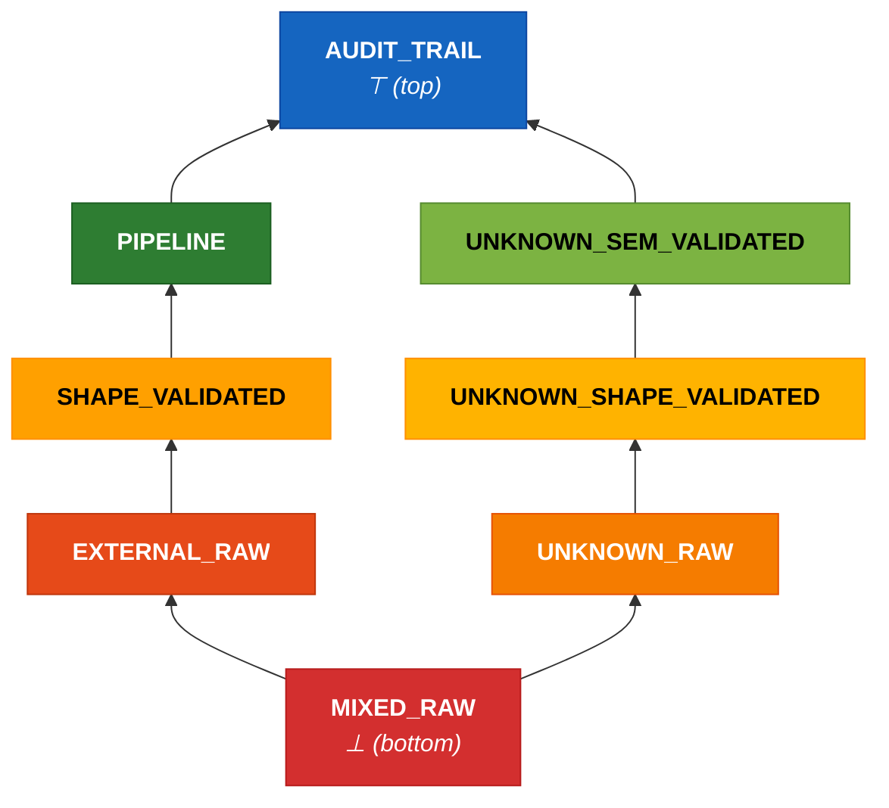

### 5. Authority tier model: enforcement specification

This section specifies the enforcement implementation of the four-tier authority model defined in §4. Tool implementers, scanner developers, and security assessors need this section; adopters and practitioners may skip to §6.

#### 5.1 Trust classification and validation status

The four tiers describe semantic authority. The eight effective states describe the enforcement contexts actually needed to grade pattern severity.

The tier model combines two orthogonal dimensions — trust classification (what guarantees the system may assume) and validation status (what processing the data has received) — to produce eight effective states.

| State | Trust Classification | Validation Status |
|-------|---------------------|-------------------|
| Audit Trail | Tier 1 | Not Applicable |
| Pipeline | Tier 2 | Not Applicable |
| Shape-Validated | Tier 3 | Shape-Validated |
| External Raw | Tier 4 | Raw |
| Unknown Raw | Unknown | Raw |
| Unknown Shape-Validated | Unknown | Shape-Validated |
| Unknown Semantically-Validated | Unknown | Semantically Validated |
| Mixed Raw | Mixed | Raw |

These eight states determine finding severity when pattern rules are evaluated: the same pattern may be an error in one state and suppressed in another (§7).

**Canonical tokens.** The following identifiers are normative and MUST be used consistently in manifest schemas, SARIF output, configuration files, and implementation code: `AUDIT_TRAIL`, `PIPELINE`, `SHAPE_VALIDATED`, `EXTERNAL_RAW`, `UNKNOWN_RAW`, `UNKNOWN_SHAPE_VALIDATED`, `UNKNOWN_SEM_VALIDATED`, `MIXED_RAW`. Prose may use the human-readable labels from the table above; machine-facing artefacts MUST use these tokens.

**Join operation.** When data from two different taint states merges at a program point (assignment, function parameter, container construction), the resulting state is determined by the join. The general rule: any merge of values from different trust classifications produces MIXED_RAW. The validation status of the result is RAW regardless of the inputs' validation status — mixing data resets the validation dimension because the composite's structural guarantees are weaker than those of its strongest input.

Specific join rules (the join is commutative — operand order does not matter):

| Operand A | Operand B | Result | Examples |
|-----------|-----------|--------|----------|
| Any classified state | Different classified state | MIXED_RAW | join(AUDIT_TRAIL, PIPELINE), join(PIPELINE, EXTERNAL_RAW), join(SHAPE_VALIDATED, PIPELINE) |
| Any state | UNKNOWN_RAW | MIXED_RAW | join(PIPELINE, UNKNOWN_RAW), join(AUDIT_TRAIL, UNKNOWN_RAW), join(SHAPE_VALIDATED, UNKNOWN_RAW) |
| Any state | UNKNOWN_SHAPE_VALIDATED | MIXED_RAW | join(EXTERNAL_RAW, UNKNOWN_SHAPE_VALIDATED), join(PIPELINE, UNKNOWN_SHAPE_VALIDATED) |
| Any state | UNKNOWN_SEM_VALIDATED | MIXED_RAW | join(SHAPE_VALIDATED, UNKNOWN_SEM_VALIDATED), join(AUDIT_TRAIL, UNKNOWN_SEM_VALIDATED) |
| UNKNOWN_RAW | UNKNOWN_RAW | UNKNOWN_RAW | join(UNKNOWN_RAW, UNKNOWN_RAW) — provenance equally unknown |
| UNKNOWN_RAW | UNKNOWN_SHAPE_VALIDATED | UNKNOWN_RAW | join(UNKNOWN_RAW, UNKNOWN_SHAPE_VALIDATED) — validated status lost |
| UNKNOWN_RAW | UNKNOWN_SEM_VALIDATED | UNKNOWN_RAW | join(UNKNOWN_RAW, UNKNOWN_SEM_VALIDATED) — validated status lost |
| UNKNOWN_SHAPE_VALIDATED | UNKNOWN_SHAPE_VALIDATED | UNKNOWN_SHAPE_VALIDATED | Identity — provenance equally unknown, same validation level |
| UNKNOWN_SHAPE_VALIDATED | UNKNOWN_SEM_VALIDATED | UNKNOWN_SHAPE_VALIDATED | Semantic status lost to the weaker validation |
| UNKNOWN_SEM_VALIDATED | UNKNOWN_SEM_VALIDATED | UNKNOWN_SEM_VALIDATED | Identity — provenance equally unknown, same validation level |
| Any state | MIXED_RAW | MIXED_RAW | MIXED absorbs further merges |
| X | X | X | join(PIPELINE, PIPELINE) = PIPELINE |

**Design rationale for UNKNOWN joins.** UNKNOWN is treated as a distinct classification for join purposes — it is *not* equivalent to the other operand. Merging known-provenance data with unknown-provenance data produces a composite whose provenance is genuinely mixed, not merely unknown. This prevents UNKNOWN from silently inheriting a classification it has not earned. Within the UNKNOWN classification itself, merging two unknown-origin values does not create mixed provenance — both are equally unknown — and the validation status demotes to the weaker of the two (raw beats shape-validated, shape-validated beats semantically-validated).

This join definition is REQUIRED for consistent taint propagation across implementations.

**Join operators: `join_fuse` and `join_product`.** The join table above applies uniformly to all merge operations in the current framework. However, not all merge operations are semantically equivalent. The framework distinguishes two conceptual join operators:

- **`join_fuse`** applies to operations that genuinely merge data into a single artefact where the contributing components lose their individual identity: string concatenation, dict merge (`{**a, **b}`), list extension, format-string interpolation. The result is a fused artefact whose provenance is inseparable. `join_fuse` produces MIXED_RAW when the operands span different trust classifications — this is the current behaviour, unchanged.

- **`join_product`** applies to operations that compose data into a product-type structure where each component retains its identity: dataclass construction, named-tuple packing, record/POJO construction, typed constructor invocation. The components are individually addressable after construction — `record.audit_field` and `record.external_field` remain distinct access paths.

At the framework level, `join_product` is treated identically to `join_fuse` — both produce MIXED_RAW when operands span different trust classifications. The eight-state model and the 8×8 severity matrix are unchanged.

**Binding extension: MIXED_TRACKED.** Language bindings MAY define a `MIXED_TRACKED` extension state for `join_product` on named product types where the binding can statically resolve field membership. In `MIXED_TRACKED`, each field retains its individual taint state; the composite carries a summary taint (the join of all fields) for contexts where field-level resolution is not available — e.g., when the composite is passed to a function that accepts a generic type, or when field-level tracking is lost through an untyped intermediary.

Bindings that implement `MIXED_TRACKED` SHOULD declare which named product types they can track at field level. Product types whose field membership cannot be statically resolved (e.g., dynamically constructed classes, untyped dicts, raw tuples) remain subject to `join_fuse` semantics and produce MIXED_RAW.

Bindings that do not implement field sensitivity treat `join_product` as `join_fuse` — conservative fallback to MIXED_RAW. This is the current behaviour and remains conformant. Field-sensitive taint is a binding requirement (SHOULD), not a framework invariant (MUST).

**Severity matrix extension for MIXED_TRACKED.** The framework severity matrix remains 8×8. Bindings that implement `MIXED_TRACKED` extend the matrix with a ninth column whose severity inherits from the MIXED_RAW column unless the binding explicitly narrows it. Narrowing is permitted (a binding MAY reduce severity where field-level resolution eliminates false positives); widening is not (a binding MUST NOT assign higher severity in the MIXED_TRACKED column than in the corresponding MIXED_RAW cell). This follows the overlay narrowing principle in §13.

**Deferred: framework-level ninth state.** Full elevation of `MIXED_TRACKED` to a ninth framework state — with corresponding changes to the join table, cross-product table, and severity matrix — is deferred until at least one binding demonstrates field-sensitive taint tracking with specimen-level evidence and a worked example in its golden corpus. The binding refinement approach was chosen to reduce cascade cost: the conceptual split lands in Part I; bindings operationalise it at their own pace; the framework promotes the extension when binding-level evidence supports it.

**Lattice structure (Hasse diagram).** The eight effective states form a partial order under the join. The diagram below makes the ordering explicit — states connected by an upward path are ordered; states on separate branches are incomparable (their join produces a lower state).

**Lattice orientation note.** This diagram uses the mathematical convention where "bottom" (⊥) denotes the element that every other element joins toward — the most restrictive enforcement state, not the lowest trust level. MIXED_RAW is bottom because any merge of unlike states reaches it, and it cannot be escaped through ordinary validation. AUDIT_TRAIL is top (⊤) because it is the most authoritative state. Readers familiar with security lattices (e.g., BLP) may be accustomed to the reverse orientation where "top" means most restricted; this lattice describes enforcement burden, not access restriction, which is why AUDIT_TRAIL sits at top and MIXED_RAW at bottom.

The key non-obvious property: UNKNOWN_SEM_VALIDATED and PIPELINE are on parallel chains — neither dominates the other. Their join produces MIXED_RAW, not either operand.

Two properties to note: (1) MIXED_RAW is the absorbing element — any cross-classification merge reaches it, and further merges stay there. (2) The UNKNOWN chain (UNKNOWN_RAW → UNKNOWN_SHAPE_VALIDATED → UNKNOWN_SEM_VALIDATED) and the classified chain (EXTERNAL_RAW → SHAPE_VALIDATED → PIPELINE) are parallel — validation can advance within either chain but cannot cross between them without a trust classification decision (which is a governance act, not a validation act). AUDIT_TRAIL is the unique top element, reachable only through the Tier 2 → Tier 1 construction transition.

**UNKNOWN** is data whose trust classification cannot be determined from available annotations. Entry conditions: the data enters a scope with no wardline annotation declaring its trust classification, or it is produced by an unannotated function whose inputs span multiple tiers. Invariants: UNKNOWN data receives conservative enforcement (equivalent to or stricter than EXTERNAL_RAW for most rules); UNKNOWN data that passes shape validation transitions to UNKNOWN_SHAPE_VALIDATED; UNKNOWN data that passes semantic validation transitions to UNKNOWN_SEM_VALIDATED. Neither transition grants a trust classification — the data remains unknown-origin.

**MIXED** is data derived from inputs spanning multiple authority tiers. Entry conditions: a function or expression combines inputs from two or more distinct trust classifications (e.g., Tier 1 audit data merged with Tier 4 external input). Invariants: MIXED data activates the pattern rules of every contributing tier — the enforcement burden is the union of all contributing tiers' restrictions. MIXED data cannot transition to a single-tier classification through ordinary validation, because validation establishes structural and semantic properties but does not decompose provenance. A declared normalisation boundary may collapse mixed inputs into a new Tier 2 artefact — the normalisation step is semantically a new construction (like the T2-to-T1 transition), not a passthrough of the original mixed data.

**The distinction between UNKNOWN and MIXED:** MIXED means the analysis *can show* that a real cross-tier combination occurred — the contributing tiers are known but heterogeneous. UNKNOWN means the analysis *cannot determine* the provenance at all — the tier is absent, not mixed. An unannotated function that combines Tier 1 and Tier 4 inputs produces MIXED (the analysis sees both tiers). An unannotated function whose inputs are themselves unannotated produces UNKNOWN (the analysis has no tier information to combine).

**Cross-product analysis.** The following table shows which of the 24 theoretical state combinations are reachable and which are impossible or collapsed. The full cross-product of six trust classifications (TIER_1, TIER_2, TIER_3, TIER_4, UNKNOWN, MIXED) and four validation statuses (NOT_APPLICABLE, RAW, SHAPE_VALIDATED, SEMANTICALLY_VALIDATED) yields 24 theoretical combinations. Eight are reachable as effective states; sixteen are impossible or collapsed:

| Classification | Not Applicable | Raw | Shape-Validated | Sem. Validated | Rationale |
|----------------|----------------|-----|-----------------|----------------|-----------|
| Tier 1 | **Audit Trail** | Impossible | Impossible | Impossible | Tier 1 artefacts are produced under institutional rules — they are not raw and validation is not applicable to them |
| Tier 2 | **Pipeline** | Impossible | Collapsed to Pipeline | Collapsed to Pipeline | Tier 2 *is* the result of semantic validation — raw Tier 2 is contradictory; shape-only Tier 2 is contradictory (semantic validation requires prior shape validation); sem-validated Tier 2 is redundant |
| Tier 3 | Impossible | Impossible | **Shape-Validated** | Collapsed to Pipeline | Tier 3 *is* the result of shape validation — raw Tier 3 is contradictory; semantically validated Tier 3 becomes Tier 2 |
| Tier 4 | Impossible | **External Raw** | Collapsed to Shape-Validated | Collapsed to Pipeline | Tier 4 is by definition raw external data; shape-validated Tier 4 becomes Tier 3; semantically validated Tier 4 becomes Tier 2 (implying both validation steps occurred) |
| Unknown | Impossible | **Unknown Raw** | **Unknown Shape-Validated** | **Unknown Semantically-Validated** | Not Applicable is reserved for data produced under institutional rules. Unknown-origin data has not been produced under such rules, so Not Applicable does not apply. Both validated states are reachable because validation establishes properties without resolving provenance |
| Mixed | Impossible | **Mixed Raw** | Collapsed to Mixed Raw | Collapsed to Mixed Raw | Ordinary validation does not resolve mixed provenance — it establishes structure or semantics but cannot decompose the contributing tiers. A declared normalisation boundary may produce a new T2 artefact from mixed inputs |

All sixteen non-reachable combinations are accounted for by the Impossible or Collapsed entries in the Rationale column. The normalisation boundary mechanism for MIXED data is specified in §5.2 (transition semantics).

#### 5.2 Transition semantics

Tier transitions are directional and constrained:

```mermaid
graph LR
    T4["<b>Tier 4</b><br/>Raw Observation"]
    T3["<b>Tier 3</b><br/>Shape-Validated Representation"]
    T2["<b>Tier 2</b><br/>Semantically Validated Representation"]
    T1["<b>Tier 1</b><br/>Trusted Assertion"]
    RAW["Raw Representation<br/><i>(serialised bytes)</i>"]

    T4 -->|"Shape validation<br/>(structural establishment)"| T3
    T3 -->|"Semantic validation<br/>(domain establishment)"| T2
    T2 -->|"Trusted construction<br/>(institutional rules)"| T1
    T1 -->|"Serialisation<br/>(sheds direct authority)"| RAW
    RAW -->|"Trusted restoration<br/>(§5.3 evidence categories)"| T1
    RAW -.->|"Shape validation only<br/>(no provenance claim)"| USV["UNKNOWN_SHAPE_VALIDATED"]
    USV -.->|"Semantic validation<br/>(no provenance claim)"| USEV["UNKNOWN_SEM_VALIDATED"]

    style T1 fill:#2C3E5D,color:#fff,stroke:#2C3E5D
    style T2 fill:#4A6FA5,color:#fff,stroke:#4A6FA5
    style T3 fill:#6B8EC2,color:#fff,stroke:#6B8EC2
    style T4 fill:#8B9DC3,color:#fff,stroke:#8B9DC3
    style RAW fill:#D4D4D4,color:#333,stroke:#999
    style USV fill:#D4D4D4,color:#333,stroke:#999,stroke-dasharray: 5 5
    style USEV fill:#D4D4D4,color:#333,stroke:#999,stroke-dasharray: 5 5
```

- **T4 to T3 — structural establishment.** Via shape validation: the data passes through a defined validation boundary that guarantees structural properties — required fields present, types correct, data conforms to its declared structural contract. Shape-validated Tier 4 data *becomes* Tier 3. There is no "shape-validated Tier 4" state — shape validation is the mechanism by which raw observations become shaped representations. After this transition, the data is safe to handle (field access will not crash) but its values are not yet verified for domain use.
- **T3 to T2 — domain establishment.** Via semantic validation: the data passes through a validation boundary that establishes domain-constraint satisfaction for every intended use within the declared bounded context. Semantically validated Tier 3 data *becomes* Tier 2. Bounded-context adequacy is expressed through named boundary contracts (e.g., `"landscape_recording"`, `"partner_reporting"`) that specify what data crosses the boundary and at what tier, rather than through fully qualified function names. Each contract declares a stable semantic identifier, the data tier expected, and the direction of flow. The semantic validator MUST satisfy the constraints of every contract declared in its bounded context — it establishes that the data is safe to *use*, not merely safe to *handle*. The function-level binding (which functions currently implement each contract) is a secondary mapping that resides in the overlay (§13.1.2) and survives refactoring independently of the contract declarations.
- **T2 to T1 — trusted construction.** The transition is an act of institutional interpretation: only via explicit trusted construction under institutional rules. A Tier 1 artefact is a new semantic object — an audit entry, a decision record, a fact assertion — produced from Tier 2 inputs under governed logic. The source inputs remain Tier 2 after the Tier 1 artefact is produced.

**Combined validation boundaries.** A single function may perform both shape and semantic validation (T4→T2) — this is a common pattern for simple data types where the structural and semantic checks are naturally interleaved. The model treats this as two logical transitions occurring within one function body: the structural checks establish T3 guarantees, and the semantic checks then establish T2 guarantees. The scanner must be able to establish that the boundary performs both structural and semantic validation, whether inline or through analysable helper calls.

Combined validation boundaries are declared with a combined-validation annotation (§6, Group 1) — e.g., `@validates_external` in the Python binding (Part II-A §A.4), `@ValidatesExternal` in the Java binding (Part II-B §B.4) — or the generic trust-boundary annotation with `from_tier=4, to_tier=2` (§6, Group 16). The decomposed annotations — shape validation (T4→T3) and semantic validation (T3→T2) — are used when the two phases are separate functions.

Seven invariants govern these transitions:

1. **Shape-validated T4 becomes T3.** Shape validation establishes structure — field presence, type correctness, schema conformance — not domain meaning. There is no intermediate state.
2. **Semantically validated T3 becomes T2.** Semantic validation establishes domain-constraint satisfaction for every intended use within the declared bounded context. There is no "partially validated" state — data is either semantically valid for all intended uses or it is not.
3. **Shape validation must precede semantic validation.** Semantic validation operates on structurally sound data. Applying domain-constraint checks to data whose field presence and type correctness have not been established is structurally unsound — the semantic checks may crash, produce misleading results, or silently operate on wrong types. A function that performs both checks in a single body satisfies this invariant internally; two separate functions must be ordered correctly.
4. **T2 does not automatically upgrade to T1.** Tier 1 artefacts are new semantic objects produced under institutional rules, not Tier 2 data with a higher label.
5. **Serialisation sheds direct authority at the representation layer.** A Tier 1 artefact written to storage becomes a raw representation. The act of serialisation strips the direct authority relationship — what remains is bytes whose provenance must be independently established on read.
6. **Trusted restoration may reinstate prior authority.** A raw representation may be restored to Tier 1 only through a declared *trusted restoration boundary* with provenance and integrity guarantees (see §5.3).
7. **Tier assignment is not contagious.** Authority assigned to a derived Tier 1 artefact does not retroactively alter the trust classification of its source inputs. This prevents laundering lower tiers into higher tiers by accident — the failure mode where "validated once" magically turns all downstream uses into authoritative truth.

#### 5.3 Trusted restoration boundaries

The serialisation/restoration model distinguishes *construction* from *restoration*. Construction produces a new Tier 1 artefact from Tier 2 inputs under institutional rules (§5.2, T2-to-T1 transition). Restoration reconstitutes a previously serialised Tier 1 artefact from its raw representation. The distinguishing criterion: restoration requires an evidence-backed provenance claim supported by institutional attestation — a mere assertion of internal origin does not suffice (see evidence categories below).

Four categories of provenance evidence support restoration boundary declarations, each progressively harder to verify technically. The evidence requirements are cumulative — each restoration tier requires all evidence categories of the tiers below it:

1. **Structural evidence (REQUIRED for any restoration above raw).** The raw representation must pass shape validation — schema conformance, field completeness, type correctness. This is the minimum requirement and is machine-verifiable. WL-007-style structural verification applies: a restoration boundary function that contains no rejection path is structurally unsound.
2. **Semantic evidence (REQUIRED for restoration to Tier 2 or above).** The restored data must pass semantic validation — domain constraints satisfied for every intended use within the declared bounded context. Structural evidence alone establishes that the data is safe to handle; semantic evidence establishes that it is safe to use. This is particularly important for restoration because domain constraints may have changed since serialisation — business rules evolve, external dependencies shift, and data that was semantically valid at serialisation time may no longer be.
3. **Integrity evidence (REQUIRED for restoration to Tier 1).** Cryptographic or structural integrity checks that the representation has not been modified since serialisation — checksums, signatures, or equivalent mechanisms. Restoration with structural, semantic, and institutional evidence but without integrity evidence produces at most Tier 2 — the data's structure and domain validity are verified but its integrity since serialisation is not established. Integrity evidence may be absent by exception only, under STANDARD exception governance (§9) with explicit rationale documenting why integrity verification is not feasible and what compensating controls apply.
4. **Provenance-institutional evidence (REQUIRED for restoration to any known-provenance tier).** Institutional attestation that the storage boundary is trustworthy — that the file, database, or message queue is under the organisation's control, that access controls are in place, and that the serialisation path is known. This evidence is explicitly institutional, not technical. It cannot be verified by the enforcement tool and is governed through the governance model (§9). Without institutional evidence, restoration cannot produce a known-provenance tier — only UNKNOWN states are reachable.

The four evidence categories determine the restored tier:

| Structural | Semantic | Integrity | Institutional | Restored Tier |
|:---:|:---:|:---:|:---:|---|
| Yes | Yes | Yes | Yes | **Tier 1** — full restoration. All four categories present; the restoration produces an artefact with the same authority as the original. |
| Yes | Yes | — | Yes | **Tier 2 maximum.** Structure and domain validity verified, provenance institutionally attested, but integrity since serialisation is not established. |
| Yes | — | — | Yes | **Tier 3 maximum.** Structure verified and provenance institutionally attested, but domain constraints have not been re-verified since serialisation. Appropriate when semantic validity may have been invalidated by time — business rules that have changed, domain constraints that depend on external state. |
| Yes | Yes | — | — | **UNKNOWN_SEM_VALIDATED.** Structure and domain constraints verified, but no institutional attestation of provenance. The data passes all technical checks but its origin is unverified. |
| Yes | — | — | — | **UNKNOWN_SHAPE_VALIDATED.** Structure verified but no provenance claim and no semantic re-verification. Shape-validated data of indeterminate origin. |
| — | — | — | — | **UNKNOWN_RAW.** No evidence present. The data is treated as fully untrusted. Note: this is not Tier 4 (EXTERNAL_RAW) — Tier 4 denotes data from outside the system boundary. A raw representation with no evidence is of indeterminate origin, not necessarily external. |

The key distinction: institutional evidence is the gate between known-provenance tiers (T1–T3) and unknown-provenance states (UNKNOWN_*). A mere assertion of internal provenance — without institutional attestation — does not elevate data above unknown-origin status. This prevents trust-classification uplift on assertion rather than evidence: an agent or developer claiming "this is internal data" without institutional backing receives no tier benefit from the claim.

#### 5.4 Cross-language taint propagation

In polyglot applications where data crosses language boundaries (e.g., a Python service calling a Go microservice, or a shared database accessed by multiple language runtimes), the receiving language's enforcement tool cannot verify the emitting language's taint assertions. Data crossing a language boundary resets to UNKNOWN_RAW in the receiving binding unless the receiving binding can independently verify the emitting binding's taint assertion — for example, through a shared wardline manifest (§13) that declares the cross-language interface as a typed trust boundary with both bindings enforcing the same tier assignment.

This is conservative: it may over-taint data that was well-classified in the emitting language. The alternative — trusting cross-language taint assertions without verification — would allow a weaker binding to launder taint state through a language boundary. Polyglot applications that need tighter cross-language taint tracking should declare their inter-language interfaces as explicit trust boundaries in the root wardline manifest, with both bindings' enforcement tools validating the shared boundary declarations.

**Scope clarification.** This section applies to cross-*binding* boundaries — where data passes between different language runtimes, each with its own enforcement tool. It does not apply to serialisation boundaries within the same binding (e.g., a Python application reading from a database that the same Python application wrote to). Serialisation boundaries within a single binding are governed by the restoration boundary model (§5.3) using the restoration boundary annotation (§6, Group 17), which provides more precise taint tracking through provenance evidence categories. A Python application reading its own audit trail from PostgreSQL is a restoration boundary, not a cross-language boundary — the emitting and receiving binding are the same, and the restoration model applies.
